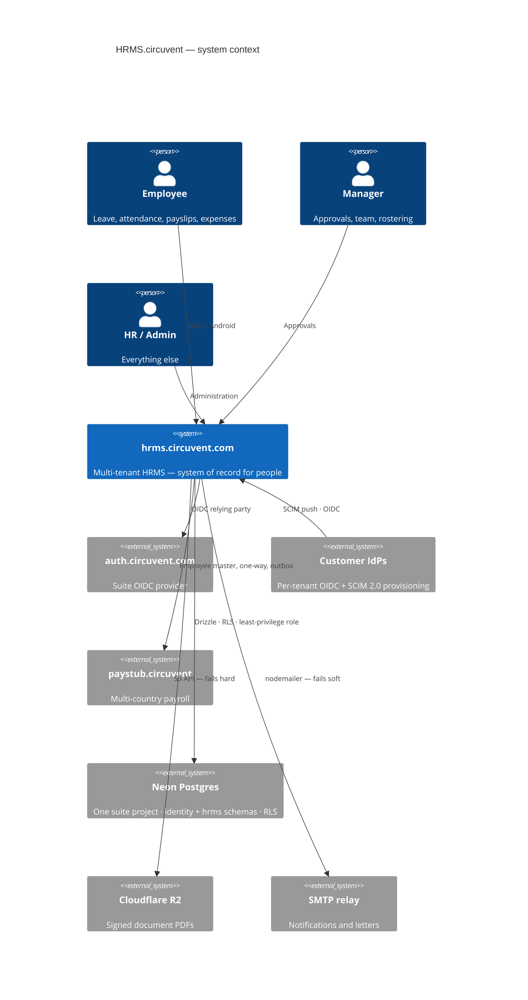
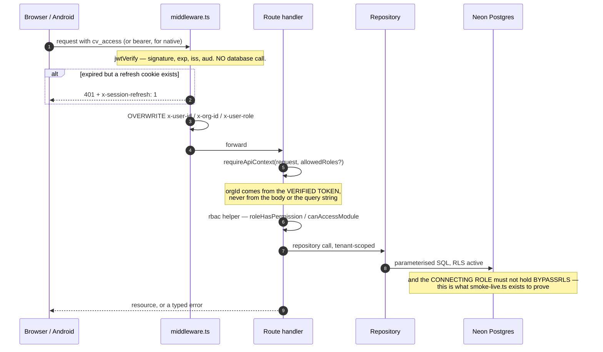

# 01 · System Overview

> **Audience:** everyone. An intern reads §1–§4; a CTO reads §1 and §10.
> **System:** `hrms.circuvent.com` — the system of record for **who works here**. The largest application in the Circuvent suite.

---

## 1. Executive summary

This is a full multi-tenant HRMS: employees, leave, attendance, rostering, payroll, recruitment, performance, learning, documents and e-signature, helpdesk, assets, benefits, compensation, expenses, governance — plus a shipped native Android app.

```
   ╔══════════════════════════════════════════════════════════════════════╗
   ║  THE MOST IMPORTANT SENTENCE IN THIS ENTIRE AUDIT                    ║
   ╠══════════════════════════════════════════════════════════════════════╣
   ║                                                                      ║
   ║  From the header of scripts/smoke-live.ts:                           ║
   ║                                                                      ║
   ║    "ninety-one correct policies and seventy-five passing isolation   ║
   ║     tests, while DATABASE_URL pointed at a role with BYPASSRLS and   ║
   ║     every query returned every tenant's rows.                        ║
   ║     Nothing that ran in CI could have noticed."                      ║
   ║                                                                      ║
   ║  The policies were right. The tests were right. The tests passed.    ║
   ║  And every tenant could read every other tenant's data, because      ║
   ║  the CREDENTIAL the application actually connected with was exempt   ║
   ║  from the policies being tested.                                     ║
   ║                                                                      ║
   ║  This is the defining lesson of the codebase, and the reason it now  ║
   ║  has nine verification scripts instead of a test suite alone.        ║
   ╚══════════════════════════════════════════════════════════════════════╝
```

### At a glance

| | |
| --- | --- |
| **Type** | Multi-tenant HRMS with subscription plans · web + native Android |
| **Framework** | Next.js 16.1 App Router (Turbopack) · React 19.2 · TypeScript 5 strict |
| **Scale** | 1,454 files · **574 src TypeScript files** · **144,146 lines** · 150 API routes · 102 pages |
| **Database** | Neon Postgres · Drizzle ORM · **39 migrations** · row-level security |
| **Tests** | **92 test files · 2,664 tests passing**, 12 skipped, 1 flaky |
| **CI** | ✅ **`.github/workflows/verify.yml`** — the only real CI in the suite |
| **Guards** | **9 custom verification scripts** + gitleaks |
| **Mobile** | `android/` Kotlin Multiplatform — **shipped, v1.8.0, versionCode 10** |
| **Repository** | `github.com/Hemakotibonthada/HRMS.circuvent` · `main` + `develop` · 122 commits |
| **Identity** | Four sign-in paths converging on one HS256 suite session |

### The five decisions that define it

| # | Decision | Why it matters |
| --- | --- | --- |
| 1 | **Verify the credential, not just the policy** | 91 correct RLS policies meant nothing while the app connected as a `BYPASSRLS` role. `verify-credential-reach` and `smoke-live` exist because of that. |
| 2 | **Pure rule modules, impure shells** | ~40 domain modules take arguments and return values. That is why 2,664 tests run in under a minute with no database. |
| 3 | **Money is `bigint` minor units** | `money/minor.ts`: *"floats lose money, and the number it loses it by is somebody's raise."* Held everywhere except one legacy seam — see §7. |
| 4 | **Refuse rather than invent** | A missing document token refuses to render. A lunisolar holiday is not computed. The assistant will say *"I cannot see that"* rather than answer. |
| 5 | **Every fix is documented in the file it fixed** | An unusual number of modules open with a comment naming the *specific* bug they exist to prevent. |

> ⚠️ **A fact worth stating plainly:** all 122 commits are dated **2026-08-19**, several titled `chore: auto-sync HH:MM`. The working tree is currently dirty with in-flight work. Commit count here is a proxy for change volume, not project age — this system has not yet run a payroll cycle in anger.

---

## 2. What it owns, and what it does not

```
   HRMS OWNS                              DELEGATED / ELSEWHERE
   ---------                              ---------------------
   employees, org structure               identity federation  -> auth.circuvent.com
   leave, attendance, rostering           multi-country payroll -> paystub.circuvent
   its OWN payroll module (India)         mail transport        -> shared SMTP relay
   recruitment (its own ATS module)       object storage        -> Cloudflare R2
   performance, learning, documents
   helpdesk, assets, benefits             NOTE: ATS.circuvent, Mail.circuvent and
   compensation, expenses, governance     DevOps.circuvent appear in ecosystem.ts
   subscriptions and plans                only as NAV LINKS. There are no direct
                                          REST calls to them from this codebase.
```

> **A correction worth making early.** `src/lib/payroll-client.ts` is *not* a bridge to Paystub — it is a browser client for HRMS's *own* `/api/payroll/*` routes. The real cross-app link is `src/lib/paystub-client.ts`, and it is a **one-way outbound push of employee master data only**. HRMS does not delegate a single payroll calculation to Paystub. Both applications compute Indian statutory figures independently.

---

## 3. Technology stack

| Layer | Choice | Note |
| --- | --- | --- |
| Framework | Next.js 16.1 App Router, Turbopack | uses `middleware.ts`, **not** the Next 16 `proxy.ts` rename |
| Language | TypeScript 5 strict | **0 TODO · 0 `@ts-ignore` · 0 `eslint-disable` · 0 `console.log`** in `src/` |
| ORM | Drizzle 0.45 + drizzle-kit 0.31 | 39 migrations |
| Database | Neon Postgres | row-level security, per-app least-privilege roles |
| Passwords | **Argon2id** via `@noble/hashes` | 19 MiB, t=2, p=1, PHC string, auto-rehash on param drift |
| Sessions | `jose` HS256 (own) + RS256/JWKS (external IdPs) | |
| MFA | `otpauth` TOTP + `qrcode` | secret encrypted at rest |
| PDF | `pdf-lib` | hand-laid-out — **no headless Chromium on serverless** |
| Mail | `nodemailer` | direct SMTP, fails soft |
| Storage | `@aws-sdk/client-s3` → Cloudflare R2 | fails **hard**, deliberately |
| Tests | Vitest 4 + Testing Library + `@electric-sql/pglite` | PGlite powers the *verify scripts*, not the test suite |
| Mobile | Kotlin Multiplatform + Jetpack Compose | `android/` — shipped |

---

## 4. Topology

```
        ┌──────────────────────┐        ┌────────────────────────────┐
        │  auth.circuvent.com  │        │  Per-tenant customer IdPs  │
        │  suite OIDC provider │        │  Okta · Entra · Google     │
        └──────────┬───────────┘        └─────────────┬──────────────┘
                   │ RS256 / JWKS                     │ RS256 / JWKS
                   └────────────────┬─────────────────┘
                                    ▼
   ┌────────────┐          ┌─────────────────────────────────────┐
   │  Browser   │─────────▶│      hrms.circuvent.com             │
   │  Android   │  cv_access│                                     │
   │  (v1.8.0)  │  cv_refresh│  middleware.ts  ── the gate        │
   └────────────┘          │  150 API routes · 102 pages         │
                           │  ~40 PURE rule modules              │
   ┌────────────┐  SCIM 2.0│  Drizzle repositories               │
   │  IdP SCIM  │─────────▶│                                     │
   └────────────┘          └──┬─────────┬──────────┬─────────┬───┘
                              │         │          │         │
              ┌───────────────┘         │          │         └──────────────┐
              ▼                         ▼          ▼                        ▼
   ┌────────────────────┐  ┌──────────────────┐ ┌──────────┐  ┌──────────────────────┐
   │  Neon Postgres     │  │  Cloudflare R2   │ │   SMTP   │  │  paystub.circuvent   │
   │  ONE suite project │  │  signed PDFs     │ │ fails    │  │  employee master     │
   │  identity + hrms   │  │  FAILS HARD      │ │ SOFT     │  │  push, via OUTBOX    │
   │  RLS + least-priv  │  └──────────────────┘ └──────────┘  └──────────────────────┘
   └────────────────────┘
```



### Module map

```
   src/
     middleware.ts        THE GATE. Overwrites x-user-id / x-org-id / x-user-role.
     lib/
       auth/              session · tokens · password (Argon2id) · mfa · webauthn
       crypto/            AES-256-GCM field encryption
       rbac.ts            ~90 permissions across 4 roles (+ `owner` above them)
       api-context.ts     session principal  -> role
       api-v1-context.ts  API-key principal  -> scopes
       ── ~40 PURE rule modules ──
       statutory-india.ts   PF · ESI · PT · TDS · gratuity      bigint, dated config
       compensation.ts      bands · compa-ratio · vesting        bigint
       settlement.ts        full & final                         bigint
       rostering.ts         shifts · constraints · swaps         pure
       workflow/engine.ts   one approval engine for everything   pure
       reporting/builder.ts allow-listed report compiler         pure
       governance.ts        retention · erasure — PLANS only     pure
       sla.ts  assets.ts  benefits-rules.ts  learning-rules.ts
       performance.ts  ats.ts  offer-rules.ts  lifecycle-rules.ts
       document-rules.ts  custom-fields.ts  intelligence/  ...
       ── impure shells ──
       *-client.ts        browser fetch wrappers
       paystub-client.ts  + paystub-sync-outbox.ts
       notifications/     engine (decide) → notify (write) → transport (deliver)
     db/
       schema/            Drizzle definitions — hrms.ts is 1,440 lines
       repositories/      *.neon.ts — the only code that queries
     app/
       (dashboard)/       102 pages
       api/               150 route handlers
   android/               Kotlin Multiplatform — SHIPPED v1.8.0
   mobile/                Expo — ABANDONED precursor, same package id
   scripts/               9 verification scripts + ~25 operational tools
```

---

## 5. The security model

```
   ┌──────────────────────────────────────────────────────────────────────┐
   │  LAYER 1 — FOUR SIGN-IN PATHS, ONE SESSION                           │
   │    local Argon2id · suite OIDC · per-tenant customer OIDC · passkeys │
   │    all converge on one HS256 token: sub · orgId · role · email       │
   │    cv_access 15 min · cv_refresh 30 d, SHA-256 hashed, single-use,   │
   │    rotated on every use, with FAMILY REVOCATION on reuse             │
   ├──────────────────────────────────────────────────────────────────────┤
   │  LAYER 2 — THE GATE                                                  │
   │    middleware.ts verifies signature/exp/iss/aud with no DB call,     │
   │    then ALWAYS OVERWRITES x-user-id, x-org-id and x-user-role.       │
   │    Client-supplied values are discarded. 36 assertions cover this.   │
   ├──────────────────────────────────────────────────────────────────────┤
   │  LAYER 3 — AUTHORIZATION                                             │
   │    ~90 dot-notation permissions · 4 roles in rbac.ts                 │
   │    + `owner` as a de facto super-role at the API layer               │
   │    canAccessModule() FAILS CLOSED on an unmapped module              │
   ├──────────────────────────────────────────────────────────────────────┤
   │  LAYER 4 — TENANCY                                                   │
   │    orgId is derived from the VERIFIED TOKEN, never from the request  │
   │    — with exactly one exception, and it is a finding (§8)            │
   │    plus Postgres RLS, plus per-app least-privilege database roles    │
   ├──────────────────────────────────────────────────────────────────────┤
   │  LAYER 5 — DATA AT REST                                              │
   │    AES-256-GCM field encryption (PAN, UAN, MFA secrets, …)           │
   │    ⚠ bank_details is jsonb and is NOT encrypted — masked on read     │
   └──────────────────────────────────────────────────────────────────────┘
```

### MFA, done carefully

```
   3-state machine:  off → pending → active

   • The secret is minted and stored ENCRYPTED at `pending`.
   • Backup codes are issued ONLY after a live code proves the secret works.
     Codes are never handed out for a secret not yet verified.
   • `pending` is deliberately NOT enforced at sign-in — anti-lockout, and it
     grants no elevated trust either.
   • Disabling MFA requires the current password AND a live TOTP code.
     A stolen session cookie alone cannot turn the control off.
   • Enrol/confirm/disable are rate limited 10/min per user, explicitly so a
     six-digit code over a 90-second window cannot become a brute-force
     surface that bypasses the sign-in lockout.

   VERIFIED: both sign-in paths — password and SSO/passkey — independently
   call mfaRequiredAtSignIn(). There is NO bypass.

   ⚠ The trade is fail-closed: an MFA-enabled user currently cannot complete
     SSO or passkey login at all, because neither accepts a TOTP parameter.
     An availability gap, not a security gap. Doc 05, D-09.
```

---

## 6. Core workflows

### 6.1 A request, end to end



### 6.2 The approval engine

One configurable engine (`workflow/engine.ts`, pure, 493 lines with a 495-line test) serves leave, expense, travel, loan and offboarding approvals — rather than each module hard-coding its own routing. `startWorkflow`, `advanceWorkflow`, `resolveApprovers`, `findBreaches`.

### 6.3 Cross-application sync uses a transactional outbox

```
   Employee changes in HRMS
        │
        ├─ row written to paystub_sync_outbox IN THE SAME TRANSACTION
        │
        └─ HTTP POST to paystub.circuvent/api/sync/employees
             X-Service-Token: <CROSS_APP_SYNC_TOKEN>
             exponential backoff, capped around 17 hours
             drained by /api/cron

   The same pattern appears three more times:
     document-pdf-outbox · directory-group-outbox · outbox-sweep

   PAN is decrypted immediately before transmission. Department and location
   cross as CODE + NAME strings, never internal UUIDs, because Paystub owns
   its own independent tables.
```

---

## 7. Money — mostly right, with one honest seam

```
   ✅  src/lib/money/minor.ts

       /** A whole number of paise, as a decimal string. Never a float. */
       export type MinorUnits = string;

       Header rationale, verbatim:
         "the comment on the type said the result must never be summed or
          compared for equality on the client. That is a rule a type cannot
          enforce and a reviewer has to remember, and it was already being
          broken: the payroll dashboard adds every payslip's net pay together
          to render the headline Net Payroll figure."

   ✅  bigint throughout: statutory-india.ts · compensation.ts · assets.ts ·
       expense-rules.ts · settlement.ts

   🔴  src/lib/payroll-engine.ts is entirely `number`-based.
       580 lines of Math.round on plain floats. It is LEGACY: five of its
       seven major functions have zero callers anywhere in src/.

   🔴  But two of them are still wired into the real pipeline, through a
       currency-unsafe seam in payroll.neon.ts:

         const professionalTax =
           BigInt(Math.round(calculateProfessionalTax(minorToMajor(gross)) * 100));

       bigint → minorToMajor() → float math → BigInt(Math.round(x*100))

       minorToMajor() is money/minor.ts's own DISPLAY-ONLY helper, whose
       doc comment warns it "must never be summed or compared for equality."
```

Doc 05, D-03. Values are rounded back to whole paise, so this is not demonstrably producing a wrong figure today — but it is a direct violation of the codebase's own stated invariant, in the one place money is actually computed.

**And gratuity exists three times:** the correct bigint, Act-compliant version in `statutory-india.ts` (used by `settlement.ts`), plus two naive float duplicates in `payroll-engine.ts` and `hr-utils.ts` with no part-year rounding and no death/disablement waiver. Both duplicates have zero callers — but both are still exported.

> The codebase already fixed this exact problem once, for income tax, and wrote it down: *"There were three implementations of the Indian slabs in this codebase — payroll's old regime, the tax page's own inline copy, and the real one — and three copies of a slab table is three different answers to 'what is my tax', of which at most one is right."* Gratuity is the same story, not yet finished.

---

## 8. Design patterns actually in use

| Pattern | Where | Note |
| --- | --- | --- |
| **Pure core / impure shell** | ~40 rule modules vs `*-client.ts` and `*.neon.ts` | nearly every module header states this in its own words |
| **Decide → write → deliver** | `notifications/engine` → `notify` → `transport`; `document-notify` → `document-dispatch` | |
| **State machines as allow-list data** | `lifecycle-rules`, `referral-rules`, `assets`, `expense-rules` | `Record<State, State[]>`, not `if` chains |
| **Return every violation, not the first** | `rostering`, `offer-rules`, `custom-fields`, `assets` | *"a form filled in once should not need five round trips"* |
| **Config as a dated parameter** | `statutory-india.ts`'s `PfConfig`, `EsiConfig` | *"a payroll run for March 2025 must still compute with March 2025's rates"* |
| **Plan, then execute** | `governance.ts` returns an erasure *plan*; locked-month attendance corrections route to arrears rather than mutating a paid month | irreversibility safeguards |
| **Allow-list, not escaping** | `reporting/builder.ts` — every field must exist in a fixed catalogue; values always bound | SQL-injection-safe by construction |
| **Transactional outbox** | 4 separate outboxes + a sweeper | cross-system reliability |
| **Self-documented regression history** | `expense-rules`, `leave-provisioning`, `income-tax-declaration`, `assistant`, `money/minor`, `catalog` | each opens by naming the specific bug it prevents |

**Two patterns worth calling out as unusually good:**

- **`assistant.ts` refuses to invent.** It replaced a chatbot that fabricated answers — a hardcoded *"Casual Leave: 6 remaining"*, a fake performance rating. The new rule: never state a fact about a person that has not been fetched. Only two answer kinds are allowed — `fetched` (real API data, sourced) or `navigation` (a link, no figures). Anything else returns an honest *"I cannot see that."*
- **`ap-holidays.ts` refuses to guess.** It categorises each holiday by how its date is *known* — Gregorian-fixed, solar, or lunisolar/Islamic — and deliberately does not compute the third category, because those dates require confirmation rather than arithmetic.

---

## 9. Where reality diverges from the documentation

```
   docs/PLATFORM-ARCHITECTURE.md  — "Status: Phase 0 — Plan", describes HRMS
                                    as FIRESTORE-backed, 52k LOC, "zero
                                    automated tests"
   docs/DEPLOYMENT.md             — "No Neon project exists yet", "No Vercel
                                    project exists yet", "main has not been
                                    created"
   docs/PLAY-STORE.md             — describes the Expo app as never run on a
                                    device

   ACTUAL REALITY
   ──────────────
   Postgres + Drizzle. ~144,000 lines. 92 test files, 2,664 passing tests.
   A `main` branch with a shipped "Release 1.8.0" commit.
   A live cron entry in vercel.json.
   A signed, tested Kotlin Android app at versionCode 10.

   A new engineer reading docs/ first would misunderstand the entire system.
   docs/ROADMAP.md (96 KB) and README.md are the accurate ones.
```

Doc 05, D-06.

---

## 10. Health assessment

```
   Verification discipline  ████████████████████░  9/10  9 guard scripts, real CI
   Test coverage            ██████████████████░░░  8/10  2,664 tests, 92 files
   Code hygiene             ██████████████████░░░  8/10  0 TODO/ts-ignore/disable
   Domain rigour            ██████████████████░░░  8/10  pure modules, dated config
   Auth & session design    ██████████████████░░░  8/10  4 paths, family revocation
   Tenancy enforcement      ████████████████░░░░░  7/10  token-derived, one exception
   ─────────────────────────────────────────────────
   Money consistency        ████████████░░░░░░░░░  6/10  🔴 one float seam, 3 gratuities
   CI completeness          ████████████░░░░░░░░░  6/10  9 of 12 checks; misses 3
   Documentation accuracy   ████████░░░░░░░░░░░░░  4/10  🔴 two docs wholesale obsolete
   Dead code                ████████░░░░░░░░░░░░░  4/10  ~1,583 lines never imported
   Rule-source singularity  ██████░░░░░░░░░░░░░░░  3/10  🔴 rules exist in 3 codebases
   Response headers         ████░░░░░░░░░░░░░░░░░  2/10  🔴 no security headers at all
```

**What is genuinely excellent:** nine verification scripts that check things a test suite structurally cannot; Argon2id with auto-rehash; refresh-token family revocation; MFA that will not issue backup codes for an unproven secret; `orgId` derived from the token everywhere but one route; a single approval engine; an allow-list report compiler; and a documentation convention where modules name the bug they exist to prevent.

**What needs attention:** the float seam in the payroll pipeline, three parallel implementations of the same business rules (web TypeScript, Expo TypeScript, Kotlin), two architecture documents that describe a system that no longer exists, `bank_details` stored unencrypted, and `next.config.ts` with no security headers whatsoever.

---

## 11. Where to start reading

```
   1. README.md                        the accurate one
   2. docs/ROADMAP.md                  96 KB, and the real history
   3. .github/workflows/verify.yml     what actually gates a merge
   4. scripts/smoke-live.ts            read the header. Twice.
   5. src/middleware.ts                the gate, plus its 36-assertion test
   6. src/lib/rbac.ts                  ~90 permissions, 4 roles
   7. src/lib/money/minor.ts           and then payroll-engine.ts, for contrast
   8. src/lib/statutory-india.ts       670 lines, the most rigorous module here
   9. src/db/schema/hrms.ts            1,440 lines
```

---

*Next: [02_DATABASE_AND_DATA_MODELS.md](./02_DATABASE_AND_DATA_MODELS.md) · [03_INTEGRATIONS_AND_ECOSYSTEM.md](./03_INTEGRATIONS_AND_ECOSYSTEM.md) · [04_MAINTENANCE_AND_OPERATIONS.md](./04_MAINTENANCE_AND_OPERATIONS.md) · [05_AREAS_OF_ENHANCEMENT.md](./05_AREAS_OF_ENHANCEMENT.md)*
