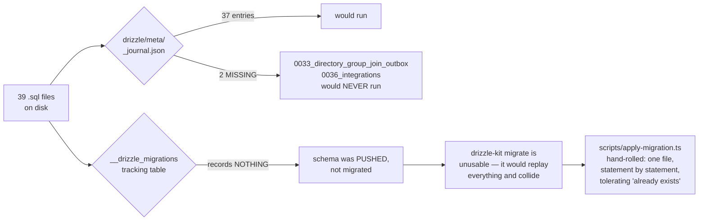

# 02 · Database and Data Models

> **Audience:** engineers and DBAs. §1–§3 are the map; §4–§6 are the enforcement machinery; §8 is the debt.
> **Engine:** Neon Postgres · Drizzle ORM 0.45 · drizzle-kit 0.31 · **two drivers, deliberately**

---

## 1. Shape of the database

```
   ╔══════════════════════════════════════════════════════════════════════╗
   ║  117 PHYSICAL TABLES · 44 ENUM TYPES · 2 SCHEMAS                     ║
   ╠══════════════════════════════════════════════════════════════════════╣
   ║                                                                      ║
   ║   116 defined in Drizzle TypeScript  (src/db/schema/*.ts, 13 files)  ║
   ║   + 1 that exists ONLY as raw SQL    (hrms.doc_store, in 0023)       ║
   ║   ────────────────────────────────                                   ║
   ║   = 117 tables                                                       ║
   ║                                                                      ║
   ║   schema `identity`  20 tables   cross-app: orgs, users, sessions,   ║
   ║                                  SSO, SCIM, API keys, audit log      ║
   ║   schema `hrms`      97 tables   every HR domain + doc_store         ║
   ║                                                                      ║
   ║   116 of 117 carry org_id. The one exception is `organizations`      ║
   ║   itself — it IS the tenant.                                         ║
   ╚══════════════════════════════════════════════════════════════════════╝
```

### The conventions, stated once

Every table follows these, so they are omitted from the tables below:

| Convention | Definition |
| --- | --- |
| Primary key | `id uuid PRIMARY KEY DEFAULT gen_random_uuid()` |
| Tenant key | `org_id uuid NOT NULL REFERENCES identity.organizations(id) ON DELETE CASCADE` |
| Timestamps | `created_at timestamptz DEFAULT now()` on most tables |
| Money | `*_minor bigint` — a whole number of paise. **Never `numeric`, never `float`.** |
| Deletes | `CASCADE` or `SET NULL`, with exactly **three** `RESTRICT` exceptions (§7) |

### Domains by table count

```
   Employees & org structure   ████████        8
   Attendance & shifts         ████████████   12
   Identity / auth / SSO       ████████████   12 + organizations
   Performance                 ██████████     10
   Recruitment (own ATS)       █████████       9
   Helpdesk                    ███████         7
   Compensation                ██████          6
   Benefits                    ██████          6
   Governance / privacy        ██████          6
   Assets                      █████           5
   Loans & IT declarations     █████           5
   Leave                       ████            4
   Referrals                   ████            4
   Learning                    ████            4
   Documents & e-signature     ████            4
   Workflow / announcements    ████            4
   Custom fields               ███             3
   Payroll                     ███             3
   Expenses                    █               1
   Integrations                █               1
   doc_store (raw SQL)         █               1
```

---

## 2. Entity relationship — the core spine

```mermaid
erDiagram
    ORGANIZATIONS ||--o{ USERS : "employs"
    ORGANIZATIONS ||--|| SUBSCRIPTIONS : "has one"
    ORGANIZATIONS ||--o{ EVERYTHING_ELSE : "org_id on 116 tables"

    USERS ||--o{ USER_ROLES : "per-app role"
    USERS ||--o{ SESSIONS : "refresh chain"
    USERS ||--o{ WEBAUTHN_CREDENTIALS : "passkeys"
    USERS ||--o| EMPLOYEES : "may be"

    EMPLOYEES ||--o{ ATTENDANCE_RECORDS : "one per work day"
    EMPLOYEES ||--o{ LEAVE_REQUESTS : "applies"
    EMPLOYEES ||--o{ LEAVE_BALANCES : "per year, per type"
    EMPLOYEES ||--o{ SALARY_STRUCTURES : "dated"
    EMPLOYEES ||--o{ PAYROLL_RECORDS : "one per run"
    EMPLOYEES ||--o{ EXPENSE_CLAIMS : "submits"
    EMPLOYEES ||--o{ ASSET_ASSIGNMENTS : "holds"
    EMPLOYEES ||--o{ LIFECYCLE_JOURNEYS : "onboard/offboard"
    EMPLOYEES ||--o{ PAYSTUB_SYNC_OUTBOX : "queued push"

    DEPARTMENTS ||--o{ EMPLOYEES : "belongs to"
    LOCATIONS ||--o{ EMPLOYEES : "sits at"

    PAYROLL_RUNS ||--o{ PAYROLL_RECORDS : "one per employee"

    JOB_POSTINGS ||--o{ APPLICATIONS : "receives"
    CANDIDATES ||--o{ APPLICATIONS : "submits"
    APPLICATIONS ||--o{ INTERVIEWS : "schedules"
    APPLICATIONS ||--o{ INTERVIEW_SCORECARDS : "collects"
    APPLICATIONS ||--o{ OFFERS : "versioned"

    ROSTERS ||--o{ ROSTER_ASSIGNMENTS : "publishes"
    SHIFT_PATTERNS ||--o{ ROSTER_ASSIGNMENTS : "RESTRICT"
    ROSTER_ASSIGNMENTS ||--o{ SHIFT_SWAP_REQUESTS : "may be swapped"

    GENERATED_DOCUMENTS ||--o{ DOCUMENT_SIGNATURES : "sequenced"
    GENERATED_DOCUMENTS ||--o{ DOCUMENT_PDF_OUTBOX : "archival queue"

    REVIEW_CYCLES ||--o{ PERFORMANCE_REVIEWS : "contains"
    FEEDBACK_REQUESTS ||--|| FEEDBACK_RESPONSES : "1:1, split on purpose"
```



> **Why `FEEDBACK_REQUESTS` and `FEEDBACK_RESPONSES` are two tables in a strict 1:1.** They are split so that aggregating 360° feedback never has to touch the respondent's identity. The request holds *who was asked*; the response holds *what was said*. An anonymised roll-up reads only the second table.

---

## 3. Table inventory, by domain

> Only non-obvious columns, foreign keys, uniques and indexes are listed. `casc` = `ON DELETE CASCADE`, `set0` = `SET NULL`, `big` = `bigint`, `j` = `jsonb`, `t` = `text`, `d` = `date`, `ts` = `timestamptz`, `u` = `uuid`.

### 3.1 `identity` — tenancy, auth, federation (20 tables)

| Table | Notable columns | FK → | Unique | Index |
| --- | --- | --- | --- | --- |
| `organizations` | `slug`, `plan`, `features` j, `settings` j, `deleted_at` | *(none — this is the tenant)* | `slug` | — |
| `users` | `email`, `password_hash`, `legacy_firebase_uid`, **`mfa_secret` (encrypted)**, `mfa_backup_codes` j, `status` | — | `email` **globally**, `legacy_firebase_uid` | `org_id`, `(org_id,status)` |
| `user_roles` | `app` enum, `role` enum, `extra_permissions` j | `user_id`→users casc | `(user_id,app)` | `(org_id,app)` |
| `sessions` | `refresh_token_hash`, **`rotated_to_id`**, `ip_address` inet, `expires_at` | `user_id`→users casc | `refresh_token_hash` | `user_id`, `expires_at` |
| `auth_tokens` | `email`, `purpose` enum, `token_hash` | users casc·null, orgs casc·null | `token_hash` | `(email,purpose)` |
| `api_keys` | `key_prefix`, `key_hash`, `scopes` j, `rate_limit_per_minute` | — | `key_hash` | `org_id` |
| `subscriptions` | `plan`, `status`, `max_employees`, `current_employees` | — | `org_id` (1:1) | — |
| `audit_log` | `actor_id`, `app`, `action`, `before`/`after` j, **`previous_hash`, `hash`** | — | — | `(org_id,created_at)`, `(entity_type,entity_id)`, `actor_id` |
| `webauthn_credentials` | `credential_id`, `public_key`, `sign_count` | `user_id`→users casc | `credential_id` **globally** | `user_id` |
| `sso_connections` | `protocol` enum, **`client_secret` (encrypted)**, `domains` j | — | — | `(org_id,is_active)` |
| `sso_auth_states` | `state`, `nonce`, `code_verifier`, `expires_at` | `connection_id` casc | `state` | `expires_at` |
| `sso_identities` | `subject`, `email_at_link` | users casc, connections casc | `(connection_id,subject)` | `user_id` |
| `scim_tokens` | `token_hash`, `token_prefix`, `revoked_at` | — | `token_hash` | `org_id` |
| `scim_sync_log` | `operation`, `payload` j, `status_code` | tokens set0, users set0 | — | `(org_id,received_at)`, `(org_id,external_id)` |

### 3.2 Employees and org structure (8 tables)

| Table | Notable columns | FK → | Unique | Index |
| --- | --- | --- | --- | --- |
| `locations` | `code`, `lat`/`long` num(10,7), `geofence_radius_meters` | — | `(org_id,code)` | — |
| `departments` | `code`, `head_id` u **(no FK)**, `parent_id` u **(no FK, self-ref)**, `budget_minor` big | — | `(org_id,code)` | `org_id` |
| **`employees`** | `employee_code`, `work_email`, `reporting_to_id` u **(no FK — "deferred FK in migration")**, **`bank_details` j (PLAINTEXT)**, `pan_number`, `aadhaar_number`, `uan_number`, `pf_number`, `esi_number` | users set0, departments set0, locations set0 | `(org_id,employee_code)`, `(org_id,work_email)`, `user_id` | `(org_id,status)`, `(org_id,department_id)`, `reporting_to_id` |
| `employee_documents` | `blob_url`, `is_verified` | employees casc | — | `employee_id` |
| `paystub_employee_sync_outbox` | `status`, `attempt_count`, `next_attempt_at` | employees casc | `(org_id,employee_id)` | `(status,next_attempt_at)` |
| `directory_group_join_outbox` | `group_address`, `member_email` | employees casc | `(org_id,employee_id,group_address)` | `(status,next_attempt_at)` |
| `lifecycle_journeys` | `kind` enum, `anchor_date` | employees casc | `(employee_id,kind)` | `(org_id,status)` |
| `lifecycle_tasks` | `task_key`, `mandatory`, `due_offset_days` | journeys casc | `(journey_id,task_key)` | `journey_id`, `(org_id,completed)` |

### 3.3 Attendance and scheduling (12 tables)

| Table | Notable columns | FK → | Unique | Index |
| --- | --- | --- | --- | --- |
| `shifts` | `code`, `start_time`/`end_time`, `weekly_off_days` j | — | `(org_id,code)` | — |
| `attendance_records` | `work_date`, `status`, `clock_in_method`/`out_method`, `is_within_geofence`, **`requires_location_review`**, `location_signals` j | employees casc, shifts set0 | `(employee_id,work_date)` | `(org_id,work_date)`, `(org_id,status,work_date)`, **partial idx on `requires_location_review`** |
| `attendance_regularisations` | `attendance_date`, `reason`, `routing`, `has_proof` | employees casc, decided_by set0 | — | `(employee_id,attendance_date)`, `(org_id,status)` |
| `work_arrangement_requests` | `kind` (wfh / on_duty), `start_date`/`end_date` | employees casc | — | `(employee_id,start_date)` |
| `shift_patterns` | `code`, **`crosses_midnight`**, `pay_multiplier` num(5,3) | departments set0, locations set0 | `(org_id,code)` | `(org_id,is_active)` |
| `shift_eligibility` | `valid_from`/`valid_until` | employees casc, patterns casc | `(employee_id,pattern_id)` | `org_id` |
| `availability` | `kind` enum, `start_date`/`end_date` | employees casc | — | `(org_id,start_date,end_date)` |
| `rosters` | `status`, **`constraints_snapshot` j**, `accepted_warnings` j | departments set0, locations set0 | — | `(org_id,period_start,period_end)` |
| `roster_assignments` | `shift_date`, `starts_at`/`ends_at`, `status` | rosters casc, employees casc, **patterns RESTRICT** | — | `roster_id`, `(employee_id,shift_date)` |
| `shift_swap_requests` | `status`, `expires_at` | assignments casc, employees casc | — | `(org_id,status)`, `assignment_id` |
| `open_shifts` | `shift_date`, `headcount_needed` | rosters casc, patterns casc | — | `(org_id,shift_date)` |
| `coverage_requirements` | `weekday`, `headcount` | patterns casc, departments casc, locations casc | — | `(org_id,pattern_id)` |

> `rosters.constraints_snapshot` stores the rules **as they were when the roster was published**. A later policy change cannot retroactively make a published roster non-compliant.

### 3.4 Leave (4 tables)

| Table | Notable columns | FK → | Unique |
| --- | --- | --- | --- |
| `leave_policies` | `leave_type` enum, `annual_quota_days` num | — | `(org_id,leave_type)` |
| `leave_requests` | `leave_type`, `status`, `start_date`/`end_date` | employees casc | — |
| `leave_balances` | `year`, `leave_type`, `opening_days` / **`accrued_days`** / `used_days` | employees casc | `(employee_id,year,leave_type)` |
| `holidays` | `holiday_date`, `year`, `is_optional` | locations casc | — |

> ⚠️ **`accrued_days` is always 0.** Provisioning is annual-upfront, and the monthly accrual job that would populate this column *does not exist yet*. The column is present, correct and unused. Doc 05, D-07.
>
> ⚠️ The `leave_type` enum has **11 values**; only **9** have a seeded default policy. `wfh` and `study` have none.

### 3.5 Payroll, loans, tax (8 tables)

| Table | Notable columns | Unique |
| --- | --- | --- |
| `salary_structures` | `effective_from`/`to`, `ctc_minor`, `basic_minor`, `hra_minor` … 9 bigint columns | — |
| `payroll_runs` | `period_month`/`year`, `run_type`, `status`, `processed_by_id`, **`approved_by_id`** | `(org_id,period_year,period_month,run_type)` |
| `payroll_records` | `working_days`/`present_days`/`lop_days`, **~20 bigint earning + deduction columns**, `net_pay_minor`, `anomalies` j | `(run_id,employee_id)` |
| `employee_loans` | `principal_minor`, `interest_rate_percent` | — |
| `loan_repayments` | `period_month`/`year`, `amount_minor` | `(loan_id,period_year,period_month)` |
| `loan_benchmark_rates` | `financial_year`, `loan_type`, `rate_percent` | `(org_id,financial_year,loan_type)` |
| `it_declarations` | `financial_year`, `regime`, `rent_paid_minor` | `(employee_id,financial_year)` |
| `it_declaration_items` | `section`, `declared_minor`, `verified_minor` | `(declaration_id,section)` |

> `payroll_runs` carries `processed_by_id` **and** `approved_by_id` — the schema shape for maker-checker. `loan_benchmark_rates` is keyed by financial year for the same reason `PfConfig` is a dated parameter: a run for FY2024 must compute with FY2024's rates.

### 3.6 Compensation (6 tables)

`salary_bands` (grade × location, min/mid/max minor) · `compensation_cycles` (status, **`merit_matrix` j**, `prorate_new_joiners`) · `budget_pools` (`allocated_minor`, `committed_minor`) · `compensation_recommendations` (`compa_ratio`, `system_percent` → `proposed_percent` → `final_percent`, **`override_reason`**) · `equity_grants` (`total_units`, `vesting_months`, `exercised_units`) · `salary_history` (**insert-only**).

> The three-percent progression on `compensation_recommendations` is the audit trail: what the *system* suggested, what the *manager* proposed, what *calibration* settled on — with a mandatory reason when a human overrides the model.

### 3.7 Recruitment — HRMS's own ATS module (9 tables)

`job_postings` · `candidates` · `applications` (`tracking_token` unique, `match_score`) · `interviews` (`panelist_ids` j) · `pipeline_stages` · `application_events` (insert-only) · **`interview_scorecards`** · **`offers`** (versioned, `supersedes_offer_id` with no FK) · `application_sources`.

> `interview_scorecards.submitted_at` **gates visibility**: an interviewer cannot see other panellists' scores until their own is submitted. That is anchoring bias prevented in the data model rather than in a UI rule.
>
> This is *not* `ATS.circuvent` — it is a separate, internal recruitment module inside HRMS. See doc 03.

### 3.8 Referrals (4 tables)

`referrals` · `referral_policies` (`instalments` j) · `referral_events` (insert-only) · **`referral_invites`**.

```
   ╔══════════════════════════════════════════════════════════════════════╗
   ║  referral_invites — documented in-code as:                           ║
   ║                                                                      ║
   ║  "the only table in the schema that grants an unauthenticated        ║
   ║   write into a tenant's data"                                        ║
   ║                                                                      ║
   ║  The mailed token IS the entire authority. Only its SHA-256 is       ║
   ║  stored — never the token. Plus expires_at, revoked_at,              ║
   ║  submitted_at and consent_given_at.                                  ║
   ║                                                                      ║
   ║  This is the single highest-scrutiny table in the database.          ║
   ╚══════════════════════════════════════════════════════════════════════╝
```

### 3.9 Performance (10 tables)

`review_cycles` · `performance_goals` (self-referencing `parent_goal_id`, no FK) · `performance_reviews` · `competencies` (`behavioural_anchors` j) · `competency_ratings` · `feedback_requests` · `feedback_responses` · `calibration_sessions` (`distribution_target` j, a snapshot) · **`calibration_adjustments`** (insert-only, `rating_before`/`after`, **`justification` NOT NULL**) · `check_ins` (`private_notes`, `mood_rating`).

> A calibration cannot silently change a rating: the adjustment row is insert-only and the justification column is `NOT NULL`.
>
> ⚠️ `competency_ratings.review_id` and `calibration_adjustments.review_id` are plain `uuid`, **not foreign keys** to `performance_reviews` — most likely cross-file circular-import avoidance, but undocumented as deliberate, unlike `custom_field_values.entity_id` which is. Doc 05, D-13.

### 3.10 Learning, benefits, documents (14 tables)

`courses` / `course_modules` / `course_enrolments` (`expires_on` drives recertification) / `certifications` · `benefit_plans` / `enrolment_windows` / `benefit_enrolments` (**plan FK is `RESTRICT`**) / `dependants` / `enrolment_dependants` / `benefit_claims` · `document_templates` (`required_tokens` j) / `generated_documents` (`content_hash` sha-256) / `document_signatures` (`access_token_hash`, `signed_content_hash`, sequenced) / `document_pdf_storage_outbox`.

> Signing captures **`signed_content_hash`** — proof of *what* was signed, not merely *that* something was. Change the document afterwards and the hashes diverge.

### 3.11 Helpdesk, assets, expenses, workflow (17 tables)

`sla_policies` / `ticket_categories` (**`is_confidential`, `confidential_to_roles`**) / `tickets` / **`ticket_pauses`** / `ticket_comments` (`is_internal`) / `ticket_events` / `knowledge_articles` (`deflection_count`) · `asset_categories` / `assets` / `asset_assignments` (**`book_value_on_issue_minor`**) / `asset_maintenance` / `asset_events` · `expense_claims` · `workflow_definitions` / **`workflow_instances`** (polymorphic `entity_type` + `entity_id`, definition FK is `RESTRICT`) / `announcements` / `notifications`.

> `ticket_pauses` exists so SLA clocks stop while a ticket waits on the requester. Without it, "pending requester" time would count against the team's resolution target.

### 3.12 Governance and privacy (6 tables)

`retention_policies` (`anchor` enum, `method` enum, **`basis`**) · `legal_holds` (blanket when `entity_id` is null) · `data_subject_requests` (`plan` j, `outcome` j, **`refused_areas` j**, `due_on`) · `erasure_log` (insert-only) · `consent_records` (append-only — `granted_at` and `withdrawn_at`, never an update) · `processing_activities` (`lawful_basis`, `transfers` j).

> A GDPR-shaped design throughout: consent is *appended*, never mutated, so the history of what a person agreed to and when is reconstructible; and a DSAR can be **partially refused** with the refused areas recorded, which is what the regulation actually contemplates.

### 3.13 Custom fields, integrations, doc_store (5 tables)

| Table | Note |
| --- | --- |
| `custom_field_definitions` | `entity_type` + `key`, `data_type` enum (11 kinds), `is_pii` |
| `custom_field_values` | `entity_id` is **deliberately not a FK** — documented polymorphic gap; orphans cleaned by the entity's own delete path. `is_unique` is **trigger-maintained** — the schema comment says *"never write from application code."* |
| `custom_field_audit` | before / after |
| `integrations` | `kind` CHECK-constrained to slack / teams / generic webhook, `endpoint_url`, `secret_encrypted` |
| **`hrms.doc_store`** | See below |

```
   hrms.doc_store — the only table with no TypeScript definition
   ──────────────────────────────────────────────────────────────
     org_id  ·  collection text  ·  data jsonb  ·  deleted_at

     GIN (data jsonb_path_ops)
     partial (org_id, collection, created_at DESC) WHERE deleted_at IS NULL

   A deliberate schemaless catch-all for ~20 legacy Firestore collections
   — kudos, wellness, badges, celebrations, visitors, grievances — that
   "have no relational table and never will."

   It is read and written purely through raw `sql` tagged templates,
   OUTSIDE Drizzle's type-checked query builder.

   Its own migration header records that it was originally numbered 0012
   and was found MISSING FROM THE JOURNAL — the exact defect that is still
   live today for two other migrations (§5).
```

---

## 4. Multi-tenancy: row-level security, for real

This is the most rigorous part of the codebase. It is also the part that once failed completely.

### 4.1 The mechanism

```sql
CREATE OR REPLACE FUNCTION app_current_org() RETURNS uuid
LANGUAGE sql STABLE AS $$
  SELECT NULLIF(current_setting('app.org_id', true), '')::uuid
$$;

CREATE OR REPLACE FUNCTION app_is_superuser() RETURNS boolean
LANGUAGE sql STABLE AS $$
  SELECT COALESCE(current_setting('app.superuser', true), 'off') = 'on'
$$;
```

Rather than repeat a policy 117 times, migration `0003` defines a **sweeping function** that is then called by **17 later migrations**:

```sql
CREATE OR REPLACE FUNCTION apply_tenant_rls(
  target_schemas text[] DEFAULT ARRAY['identity','hrms']
) RETURNS int LANGUAGE plpgsql AS $$
DECLARE target record; applied int := 0;
BEGIN
  FOR target IN
    SELECT c.table_schema, c.table_name FROM information_schema.columns c
    JOIN information_schema.tables t
      ON t.table_schema = c.table_schema AND t.table_name = c.table_name
     AND t.table_type = 'BASE TABLE'
    WHERE c.column_name = 'org_id' AND c.table_schema = ANY(target_schemas)
  LOOP
    EXECUTE format('ALTER TABLE %I.%I ENABLE ROW LEVEL SECURITY', ...);
    EXECUTE format('ALTER TABLE %I.%I FORCE  ROW LEVEL SECURITY', ...);
    EXECUTE format('DROP POLICY IF EXISTS tenant_isolation ON %I.%I', ...);
    EXECUTE format(
      'CREATE POLICY tenant_isolation ON %I.%I'
      ' USING      (app_is_superuser() OR org_id = app_current_org())'
      ' WITH CHECK (app_is_superuser() OR org_id = app_current_org())', ...);
    EXECUTE format('GRANT SELECT, INSERT, UPDATE, DELETE ON %I.%I TO hrms_app', ...);
    applied := applied + 1;
  END LOOP;
  RETURN applied;
END $$;
```

**`FORCE ROW LEVEL SECURITY` is deliberate.** Plain `ENABLE` exempts the table *owner*. `FORCE` binds the owner too — the stated reason: *"a mistake in a migration script must not be able to read across tenants either."*

**Live-verified: 117 `tenant_isolation` policies exist.**

### 4.2 There is no `WHERE org_id = ?` convention

```
   ┌────────────────────────────────────────────────────────────────────┐
   │  Application code NEVER writes a tenant filter.                    │
   │  There is exactly one sanctioned entry point:                      │
   │                                                                    │
   │      withTenant(ctx, async (tx) => { ... })                        │
   │                                                                    │
   │  which requires ctx.orgId (unless superuser), opens a transaction, │
   │  and sets three GUCs:                                              │
   │                                                                    │
   │      set_config('app.org_id',    ctx.orgId,  true)                 │
   │      set_config('app.user_id',   ctx.userId, true)                 │
   │      set_config('app.superuser', 'on'|'off', true)                 │
   │                       ────────────────────────┘                    │
   │                       the `true` is SET LOCAL semantics:           │
   │                       TRANSACTION-SCOPED, reverts on commit        │
   │                                                                    │
   │  Isolation is delegated entirely to Postgres. Application code     │
   │  CANNOT forget it — it can only bypass withTenant() entirely.      │
   └────────────────────────────────────────────────────────────────────┘
```

Because the GUC is `SET LOCAL`, it reverts **before the physical connection returns to the pool**. A later request borrowing the same `pg.Pool` connection cannot inherit the previous tenant's `org_id`. This is the correct design.

And the failure mode of *forgetting* `withTenant()` is fail-closed, not a leak: `app_current_org()` returns `NULL`, and `org_id = NULL` is `NULL`/false — the query returns **zero rows**, a visible bug rather than a silent cross-tenant read.

### 4.3 The incident

```
   ╔══════════════════════════════════════════════════════════════════════╗
   ║  WHAT ACTUALLY HAPPENED — documented in src/db/client.ts             ║
   ╠══════════════════════════════════════════════════════════════════════╣
   ║                                                                      ║
   ║   The role `hrms_app` existed.                                       ║
   ║   It correctly had rolbypassrls = false.                             ║
   ║   The 117 policies were correct.                                     ║
   ║   75 isolation tests passed.                                         ║
   ║                                                                      ║
   ║   But `hrms_app` was NEVER GRANTED LOGIN.                            ║
   ║                                                                      ║
   ║   So DATABASE_URL pointed at `neondb_owner` — the table owner,       ║
   ║   which bypasses RLS regardless of what the policies say.            ║
   ║                                                                      ║
   ║   Two organisations shared the database.                             ║
   ║   Either could read the other's payroll.                             ║
   ║                                                                      ║
   ║   "ninety-one correct policies, seventy-five passing isolation       ║
   ║    tests, and a DATABASE_URL pointing at the database owner…         ║
   ║    every policy was inert."                                          ║
   ╚══════════════════════════════════════════════════════════════════════╝

   THE FIX — drizzle/0028_app_role_login.sql
      ALTER ROLE hrms_app WITH LOGIN;
      ALTER ROLE hrms_app NOBYPASSRLS;
      + grants

   THE GUARD — assertConnectionIsolatesTenants(), src/db/client.ts
      Queries pg_roles.rolbypassrls for current_user on first use.
      Throws with remediation text unless the role does not bypass RLS,
      or ALLOW_RLS_BYPASS=true is explicitly set.
      Memoized per process; the promise is CLEARED ON REJECTION so a
      transient failure does not permanently poison the pool.
      Skipped for superuser context, so migrations are not blocked.
```

### 4.4 Two more hardened objects

| Object | Hardening |
| --- | --- |
| `identity.login_lookup` | A **`security_barrier` view** used for pre-authentication sign-in, when there is no `org_id` context yet |
| `identity.audit_log` | **Append-only**: `REVOKE UPDATE, DELETE … FROM hrms_app` *plus* a `BEFORE UPDATE OR DELETE` trigger. **Hash-chained**: `sha256(prev_hash ‖ org_id ‖ actor_id ‖ action ‖ entity_type ‖ entity_id ‖ after ‖ created_at)` — tampering with any earlier row breaks every subsequent hash |

---

## 5. Migrations — 39 files, and a ledger that does not work



### Highlights of the sequence

| # | File | What it did |
| --- | --- | --- |
| 0001 | `row_level_security` | `app_current_org()`, `app_is_superuser()`, the `hrms_app` role, RLS swept over every `org_id` table |
| 0003 | `rls_for_talent_tables` | Defines the reusable `apply_tenant_rls()` — called by 17 later migrations |
| 0006–0007 | `custom_fields` | Adds the tables, **drops** the jsonb `custom_fields` columns, and **backfills** the blob into rows |
| 0010 | `federation` | SSO/SCIM tables; **drops** placeholder tables `CASCADE` |
| 0016 | `assets` | **Backfills** the new `state` enum from the old free-text `status` |
| 0023 | `doc_store` | The schemaless catch-all — **renumbered from an original 0012** after it was found missing from the journal |
| 0026 | `list_query_indexes` | A deliberate performance migration, then *proved* by `verify-query-plans.ts` |
| **0028** | **`app_role_login`** | **`ALTER ROLE hrms_app WITH LOGIN; NOBYPASSRLS`** — the fix for §4.3 |
| 0033b | `directory_group_join_outbox` | ⚠️ Applies RLS correctly — **but is missing from the journal** |
| 0036 | `integrations` | ⚠️ Applies RLS correctly — **but is missing from the journal** |
| 0037 | `document_pdf_storage_outbox` | The most recent |

### Findings

```
   🔴 JOURNAL DRIFT — LIVE AND CURRENTLY FAILING
      39 files on disk · 37 journal entries.
      0033_directory_group_join_outbox and 0036_integrations are absent.
      In a fresh environment, drizzle-kit migrate would SILENTLY SKIP both.
      This is the one failing check in verify-migrations.ts's 75.
      Per 0023's own comment, this mistake has now happened THREE times.

   🔴 NO WORKING LEDGER
      __drizzle_migrations "records nothing on this deployment, while
      almost every table exists" — the schema was pushed, not migrated.
      There is no authoritative record of what has run against any database.

   🟠 SNAPSHOT DRIFT
      *_snapshot.json exists for 0000–0005 and 0008 only — 7 of 37.

   🟠 HAND-WRITTEN BY NECESSITY
      0005, 0007, 0009, 0010, 0011, 0012, 0014 and others are hand-written
      "because drizzle-kit needs an interactive terminal to resolve
       rename-versus-replace and has none here."

   ✅ DESTRUCTIVE OPERATIONS ARE RARE AND DELIBERATE
      DROP COLUMN in 0006/0007 (jsonb placeholders, with a backfill first).
      DROP TABLE CASCADE in 0010/0014 (placeholder tables only).
      NO `ALTER TYPE` and NO `TRUNCATE` anywhere in all 39 files.
```

---

## 6. Field-level encryption

```
   ENVELOPE FORMAT
   ───────────────
      enc.v1.<keyId>.<iv-base64url>.<ciphertext+tag-base64url>
      ─── ── ─────── ─────────────  ────────────────────────
       │   │     │          │                  │
       │   │     │          │                  └─ AES-256-GCM, 16-byte tag
       │   │     │          └──── 12 random bytes, per encryption
       │   │     └─── 8-hex SHA-256 fingerprint of the key = KEY VERSION
       │   └─── format version
       └─── prefix; isEncrypted() tests for exactly this

   KEYS
      ENCRYPTION_KEY           current, 32 bytes base64 — encrypt + decrypt
      ENCRYPTION_KEY_PREVIOUS  comma-separated retired keys — DECRYPT ONLY

   BEHAVIOUR
      decryptField() on a NON-prefixed value returns it UNCHANGED
        → deliberate backward compatibility with pre-encryption plaintext
      needsReEncryption() flags plaintext OR a retired key → drives backfill

   ⚠ NO AAD. createCipheriv is called without .setAAD(), so the GCM tag
     authenticates the ciphertext but not the row/column it belongs to —
     a theoretical ciphertext-substitution risk within one key.

   ⚠ NO BLIND INDEX. Acknowledged in the module header as an accepted gap,
     because no encrypted field is currently searched or filtered.
```

### What is actually encrypted — and the drift

`scripts/encrypt-fields.ts` names exactly **four** target columns:

| Column | Backfill target? | Reality |
| --- | :-: | --- |
| `identity.users.mfa_secret` | ✅ | Encrypted at write; the **only** column proven end-to-end by `verify-encryption.ts` |
| `identity.sso_connections.client_secret` | ✅ | Claimed encrypted at write by its schema comment |
| `hrms.employees.pan_number` | ✅ | Encrypted on the `updateBankDetails` path — *"every earlier row and every other write path left it in the clear"* |
| `hrms.employees.aadhaar_number` | ✅ | 🔴 **Has no capture path anywhere in the product.** The backfill targets a column nothing populates |
| `talent.dependants.identifier` | ❌ | 🔴 Comment says *"encrypted at rest"* — **absent from `TARGETS` entirely** |
| `hrms.employees.bank_details` (jsonb) | ❌ | 🔴 **Plaintext account number and IFSC in Postgres.** Masked to last-4 only on read, by `toBankDetailsView`. A `jsonb`→ciphertext change needs a column type migration, not a backfill |
| `uan_number`, `pf_number`, `esi_number` | ❌ | Deliberate — *"scheme membership numbers, quoted on statutory filings, left in the clear"* |

The schema's own comment is the most honest source here:

> *"PAN is a national identifier and, as of `updateBankDetails`, is the one of these five actually encrypted at rest… **Aadhaar has no capture path anywhere in the product yet, encrypted or otherwise, despite once being claimed encrypted by this same comment.**"*

---

## 7. Referential integrity — the deliberate gaps

| Pattern | Where | Verdict |
| --- | --- | --- |
| `ON DELETE RESTRICT` (3 only) | `roster_assignments.pattern_id`, `benefit_enrolments.plan_id`, `workflow_instances.definition_id` | ✅ correct — a shift pattern, benefit plan or workflow definition in use must be *deactivated*, never deleted |
| Documented polymorphic gap | `custom_field_values.entity_id` | ✅ intentional, and said so |
| Undocumented soft FKs | `competency_ratings.review_id`, `calibration_adjustments.review_id` | 🟠 probably circular-import avoidance; not stated |
| Unenforced self-references | `employees.reporting_to_id`, `departments.parent_id`/`head_id`, `performance_goals.parent_goal_id`, `ticket_categories.parent_id`, `offers.supersedes_offer_id` | 🟠 `employees.reporting_to_id` at least says *"deferred FK in migration"* |
| Polymorphic `entity_type` + `entity_id` | `workflow_instances`, `legal_holds`, `erasure_log`, `application_events` | ✅ genuinely polymorphic — a FK is not expressible |
| Trigger-maintained column | `custom_field_values.is_unique` | ✅ *"never write from application code"* |

---

## 8. Connection handling — two drivers, one unused

```
   src/db/client.ts

   edgeDb()   drizzle-orm/neon-http over @neondatabase/serverless
              One HTTP round-trip per query. Stateless. Edge-compatible.
              ❌ CANNOT hold a transaction open, so CANNOT carry the tenant GUC.
              ⚠ ZERO CALL SITES — grep for `edgeDb(` across all 574 src files
                finds only the function's own definition.

   db()       drizzle-orm/node-postgres over a pg.Pool
              A real pooled TCP connection. Required for transactions and
              therefore for anything relying on RLS, since SET LOCAL
              app.org_id only survives inside a transaction.
              Memoized on globalThis — "Next.js dev server hot-reloads
              modules; without this the pool leaks a new set of connections
              on every reload."
              max 10 (DATABASE_POOL_MAX) · idle 30 s · connect timeout 10 s

   withTenant(ctx, fn)   the sanctioned entry point — see §4.2
```

---

## 9. The five database guard scripts

All five were executed live against the real Neon instance during this audit.

```
   ┌───────────────────────────┬─────────┬────────────────────────────────┐
   │ Script                    │ Result  │ What it proves                 │
   ├───────────────────────────┼─────────┼────────────────────────────────┤
   │ verify-migrations.ts      │ 74 / 75 │ All 39 migrations apply to a   │
   │   1,647 lines · PGlite    │  1 FAIL │ real in-memory Postgres; 117   │
   │   npm run db:verify       │         │ policies created; TS schema    │
   │                           │         │ matches SQL. THE FAILURE IS    │
   │                           │         │ the journal gap (§5).          │
   ├───────────────────────────┼─────────┼────────────────────────────────┤
   │ verify-encryption.ts      │ 13 / 13 │ Backfill encrypts exactly the  │
   │   npm run db:verify:      │         │ plaintext rows, is idempotent, │
   │   encryption              │         │ key rotation works, and the    │
   │                           │         │ retired key becomes optional.  │
   │                           │         │ ⚠ mfa_secret ONLY.             │
   ├───────────────────────────┼─────────┼────────────────────────────────┤
   │ verify-live-isolation.ts  │  3 / 3  │ Connected as `hrms_app`,       │
   │   npm run db:verify:live  │ that    │ rolbypassrls = false ✓,        │
   │   ⚠ NOT in `npm run       │ could   │ policies present ✓, no table   │
   │      verify`              │ run     │ uncovered ✓.                   │
   │                           │         │ 🔴 Only 1 organisation exists, │
   │                           │         │ so the plant-a-row-as-A-and-   │
   │                           │         │ read-as-B experiment — the one │
   │                           │         │ that matters most — DID NOT    │
   │                           │         │ EXECUTE. It was skipped, not   │
   │                           │         │ passed.                        │
   ├───────────────────────────┼─────────┼────────────────────────────────┤
   │ verify-credential-reach   │  2 / 2  │ HRMS's credential opens `hrms` │
   │   .ts                     │         │ and CANNOT open `neondb`.      │
   │   ⚠ NOT in `npm run       │         │ ⚠ Auth.circuvent's half was    │
   │      verify`              │         │ skipped (no local .env.local). │
   ├───────────────────────────┼─────────┼────────────────────────────────┤
   │ verify-query-plans.ts     │  4 / 4  │ Seeds 4,000 expense_claims,    │
   │   npm run db:verify:plans │         │ EXPLAINs, then DROPS THE INDEX │
   │                           │         │ as a counterfactual and proves │
   │                           │         │ the Sort comes back.           │
   │                           │         │ ⚠ ONE table only.              │
   └───────────────────────────┴─────────┴────────────────────────────────┘
```

The counterfactual in `verify-query-plans.ts` is worth quoting, because it is the difference between asserting and proving:

```ts
check("the newest-first list uses an index",
      /Index (Scan|Only Scan)/.test(listPlan));
check("and no longer sorts the whole tenant to return fifty rows",
      !/\bSort\b/.test(listPlan));
await db.exec(`DROP INDEX hrms.expense_claims_org_created_idx`);
check("dropping the index brings the sort back, so the index is what removed it",
      /\bSort\b/.test(withoutIndex) || /Seq Scan/.test(withoutIndex));
```

And `verify-live-isolation.ts` states its own purpose better than any summary could:

> *"`db:verify` proves the RLS policies are correct… That is not a proof of the deployment: it says nothing about the role `DATABASE_URL` actually names. This script asks the only question that matters in production: connect as whoever we really connect as, plant a row in one tenant, ask as another, and see whether it comes back."*

---

## 10. Caching

**There is none.** No Redis, no Upstash, no `unstable_cache`, no materialised views. Every read goes to Postgres.

For the current scale this is the right call — it removes an entire class of stale-data and cache-key-tenancy bugs, and the composite indexes are doing the work. It is a scaling item, not a defect. Doc 05, D-16.

> The one place an in-memory cache *does* exist is `checkRateLimit` in `api-context.ts` — and it is per-serverless-instance, which is exactly why it is flagged as a stopgap in its own comment.

---

## 11. Data-layer debt, ranked

| # | Finding | Severity |
| --- | --- | --- |
| 1 | **Journal drift** — 2 migrations would never run in a fresh environment; currently failing CI's own check | 🔴 |
| 2 | **No `__drizzle_migrations` ledger** — no authoritative record of what has run anywhere | 🔴 |
| 3 | **`bank_details` jsonb is plaintext** — masked on read only | 🔴 |
| 4 | **Encryption scope drift** — Aadhaar targeted but uncapturable; `dependants.identifier` claimed but untargeted | 🟠 |
| 5 | **`verify-live-isolation`'s core test never executed** — only one organisation exists | 🟠 |
| 6 | **Snapshot drift** — 7 of 37 | 🟠 |
| 7 | **No AAD in the GCM envelope** | 🟡 |
| 8 | **`edgeDb()` has zero call sites** — and structurally cannot carry the tenant GUC if ever wired | 🟡 |
| 9 | **Query-plan proof covers one table** — `attendance_records`, `payroll_records`, `tickets` are asserted by convention only | 🟡 |
| 10 | **Undocumented soft FKs** on the two `review_id` columns | 🟡 |
| 11 | **Tenant isolation hinges on one fact** — that `DATABASE_URL` names a `NOBYPASSRLS` role. The runtime guard is strong, but it is also an admission that 117 correct policies once depended on an unchecked assumption for an unknown period **in production** | 🔴 |

---

*Next: [03_INTEGRATIONS_AND_ECOSYSTEM.md](./03_INTEGRATIONS_AND_ECOSYSTEM.md) · Back to [01_SYSTEM_OVERVIEW.md](./01_SYSTEM_OVERVIEW.md)*
