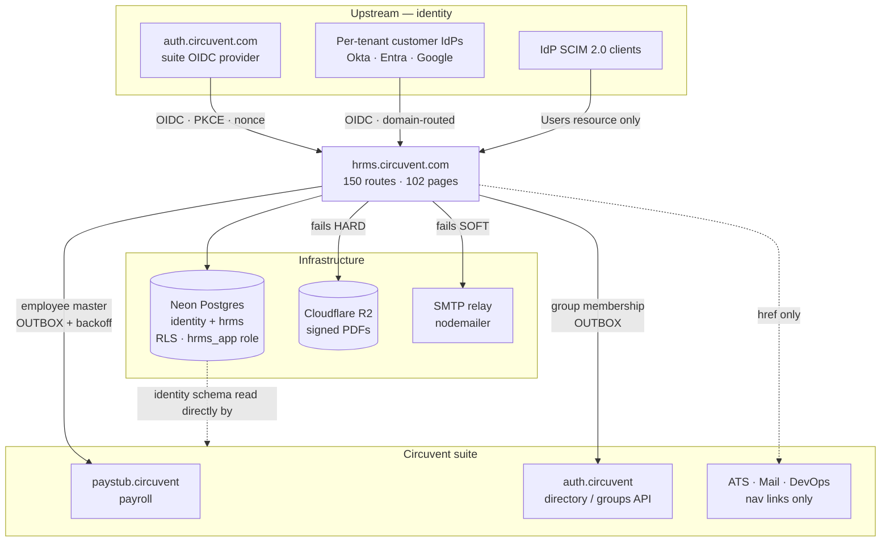
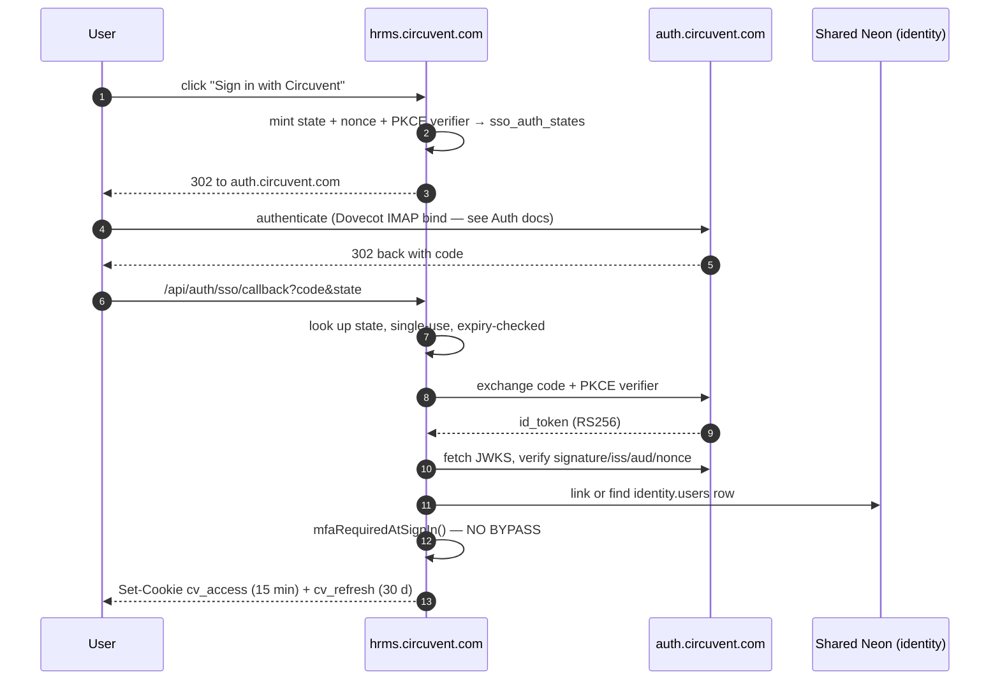

# 03 · Integrations and Ecosystem

> **Audience:** integration engineers, security reviewers, and anyone tracing where a piece of data goes.
> **One-line summary:** HRMS is a **relying party** to two OIDC systems, a **receiver** of SCIM provisioning, a **publisher** of employee master data to Paystub, and a **consumer** of four infrastructure services. It is never an identity provider, and it receives no third-party webhooks.

---

## 1. The map

```
                        UPSTREAM — things that push INTO HRMS
   ┌─────────────────────────────────────────────────────────────────────┐
   │                                                                     │
   │   auth.circuvent.com          Customer IdPs             IdP SCIM    │
   │   (suite OIDC provider)       (Okta/Entra/Google,       clients     │
   │          │                     one per tenant)             │        │
   │          │ RS256/JWKS                 │ RS256/JWKS          │ SCIM 2.0│
   └──────────┼────────────────────────────┼─────────────────────┼───────┘
              ▼                            ▼                     ▼
   ╔══════════════════════════════════════════════════════════════════════╗
   ║                        hrms.circuvent.com                            ║
   ║                                                                      ║
   ║       150 API routes    ·    102 pages    ·    Android v1.8.0        ║
   ║                                                                      ║
   ║   128 routes  requireApiContext   session cookie / bearer JWT        ║
   ║     3 routes  requireApiKey       cvk_ API keys, scope-based         ║
   ║     2 routes  authenticateScim    hashed per-org bearer              ║
   ║    17 routes  public / bespoke    health, openapi, tokens, cron      ║
   ╚══════════════════════════════════════════════════════════════════════╝
              │              │              │              │
              ▼              ▼              ▼              ▼
   ┌──────────────┐ ┌──────────────┐ ┌────────────┐ ┌──────────────────┐
   │ Neon Postgres│ │ Cloudflare R2│ │ SMTP relay │ │ paystub.circuvent│
   │ THE backbone │ │ signed PDFs  │ │ nodemailer │ │ employee master  │
   │ identity +   │ │ FAILS HARD   │ │ FAILS SOFT │ │ ONE-WAY, OUTBOX  │
   │ hrms schemas │ │              │ │            │ │                  │
   └──────────────┘ └──────────────┘ └────────────┘ └──────────────────┘
              │
              ▼  also read directly by
   ┌───────────────────────────────────────────────────────────────────┐
   │  auth · mail · ats · website · devops — the shared identity schema │
   │  THIS, not any API, is the real backbone of "suite single sign-on" │
   └───────────────────────────────────────────────────────────────────┘

                        DOWNSTREAM — nav links only
   ┌───────────────────────────────────────────────────────────────────┐
   │  ATS.circuvent · Mail.circuvent · DevOps.circuvent                │
   │  appear in src/lib/ecosystem.ts as APP-SWITCHER URLs.             │
   │  NO direct REST calls to any of them exist in this codebase.      │
   └───────────────────────────────────────────────────────────────────┘
```



---

## 2. The four ways in

```
   ┌──────────────────┬───────────────┬──────────┬──────────────────────┐
   │ Path             │ Credential    │ # routes │ Principal            │
   ├──────────────────┼───────────────┼──────────┼──────────────────────┤
   │ Session          │ cv_access     │   128    │ a PERSON with a ROLE │
   │                  │ cookie, or a  │          │ ApiContext           │
   │                  │ bearer JWT    │          │ { orgId, userId,     │
   │                  │ (native)      │          │   email?, role }     │
   ├──────────────────┼───────────────┼──────────┼──────────────────────┤
   │ API key          │ cvk_live_…    │     3    │ a SYSTEM with SCOPES │
   │                  │ SHA-256 at    │          │ ApiKeyContext        │
   │                  │ rest          │          │ { orgId, keyId,      │
   │                  │               │          │   scopes }           │
   ├──────────────────┼───────────────┼──────────┼──────────────────────┤
   │ SCIM             │ per-org       │     2    │ an IdP provisioning  │
   │                  │ bearer,       │          │ users                │
   │                  │ SHA-256       │          │                      │
   ├──────────────────┼───────────────┼──────────┼──────────────────────┤
   │ Public / bespoke │ none, or a    │    17    │ health probes, spec  │
   │                  │ single-use    │          │ documents, mailed    │
   │                  │ hashed token, │          │ tokens, and two      │
   │                  │ or a static   │          │ static shared        │
   │                  │ shared secret │          │ secrets              │
   └──────────────────┴───────────────┴──────────┴──────────────────────┘
                                        ───
                                        150   ← reconciles exactly
```

### Why two context modules

`api-context.ts` and `api-v1-context.ts` exist separately because **two different kinds of principal need two different shapes**. A session belongs to a *person* who has a *role*; an API key belongs to an *integration* that has *scopes*. The header of `api-v1-context.ts` states the reason plainly: reusing the role model for API keys would over-permission integrations.

```ts
// api-context.ts — 128 routes
export type ApiRole = "owner" | "admin" | "hr" | "manager" | "employee";
export interface ApiContext { orgId: string; userId: string; email?: string; role: ApiRole }
export async function requireApiContext(request: NextRequest, allowedRoles?: ApiRole[]): Promise<ApiContext>

// api-v1-context.ts — 3 routes
export interface ApiKeyContext { orgId: string; keyId: string; scopes: ApiKeyScope[]; superuser?: false }
export async function requireApiKey(request: NextRequest, requiredScopes?: ApiKeyScope[]): Promise<ApiKeyContext>
```

Both throw typed errors, and both share the same in-memory `checkRateLimit`.

---

## 3. The 150 routes, grouped

| Prefix | # | Auth | Purpose |
| --- | :-: | --- | --- |
| `/api/auth/*` | 15 | mixed | login · register · logout · refresh · me · MFA · SSO · passkey |
| `/api/performance/*` | 11 | session | reviews, goals, self-assessment, ratings |
| `/api/compensation/*` | 8 | session | pay bands, revisions, structures |
| `/api/roster/*` | 8 | session | shift and roster scheduling |
| `/api/documents/*` | 8 | session ×7, **service token** ×1 | generation, e-sign lifecycle, reminders |
| `/api/learning/*` | 7 | session | courses, enrolments, completions |
| `/api/assets/*` | 6 | session | IT and company asset tracking |
| `/api/ats/*` | 6 | session | **HRMS's own internal recruitment pipeline** |
| `/api/governance/*` | 6 | session | retention, legal hold, DSAR, consent |
| `/api/employees/*` | 5 | session | core employee CRUD |
| `/api/referrals/*` | 5 | session ×4, **public token** ×1 | employee referral programme |
| `/api/helpdesk/*` | 5 | session | internal IT/HR ticketing |
| `/api/attendance/*` | 5 | session | check-in/out, regularisation |
| `/api/v1/*` | 4 | **API key** ×3, public ×1 | public partner API + OpenAPI spec |
| `/api/benefits/*` | 4 | session | enrolment and administration |
| `/api/reports/*` | 3 | session | canned reports |
| `/api/leave/*` | 3 | session | apply, approve, balance |
| `/api/lifecycle/*` | 3 | session | onboarding / offboarding |
| `/api/integrations/*` | 3 | session (`settings.manage`) | configure **outbound** webhooks |
| `/api/expenses/*` | 3 | session | claims and approval |
| `/api/custom-fields/*` | 3 | session | tenant-defined schema extensions |
| `/api/scim/*` | 3 | **SCIM token** ×2, public ×1 | inbound SCIM 2.0 provisioning |
| `/api/payroll/*` | 3 | session | HRMS's own payroll module |
| `/api/sync/*` | 2 | session | **inbound** — sibling apps querying HRMS |
| `/api/tax/*` | 2 | session | declarations and computation |
| `/api/workflows/*` · `/api/holidays/*` · `/api/groups/*` · `/api/collections/*` | 2 each | session | configuration and generic data |
| 10 further single-route groups | 1 each | session | loans, recruitment, work-arrangements, departments, team, notifications, announcements |
| `/api/health` | 1 | **none** | status probe |
| `/api/sign/[id]` | 1 | **single-use hashed token** | e-signature by a non-account holder |
| `/api/cron` | 1 | **`CRON_SECRET` bearer** | outbox sweeps, reminder triggers |
| **Total** | **150** | | |

### Exactly three routes have no authentication at all

| Route | Why that is correct |
| --- | --- |
| `GET /api/health` | Status only. No tenant data. |
| `GET /api/v1/openapi` | The API's shape — needed *before* an integrator has a key. |
| `GET /api/scim/v2/ServiceProviderConfig` | Capability metadata. **Unauthenticated per RFC 7644 §4.** |

Two more accept no session but *do* require a secret — a single-use hashed token, not "no auth":

```
   GET/POST /api/public/referral/[token]     GET/POST /api/sign/[id]
   ─────────────────────────────────────     ────────────────────────
   256-bit token                             same pattern
   only its SHA-256 is stored                constant-time comparison
   uniform 404 on any mismatch               wrong id and wrong token
   rate limited 30/min GET, 5/min POST       return the SAME 404
```

The uniform-404 discipline matters: a distinguishable "wrong token" response would confirm that a valid document id had been guessed.

---

## 4. Suite identity — how single sign-on actually works

```
   THE THING PEOPLE ASSUME                THE THING THAT IS TRUE
   ───────────────────────                ──────────────────────
   "The apps call each other's            The apps SHARE ONE POSTGRES
    APIs to share sessions."              PROJECT and read the SAME
                                          `identity` schema DIRECTLY.

                                          identity.users
                                          identity.organizations
                                          identity.sessions
                                          identity.user_roles

                                          A shared HS256 AUTH_JWT_SECRET
                                          then makes one app's cookie
                                          verifiable by all of them.
```



### Two SSO systems, both relying-party

| Module | Role | Notes |
| --- | --- | --- |
| `src/lib/circuvent-sso.ts` | RP to **`auth.circuvent.com`** | The suite IdP. PKCE + state + nonce, RS256/JWKS. |
| `src/lib/sso.ts` | RP to **each tenant's own IdP** | Okta / Entra / Google, selected by email domain. **Explicitly not SAML** — the header documents the reason (the XML signature-wrapping attack class), so this is a decision, not an omission. |

**HRMS is never itself an OIDC provider or a SAML IdP for anyone.**

---

## 5. Inbound SCIM 2.0

```
   IdP (Okta / Entra)  ──── SCIM 2.0 ────▶  /api/scim/v2/Users
                                            /api/scim/v2/Users/[id]
                                            /api/scim/v2/ServiceProviderConfig

   AUTHENTICATION
     bearer token → SHA-256 → per-org scimTokens lookup
                  → TIMING-SAFE compare → revoked? expired?
     600 requests/min/org
     EVERY call written to scim_sync_log — operation, payload, status code

   COVERAGE
     ✅ Users resource
     ✅ ServiceProviderConfig  (unauthenticated, per RFC 7644 §4)
     🔴 NO Groups resource — an IdP configured to push SCIM groups has
        nothing to call. Common in Okta/Entra SCIM apps. Doc 05, D-12.
```

---

## 6. API keys

```
   FORMAT     cvk_<live|test>_<32 hex>_<48 hex>
                              ─────────  ─────────
                              16 random  24 random bytes = the SECRET
                              bytes, an  192 bits of entropy
                              INDEXED
                              LOOKUP
                              PREFIX

   AT REST    SHA-256 — justified in-code precisely BECAUSE the secret
              carries 192 bits of entropy, so no KDF is needed (unlike
              a password, which is low-entropy and therefore needs Argon2id)

   LOOKUP     prefix indexes the row → hash compared with
              timingSafeEqualHex() — constant time

   SCOPES     employees:read/write · leave:read/write ·
              attendance:read/write · payroll:read/write ·
              reports:read · webhooks:manage

              ⚠ `write` DOES NOT imply `read`. requireScopes() checks
                each one explicitly. An integration that only writes
                cannot read back.

   LIFECYCLE  expiresAt and revokedAt, both checked at request time,
              and revoked keys excluded at the SQL layer too

   LIMITS     per-key bucket: checkRateLimit(`apikey:${keyId}`,
              key.rateLimitPerMinute, 60_000) — configurable per key
```

> 🟡 **One inconsistency.** `requireApiKey` distinguishes *"expired"* from *"invalid"* in its client-facing error, while login, SCIM and the referral/sign tokens all deliberately collapse failure reasons to prevent enumeration. Low severity, but worth aligning. Doc 05, D-14.

---

## 7. The Paystub integration — and a common misconception

```
   ╔══════════════════════════════════════════════════════════════════════╗
   ║  HRMS DOES NOT DELEGATE PAYROLL TO PAYSTUB.                          ║
   ║                                                                      ║
   ║  Both applications compute Indian statutory figures independently.   ║
   ║  HRMS has its own payroll module, its own payroll_runs and           ║
   ║  payroll_records tables, and its own statutory-india.ts.             ║
   ║                                                                      ║
   ║  The only link is a ONE-WAY PUSH OF EMPLOYEE MASTER DATA.            ║
   ╚══════════════════════════════════════════════════════════════════════╝

   ⚠ AND: src/lib/payroll-client.ts is NOT the Paystub client.
     It is a browser fetch wrapper for HRMS's own /api/payroll/* routes.
     The real one is src/lib/paystub-client.ts.
```

### What crosses, and how

```
   TRIGGER   an employee record changes
      │
      ▼
   ┌────────────────────────────────────────────────────────────┐
   │  paystub_employee_sync_outbox                              │
   │  row written IN THE SAME DATABASE TRANSACTION as the change│
   └────────────────────────────────────────────────────────────┘
      │  after commit
      ▼
   POST  $PAYSTUB_SYNC_URL        (https://paystub.circuvent.com/api/sync/employees)
   Header  X-Service-Token: $CROSS_APP_SYNC_TOKEN

   PAYLOAD   name · date of birth · address · phone
             PAN / UAN / PF / ESI  ── DECRYPTED immediately before sending
             department + location as CODE and NAME
                                    ─────────────────
                                    never internal UUIDs, because Paystub
                                    owns its own independent tables and
                                    HRMS's primary keys mean nothing there

   ON FAILURE  exponential backoff, capped around 17 hours,
               drained by /api/cron
```

The **transactional outbox** pattern appears four times in this codebase:

| Outbox | Purpose |
| --- | --- |
| `paystub-sync-outbox.ts` | employee master → Paystub |
| `document-pdf-outbox.ts` | signed PDF → Cloudflare R2 |
| `directory-group-outbox.ts` | group membership → auth.circuvent directory |
| `outbox-sweep.ts` | the shared drainer, invoked by `/api/cron` |

Its value: the queue row and the business change either both commit or neither does. There is no window where an employee is updated but the sync was never queued.

---

## 8. Every outbound dependency, and its failure mode

| System | Protocol / auth | What crosses | Failure mode |
| --- | --- | --- | --- |
| **paystub.circuvent** | HTTPS POST, `X-Service-Token` | employee master data | **Durable** — outbox + backoff |
| **auth.circuvent.com** (OIDC) | OIDC redirect, RS256/JWKS | ID-token claims only | Blocks that login attempt; password login unaffected |
| **auth.circuvent.com** (directory API) | HTTPS, `Bearer` **and** `X-Service-Token` (`DIRECTORY_SERVICE_TOKEN`) — `directory-sdk.ts` | group membership for mail-list expansion | **Fails soft** on read (empty directory); writes queue in an outbox |
| **SMTP relay** | direct SMTP via `nodemailer` | notifications, letters | **Fails soft** — logs, returns `false`, callers proceed |
| **Cloudflare R2** | `@aws-sdk/client-s3` | signed document PDFs | **Fails hard** — throws |
| **Neon Postgres** | direct connection, `hrms_app` role | everything | N/A — this *is* the system |
| ATS · Mail · DevOps | **none** | — | `ecosystem.ts` nav links only |

```
   WHY MAIL FAILS SOFT AND STORAGE FAILS HARD — the reasoning is explicit:

     A delayed notification email is an inconvenience.
     A signed document that was never persisted is unrecoverable.

     So the mailer swallows and logs; the object store throws.
```

---

## 9. Outbound webhooks — and the absence of inbound ones

```
   ┌────────────────────────────────────────────────────────────────────┐
   │  WHAT EXISTS: outbound                                             │
   │    /api/integrations/*  (3 routes, gated on `settings.manage`)     │
   │    Configure Slack / Teams / generic webhook DESTINATIONS that     │
   │    HRMS calls out to when events fire.                             │
   │    Destination URLs pass an SSRF checkEndpoint() validation.       │
   ├────────────────────────────────────────────────────────────────────┤
   │  WHAT DOES NOT EXIST: inbound                                      │
   │    A repository-wide search across all 150 routes for              │
   │    x-hub-signature · stripe-signature · x-*-signature ·            │
   │    HMAC verification helpers                                       │
   │    returned ZERO matches.                                          │
   │                                                                    │
   │    There is no endpoint anywhere that receives and verifies a      │
   │    third-party webhook callback. "Webhook signature verification"  │
   │    is therefore not applicable today.                              │
   └────────────────────────────────────────────────────────────────────┘
```

Good practice to carry forward: if an inbound receiver is ever added, it should reuse the SCIM/API-key pattern — hash at rest, constant-time compare, uniform failure.

---

## 10. Two static shared secrets

```
   /api/cron                            CRON_SECRET
     • timingSafeEqual comparison ✅
     • fails CLOSED (503) if the env var is unset ✅
     • 🔴 NO nonce, NO timestamp — replayable indefinitely until rotated
     • 🔴 NO rate limit found on this route

   /api/documents/reminders             CROSS_APP_SYNC_TOKEN
     • requireServiceToken() checks x-service-token (or bearer)
     • timingSafeEqual ✅, fails CLOSED (403) if unset ✅
     • falls back to requireApiContext + ["owner","admin","hr"] for humans
     • 🔴 NO rate limit
     • 🔴 THE ONE TENANCY EXCEPTION — see below
```

```
   ╔══════════════════════════════════════════════════════════════════════╗
   ║  THE ONE PLACE orgId IS NOT DERIVED FROM A VERIFIED IDENTITY         ║
   ╠══════════════════════════════════════════════════════════════════════╣
   ║                                                                      ║
   ║  In 149 of 150 routes, orgId comes from requireApiContext() or       ║
   ║  requireApiKey() — that is, from the VERIFIED TOKEN. Never from the  ║
   ║  request body. Never from the query string. This is stated as the    ║
   ║  design rationale in api-context.ts's own header, and it holds.      ║
   ║                                                                      ║
   ║  /api/documents/reminders is the exception. Once the static          ║
   ║  CROSS_APP_SYNC_TOKEN is accepted, the tenant to act on is read      ║
   ║  from  ?orgId=  in the query string.                                 ║
   ║                                                                      ║
   ║  Anyone holding that shared token can name ANY tenant and trigger    ║
   ║  mass reminder emails for it. With no rate limit.                    ║
   ║                                                                      ║
   ║  → Doc 05, D-02                                                      ║
   ╚══════════════════════════════════════════════════════════════════════╝
```

`requireUserOrService()` — a helper in `server-auth.ts` that accepts either credential — is **defined but never called anywhere**. The one route that needs the dual path reimplements it inline. Doc 05, D-15.

---

## 11. Environment variables

| Variable | Purpose | In `.env.example`? |
| --- | --- | :-: |
| `DATABASE_URL` | Neon connection — **must name a `NOBYPASSRLS` role** | ✅ |
| `DATABASE_POOL_MAX` | pg pool size, default 10 | ✅ |
| `AUTH_JWT_SECRET` | **HS256 suite session secret — shared across all apps** | ✅ |
| `ENCRYPTION_KEY` | AES-256-GCM current key, base64 | ✅ |
| `ENCRYPTION_KEY_PREVIOUS` | comma-separated retired keys, decrypt-only | ✅ |
| `CRON_SECRET` | `/api/cron` bearer | ✅ |
| `CROSS_APP_SYNC_TOKEN` | Paystub push + `/api/documents/reminders` | ✅ |
| `PAYSTUB_SYNC_URL` | Paystub endpoint | ✅ |
| `SMTP_*` | nodemailer transport | ✅ |
| `S3_*` / R2 credentials | object storage | ✅ |
| `SSO_CLIENT_ID` | suite OIDC client | 🔴 **undocumented** |
| `SSO_CLIENT_SECRET` | suite OIDC client | 🔴 **undocumented** |
| `SSO_REDIRECT_URI` | suite OIDC callback | 🔴 **undocumented** |
| `AUTH_ISSUER` | expected `iss` | 🔴 **undocumented** |
| `DIRECTORY_SERVICE_TOKEN` | directory/groups API | 🔴 **undocumented** |
| `ALLOW_RLS_BYPASS` | escape hatch for the RLS guard — **never set in production** | ✅ |
| `NEXT_PUBLIC_USE_LOCAL_CREDS` | 🔴 **dead** — points at `src/lib/local-auth.ts`, which does not exist | ✅ |

Five variables are read by code but absent from `.env.example`. Each fails soft or disables its feature when unset, so severity is low — but it is exactly the kind of drift that makes a fresh deployment quietly lose SSO. Doc 05, D-11.

---

## 12. Integration risk register

| # | Risk | Severity |
| --- | --- | --- |
| 1 | **`/api/documents/reminders` takes `orgId` from the query string** after a static token, with no rate limit — cross-tenant blast radius | 🔴 |
| 2 | **`AUTH_JWT_SECRET` is one symmetric key shared suite-wide** — a leak in *any* sibling app forges sessions everywhere; no per-app key separation is visible from this repository | 🔴 |
| 3 | **`/api/cron`'s secret is replayable** — no nonce, no timestamp, no rate limit | 🟠 |
| 4 | **Five required env vars are undocumented** — SSO silently disables on a fresh deploy | 🟠 |
| 5 | **In-memory rate limiting** — per serverless instance, so the real ceiling scales with instance count. Flagged as a stopgap in its own comment; a Redis swap is planned | 🟠 |
| 6 | **SCIM has no Groups resource** — an IdP expecting group push has nothing to call | 🟠 |
| 7 | **`requireUserOrService()` is dead code** — the intended pattern was never applied | 🟡 |
| 8 | **`NEXT_PUBLIC_USE_LOCAL_CREDS` is a dead security toggle** — harmless only because nothing implements it, and `NEXT_PUBLIC_*` is client-visible by definition | 🟡 |
| 9 | **API-key error messages distinguish expired from invalid** — inconsistent with the uniform-failure discipline used elsewhere | 🟡 |

### And the positive control, stated explicitly

> Outside of risk #1, `orgId` is **always** derived from the verified token in `requireApiContext` / `requireApiKey` — never trusted from a request body or query string. This is the stated design rationale in `api-context.ts`'s header and it is consistently applied across 149 of 150 routes. Combined with Postgres RLS and a `NOBYPASSRLS` connection role, it is a genuinely strong defence in depth.

---

*Next: [04_MAINTENANCE_AND_OPERATIONS.md](./04_MAINTENANCE_AND_OPERATIONS.md) · Back to [02_DATABASE_AND_DATA_MODELS.md](./02_DATABASE_AND_DATA_MODELS.md)*
