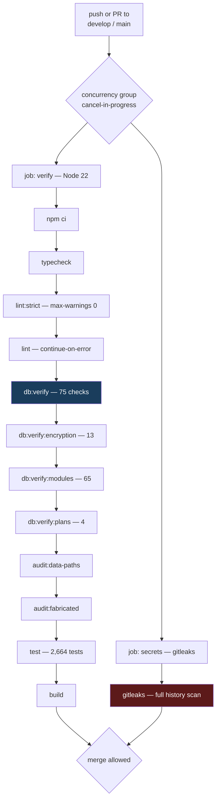

# 04 · Maintenance and Operations

> **Audience:** anyone who has to run, deploy, debug or extend this system.
> **The distinguishing fact:** this is the **only application in the Circuvent suite with a working CI pipeline** — and even so, it runs 9 of its own 12 verification checks.

---

## 1. Local setup

```
   ┌──────────────────────────────────────────────────────────────────────┐
   │  PREREQUISITES                                                       │
   │    Node 22 (CI pins it; 20 will build but is not what ships)         │
   │    A Neon Postgres database                                          │
   │    JDK 17 + Android SDK — ONLY if you touch android/                 │
   └──────────────────────────────────────────────────────────────────────┘

   git clone https://github.com/Hemakotibonthada/HRMS.circuvent
   cd HRMS.circuvent
   npm install

   cp .env.example .env.local        ← then fill it in, see §2
   npm run db:verify                 ← 39 migrations onto in-memory PGlite
   npm run dev                       ← Next 16 + Turbopack, port 3000

   FIRST-RUN SANITY, in order:
     npm run typecheck               tsc --noEmit
     npm run test                    2,664 tests, ~92 files
     npm run db:verify:live          ⚠ needs a REAL DATABASE_URL
```

> ⚠️ **`npm run db:verify:live` is the one that matters and the one that is not in CI.** Everything else runs against in-memory PGlite. Run it against a real database after any change to roles, grants or connection strings. It is the check that would have caught the BYPASSRLS incident.

---

## 2. Configuration

`.env.local` is git-ignored and has never been committed. `.vercelignore` exists specifically because, before it did, `.env.local` and database backups were uploaded to every Vercel deployment.

```
   REQUIRED
     DATABASE_URL             ⚠ MUST name a role WITHOUT BYPASSRLS.
                                The app refuses to start otherwise —
                                assertConnectionIsolatesTenants() throws.
     AUTH_JWT_SECRET          HS256, shared across the whole suite
     ENCRYPTION_KEY           32 bytes, base64 — AES-256-GCM

   OPTIONAL BUT LOAD-BEARING
     ENCRYPTION_KEY_PREVIOUS  comma-separated retired keys (decrypt only)
     CRON_SECRET              /api/cron — fails CLOSED (503) if unset
     CROSS_APP_SYNC_TOKEN     Paystub push + documents/reminders
     PAYSTUB_SYNC_URL         https://paystub.circuvent.com/api/sync/employees
     SMTP_*                   nodemailer — fails SOFT if unset
     S3_* / R2 credentials    object storage — fails HARD if a PDF is needed
     DATABASE_POOL_MAX        default 10

   READ BY CODE, ABSENT FROM .env.example  🔴
     SSO_CLIENT_ID  ·  SSO_CLIENT_SECRET  ·  SSO_REDIRECT_URI
     AUTH_ISSUER    ·  DIRECTORY_SERVICE_TOKEN

   ESCAPE HATCHES — never in production
     ALLOW_RLS_BYPASS=true          disables the tenancy guard
     NEXT_PUBLIC_USE_LOCAL_CREDS    🔴 DEAD — src/lib/local-auth.ts
                                       does not exist
```

---

## 3. The npm script surface

```
   DEVELOPMENT              dev · build · start · lint · typecheck

   STRICTNESS               lint:strict   --max-warnings 0, but only over
                                          an explicit ALLOW-LIST of paths
                            lint:a11y     jsx-a11y rules
                            typecheck:mobile

   DATABASE                 db:verify              39 migrations → PGlite, 75 checks
                            db:verify:encryption   13 checks, key rotation
                            db:verify:modules      65 checks, route reality
                            db:verify:plans        4 checks, EXPLAIN + counterfactual
                            db:verify:live      ⚠ needs a real DB — RLS in production
                            db:verify:reach     ⚠ needs two apps' creds

   AUDITS                   audit:data-paths     91 pages vs their data sources
                            audit:fabricated     hardcoded data that looks real
                            audit:unwired        built but never dispatched

   AGGREGATE                verify        ← 12 checks
   ```

```
   npm run verify   — the 12 checks
   ┌────────────────────────────────┬──────────────┐
   │ typecheck                      │  ✅ in CI    │
   │ typecheck:mobile               │  🔴 NOT      │
   │ lint:strict                    │  ✅ in CI    │
   │ lint:a11y                      │  🔴 NOT      │
   │ lint                           │  ✅ advisory │
   │ db:verify                      │  ✅ in CI    │
   │ db:verify:encryption           │  ✅ in CI    │
   │ db:verify:modules              │  ✅ in CI    │
   │ db:verify:plans                │  ✅ in CI    │
   │ audit:data-paths               │  ✅ in CI    │
   │ audit:fabricated               │  ✅ in CI    │
   │ audit:unwired                  │  🔴 NOT      │
   │ test                           │  ✅ in CI    │
   │ build                          │  ✅ in CI    │
   └────────────────────────────────┴──────────────┘
        A developer running `npm run verify` locally gets MORE
        coverage than CI provides. Doc 05, D-04.
```

---

## 4. Continuous integration

`.github/workflows/verify.yml` — the only real CI in the Circuvent suite.



```
   ┌──────────────────────────────────────────────────────────────────────┐
   │  WHAT CI CANNOT SEE — and this is the whole lesson                   │
   │                                                                      │
   │  Every db:verify* step in CI runs against IN-MEMORY PGlite.          │
   │  No live database is ever contacted.                                 │
   │                                                                      │
   │  That is precisely why the BYPASSRLS incident was invisible:         │
   │  PGlite connects as its own superuser, so RLS policy correctness     │
   │  tests pass regardless of which role production actually uses.       │
   │                                                                      │
   │  db:verify:live and db:verify:reach are the two checks that would    │
   │  have caught it — and they are the two that need real credentials,   │
   │  and therefore the two NOT in CI.                                    │
   │                                                                      │
   │  This is a genuine, unresolved gap. Doc 05, D-01.                    │
   └──────────────────────────────────────────────────────────────────────┘
```

---

## 5. The nine guard scripts

These check things a unit test structurally cannot.

### 5.1 `audit-data-paths.ts` — does the page have a data source?

```
   Walks 91 dashboard pages and reconciles each against
     12 ENTITY_ROUTES  +  29 allow-listed doc_store collections

   THE FAILURE IT PREVENTS:
     A page fetches /api/kudos. That route does not exist. The fetch
     404s. The component's catch block renders an empty state.

     The user sees "No kudos yet."
     Not "something is broken."

     A silent 404 that renders as an empty state is indistinguishable
     from genuinely having no data — and no test would ever catch it,
     because the component behaves exactly as written.
```

### 5.2 `audit-fabricated-data.ts` — is this number real?

Scans for hardcoded values that look like live data. **Currently 0 findings.**

> Its own history is the point: an earlier version scanned **2 of 9 directories** and reported clean while real fabricated data sat in the 7 it never opened. A guard that only appears to work is worse than none.

### 5.3 `audit-unwired.ts` — is it wired up?

Checks that anything built to be dispatched actually is, across 6 effect modules. Current verdict: *"Everything built to be dispatched is dispatched."*

### 5.4 `verify-modules.ts` — is the route real?

65 checks. Its rationale:

> *"two routes were once fakes that returned 201 and wrote nothing."*

A route returning `201 Created` while persisting nothing passes every integration test that only asserts the status code.

### 5.5–5.9 The five database guards

Covered in detail in doc 02 §9. Summary of the live run performed during this audit:

```
   verify-migrations.ts        74 / 75    🔴 1 FAIL — journal drift
   verify-encryption.ts        13 / 13    ✅
   verify-live-isolation.ts     3 / 3     ⚠ core cross-tenant test SKIPPED
                                            (only 1 organisation exists)
   verify-credential-reach.ts   2 / 2     ⚠ Auth.circuvent half skipped
   verify-query-plans.ts        4 / 4     ✅ with a DROP INDEX counterfactual
```

---

## 6. The test suite

```
   92 test files  ·  2,664 tests passing  ·  12 skipped  ·  1 flaky

   Vitest 4 + Testing Library + @electric-sql/pglite

   WHY IT IS FAST: ~40 domain modules are PURE. They take arguments and
   return values. No database, no clock, no network — so the statutory,
   rostering, workflow, expense and settlement suites are plain function
   calls.

   NOTABLE COVERAGE
     middleware.test.ts        36 assertions across 6 describes, including
                               look-alike prefix rejection (/loginish must
                               NOT match the /login public prefix) and
                               header-overwrite protection
     rbac.test.ts              36 assertions — role completeness, privilege
                               boundaries, canAccessModule fail-closed,
                               and "a reporting line does not imply pay
                               visibility"
     workflow/engine.test.ts   495 lines for a 493-line module

   ⚠ FLAKY: paystub-sync-outbox.test.ts passes standalone, intermittently
     fails in a full-suite run — a shared-state or timing dependency.
     Doc 05, D-17.

   ⚠ UNTESTED: document-dispatch.ts · notifications/notify.ts · hr-utils.ts
     — all three have real side effects.
```

---

## 7. Code quality

```
   IN src/  —  measured, not estimated
   ┌─────────────────────────────────┬─────────┐
   │ TODO / FIXME comments           │    0    │
   │ @ts-ignore / @ts-expect-error   │    0    │
   │ eslint-disable                  │    0    │
   │ literal console.log             │    0    │
   │ files using `any`               │   ~9    │
   └─────────────────────────────────┴─────────┘

   That is an unusually clean tree. But:

   🔴 lint:strict --max-warnings 0 covers only an EXPLICIT ALLOW-LIST.
      Outside it — and therefore never strictly linted:
        almost all  src/app/(dashboard)/**/page.tsx
        all         src/components/**
        all         src/hooks/**
        all         src/stores/**
        about half  src/app/api/**

      The plain `lint` run reports ~925 warnings and is
      `continue-on-error` in CI. README says "~936".

   LARGEST FILES
     src/db/schema/hrms.ts                        1,440
     src/db/repositories/ats.neon.ts              1,292
     src/lib/document-templates/catalog.ts        1,139
     src/db/repositories/rostering.neon.ts        1,012
     src/app/(dashboard)/admin/page.tsx             919
```

---

## 8. The other ~25 scripts

| Script | What it does |
| --- | --- |
| `apply-app-role.ts` | Creates/repairs `hrms_app` — the fix from migration 0028 |
| `contain-database-access.ts` | 🔴 Written because **Auth's credential could open the `hrms` database as `neondb_owner` with BYPASSRLS** |
| `smoke-live.ts` | End-to-end against a live deployment. **Read its header.** |
| `apply-migration.ts` | Hand-rolled migration runner — one file, statement by statement, tolerating "already exists" |
| `encrypt-fields.ts` | Backfills the 4 encryption targets |
| `sync-employees-to-paystub.ts` | Manual outbox drain |
| `sweep-routes.ts` | Route inventory |
| `test-e2e.ts` | E2E harness |
| `audit-suite-connections.ts` | 🟠 contains a **hardcoded absolute path** `C:\Users\v-hbonthada\…` — works on exactly one machine |
| `clean-prod-keep-applicants.mjs`, `seat-the-founder.mjs`, `merge-duplicate-org.cjs`, `purge-demo-tenants.mjs` | ⚠️ Destructive production data tools. Read before running. |

---

## 9. Deployment

```
   ┌──────────┐   git push    ┌──────────┐   build   ┌──────────────────┐
   │  local   │──────────────▶│  GitHub  │──────────▶│  Vercel          │
   │  develop │               │  verify  │           │  Next 16 runtime │
   └──────────┘               │  gitleaks│           └────────┬─────────┘
                              └──────────┘                    │
                                                              ▼
                                              ┌──────────────────────────┐
                                              │  vercel.json             │
                                              │  crons: [{               │
                                              │    "path": "/api/cron",  │
                                              │    "schedule":"0 3 * * *"│
                                              │  }]                      │
                                              └──────────────────────────┘
                                                    ONE cron, daily 03:00
                                                    drains ALL FOUR outboxes
```

```
   🔴 next.config.ts HAS NO SECURITY HEADERS.

      No Content-Security-Policy.
      No Strict-Transport-Security.
      No X-Frame-Options / frame-ancestors.
      No X-Content-Type-Options.
      No Referrer-Policy · No Permissions-Policy.

      Also absent: serverExternalPackages, and any image remote-pattern
      allow-list.

      For an application holding salary, bank details and national
      identifiers, this is the single cheapest high-value fix available.
      Doc 05, D-05.
```

### Mobile

```
   ┌────────────────────────────┬────────────────────────────────────────┐
   │  mobile/                   │  android/                              │
   │  Expo ~52 · RN 0.76.6      │  Kotlin Multiplatform                  │
   │                            │    shared/  — business logic           │
   │  v1.0.0 / versionCode 1    │    app/     — Jetpack Compose          │
   │                            │    iosApp/  — SwiftUI, NEVER COMPILED  │
   │  "has never been run on a  │                                        │
   │   device" — its own docs   │  v1.8.0 / versionCode 10               │
   │                            │  SIGNED AND READY (HRMS Upload.md)     │
   │  ❌ ABANDONED PRECURSOR     │  ✅ THE ONE THAT SHIPS                  │
   └────────────────────────────┴────────────────────────────────────────┘
              ⚠ BOTH DECLARE THE SAME APP ID: com.circuvent.hrms

   CONSEQUENCE: business rules now exist independently in THREE codebases
     web TypeScript  ·  Expo TypeScript  ·  Kotlin
   A statutory rate change must be made three times, correctly, in three
   languages. Nothing checks that they agree. Doc 05, D-08.
```

---

## 10. Debugging playbook

### 10.1 Every query returns zero rows

```
   SYMPTOM   A page renders empty. No error. The data exists in the DB.

   CAUSE #1  The code path did not go through withTenant().
             app_current_org() returns NULL, `org_id = NULL` is NULL,
             the RLS policy denies everything.
             FIX: route the repository call through withTenant(ctx, fn).

   CAUSE #2  ctx.orgId is empty string rather than a uuid.
             set_config('app.org_id', '', true) → NULLIF gives NULL.
             Same outcome.

   ✅ This is FAIL-CLOSED. An empty result is the safe failure. The
      dangerous failure — seeing OTHER tenants' rows — means the
      connecting role has BYPASSRLS. Run: npm run db:verify:live
```

### 10.2 The app refuses to start

```
   "the connected role bypasses row-level security"
       → DATABASE_URL names a superuser or the table owner.
       → npx tsx scripts/apply-app-role.ts, then repoint DATABASE_URL
         at hrms_app.
       → Do NOT set ALLOW_RLS_BYPASS=true to make it go away.
```

### 10.3 A user cannot sign in

```
   ┌─ Password rejected? ─────────────────────────────────────────────┐
   │  Argon2id auto-rehashes on parameter drift. A hash written under │
   │  older parameters still verifies. Check the PHC prefix.          │
   └──────────────────────────────────────────────────────────────────┘
   ┌─ SSO or passkey silently refuses? ───────────────────────────────┐
   │  🔴 MOST LIKELY: the user has MFA active. Neither SSO nor        │
   │     passkey accepts a TOTP parameter, so mfaRequiredAtSignIn()   │
   │     fails them closed. This is the known UX gap, not a bug in    │
   │     the IdP. Workaround: password + TOTP. Doc 05, D-09.          │
   └──────────────────────────────────────────────────────────────────┘
   ┌─ 401 with x-session-refresh: 1 ──────────────────────────────────┐
   │  Normal. Access token expired, refresh cookie present. The       │
   │  client should call /api/auth/refresh and retry once.            │
   └──────────────────────────────────────────────────────────────────┘
   ┌─ Refresh returns 401 unexpectedly? ──────────────────────────────┐
   │  A refresh token was REUSED. That triggers FAMILY REVOCATION —   │
   │  every session in the chain is killed. Usually two tabs racing;  │
   │  occasionally a real theft. Check sessions.rotated_to_id.        │
   └──────────────────────────────────────────────────────────────────┘
```

### 10.4 The Paystub sync is not arriving

```
   1  SELECT status, attempt_count, next_attempt_at, last_error
        FROM hrms.paystub_employee_sync_outbox
       WHERE org_id = :org AND status <> 'sent';

   2  Backoff caps around 17 HOURS. A row can legitimately sit
      untouched for most of a day.

   3  Only /api/cron drains it — once daily at 03:00 UTC.
      Manual drain: npx tsx scripts/sync-employees-to-paystub.ts

   4  Check CROSS_APP_SYNC_TOKEN matches on BOTH sides.
```

### 10.5 A migration did not run

```
   npm run db:verify

   Expect: "missing from _journal.json: 0033_directory_group_join_outbox,
            0036_integrations"

   🔴 THIS IS THE KNOWN, CURRENT, REAL FAILURE. Doc 05, D-10.
      Those two files apply RLS correctly but would never execute in a
      fresh environment, because drizzle reads the journal, not the
      directory.

   Fix: add both entries to drizzle/meta/_journal.json.
```

### 10.6 A page shows an empty state that should have data

```
   npm run audit:data-paths

   This is exactly the failure it was written to find: a fetch to a
   route that does not exist, 404ing into a component's catch block,
   rendering "no items" instead of "broken".
```

---

## 11. Observability

```
   WHAT EXISTS                          WHAT DOES NOT
   ───────────                          ─────────────
   ✅ identity.audit_log — hash-chained  ❌ APM / distributed tracing
      and append-only at the DB level    ❌ Sentry or equivalent
   ✅ scim_sync_log — every SCIM call    ❌ structured JSON logging
   ✅ outbox tables with attempt_count,  ❌ alerting on outbox depth
      next_attempt_at, last_error        ❌ uptime monitoring beyond
   ✅ /api/health                           /api/health existing
   ✅ Vercel platform logs               ❌ dashboards of any kind

   Practically: the ONLY way to learn that the Paystub outbox has been
   failing for three days is to query the table. Nothing raises a hand.
   Doc 05, D-18.
```

---

## 12. Routine maintenance

| Cadence | Task |
| --- | --- |
| **Every deploy** | `npm run verify` locally — it covers 3 more checks than CI does |
| **Every deploy** | Confirm `DATABASE_URL` still names `hrms_app` |
| **Weekly** | Query all four outbox tables for rows with a high `attempt_count` |
| **Monthly** | `npm run db:verify:live` against production — **once there is more than one organisation, so the cross-tenant test actually executes** |
| **Monthly** | `npm run db:verify:reach` with both apps' credentials present |
| **Quarterly** | Rotate `ENCRYPTION_KEY`; move the old key to `ENCRYPTION_KEY_PREVIOUS`; run `encrypt-fields.ts`; only then drop the retired key |
| **Quarterly** | Rotate `CRON_SECRET` and `CROSS_APP_SYNC_TOKEN` — neither has replay protection |
| **Per statutory change** | Update `statutory-india.ts` **and** the Kotlin `shared/` module **and** the Expo copy, or delete the latter two |
| **Per migration** | Add the journal entry. This has been missed three times. |

---

*Next: [05_AREAS_OF_ENHANCEMENT.md](./05_AREAS_OF_ENHANCEMENT.md) · Back to [03_INTEGRATIONS_AND_ECOSYSTEM.md](./03_INTEGRATIONS_AND_ECOSYSTEM.md)*
