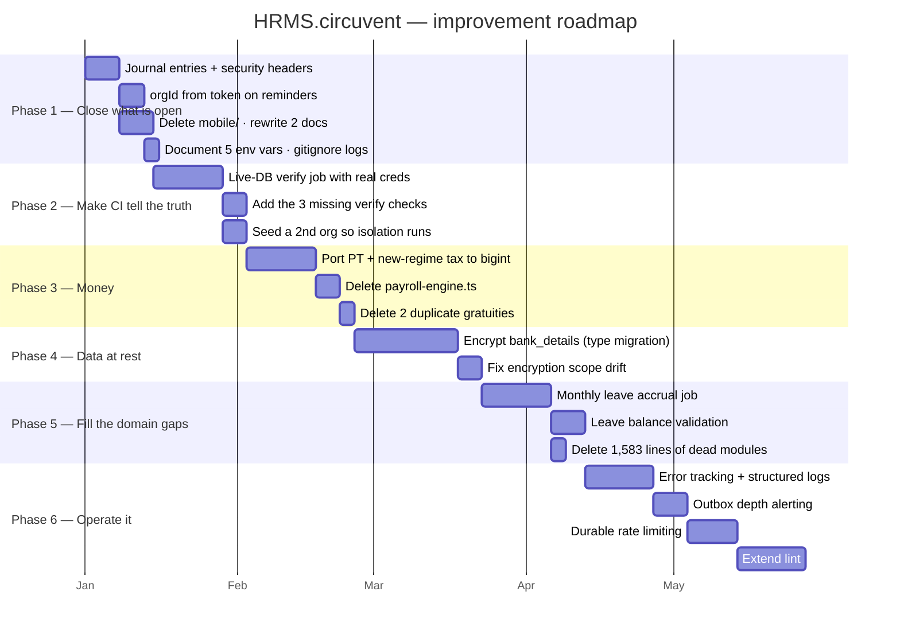

# 05 · Areas of Enhancement

> **Audience:** engineering leadership and whoever owns the next two quarters.
> **Method:** every item below is traceable to a file, a script's live output, or a comment in the codebase itself. Nothing here is speculative.

---

## 1. Gap analysis

```
   ┌─────────────────────────┬────────┬────────┬────────────────────────┐
   │ Dimension               │  Now   │ Target │ Gap                    │
   ├─────────────────────────┼────────┼────────┼────────────────────────┤
   │ Verification discipline │ ████████│████████│ best in the suite      │
   │ Test coverage           │ ███████ │████████│ 3 side-effect modules  │
   │ Code hygiene            │ ███████ │████████│ lint allow-list gaps   │
   │ Domain rigour           │ ███████ │████████│ leave accrual missing  │
   │ Auth & session design   │ ███████ │████████│ MFA blocks SSO         │
   │ Tenancy enforcement     │ ██████  │████████│ 1 route reads ?orgId=  │
   │ Money consistency       │ █████   │████████│ 🔴 float seam          │
   │ CI completeness         │ █████   │████████│ 🔴 no live-DB check    │
   │ Encryption at rest      │ ████    │████████│ 🔴 bank_details plain  │
   │ Documentation accuracy  │ ███     │████████│ 🔴 2 docs obsolete     │
   │ Dead code               │ ███     │████████│ ~1,583 lines           │
   │ Rule-source singularity │ ██      │████████│ 🔴 rules in 3 languages│
   │ Response headers        │ █       │████████│ 🔴 none at all         │
   │ Observability           │ █       │██████  │ 🔴 nothing raises a hand│
   └─────────────────────────┴────────┴────────┴────────────────────────┘
```

---

## 2. The one thing to internalise before anything else

```
   ╔══════════════════════════════════════════════════════════════════════╗
   ║                                                                      ║
   ║   "ninety-one correct policies and seventy-five passing isolation    ║
   ║    tests, while DATABASE_URL pointed at a role with BYPASSRLS and    ║
   ║    every query returned every tenant's rows.                         ║
   ║    Nothing that ran in CI could have noticed."                       ║
   ║                                                                      ║
   ║                          — scripts/smoke-live.ts                     ║
   ║                                                                      ║
   ╠══════════════════════════════════════════════════════════════════════╣
   ║                                                                      ║
   ║   Every artefact was correct:                                        ║
   ║     ✅ the policies                                                   ║
   ║     ✅ the tests                                                      ║
   ║     ✅ the test results                                               ║
   ║                                                                      ║
   ║   And the system was completely broken, because the CREDENTIAL       ║
   ║   the application actually connected with was exempt from the        ║
   ║   policies being tested.                                             ║
   ║                                                                      ║
   ║   The lesson is not "add a test."                                    ║
   ║   The lesson is: SOME PROPERTIES ARE ONLY TRUE OF A DEPLOYMENT,      ║
   ║   AND A TEST SUITE CANNOT SEE THEM.                                  ║
   ║                                                                      ║
   ║   This codebase learned that and grew nine verification scripts.     ║
   ║   Two of them — the two that would have caught this — are still      ║
   ║   NOT in CI, because they need real credentials. That is the         ║
   ║   single most important open item in this document.                  ║
   ╚══════════════════════════════════════════════════════════════════════╝
```

A second, related incident is recorded in `scripts/contain-database-access.ts`: **Auth's credential could open the `hrms` database as `neondb_owner` with BYPASSRLS.** Same class of failure — a credential reaching further than intended — but across applications rather than across tenants.

---

## 3. Technical debt log

Severity: 🔴 critical · 🟠 high · 🟡 medium · ⚪ low

| ID | Finding | Sev | Effort |
| --- | --- | :-: | :-: |
| **D-01** | **`db:verify:live` and `db:verify:reach` are not in CI.** Every DB check in CI runs against in-memory PGlite, which connects as its own superuser — structurally unable to detect the exact failure that already happened once | 🔴 | M |
| **D-02** | **`/api/documents/reminders` reads `orgId` from the query string** after a static token, with no rate limit. The one place in 150 routes where a tenant is not derived from a verified identity | 🔴 | S |
| **D-03** | **Float seam in the live payroll pipeline.** `payroll.neon.ts` does `BigInt(Math.round(calculateProfessionalTax(minorToMajor(gross)) * 100))` — round-tripping through the codebase's own display-only helper, whose doc comment forbids exactly this | 🔴 | M |
| **D-04** | **CI runs 9 of the 12 `npm run verify` checks.** Omits `typecheck:mobile`, `lint:a11y`, `audit:unwired`. A local run is stricter than the merge gate | 🔴 | S |
| **D-05** | **`next.config.ts` has no security headers.** No CSP, HSTS, X-Frame-Options, X-Content-Type-Options, Referrer-Policy or Permissions-Policy — on an app holding salary, bank details and national identifiers | 🔴 | S |
| **D-06** | **`docs/PLATFORM-ARCHITECTURE.md` and `docs/DEPLOYMENT.md` are wholesale obsolete.** They describe a Firestore-backed system with "zero automated tests", "no Neon project", "no Vercel project" and "`main` has not been created" — none of which is true | 🔴 | S |
| **D-07** | **`bank_details` is unencrypted `jsonb`.** Full account number and IFSC in plaintext in Postgres; masked only on read. Needs a column type migration, not a backfill | 🔴 | L |
| **D-08** | **Business rules exist independently in three codebases** — web TypeScript, Expo TypeScript, Kotlin — all shipping under app id `com.circuvent.hrms`. Nothing checks that they agree | 🔴 | L |
| **D-09** | **MFA blocks SSO and passkey sign-in entirely.** No bypass exists (correct), but neither path accepts a TOTP parameter, so an MFA-enabled user cannot use them at all | 🟠 | M |
| **D-10** | **Migration journal drift.** 39 files, 37 journal entries; `0033_directory_group_join_outbox` and `0036_integrations` would never run in a fresh environment. **This is currently the one failing check in `verify-migrations.ts`.** Per `0023`'s own comment, this has now happened three times | 🟠 | S |
| **D-11** | **Five required env vars are undocumented** — `SSO_CLIENT_ID`, `SSO_CLIENT_SECRET`, `SSO_REDIRECT_URI`, `AUTH_ISSUER`, `DIRECTORY_SERVICE_TOKEN`. SSO silently disables on a fresh deploy | 🟠 | S |
| **D-12** | **Three gratuity implementations.** One correct (bigint, Act-compliant, `statutory-india.ts`); two naive float duplicates in `payroll-engine.ts` and `hr-utils.ts` with no part-year rounding and no death/disablement waiver. Both are dead — and both are still exported | 🟠 | S |
| **D-13** | **~1,583 lines of dead modules.** `employee-lifecycle.ts` (469), `compliance-engine.ts` (475), `reporting-engine.ts` (639) — zero importers, zero tests | 🟠 | S |
| **D-14** | **No monthly leave accrual.** `leave_balances.accrued_days` exists and is always 0. Provisioning is annual-upfront; the accrual job "does not exist yet" | 🟠 | M |
| **D-15** | **No leave-request-vs-balance validation anywhere in `src/lib`.** Nothing in the pure rule layer prevents applying for more leave than is held | 🟠 | M |
| **D-16** | **`lint:strict` covers an explicit allow-list only.** Almost all dashboard pages, all of `components/`, `hooks/`, `stores/`, and about half of `app/api/` are never strictly linted. ~925 warnings sit behind `continue-on-error` | 🟠 | M |
| **D-17** | **`/api/cron`'s secret is replayable** — constant-time compared, but no nonce, no timestamp, no rate limit | 🟠 | S |
| **D-18** | **No observability.** No APM, no error tracking, no structured logs, no alerting. The only way to learn an outbox has been failing for three days is to query the table | 🟠 | M |
| **D-19** | **`dev2.log` and `build_output2.txt` are committed** and absent from `.gitignore` — swept in by an unattended `chore: auto-sync` commit | 🟡 | S |
| **D-20** | **No working `__drizzle_migrations` ledger.** The schema was pushed, not migrated; there is no authoritative record of what has run against any database | 🟡 | M |
| **D-21** | **Encryption scope drift.** `aadhaar_number` is a backfill target with no capture path anywhere in the product; `dependants.identifier` claims encryption-at-rest but is absent from `TARGETS` | 🟡 | S |
| **D-22** | **`verify-live-isolation`'s core test has never executed.** Only one organisation exists, so the plant-as-A-read-as-B experiment is skipped, not passed | 🟡 | S |
| **D-23** | **Three side-effect modules are untested** — `document-dispatch.ts`, `notifications/notify.ts`, `hr-utils.ts` | 🟡 | M |
| **D-24** | **`paystub-sync-outbox.test.ts` is flaky** — passes standalone, intermittently fails in a full-suite run | 🟡 | S |
| **D-25** | **In-memory rate limiting.** Per serverless instance, so the real ceiling scales with instance count. Flagged as a stopgap in its own comment | 🟡 | M |
| **D-26** | **SCIM has no Groups resource.** An IdP configured for group push has nothing to call | 🟡 | M |
| **D-27** | **`edgeDb()` has zero call sites** — and structurally cannot carry the tenant GUC if ever wired up | 🟡 | S |
| **D-28** | **Query-plan proof covers one table.** `expense_claims` is verified by EXPLAIN with a `DROP INDEX` counterfactual; `attendance_records`, `payroll_records` and `tickets` are asserted by naming convention only | 🟡 | M |
| **D-29** | **`audit-suite-connections.ts` hardcodes an absolute path** `C:\Users\v-hbonthada\…` — works on exactly one machine | ⚪ | S |
| **D-30** | **`requireUserOrService()` is dead code** — the intended dual-credential pattern was never applied | ⚪ | S |
| **D-31** | **`NEXT_PUBLIC_USE_LOCAL_CREDS` is a dead security toggle** pointing at a non-existent `src/lib/local-auth.ts`. Harmless only because nothing implements it | ⚪ | S |
| **D-32** | **No AAD in the GCM envelope** — the tag authenticates ciphertext but not the row or column it belongs to | ⚪ | M |
| **D-33** | **Undocumented soft FKs** on `competency_ratings.review_id` and `calibration_adjustments.review_id` | ⚪ | S |
| **D-34** | **API-key errors distinguish expired from invalid**, inconsistent with the uniform-failure discipline used by login, SCIM and the token routes | ⚪ | S |
| **D-35** | **Snapshot drift** — `drizzle/meta/*_snapshot.json` exists for 7 of 37 journal entries | ⚪ | M |
| **D-36** | **`mobile/` (Expo) is an abandoned precursor** sharing an app id with the shipping Kotlin app. Delete it or archive it | ⚪ | S |

---

## 4. The float seam, in full

This deserves its own section because it sits in the one place money is actually computed.

```
   THE RULE THE CODEBASE SET FOR ITSELF — src/lib/money/minor.ts

     /** A whole number of paise, as a decimal string. Never a float. */
     export type MinorUnits = string;

     …and on minorToMajor(), the display helper:
       "the result must never be summed or compared for equality"


   WHERE IT HOLDS  ✅
     statutory-india.ts   compensation.ts   settlement.ts
     assets.ts            expense-rules.ts


   WHERE IT BREAKS  🔴  — src/db/repositories/payroll.neon.ts

     const professionalTax =
       BigInt(Math.round(calculateProfessionalTax(minorToMajor(gross)) * 100));
                         ─────────────────────── ─────────────────  ─────
                                 │                       │            │
       a FLOAT function from ────┘                       │            │
       payroll-engine.ts                                 │            │
                                                         │            │
       fed by the DISPLAY-ONLY helper ───────────────────┘            │
       whose own comment forbids this                                 │
                                                                      │
       then forced back into bigint ─────────────────────────────────┘

     Same shape for calculateNewRegimeIncomeTax.
     bigint → float → bigint, twice, per employee, per run.


   WHY payroll-engine.ts IS STILL THERE
     580 lines, entirely number-based, a legacy remnant.
     FIVE of its seven major functions have ZERO callers.
     Only these two are still wired in — through this seam.
```

**The codebase has already solved this exact problem once, and wrote down how.** From `income-tax-declaration.ts`:

> *"There were three implementations of the Indian slabs in this codebase — payroll's old regime, the tax page's own inline copy, and the real one — and three copies of a slab table is three different answers to 'what is my tax', of which at most one is right."*

Income tax slabs were consolidated. **Gratuity was not.** Professional tax was not. The pattern is understood; the work is unfinished.

---

## 5. Three codebases, one set of rules

```
                        ┌──────────────────────────┐
                        │  Indian statutory rules  │
                        │  PF · ESI · PT · TDS ·   │
                        │  gratuity · leave        │
                        └────────────┬─────────────┘
                                     │
              ┌──────────────────────┼──────────────────────┐
              ▼                      ▼                      ▼
   ┌────────────────────┐ ┌────────────────────┐ ┌────────────────────┐
   │  web TypeScript    │ │  Expo TypeScript   │ │  Kotlin            │
   │  src/lib/          │ │  mobile/src/lib/   │ │  android/shared/   │
   │  statutory-india   │ │  leave-rules       │ │                    │
   │  .ts               │ │  shift-rules       │ │  v1.8.0            │
   │                    │ │  attendance-rules  │ │  versionCode 10    │
   │  ✅ SHIPS           │ │  ❌ ABANDONED       │ │  ✅ SHIPS           │
   └────────────────────┘ └────────────────────┘ └────────────────────┘
              └──────────────────────┴──────────────────────┘
                    all three declare com.circuvent.hrms

   ⚠ NOTHING CHECKS THAT THEY AGREE.

   A PF wage-ceiling change must be made three times, correctly, in two
   languages, by people who may not know the other two copies exist.

   NOTE ON NAMING: leave-rules.ts, shift-rules.ts and attendance-rules.ts
   do NOT exist in src/lib. Those names point ONLY at mobile/src/lib/*.
   The web equivalents are leave-provisioning.ts, rostering.ts and
   attendance-regularisation.ts. A search for the former names finds the
   ABANDONED copy first.
```

**Recommendation:** delete `mobile/` outright (it has never run on a device and its own docs say so), then extract the statutory rules into a versioned specification that both the web and Kotlin implementations are tested against — a shared fixture file of inputs and expected outputs, run by both suites.

---

## 6. Phased roadmap



### Phase 1 — Close what is already open (about a week)

Everything here is small, and every item is a known-broken thing rather than an improvement.

| Task | Debt | Why now |
| --- | --- | --- |
| Add two journal entries | D-10 | It is the one **currently failing** check. Two lines of JSON. |
| Add security headers to `next.config.ts` | D-05 | Highest value-per-hour item in this document |
| Derive `orgId` from the token on `/api/documents/reminders`, and rate-limit it | D-02 | Closes the only tenancy exception in 150 routes |
| Delete `mobile/`, rewrite `PLATFORM-ARCHITECTURE.md` and `DEPLOYMENT.md` | D-36, D-06 | Both actively mislead new engineers today |
| Document the 5 env vars; gitignore `dev2.log` and `build_output2.txt` | D-11, D-19 | Trivial |

### Phase 2 — Make CI tell the truth (2–3 weeks)

```
   ADD A JOB THAT CONNECTS TO A REAL DATABASE.

   A dedicated CI Neon branch, seeded with TWO organisations, with
   DATABASE_URL pointing at hrms_app. Then run:

     npm run db:verify:live      ← the plant-as-A-read-as-B experiment
                                   FINALLY EXECUTES
     npm run db:verify:reach     ← proves credential containment

   Plus the three checks CI currently skips:
     typecheck:mobile (or drop it with mobile/)
     lint:a11y
     audit:unwired

   OUTCOME: CI becomes capable of catching the class of failure that
   already occurred once. Right now it is not.
```

### Phase 3 — Finish the money migration (3 weeks)

1. Port `calculateProfessionalTax` and `calculateNewRegimeIncomeTax` to bigint, in `statutory-india.ts` alongside their siblings.
2. Repoint `payroll.neon.ts` at them. **Delete the `minorToMajor()` round-trip.**
3. Delete `payroll-engine.ts` entirely — the other five functions already have no callers.
4. Delete `calculateGratuity` from `payroll-engine.ts` and `hr-utils.ts`. One implementation, in `statutory-india.ts`.
5. Add a regression test asserting there is exactly one gratuity implementation.

### Phase 4 — Data at rest (3–4 weeks)

`bank_details` is `jsonb`. Encrypting it means a column type change, a backfill and a read-path change — not a one-line addition to `TARGETS`. Sequence: add `bank_details_encrypted text` → dual-write → backfill → switch reads → drop the old column. While in there, resolve the encryption scope drift (D-21).

### Phase 5 — Fill the domain gaps (3 weeks)

Monthly accrual (`accrued_days` finally does something) · a pure `validateLeaveRequest(request, balance, policy)` in `src/lib` · delete the three dead modules.

### Phase 6 — Operate it (6–8 weeks)

Error tracking · structured logs · alerting on outbox depth and age · durable rate limiting (Redis/Upstash — already planned in-code) · extend `lint:strict` past the allow-list.

---

## 7. What not to change

```
   ✅ THE PURE-CORE / IMPURE-SHELL SPLIT
      It is why 2,664 tests run in under a minute with no database.

   ✅ THE NINE VERIFICATION SCRIPTS
      They check things a test suite structurally cannot. Adding more
      unit tests would not have caught the BYPASSRLS incident. These do.

   ✅ THE TRANSACTIONAL OUTBOX, ALL FOUR TIMES
      The queue row and the business change commit together, or neither.

   ✅ assertConnectionIsolatesTenants()
      The single best line of defence in the codebase.

   ✅ FORCE ROW LEVEL SECURITY
      "a mistake in a migration script must not be able to read across
       tenants either."

   ✅ THE HASH-CHAINED, APPEND-ONLY AUDIT LOG
      Revoked at the grant level AND trigger-protected AND hash-chained.

   ✅ MFA THAT WILL NOT ISSUE BACKUP CODES FOR AN UNPROVEN SECRET
      Rare, and correct.

   ✅ interview_scorecards.submitted_at GATING VISIBILITY
      Anchoring bias prevented in the data model, not a UI rule.

   ✅ THE "SELF-DOCUMENTED REGRESSION HISTORY" COMMENT CONVENTION
      Modules that open by naming the specific bug they exist to prevent.
      This audit was materially easier because of it, and so is every
      future one.

   ✅ assistant.ts REFUSING TO INVENT, AND ap-holidays.ts REFUSING TO GUESS
      Two systems that would rather say "I cannot see that" than be
      confidently wrong. Keep both.
```

---

## 8. If you only do five things

```
   ┌────┬─────────────────────────────────────────────────┬────────────┐
   │ 1  │ Add the two missing migration journal entries   │ 10 minutes │
   │    │ — it is a currently failing check               │            │
   ├────┼─────────────────────────────────────────────────┼────────────┤
   │ 2  │ Add security headers to next.config.ts          │ 1 hour     │
   ├────┼─────────────────────────────────────────────────┼────────────┤
   │ 3  │ Derive orgId from the token on                  │ half a day │
   │    │ /api/documents/reminders, and rate-limit it     │            │
   ├────┼─────────────────────────────────────────────────┼────────────┤
   │ 4  │ Add a CI job with a real two-organisation       │ 1 week     │
   │    │ database, running db:verify:live + :reach       │            │
   ├────┼─────────────────────────────────────────────────┼────────────┤
   │ 5  │ Delete payroll-engine.ts and the two duplicate  │ 1 week     │
   │    │ gratuity implementations                        │            │
   └────┴─────────────────────────────────────────────────┴────────────┘

   #4 is the one that matters most. Everything else on this list is a
   defect. #4 is the capability to notice the next one.
```

---

*Back to [01_SYSTEM_OVERVIEW.md](./01_SYSTEM_OVERVIEW.md) · [02_DATABASE_AND_DATA_MODELS.md](./02_DATABASE_AND_DATA_MODELS.md) · [03_INTEGRATIONS_AND_ECOSYSTEM.md](./03_INTEGRATIONS_AND_ECOSYSTEM.md) · [04_MAINTENANCE_AND_OPERATIONS.md](./04_MAINTENANCE_AND_OPERATIONS.md)*
