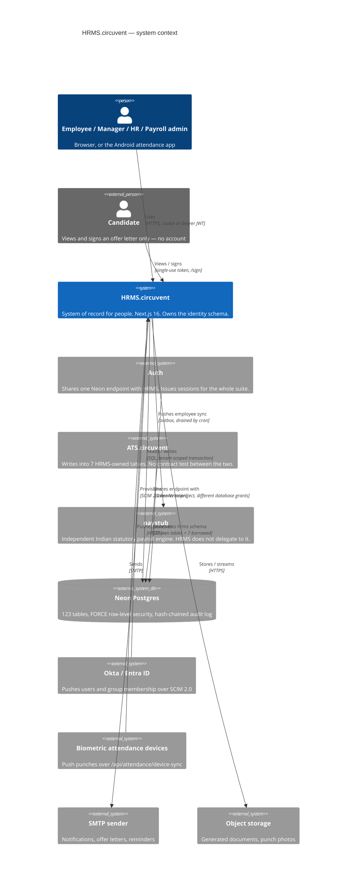
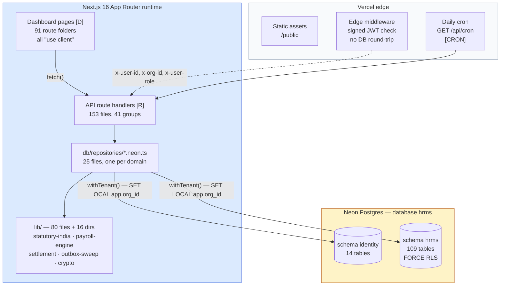
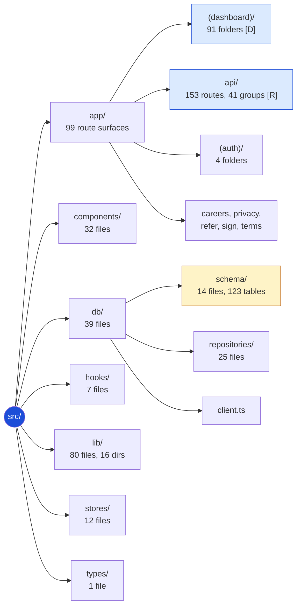

# 06 · Architecture Diagram Atlas

> **What this is.** Every other document in this folder explains. This one *shows*.
> It is a complete visual inventory of HRMS.circuvent — every module, every route,
> every table, every external call, every workflow, every state machine — with
> nothing summarised away. HRMS is the largest and most sensitive application in
> the suite: 1,454 files, 144,146 lines, 150 audited API routes (153 found by
> direct enumeration in this pass), 117 audited database tables (123 found by
> direct enumeration — see §7), and 2,664 tests. It is the system of record for
> people: employees, leave, attendance, rostering, payroll, performance and
> documents. It owns the `identity` schema the rest of the eight-application
> suite reads, it is the only application with a working CI pipeline, and its
> tenant-isolation design is the reference the other seven applications should
> copy. Where the source disagreed with the audit in docs 01–05, this document
> says so and gives the source-verified figure — the deltas are small and are
> called out individually, not hidden.
>
> **How to read it.** Each section gives the same information twice: an
> ASCII/Unicode diagram that renders anywhere (a terminal, a diff, a plain-text
> email), and a Mermaid block that renders as an interactive graphic on GitHub,
> in VS Code, and in most wikis. Sections 14–18 exist beyond the standard atlas
> structure because this application's risk surface — row-level security, the
> BYPASSRLS incident, the ATS shared-schema boundary, four outboxes and an
> append-only audit log, and the only real CI pipeline in the suite — earns
> dedicated treatment.

### Legend

```
   ┌──────────┐          a component that exists in this repository
   │  solid   │
   └──────────┘

   ╭┈┈┈┈┈┈┈┈┈┈╮          a component that lives somewhere else
   ┊  dashed  ┊          (Auth, ATS.circuvent, paystub, Neon, a browser, a device)
   ╰┈┈┈┈┈┈┈┈┈┈╯

   ──────▶               a synchronous call, made and awaited
   ┈┈┈┈┈▶                an asynchronous, queued or cron-driven signal
   ══════▶               a redirect, or a schema/tenant boundary crossing

   [D]    dynamic page    a "use client" page under (dashboard), fetching its
                          own data from this app's /api routes — there are no
                          React Server Components fetching data and no
                          "use server" actions anywhere in this repository
   [R]    route handler   an HTTP endpoint under src/app/api/**/route.ts
   [CRON] scheduled job   runs on Vercel's daily cron, not on a user request
   [RLS]  tenant isolation FORCE ROW LEVEL SECURITY is enabled on this table
   DEFECT  a verified, real problem — diagrammed honestly, not hidden
   DEAD    code or schema that exists on disk but is never exercised
```

---

## 1. C4 Level 1 — System context

```
                    ╭┈┈┈┈┈┈┈┈┈┈┈┈┈┈┈┈┈┈┈┈┈┈┈┈┈┈┈┈┈┈┈┈┈┈┈┈┈┈┈┈┈┈┈╮
                    ┊  EMPLOYEE · MANAGER · HR ADMIN · PAYROLL   ┊
                    ┊  ADMIN · CANDIDATE (offer letters only)    ┊
                    ┊  browser, or the Android attendance app    ┊
                    ╰┈┈┈┈┈┈┈┈┈┈┈┈┈┈┈┈┈┈┈┬┈┈┈┈┈┈┈┈┈┈┈┈┈┈┈┈┈┈┈┈┈┈┈╯
                                        │ HTTPS · cookie or bearer JWT
                                        ▼
   ╭┈┈┈┈┈┈┈┈┈┈┈┈┈╮     ┌─────────────────────────────────────────────────┐
   ┊  Okta /     ┊────▶│              HRMS.circuvent                    │
   ┊  Entra ID   ┊SCIM │                                                 │
   ┊ (SCIM push) ┊     │  Next.js 16 App Router · 584 src files          │
   ╰┈┈┈┈┈┈┈┈┈┈┈┈┈╯     │  91 dashboard routes · 153 API routes           │
                       │  System of record for employees, leave,         │
   ╭┈┈┈┈┈┈┈┈┈┈┈┈┈╮     │  attendance, rostering, payroll, performance,   │
   ┊  Biometric  ┊────▶│  documents. Owns the `identity` schema.         │
   ┊  attendance ┊     └───┬──────────┬──────────┬──────────┬───────────┘
   ┊  devices    ┊         │          │          │          │
   ╰┈┈┈┈┈┈┈┈┈┈┈┈┈╯         │          │          │          │
                          ▼          ▼          ▼          ▼
                 ╭┈┈┈┈┈┈┈┈┈┈╮ ╭┈┈┈┈┈┈┈┈┈╮ ╭┈┈┈┈┈┈┈┈┈┈╮ ╭┈┈┈┈┈┈┈┈┈┈┈╮
                 ┊  Neon    ┊ ┊  Auth   ┊ ┊  ATS     ┊ ┊  paystub  ┊
                 ┊ Postgres ┊ ┊(shared  ┊ ┊(writes   ┊ ┊(indep.    ┊
                 ┊ 123      ┊ ┊ Neon    ┊ ┊ into 7   ┊ ┊ statutory ┊
                 ┊ tables   ┊ ┊ endpoint)┊ ┊ borrowed ┊ ┊ payroll — ┊
                 ┊ FORCE RLS┊ ┊         ┊ ┊ tables)  ┊ ┊no delegate)┊
                 ╰┈┈┈┈┈┈┈┈┈┈╯ ╰┈┈┈┈┈┈┈┈┈╯ ╰┈┈┈┈┈┈┈┈┈┈╯ ╰┈┈┈┈┈┈┈┈┈┈┈╯
                                             │
                                             │ outbox: paystub employee sync
                                             ▼
                                       (drained by /api/cron, daily)

   ALSO REACHED: object/blob storage (documents, punch photos), an SMTP
   sender (notifications, offer letters), and a mail-exchange target for
   directory-group provisioning (see §17).

   THE ONE-LINE VERSION
   HRMS is the only application in the suite with a working CI pipeline and
   the only one that FORCES row-level security everywhere. ATS writes
   straight into its schema with no contract test. Auth's credential could
   once open this database directly — that hole is closed (§16, §14).
```



---

## 2. C4 Level 2 — Containers

```
   ┌═══════════════════════════════════════════════════════════════════════╗
   ║                       VERCEL EDGE + CRON                                ║
   ║  ┌────────────────┐  ┌─────────────────────┐  ┌───────────────────┐   ║
   ║  │ Static assets  │  │  Edge middleware     │  │  Daily cron        │   ║
   ║  │ /public        │  │  signed-JWT check,   │  │  GET /api/cron     │   ║
   ║  │                │  │  no DB round-trip    │  │  [CRON]            │   ║
   ║  └────────────────┘  └──────────┬───────────┘  └─────────┬──────────┘   ║
   ╚══════════════════════════════════╪════════════════════════╪═════════════╝
                                      │                        │
   ┌──────────────────────────────────▼════════════════════════▼═════════════┐
   │                    NEXT.js 16 APP ROUTER RUNTIME                        │
   │                                                                         │
   │  ┌───────────────────────┐   ┌────────────────────────────────────┐    │
   │  │  DASHBOARD PAGES [D]  │   │        API ROUTE HANDLERS [R]      │    │
   │  │  91 route folders,    │──▶│  153 route.ts files, 41 top-level  │    │
   │  │  all "use client",    │   │  groups — the ONLY way a page      │    │
   │  │  fetch their own data │   │  reaches data (no RSC data fetch,  │    │
   │  │  (auth, employees,    │   │  no "use server" actions anywhere) │    │
   │  │  leave, attendance,   │   └──────────────┬─────────────────────┘    │
   │  │  payroll, roster, …)  │                  │                          │
   │  └───────────────────────┘                  ▼                          │
   │                                  ┌────────────────────────────────┐    │
   │                                  │  db/repositories/*.neon.ts      │    │
   │                                  │  25 files, one per domain       │    │
   │                                  │  every call wrapped in          │    │
   │                                  │  withTenant() — see §14          │    │
   │                                  └──────────────┬───────────────────┘    │
   │                                                 │                       │
   │  ┌───────────────────────────────────────────┐  │                       │
   │  │  lib/ — 80 files + 16 subdirectories:      │  │                       │
   │  │  statutory-india, payroll-engine,          │  │                       │
   │  │  settlement, compliance-engine,            │  │                       │
   │  │  employee-lifecycle, outbox-sweep,         │◀─┘                       │
   │  │  document-templates, crypto, rbac, auth    │                          │
   │  └───────────────────────────────────────────┘                          │
   └──────────────────────────────────┬──────────────────────────────────────┘
                                      │  SQL, one transaction per request,
                                      │  SET LOCAL app.org_id (the GUC)
                                      ▼
                       ┌──────────────────────────────────────┐
                       │   NEON POSTGRES — database `hrms`     │
                       │   schema `identity` — 14 tables       │
                       │   schema `hrms`     — 109 tables      │
                       │   FORCE RLS on every one (§14)         │
                       └──────────────────────────────────────┘

   OUTSIDE THE RUNTIME: object/blob storage for documents and punch photos,
   an SMTP sender, the SCIM inbound surface (Okta/Entra push to
   /api/scim/v2/*), and the biometric device push to
   /api/attendance/device-sync.
```



---

## 3 · C4 Level 3 — Complete file map

The tree below is the whole repository, one folder per line, with a file count
where a folder is too large to list. Nothing in `src/` is omitted at the
directory level; the three largest leaves (`app/(dashboard)`, `app/api`,
`lib`) are broken out fully in §5, §7 and their own call-outs rather than
repeated here twice.

```
HRMS.circuvent/                             1,454 files, 144,146 lines (audited)
├── .github/workflows/
│   └── verify.yml                          the only CI pipeline in the suite — §18
├── Architecture_Docs/
│   ├── 01_SYSTEM_OVERVIEW.md .. 05_AREAS_OF_ENHANCEMENT.md   fact base for this atlas
│   ├── 06_ARCHITECTURE_DIAGRAMS.md         this document
│   ├── Architecture_Guide.{md,docx,pdf}    generated narrative export
│   ├── Architecture_Overview.pptx          generated slide export
│   └── generate_docs.py                    builds the exports above
├── android/                                Capacitor native shell (Kotlin + iosApp/)
├── docs/                                   DEPLOYMENT, PLATFORM-ARCHITECTURE, PLAY-STORE,
│                                            ROADMAP
├── drizzle/
│   ├── 0000_*.sql .. 0041_*.sql            43 migrations, two share number "0033" — §12
│   └── meta/_journal.json                  ledger read by verify-migrations.ts
├── mobile/                                 Expo/React Native client (app.json, eas.json)
├── public/                                 12 static assets
├── scripts/                                42 operational scripts — db:verify:*,
│                                            smoke-live, contain-database-access,
│                                            audit:*, seed, backfill
└── src/
    ├── middleware.ts                       edge JWT check, RBAC gate, headers — §10
    ├── app/
    │   ├── (auth)/                         forgot-password, login, register,
    │   │                                   reset-password
    │   ├── (dashboard)/                    91 route folders, 91 pages, all client — §5
    │   ├── api/                            41 route groups, 153 route.ts files — §5
    │   ├── careers/ privacy/ refer/        5 public, unauthenticated surfaces
    │   │   sign/ terms/
    │   └── globals.css, layout.tsx, page.tsx
    ├── components/
    │   ├── shared/hr-components.tsx        ONE file — every shared component
    │   └── ui/                             31 files — shadcn/radix primitives
    ├── db/
    │   ├── schema/                         14 files, 122 Drizzle tables + doc_store — §7
    │   ├── repositories/                   25 files — one *.neon.ts per domain
    │   └── client.ts                       pool, withTenant(), assertConnection-
    │                                       IsolatesTenants()
    ├── hooks/                              7 files — use-auth, use-rbac, use-hr-metrics
    ├── lib/                                80 files + 16 subdirectories — §4
    ├── stores/                             12 files — Zustand, one per domain slice
    └── types/index.ts                      shared TS types barrel
```

No Server Actions exist anywhere in `src/` (`grep "use server"` returns zero
matches). Every dashboard page is a client component that calls the app's own
route handlers with `fetch()` — a client-rendered pattern, unlike an
RSC-plus-Server-Action design. `components/shared/` is a single 1-file module,
which is itself a fact worth recording: there is no per-domain component
library, so every dashboard feature either reaches into that one file or into
`components/ui/`.



---
