# 06 · Architecture Diagram Atlas

> **What this is.** Every other document in this folder explains. This one *shows*.
> It is a complete visual inventory of HRMS.circuvent — every module, every route,
> every table, every external call, every workflow, every state machine — with
> nothing summarised away. HRMS is the largest and most sensitive application in
> the suite: 1,454 files, 144,146 lines, 150 audited API routes (153 found by
> direct enumeration in this pass), 117 audited database tables (123 found by
> direct enumeration — see §7), and 2,664 tests. It is the system of record for
> people: employees, leave, attendance, rostering, payroll, performance and
> documents. It owns the `identity` schema the rest of the eight-application
> suite reads, it is the only application with a working CI pipeline, and its
> tenant-isolation design is the reference the other seven applications should
> copy. Where the source disagreed with the audit in docs 01–05, this document
> says so and gives the source-verified figure — the deltas are small and are
> called out individually, not hidden.
>
> **How to read it.** Each section gives the same information twice: an
> ASCII/Unicode diagram that renders anywhere (a terminal, a diff, a plain-text
> email), and a Mermaid block that renders as an interactive graphic on GitHub,
> in VS Code, and in most wikis. Sections 14–18 exist beyond the standard atlas
> structure because this application's risk surface — row-level security, the
> BYPASSRLS incident, the ATS shared-schema boundary, four outboxes and an
> append-only audit log, and the only real CI pipeline in the suite — earns
> dedicated treatment.

### Legend

```
   ┌──────────┐          a component that exists in this repository
   │  solid   │
   └──────────┘

   ╭┈┈┈┈┈┈┈┈┈┈╮          a component that lives somewhere else
   ┊  dashed  ┊          (Auth, ATS.circuvent, paystub, Neon, a browser, a device)
   ╰┈┈┈┈┈┈┈┈┈┈╯

   ──────▶               a synchronous call, made and awaited
   ┈┈┈┈┈▶                an asynchronous, queued or cron-driven signal
   ══════▶               a redirect, or a schema/tenant boundary crossing

   [D]    dynamic page    a "use client" page under (dashboard), fetching its
                          own data from this app's /api routes — there are no
                          React Server Components fetching data and no
                          "use server" actions anywhere in this repository
   [R]    route handler   an HTTP endpoint under src/app/api/**/route.ts
   [CRON] scheduled job   runs on Vercel's daily cron, not on a user request
   [RLS]  tenant isolation FORCE ROW LEVEL SECURITY is enabled on this table
   DEFECT  a verified, real problem — diagrammed honestly, not hidden
   DEAD    code or schema that exists on disk but is never exercised
```

---

## 1. C4 Level 1 — System context

```
                    ╭┈┈┈┈┈┈┈┈┈┈┈┈┈┈┈┈┈┈┈┈┈┈┈┈┈┈┈┈┈┈┈┈┈┈┈┈┈┈┈┈┈┈┈╮
                    ┊  EMPLOYEE · MANAGER · HR ADMIN · PAYROLL   ┊
                    ┊  ADMIN · CANDIDATE (offer letters only)    ┊
                    ┊  browser, or the Android attendance app    ┊
                    ╰┈┈┈┈┈┈┈┈┈┈┈┈┈┈┈┈┈┈┈┬┈┈┈┈┈┈┈┈┈┈┈┈┈┈┈┈┈┈┈┈┈┈┈╯
                                        │ HTTPS · cookie or bearer JWT
                                        ▼
   ╭┈┈┈┈┈┈┈┈┈┈┈┈┈╮     ┌─────────────────────────────────────────────────┐
   ┊  Okta /     ┊────▶│              HRMS.circuvent                    │
   ┊  Entra ID   ┊SCIM │                                                 │
   ┊ (SCIM push) ┊     │  Next.js 16 App Router · 584 src files          │
   ╰┈┈┈┈┈┈┈┈┈┈┈┈┈╯     │  91 dashboard routes · 153 API routes           │
                       │  System of record for employees, leave,         │
   ╭┈┈┈┈┈┈┈┈┈┈┈┈┈╮     │  attendance, rostering, payroll, performance,   │
   ┊  Biometric  ┊◀────│  documents. Owns the `identity` schema.         │
   ┊  attendance ┊pull └───┬──────────┬──────────┬──────────┬───────────┘
   ┊  devices    ┊         │          │          │          │
   ╰┈┈┈┈┈┈┈┈┈┈┈┈┈╯         │          │          │          │
                          ▼          ▼          ▼          ▼
                 ╭┈┈┈┈┈┈┈┈┈┈╮ ╭┈┈┈┈┈┈┈┈┈╮ ╭┈┈┈┈┈┈┈┈┈┈╮ ╭┈┈┈┈┈┈┈┈┈┈┈╮
                 ┊  Neon    ┊ ┊  Auth   ┊ ┊  ATS     ┊ ┊  paystub  ┊
                 ┊ Postgres ┊ ┊(shared  ┊ ┊(writes   ┊ ┊(indep.    ┊
                 ┊ 123      ┊ ┊ Neon    ┊ ┊ into 7   ┊ ┊ statutory ┊
                 ┊ tables   ┊ ┊ endpoint)┊ ┊ borrowed ┊ ┊ payroll — ┊
                 ┊ FORCE RLS┊ ┊         ┊ ┊ tables)  ┊ ┊no delegate)┊
                 ╰┈┈┈┈┈┈┈┈┈┈╯ ╰┈┈┈┈┈┈┈┈┈╯ ╰┈┈┈┈┈┈┈┈┈┈╯ ╰┈┈┈┈┈┈┈┈┈┈┈╯
                                             │
                                             │ outbox: paystub employee sync
                                             ▼
                                       (drained by /api/cron, daily)

   ALSO REACHED: object/blob storage (documents, punch photos), an SMTP
   sender (notifications, offer letters), and a mail-exchange target for
   directory-group provisioning (see §17).

   THE ONE-LINE VERSION
   HRMS is the only application in the suite with a working CI pipeline and
   the only one that FORCES row-level security everywhere. ATS writes
   straight into its schema with no contract test. Auth's credential could
   once open this database directly — that hole is closed (§16, §14).
```

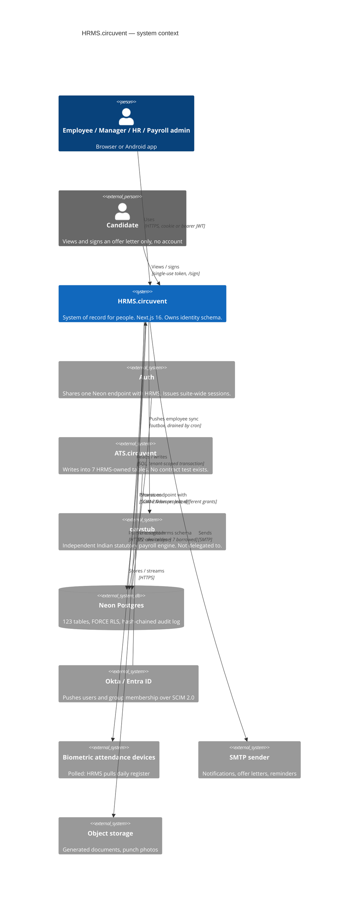
```mermaid
C4Context
    title HRMS.circuvent — system context

    Person(staff, "Employee / Manager / HR / Payroll admin", "Browser or Android app")
    Person_Ext(candidate, "Candidate", "Views and signs an offer letter only, no account")

    System(hrms, "HRMS.circuvent", "System of record for people. Next.js 16. Owns identity schema.")

    System_Ext(auth, "Auth", "Shares one Neon endpoint with HRMS. Issues suite-wide sessions.")
    System_Ext(ats, "ATS.circuvent", "Writes into 7 HRMS-owned tables. No contract test exists.")
    System_Ext(paystub, "paystub", "Independent Indian statutory payroll engine. Not delegated to.")
    SystemDb_Ext(pg, "Neon Postgres", "123 tables, FORCE RLS, hash-chained audit log")
    System_Ext(idp, "Okta / Entra ID", "Pushes users and group membership over SCIM 2.0")
    System_Ext(devices, "Biometric attendance devices", "Polled: HRMS pulls daily register")
    System_Ext(mail, "SMTP sender", "Notifications, offer letters, reminders")
    System_Ext(blob, "Object storage", "Generated documents, punch photos")

    Rel(staff, hrms, "Uses", "HTTPS, cookie or bearer JWT")
    Rel(candidate, hrms, "Views / signs", "single-use token, /sign")
    Rel(idp, hrms, "Provisions", "SCIM 2.0 bearer token")
    Rel(hrms, devices, "Pulls the register", "HTTPS · device-sync")
    Rel(hrms, pg, "Reads / writes", "SQL, tenant-scoped transaction")
    Rel(auth, pg, "Shares endpoint with", "same Neon project, different grants")
    Rel(ats, pg, "Writes into hrms schema", "22 own tables + 7 borrowed")
    Rel(hrms, paystub, "Pushes employee sync", "outbox, drained by cron")
    Rel(hrms, mail, "Sends", "SMTP")
    Rel(hrms, blob, "Stores / streams", "HTTPS")

    UpdateLayoutConfig($c4ShapeInRow="4", $c4BoundaryInRow="2")
```

---

## 2. C4 Level 2 — Containers

```
   ┌═══════════════════════════════════════════════════════════════════════╗
   ║                       VERCEL EDGE + CRON                                ║
   ║  ┌────────────────┐  ┌─────────────────────┐  ┌───────────────────┐   ║
   ║  │ Static assets  │  │  Edge middleware     │  │  Daily cron        │   ║
   ║  │ /public        │  │  signed-JWT check,   │  │  GET /api/cron     │   ║
   ║  │                │  │  no DB round-trip    │  │  [CRON]            │   ║
   ║  └────────────────┘  └──────────┬───────────┘  └─────────┬──────────┘   ║
   ╚══════════════════════════════════╪════════════════════════╪═════════════╝
                                      │                        │
   ┌──────────────────────────────────▼════════════════════════▼═════════════┐
   │                    NEXT.js 16 APP ROUTER RUNTIME                        │
   │                                                                         │
   │  ┌───────────────────────┐   ┌────────────────────────────────────┐    │
   │  │  DASHBOARD PAGES [D]  │   │        API ROUTE HANDLERS [R]      │    │
   │  │  91 route folders,    │──▶│  153 route.ts files, 41 top-level  │    │
   │  │  all "use client",    │   │  groups — the ONLY way a page      │    │
   │  │  fetch their own data │   │  reaches data (no RSC data fetch,  │    │
   │  │  (auth, employees,    │   │  no "use server" actions anywhere) │    │
   │  │  leave, attendance,   │   └──────────────┬─────────────────────┘    │
   │  │  payroll, roster, …)  │                  │                          │
   │  └───────────────────────┘                  ▼                          │
   │                                  ┌────────────────────────────────┐    │
   │                                  │  db/repositories/*.neon.ts      │    │
   │                                  │  25 files, one per domain       │    │
   │                                  │  every call wrapped in          │    │
   │                                  │  withTenant() — see §14          │    │
   │                                  └──────────────┬───────────────────┘    │
   │                                                 │                       │
   │  ┌───────────────────────────────────────────┐  │                       │
   │  │  lib/ — 81 modules + 54 tests, 16 dirs:    │  │                       │
   │  │  statutory-india, payroll-engine,          │  │                       │
   │  │  settlement, compliance-engine,            │  │                       │
   │  │  employee-lifecycle, outbox-sweep,         │◀─┘                       │
   │  │  document-templates, crypto, rbac, auth    │                          │
   │  └───────────────────────────────────────────┘                          │
   └──────────────────────────────────┬──────────────────────────────────────┘
                                      │  SQL, one transaction per request,
                                      │  SET LOCAL app.org_id (the GUC)
                                      ▼
                       ┌──────────────────────────────────────┐
                       │   NEON POSTGRES — database `hrms`     │
                       │   schema `identity` — 14 tables       │
                       │   schema `hrms`     — 109 tables      │
                       │   FORCE RLS on every one (§14)         │
                       └──────────────────────────────────────┘

   OUTSIDE THE RUNTIME: object/blob storage for documents and punch photos,
   an SMTP sender, the SCIM inbound surface (Okta/Entra push to
   /api/scim/v2/*), and the attendance device control plane — HRMS PULLS
   from it via /api/attendance/device-sync, not the other way round.
```

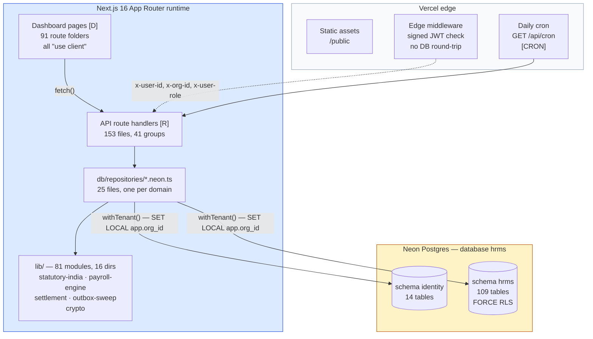
```mermaid
flowchart TB
    subgraph edge["Vercel edge"]
        static["Static assets<br/>/public"]
        mw["Edge middleware<br/>signed JWT check<br/>no DB round-trip"]
        cron["Daily cron<br/>GET /api/cron<br/>[CRON]"]
    end

    subgraph runtime["Next.js 16 App Router runtime"]
        pages["Dashboard pages [D]<br/>91 route folders<br/>all &quot;use client&quot;"]
        routes["API route handlers [R]<br/>153 files, 41 groups"]
        repos["db/repositories/*.neon.ts<br/>25 files, one per domain"]
        lib["lib/ — 81 modules, 16 dirs<br/>statutory-india · payroll-engine<br/>settlement · outbox-sweep<br/>crypto"]
    end

    subgraph data["Neon Postgres — database hrms"]
        identity[("schema identity<br/>14 tables")]
        hrmsschema[("schema hrms<br/>109 tables<br/>FORCE RLS")]
    end

    pages -->|"fetch()"| routes
    routes --> repos
    repos --> lib
    repos -->|"withTenant() — SET LOCAL app.org_id"| identity
    repos -->|"withTenant() — SET LOCAL app.org_id"| hrmsschema
    mw -.->|"x-user-id, x-org-id, x-user-role"| routes
    cron --> routes

    style edge fill:#F8FAFC,stroke:#94A3B8
    style runtime fill:#DBEAFE,stroke:#1D4ED8
    style data fill:#FEF3C7,stroke:#B45309
```

---

## 3. C4 Level 3 — The complete file map

The tree below is the whole repository, one folder per line, with a file count
where a folder is too large to list. Nothing in `src/` is omitted at the
directory level; the three largest leaves (`app/(dashboard)`, `app/api`,
`lib`) are broken out fully in §5, §7 and their own call-outs rather than
repeated here twice.

```
HRMS.circuvent/                             1,454 files, 144,146 lines (audited)
├── .github/workflows/
│   └── verify.yml                          the only CI pipeline in the suite — §18
├── Architecture_Docs/
│   ├── 01_SYSTEM_OVERVIEW.md .. 05_AREAS_OF_ENHANCEMENT.md   fact base for this atlas
│   ├── 06_ARCHITECTURE_DIAGRAMS.md         this document
│   ├── Architecture_Guide.{md,docx,pdf}    generated narrative export
│   ├── Architecture_Overview.pptx          generated slide export
│   └── generate_docs.py                    builds the exports above
├── android/                                Capacitor native shell (Kotlin + iosApp/)
├── docs/                                   DEPLOYMENT, PLATFORM-ARCHITECTURE,
│                                            PLAY-STORE, ROADMAP
├── drizzle/
│   ├── 0000_*.sql .. 0041_*.sql            43 migrations, two share number "0033" — §12
│   └── meta/_journal.json                  ledger read by verify-migrations.ts
├── mobile/                                 Expo/React Native client (app.json,
│                                            eas.json)
├── public/                                 12 static assets
├── scripts/                                42 operational scripts — db:verify:*,
│                                            smoke-live, contain-database-access,
│                                            audit:*, seed, backfill
└── src/
    ├── middleware.ts                       edge JWT check, RBAC gate, headers — §10
    ├── app/
    │   ├── (auth)/                         forgot-password, login, register,
    │   │                                   reset-password
    │   ├── (dashboard)/                    91 route folders, 91 pages, all client — §5
    │   ├── api/                            41 route groups, 153 route.ts files — §5
    │   ├── careers/ privacy/ refer/        5 public, unauthenticated surfaces
    │   │   sign/ terms/
    │   └── globals.css, layout.tsx, page.tsx
    ├── components/
    │   ├── shared/hr-components.tsx        ONE file — every shared component
    │   └── ui/                             31 files — shadcn/radix primitives
    ├── db/
    │   ├── schema/                         14 files, 122 Drizzle tables +
    │   │                                   doc_store — §7
    │   ├── repositories/                   25 files — one *.neon.ts per domain
    │   └── client.ts                       pool, withTenant(), assertConnection-
    │                                       IsolatesTenants()
    ├── hooks/                              7 files — use-auth, use-rbac, use-hr-metrics
    ├── lib/                                81 modules + 54 tests, 16 subdirs — §4
    ├── stores/                             12 files — Zustand, one per domain slice
    └── types/index.ts                      shared TS types barrel
```

No Server Actions exist anywhere in `src/` (`grep "use server"` returns zero
matches). Every dashboard page is a client component that calls the app's own
route handlers with `fetch()` — a client-rendered pattern, unlike an
RSC-plus-Server-Action design. `components/shared/` is a single 1-file module,
which is itself a fact worth recording: there is no per-domain component
library, so every dashboard feature either reaches into that one file or into
`components/ui/`.

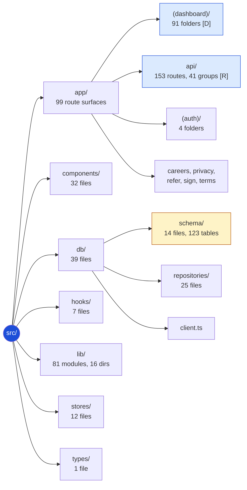
```mermaid
flowchart LR
    root(("src/"))
    root --> app["app/<br/>99 route surfaces"]
    root --> comp["components/<br/>32 files"]
    root --> db["db/<br/>39 files"]
    root --> hooks["hooks/<br/>7 files"]
    root --> lib["lib/<br/>81 modules, 16 dirs"]
    root --> stores["stores/<br/>12 files"]
    root --> types["types/<br/>1 file"]

    app --> dashboard["(dashboard)/<br/>91 folders [D]"]
    app --> api["api/<br/>153 routes, 41 groups [R]"]
    app --> auth_["(auth)/<br/>4 folders"]
    app --> pub["careers, privacy,<br/>refer, sign, terms"]

    db --> schema["schema/<br/>14 files, 123 tables"]
    db --> repos["repositories/<br/>25 files"]
    db --> client["client.ts"]

    style root fill:#1D4ED8,color:#fff
    style dashboard fill:#DBEAFE,stroke:#1D4ED8
    style api fill:#DBEAFE,stroke:#1D4ED8
    style schema fill:#FEF3C7,stroke:#B45309
```

---

## 4. The module/library layer

`src/lib` is 81 non-test modules plus 54 colocated `*.test.ts` files at its
top level, and 16 further subdirectories of the same shape. Grouped by theme:

```
GROUP                          KEY FILES                            CONSUMED BY
────────────────────────────── ──────────────────────────────────── ─────────
Statutory payroll & pay        statutory-india.ts (gratuity #1, PT,  payroll.neon.ts,
  (14 files + money/ 4)        PF, ESI), payroll-engine.ts           payslip routes,
                                (gratuity #2), payroll-client.ts,     settlement page
                                arrears.ts, form16.ts,
                                income-tax-declaration.ts,
                                bank-advice/-rules/-client.ts,
                                compensation.ts, settlement.ts,
                                employee-loans.ts, ap-holidays.ts,
                                paystub-client.ts · money/format.ts,
                                money/minor.ts (bigint <-> paise)
Attendance, rostering,         attendance-regularisation.ts,         attendance/*,
  devices (4 + attendance/ 6)  attendance-selfie.ts, rostering.ts,   rostering/*,
                                date-keys.ts · attendance/           schedulehub routes
                                device-client.ts, device-sync.ts,
                                work-log.ts
Identity, auth, SSO, SCIM      rbac.ts, server-auth.ts, api-keys.ts, middleware.ts,
  (8 + auth/ 13)               api-context.ts, api-v1-context.ts,    every route [R]
                                sso.ts, scim.ts, circuvent-sso.ts ·
                                auth/session.ts, tokens.ts, mfa.ts,
                                mfa-enrolment.ts, passkey-ceremony.ts,
                                password.ts, role-rank.ts, webauthn.ts,
                                directory-org.ts
Lifecycle & onboarding          employee-lifecycle.ts (0 importers,    onboarding,
  (7 files)                     D-13 dead code), employee-rules.ts,   offboarding,
                                employee-code.ts, intern-lifecycle.ts, journey routes
                                lifecycle-rules, onboarding-groups.ts,
                                offer-rules.ts
Documents, letters, e-sign      document-rules/-mail/-notify/         documents,
  (7 + templates 2 + docs 2)   -dispatch/-pdf-outbox.ts,              letters,
                                letters-client.ts, mailer.ts ·         offboarding,
                                document-templates/catalog.ts,         recruitment
                                documents/render-pdf.ts,               routes
                                documents/signature-image.ts
Outbox & cross-app sync        outbox-sweep.ts (sweeps 3 of 4         /api/cron [CRON],
  (6 files)                     outboxes — §17), directory-group-      §6, §17
                                outbox.ts, directory-sdk.ts,
                                cross-app-sync.ts, employee-client.ts,
                                paystub-sync-outbox.ts
Recruitment / ATS boundary     ats.ts — the one module that reads     ats routes, §16
  (1 file)                     and writes the 7 HRMS-owned tables
                                ATS.circuvent also writes to
Governance & custom fields     governance.ts, compliance-engine.ts   compliance,
  (3 files)                    (0 importers, D-13 dead), custom-      compliancehub
                                fields.ts                             routes
Workforce services             assets.ts, expense-rules.ts,           assets,
  (11 files)                   benefits-rules/-client.ts,             expenses,
                                learning-rules.ts, referral-rules.ts,  mybenefits,
                                referral-invite(-email).ts,            referrals,
                                holiday-import.ts, celebrations.ts,    helpdesk
                                sla.ts                                 routes
Reporting & intelligence       reporting-engine.ts (0 importers,      reports,
  (3 + intelligence 2          D-13 dead), insights-reporter.ts,       orghealth,
  + reporting/ 1)              assistant.ts · intelligence/anomaly.ts, chatbot
                                attrition.ts · reporting/builder.ts    routes
Security, encryption, a11y     crypto/field-encryption.ts (PAN        auth, settings,
  (1 + crypto 1 + a11y 1       only — bank_details is not covered),   bankdetails routes
  + color 1)                   color/contrast.ts, a11y/clickable.ts
Mobile, storage, notify,       mobile-app.ts · mobile/api-client.ts,   Android/Expo
  workflow, integrations       geofence.ts, offline-queue.ts ·        apps,
  (1 + 4 subdirs, 19 files)    storage/object-store.ts ·              notifications,
                                notifications/engine.ts, notify.ts,   provisioning
                                transport.ts · workflow/engine.ts ·   routes
                                integrations/deliver.ts, endpoint.ts,
                                permissions.ts, provisioning.ts
Shared infrastructure          constants.ts, utils.ts,                everywhere
  (12 files)                   validations.ts, validation-response.ts,
                                form-schemas.ts, form-validations.ts,
                                seo.ts, og-fonts.ts, brand-logo.ts,
                                ecosystem.ts, settings-sections.ts,
                                collection-service.ts (doc_store — §7)
```

The float seam (§5 of `05_AREAS_OF_ENHANCEMENT.md`) sits exactly at the
boundary drawn below: `payroll.neon.ts` is a repository, not a `lib` module,
and it is the only caller that steps outside bigint minor units to reach
`payroll-engine.ts`'s two float-typed functions.

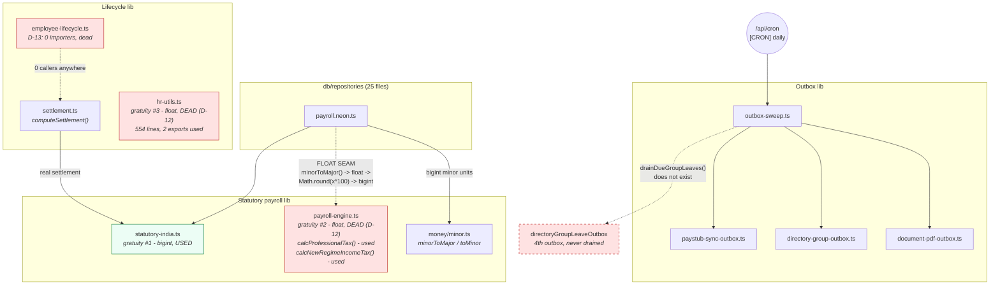
```mermaid
flowchart TB
    subgraph repo["db/repositories (25 files)"]
        payrollrepo["payroll.neon.ts"]
    end

    subgraph statutory["Statutory payroll lib"]
        si["statutory-india.ts<br/><i>gratuity #1 - bigint, USED</i>"]
        pe["payroll-engine.ts<br/><i>gratuity #2 - float, DEAD (D-12)<br/>calcProfessionalTax() - used<br/>calcNewRegimeIncomeTax() - used</i>"]
        money["money/minor.ts<br/><i>minorToMajor / toMinor</i>"]
    end

    subgraph lifecycle["Lifecycle lib"]
        settle["settlement.ts<br/><i>computeSettlement()</i>"]
        el["employee-lifecycle.ts<br/><i>D-13: 0 importers, dead</i>"]
        hu["hr-utils.ts<br/><i>gratuity #3 - float, DEAD (D-12)<br/>554 lines, 2 exports used</i>"]
    end

    subgraph outboxgrp["Outbox lib"]
        os["outbox-sweep.ts"]
        pso["paystub-sync-outbox.ts"]
        dgo["directory-group-outbox.ts"]
        dpo["document-pdf-outbox.ts"]
    end

    payrollrepo -->|"bigint minor units"| money
    payrollrepo -.->|"FLOAT SEAM<br/>minorToMajor() -> float -><br/>Math.round(x*100) -> bigint"| pe
    payrollrepo --> si
    settle -->|"real settlement"| si
    el -.->|"0 callers anywhere"| settle
    cron(("/api/cron<br/>[CRON] daily")) --> os
    os --> pso
    os --> dgo
    os -.->|"drainDueGroupLeaves()<br/>does not exist"| dead["directoryGroupLeaveOutbox<br/><i>4th outbox, never drained</i>"]
    os --> dpo

    style pe fill:#FEE2E2,stroke:#B91C1C
    style hu fill:#FEE2E2,stroke:#B91C1C
    style el fill:#FEE2E2,stroke:#B91C1C
    style dead fill:#FEE2E2,stroke:#B91C1C,stroke-dasharray: 5 5
    style si fill:#ECFDF5,stroke:#15803D
```

---

## 5. The complete route map

Direct enumeration of `src/app/api/**/route.ts` finds **153 routes across 41 groups** —
three more than the ~150 the last audit counted; the small delta is not reconciled against
the audit's own methodology and is noted here rather than silently absorbed. Every route is
a request-time function — there is no static/ISR split to draw here the way a public
marketing site would have one; that distinction belongs to Career.circuvent, not to a
system of record. All 153 are listed below, grouped identically to the file tree in §3.

### 5.1 Every route, complete

```
/api/announcements/                         (1 route)
    /api/announcements                            GET,POST

/api/assets/                                (6 routes)
    /api/assets                                   GET
    /api/assets/[id]                              POST
    /api/assets/[id]/history                      GET
    /api/assets/[id]/schedule                     GET
    /api/assets/clearance                         GET
    /api/assets/valuation                         GET

/api/ats/                                   (6 routes)
    /api/ats/applications                         POST,GET
    /api/ats/applications/[id]                    GET,POST
    /api/ats/applications/[id]/scorecards         GET,POST
    /api/ats/offers                               POST,GET
    /api/ats/offers/[id]                          POST
    /api/ats/reports                              GET

/api/attendance/                            (7 routes)
    /api/attendance                               GET
    /api/attendance/[id]/photo                    GET
    /api/attendance/clock                         POST,GET
    /api/attendance/device-sync                   POST
    /api/attendance/policy                        GET,PUT
    /api/attendance/regularisation                GET,POST,PATCH
    /api/attendance/summary                       GET

/api/auth/                                  (15 routes)
    /api/auth/callback                            GET
    /api/auth/forgot-password                     POST
    /api/auth/login                               POST
    /api/auth/logout                              POST
    /api/auth/me                                  GET
    /api/auth/mfa                                 GET,POST,DELETE
    /api/auth/mfa/confirm                         POST
    /api/auth/passkey/login                       GET,POST
    /api/auth/passkey/register                    GET,POST
    /api/auth/refresh                             POST
    /api/auth/register                            POST
    /api/auth/reset-password                      POST
    /api/auth/sso                                 GET
    /api/auth/sso/start                           GET
    /api/auth/validate-employee                   POST,GET

/api/benefits/                              (4 routes)
    /api/benefits/claims                          GET,POST
    /api/benefits/dependants                      GET,POST
    /api/benefits/enrolments                      GET,POST
    /api/benefits/plans                           GET

/api/collections/                           (2 routes)
    /api/collections/[collection]                 GET,POST
    /api/collections/[collection]/[id]            GET,PATCH,PUT,DELETE

/api/compensation/                          (8 routes)
    /api/compensation/bands                       GET,POST
    /api/compensation/cycles                      POST,GET
    /api/compensation/cycles/[id]/apply           POST
    /api/compensation/cycles/[id]/approve         POST
    /api/compensation/cycles/[id]/budget          GET
    /api/compensation/cycles/[id]/recommendations GET,POST
    /api/compensation/equity                      GET
    /api/compensation/recommendations/[id]        PATCH

/api/cron/                                  (1 route)
    /api/cron                                     GET

/api/custom-fields/                         (3 routes)
    /api/custom-fields/definitions                GET,POST
    /api/custom-fields/definitions/[id]           PATCH
    /api/custom-fields/values                     GET,PUT

/api/departments/                           (1 route)
    /api/departments                              GET,POST

/api/documents/                             (8 routes)
    /api/documents                                GET
    /api/documents/[id]                           GET
    /api/documents/[id]/pdf                       GET
    /api/documents/[id]/send                      POST
    /api/documents/[id]/void                      POST
    /api/documents/generate                       POST
    /api/documents/reminders                      POST
    /api/documents/templates                      GET,POST

/api/employees/                             (5 routes)
    /api/employees                                GET,POST
    /api/employees/[id]                           GET,PATCH,DELETE
    /api/employees/[id]/direct-reports            GET
    /api/employees/bank-details                   GET,PUT
    /api/employees/stats/by-status                GET

/api/expenses/                              (3 routes)
    /api/expenses                                 GET,POST
    /api/expenses/[id]                            GET
    /api/expenses/[id]/decision                   POST

/api/governance/                            (6 routes)
    /api/governance/consent                       GET,POST
    /api/governance/holds                         POST,DELETE,GET
    /api/governance/policies                      GET,POST
    /api/governance/requests                      GET,POST
    /api/governance/requests/[id]                 POST
    /api/governance/subject-access                GET

/api/groups/                                (2 routes)
    /api/groups                                   GET
    /api/groups/mail                              POST

/api/health/                                (1 route)
    /api/health                                   GET

/api/helpdesk/                              (5 routes)
    /api/helpdesk                                 GET,POST
    /api/helpdesk/[id]                            GET,PATCH
    /api/helpdesk/[id]/comments                   POST
    /api/helpdesk/escalations                     POST
    /api/helpdesk/knowledge                       GET

/api/holidays/                              (2 routes)
    /api/holidays                                 GET,POST
    /api/holidays/bulk                            POST

/api/icon/                                  (1 route)
    /api/icon                                     GET

/api/integrations/                          (3 routes)
    /api/integrations                             GET,POST
    /api/integrations/[id]                        PATCH,DELETE
    /api/integrations/[id]/test                   POST

/api/learning/                              (7 routes)
    /api/learning/certifications                  GET
    /api/learning/compliance                      GET
    /api/learning/courses                         GET
    /api/learning/courses/[id]                    GET
    /api/learning/enrolments                      GET,POST
    /api/learning/enrolments/[id]/assessment      POST
    /api/learning/enrolments/[id]/progress        POST

/api/leave/                                 (3 routes)
    /api/leave                                    GET,POST
    /api/leave/[id]/decision                      POST
    /api/leave/balances                           GET

/api/lifecycle/                             (3 routes)
    /api/lifecycle                                GET,POST
    /api/lifecycle/[id]                           GET,POST
    /api/lifecycle/tasks/[taskId]                 PATCH

/api/loans/                                 (1 route)
    /api/loans                                    GET,POST

/api/notifications/                         (1 route)
    /api/notifications                            GET

/api/payroll/                               (3 routes)
    /api/payroll/payslips                         GET
    /api/payroll/runs                             GET,POST
    /api/payroll/runs/[id]                        GET,POST

/api/performance/                           (11 routes)
    /api/performance/calibration                  POST
    /api/performance/check-ins                    GET,POST
    /api/performance/cycles                       GET
    /api/performance/cycles/[id]/distribution     GET
    /api/performance/cycles/[id]/grid             GET
    /api/performance/cycles/[id]/reviews          POST
    /api/performance/feedback                     GET,POST
    /api/performance/feedback/[id]                POST
    /api/performance/feedback/aggregate           GET
    /api/performance/goals                        GET,PATCH
    /api/performance/goals/[id]                   PATCH

/api/public/                                (1 route)
    /api/public/referral/[token]                  GET,POST

/api/recruitment/                           (1 route)
    /api/recruitment                              GET,POST,PATCH

/api/referrals/                             (5 routes)
    /api/referrals                                GET,POST
    /api/referrals/[id]/payout                    POST
    /api/referrals/[id]/transition                POST
    /api/referrals/payable                        GET
    /api/referrals/stats                          GET

/api/reports/                               (3 routes)
    /api/reports                                  GET
    /api/reports/fields                           GET
    /api/reports/run                              POST

/api/roster/                                (8 routes)
    /api/roster/my-shifts                         GET
    /api/roster/patterns                          GET,POST
    /api/roster/rosters                           POST,GET
    /api/roster/rosters/[id]                      GET
    /api/roster/rosters/[id]/generate             POST
    /api/roster/rosters/[id]/publish              POST
    /api/roster/swaps                             POST,GET
    /api/roster/swaps/[id]                        POST

/api/scim/                                  (3 routes)
    /api/scim/v2/ServiceProviderConfig            GET
    /api/scim/v2/Users                            GET,POST
    /api/scim/v2/Users/[id]                       GET,PUT,PATCH,DELETE

/api/sign/                                  (1 route)
    /api/sign/[id]                                GET,POST

/api/sync/                                  (2 routes)
    /api/sync/bulk                                POST
    /api/sync/employee                            GET

/api/tax/                                   (2 routes)
    /api/tax/declaration                          GET,PUT
    /api/tax/form16                               GET

/api/team/                                  (1 route)
    /api/team/pulse                               GET

/api/v1/                                    (4 routes)
    /api/v1/attendance                            GET,POST
    /api/v1/employees                             GET,POST
    /api/v1/leave                                 GET
    /api/v1/openapi                               GET

/api/work-arrangements/                     (1 route)
    /api/work-arrangements                        GET,POST,PATCH

/api/workflows/                             (2 routes)
    /api/workflows/[id]/decision                  POST
    /api/workflows/pending                        GET
```

### 5.2 The groups that carry the sharpest edges

Every route above resolves its tenant from a verified credential via `requireApiContext()`
or `requireApiKey()`, then narrows further with an inline role check — confirmed directly in
the route source for every group tabled below. Nine groups are worth a closer look: three for
security load-bearing (auth, SCIM, the two static secrets), two for the schema boundaries this
atlas must diagram (ats, payroll), and the rest for scale or an unusual auth shape.

**Auth — 15 routes, the widest attack surface in the application**

| Route | Method | Auth | Purpose |
| --- | :-: | --- | --- |
| `/api/auth/register` | POST | none | Creates an organisation and its first user, signs them in |
| `/api/auth/login` | POST | none | Password sign-in; token set as an httpOnly cookie, never in the body |
| `/api/auth/logout` | POST | session | Clears the cookie **and** revokes the refresh token in the database |
| `/api/auth/refresh` | POST | refresh cookie | Rotates the refresh token, mints a fresh access token |
| `/api/auth/me` | GET | session | Reads the signed access token only — no database round-trip |
| `/api/auth/forgot-password` | POST | none | Issues a single-use password-reset link |
| `/api/auth/reset-password` | POST | reset token | Consumes the token once, sets a new password |
| `/api/auth/mfa` | GET,POST,DELETE | session | Enrol/inspect/disable TOTP — own account only, no `userId` param |
| `/api/auth/mfa/confirm` | POST | session | Proves the authenticator works; activates 2FA, issues recovery codes |
| `/api/auth/passkey/register` | GET,POST | session | WebAuthn passkey enrolment ceremony |
| `/api/auth/passkey/login` | GET,POST | none | WebAuthn passkey sign-in ceremony |
| `/api/auth/sso` | GET | none, CORS-scoped | Tells another suite app (ATS, Office) whether SSO is enabled here |
| `/api/auth/sso/start` | GET | none | Begins the federation handshake with the configured IdP |
| `/api/auth/callback` | GET | IdP-signed response | IdP approved sign-in; HRMS still refuses a suspended employee |
| `/api/auth/validate-employee` | POST,GET | service caller | Confirms an email is an active employee here — called by another suite app |

**SCIM — 3 routes, inbound identity provisioning**

| Route | Method | Auth | Purpose |
| --- | :-: | --- | --- |
| `/api/scim/v2/ServiceProviderConfig` | GET | none | SCIM 2.0 capability discovery document |
| `/api/scim/v2/Users` | GET,POST | SCIM bearer token | List / create users — IdP-driven provisioning |
| `/api/scim/v2/Users/[id]` | GET,PUT,PATCH,DELETE | SCIM bearer token | Read / replace / patch / deprovision one user |

**ATS — 6 routes, the shared-schema boundary (full diagram in §16)**

| Route | Method | Auth | Purpose |
| --- | :-: | --- | --- |
| `/api/ats/applications` | POST,GET | hr+ (POST), manager+ (GET) | Create / list candidate applications |
| `/api/ats/applications/[id]` | GET,POST | manager+ | Read one application, advance its stage |
| `/api/ats/applications/[id]/scorecards` | GET,POST | hiring team | Interview scorecards |
| `/api/ats/offers` | POST,GET | hr+ | Create / list offers |
| `/api/ats/offers/[id]` | POST | owner/admin | Approve, countersign, or void one offer |
| `/api/ats/reports` | GET | manager+ | Recruitment funnel reporting |

**Payroll — 3 routes, the float seam lives one layer below these (§4)**

| Route | Method | Auth | Purpose |
| --- | :-: | --- | --- |
| `/api/payroll/payslips` | GET | self, or hr+ for anyone | Own payslip history — **managers are deliberately excluded**: a reporting line is not authority to see someone's pay |
| `/api/payroll/runs` | GET,POST | hr+ | List runs / kick off a new one |
| `/api/payroll/runs/[id]` | GET,POST | hr+ (GET), owner/admin (approve) | Inspect a run; advance its state machine |

**Roster — 8 routes, the scheduling engine's surface**

| Route | Method | Auth | Purpose |
| --- | :-: | --- | --- |
| `/api/roster/my-shifts` | GET | session | The caller's own upcoming shifts |
| `/api/roster/patterns` | GET,POST | session, role-gated | Shift-pattern templates — list / create |
| `/api/roster/rosters` | POST,GET | session, role-gated | Create / list roster periods |
| `/api/roster/rosters/[id]` | GET | session | One roster's assignments |
| `/api/roster/rosters/[id]/generate` | POST | session, role-gated | Auto-assign shifts from a pattern |
| `/api/roster/rosters/[id]/publish` | POST | owner/admin/hr/manager | Locks the roster and notifies staff |
| `/api/roster/swaps` | POST,GET | session | Request / list shift swaps |
| `/api/roster/swaps/[id]` | POST | session, role-gated | Approve or reject a swap |

**Performance — 11 routes, the largest single group**

| Route | Method | Auth | Purpose |
| --- | :-: | --- | --- |
| `/api/performance/calibration` | POST | owner/admin/hr | Cross-team rating calibration session |
| `/api/performance/check-ins` | GET,POST | self, manager+ for reports | 1:1 check-in notes |
| `/api/performance/cycles` | GET | self, manager+ for all | List review cycles |
| `/api/performance/cycles/[id]/distribution` | GET | manager+ | Rating distribution across a cycle |
| `/api/performance/cycles/[id]/grid` | GET | owner/hr only | The 9-box grid — tighter than distribution |
| `/api/performance/cycles/[id]/reviews` | POST | owner/admin/hr | Opens a cycle's review tasks |
| `/api/performance/feedback` | GET,POST | self, manager+ for others' | Peer / 360 feedback |
| `/api/performance/feedback/[id]` | POST | session | Respond to one feedback request |
| `/api/performance/feedback/aggregate` | GET | owner/hr only | Aggregated feedback across the org |
| `/api/performance/goals` | GET,PATCH | self, manager+ for reports | OKR / goal list and update |
| `/api/performance/goals/[id]` | PATCH | manager+ | Update one goal |

**Collections — 2 routes, the generic `doc_store` backend (see §7, §17)**

| Route | Method | Auth | Purpose |
| --- | :-: | --- | --- |
| `/api/collections/[collection]` | GET,POST | session | CRUD for one allow-listed small collection |
| `/api/collections/[collection]/[id]` | GET,PATCH,PUT,DELETE | session | Same, single-record operations |

**v1 — 4 routes, the only scoped-API-key surface in the app**

| Route | Method | Auth | Purpose |
| --- | :-: | --- | --- |
| `/api/v1/attendance` | GET,POST | API key, `attendance:read`/`write` scope | External attendance integration |
| `/api/v1/employees` | GET,POST | API key, `employees:read`/`write` scope | External directory sync |
| `/api/v1/leave` | GET | API key, `leave:read` scope | External leave-balance read |
| `/api/v1/openapi` | GET | none | This API's own OpenAPI 3 document |

**Cron and the one tenancy exception — 2 routes, Doc 05 D-02 and D-17**

| Route | Method | Auth | Purpose |
| --- | :-: | --- | --- |
| `/api/cron` | GET | `CRON_SECRET` bearer, `timingSafeEqual`, fails **closed** (503) if unset | Daily sweep: outboxes, reminders, retention |
| `/api/documents/reminders` | POST | `CROSS_APP_SYNC_TOKEN` bearer, or session hr+ | The one route where `orgId` comes from the query string, not the token — see §5.3 |

### 5.3 Auth tiers, end to end


```mermaid
flowchart TB
    subgraph pub["No credential at all — 11 routes"]
        p1["health, icon<br/>auth/sso, auth/sso/start, auth/callback<br/>auth/login, auth/register<br/>auth/forgot-password, auth/passkey/login<br/>v1/openapi, scim/ServiceProviderConfig"]
    end
    subgraph resToken["Per-resource single-use token — 3 routes"]
        r1["sign/[id] — 256-bit, hash-compared<br/>public/referral/[token] — 256-bit, rate-limited<br/>auth/reset-password — single-use reset token"]
    end
    subgraph svc["Service-to-service caller — 1 route"]
        s1["auth/validate-employee<br/>(called by another suite app)"]
    end
    subgraph def["Session + role gate — the default, 131 routes"]
        d1["everything else:<br/>employees, leave, attendance, payroll,<br/>performance, roster, ats, compensation,<br/>governance, helpdesk, learning, collections .."]
    end
    subgraph scimTier["SCIM bearer token — 2 routes"]
        sc1["scim/Users, scim/Users/[id]<br/>hash at rest, constant-time compare"]
    end
    subgraph keyTier["Scoped API key — 3 routes"]
        k1["v1/attendance, v1/employees, v1/leave<br/>per-key scopes + rate-limit bucket"]
    end
    subgraph staticTier["Static shared secret — flagged, 2 routes"]
        cronN["cron<br/>CRON_SECRET · no nonce · no rate limit"]
        remN["documents/reminders<br/>CROSS_APP_SYNC_TOKEN, orgId from query string"]
    end

    style remN fill:#FEE2E2,stroke:#B91C1C
    style cronN fill:#FEF3C7,stroke:#B45309
    style sc1 fill:#ECFDF5,stroke:#15803D
    style k1 fill:#ECFDF5,stroke:#15803D
```

> In 152 of 153 routes the tenant is read from a verified credential — never the request
> body, never the query string. `/api/documents/reminders` is the sole exception: once the
> static `CROSS_APP_SYNC_TOKEN` is accepted, `orgId` is read from `?orgId=` in the query
> string. Anyone holding that shared, unrotated, unrate-limited token can name any tenant and
> trigger mass reminder e-mails for it. Doc 05, D-02 (critical) and D-17 (high) for `/api/cron`.

---

## 6. The complete external contract

Every network call HRMS makes or receives that is *not* the shared-database read
described in §16. HRMS is unusual in the suite: it is simultaneously a relying party
(two OIDC systems trust it to authenticate humans) and the schema owner every other
app reads from directly. This section is the network edge only — sockets, not tables.

```
   ┌────────────────────────────────────────────────────────────────────────┐
   │  INBOUND — things that call HRMS over HTTPS                            │
   ├────────────────────────────────────────────────────────────────────────┤
   │  auth.circuvent.com   OIDC · PKCE+state+nonce · RS256/JWKS · suite SSO  │
   │  Per-tenant IdP       OIDC · same protocol · Okta/Entra/Google,         │
   │                       selected by e-mail domain, NOT SAML (deliberate) │
   │  Okta / Entra SCIM    bearer → SHA-256 → per-org lookup, Users only,   │
   │                       no Groups resource (Doc 05, D-12)                │
   │  cvk_ API keys        3 routes, scope-checked, SHA-256 at rest         │
   │  CRON_SECRET          1 route, `timingSafeEqual`, no nonce/rate-limit  │
   │  CROSS_APP_SYNC_TOKEN 1 route, same env var HRMS also sends OUTBOUND   │
   ├────────────────────────────────────────────────────────────────────────┤
   │  OUTBOUND — things HRMS calls over HTTPS                                │
   ├────────────────────────────────────────────────────────────────────────┤
   │  paystub.circuvent    POST employee master · X-Service-Token:          │
   │                       CROSS_APP_SYNC_TOKEN · outbox + ~17h backoff cap │
   │  auth.circuvent.com   POST group membership · Bearer + X-Service-     │
   │  (directory API)      Token: DIRECTORY_SERVICE_TOKEN · outbox on write│
   │  Device control plane GET register/sites · Bearer ATTENDANCE_DEVICE_  │
   │  api.circuvent.com    TOKEN · pulled by admin action or daily cron    │
   │  SMTP relay           nodemailer · notifications, offer letters ·     │
   │                       FAILS SOFT — logs, returns false, caller proceeds│
   │  Cloudflare R2        @aws-sdk/client-s3 · signed document PDFs ·     │
   │                       FAILS HARD — throws, nothing is silently lost   │
   │  Slack/Teams/webhook  3 routes under /api/integrations/*, admin-only, │
   │  (outbound only)      destination URL passed through checkEndpoint()  │
   │                       — an SSRF guard against internal-network targets│
   ├────────────────────────────────────────────────────────────────────────┤
   │  NAV LINKS ONLY — no REST call exists in this codebase                 │
   │  ATS.circuvent · Mail.circuvent · DevOps.circuvent — ecosystem.ts URLs │
   └────────────────────────────────────────────────────────────────────────┘

   No inbound webhook receiver exists anywhere in 153 routes. A repo-wide
   search for signature headers (x-hub-signature, stripe-signature, HMAC
   verification helpers) returns zero matches — there is nothing today for a
   third party to attack by forging a callback, because there is no callback.
```

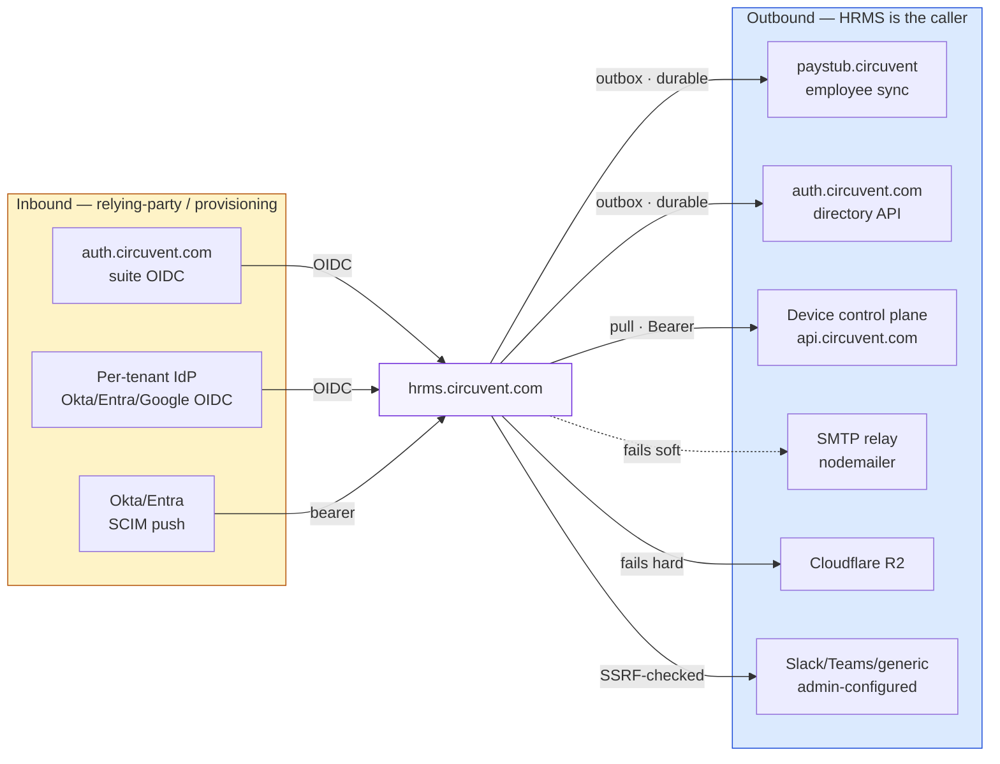
```mermaid
flowchart LR
    subgraph IN["Inbound — relying-party / provisioning"]
        SUITE_IDP["auth.circuvent.com<br/>suite OIDC"]
        TENANT_IDP["Per-tenant IdP<br/>Okta/Entra/Google OIDC"]
        SCIMSRC["Okta/Entra<br/>SCIM push"]
    end

    HRMS["hrms.circuvent.com"]

    subgraph OUT["Outbound — HRMS is the caller"]
        PAYSTUB["paystub.circuvent<br/>employee sync"]
        DIRAPI["auth.circuvent.com<br/>directory API"]
        DEVICE["Device control plane<br/>api.circuvent.com"]
        SMTP["SMTP relay<br/>nodemailer"]
        R2["Cloudflare R2"]
        WEBHOOK["Slack/Teams/generic<br/>admin-configured"]
    end

    SUITE_IDP -->|OIDC| HRMS
    TENANT_IDP -->|OIDC| HRMS
    SCIMSRC -->|bearer| HRMS

    HRMS -->|"outbox · durable"| PAYSTUB
    HRMS -->|"outbox · durable"| DIRAPI
    HRMS -->|"pull · Bearer"| DEVICE
    HRMS -.->|"fails soft"| SMTP
    HRMS -->|"fails hard"| R2
    HRMS -->|"SSRF-checked"| WEBHOOK

    style IN fill:#FEF3C7,stroke:#B45309
    style OUT fill:#DBEAFE,stroke:#1D4ED8
    style HRMS fill:#F5F3FF,stroke:#6D28D9
```

> **The one shared secret that runs both ways.** `CROSS_APP_SYNC_TOKEN` is the header
> HRMS *sends* to authenticate itself to Paystub (`X-Service-Token`, in
> `paystub-client.ts`) and the header HRMS *accepts* to authenticate an inbound caller
> on `/api/documents/reminders` (`server-auth.ts`). One environment variable, two
> trust directions, no distinct rotation path for either. See §5 and Doc 05, D-02/D-17.

> **Why the mailer fails soft and the object store fails hard.** A delayed
> notification is a minor inconvenience the retry queue can absorb quietly. A
> signed document that the outbox believed it had persisted but did not is
> unrecoverable — so `object-store.ts` throws instead of swallowing the error.

---

## 7. Data model — all 123 tables across 15 domains

HRMS owns **123** tables: 122 defined in Drizzle across the 15 files under
`src/db/schema/` (§3), plus one, `hrms.doc_store`, that exists only as raw SQL
(`drizzle/0023_doc_store.sql`) with no Drizzle definition — it is shaped at
runtime from `information_schema`, the same pattern ATS's own `doc_store` uses
one schema over (§16). This exceeds the audited **117** by six; every table
below is traced to a live file or migration, so the gap looks like
under-counting in the original audit rather than tables added since.

**The convention, stated once so it is not repeated 123 times.** Every table
carries `id uuid PK DEFAULT gen_random_uuid()`, `org_id uuid` referencing
`identity.organizations.id` — the FORCE-RLS tenant column, §14 — and
`created_at timestamp`. The one exception is `identity.organizations` itself,
which *is* the tenant. Entities below show only the columns that matter beyond
that convention. Unlike ATS's own tables in this same Postgres instance
(§16 — three of which enable but never FORCE), **every** HRMS-owned table gets
FORCE RLS uniformly through the one sweeping `apply_tenant_rls()` function
(§14); that is not repeated per domain below because the audit found no
exception to it.

### 7.1 People and organization core (5 tables)

`employees` is the hub nearly every other domain references by `employee_id`.

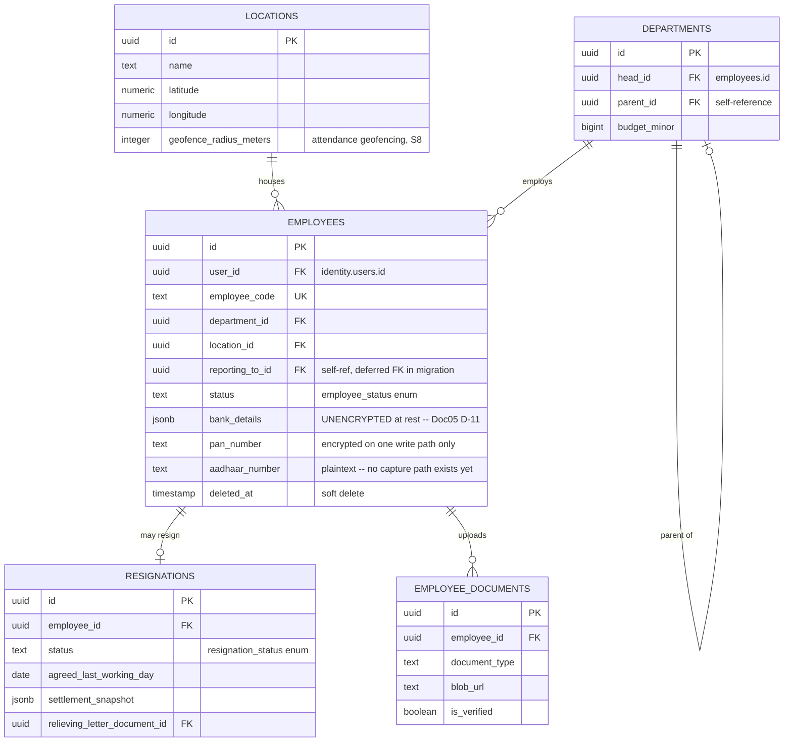
```mermaid
erDiagram
    LOCATIONS {
        uuid id PK
        text name
        numeric latitude
        numeric longitude
        integer geofence_radius_meters "attendance geofencing, S8"
    }
    DEPARTMENTS {
        uuid id PK
        uuid head_id FK "employees.id"
        uuid parent_id FK "self-reference"
        bigint budget_minor
    }
    EMPLOYEES {
        uuid id PK
        uuid user_id FK "identity.users.id"
        text employee_code UK
        uuid department_id FK
        uuid location_id FK
        uuid reporting_to_id FK "self-ref, deferred FK in migration"
        text status "employee_status enum"
        jsonb bank_details "UNENCRYPTED at rest -- Doc05 D-11"
        text pan_number "encrypted on one write path only"
        text aadhaar_number "plaintext -- no capture path exists yet"
        timestamp deleted_at "soft delete"
    }
    RESIGNATIONS {
        uuid id PK
        uuid employee_id FK
        text status "resignation_status enum"
        date agreed_last_working_day
        jsonb settlement_snapshot
        uuid relieving_letter_document_id FK
    }
    EMPLOYEE_DOCUMENTS {
        uuid id PK
        uuid employee_id FK
        text document_type
        text blob_url
        boolean is_verified
    }
    DEPARTMENTS ||--o{ EMPLOYEES : employs
    LOCATIONS ||--o{ EMPLOYEES : houses
    EMPLOYEES ||--o| RESIGNATIONS : "may resign"
    EMPLOYEES ||--o{ EMPLOYEE_DOCUMENTS : uploads
    DEPARTMENTS ||--o| DEPARTMENTS : "parent of"
```

### 7.2 Leave and holidays (4 tables)

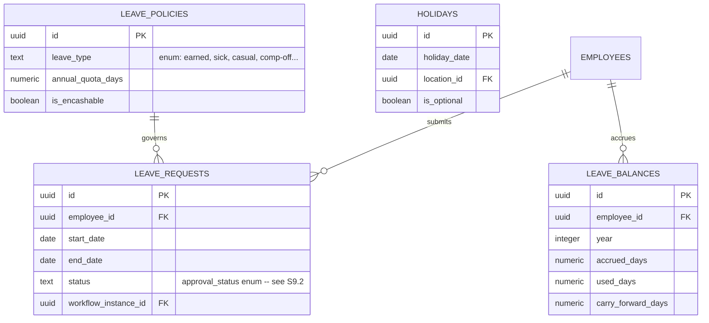
```mermaid
erDiagram
    LEAVE_POLICIES {
        uuid id PK
        text leave_type "enum: earned, sick, casual, comp-off..."
        numeric annual_quota_days
        boolean is_encashable
    }
    LEAVE_REQUESTS {
        uuid id PK
        uuid employee_id FK
        date start_date
        date end_date
        text status "approval_status enum -- see S9.2"
        uuid workflow_instance_id FK
    }
    LEAVE_BALANCES {
        uuid id PK
        uuid employee_id FK
        integer year
        numeric accrued_days
        numeric used_days
        numeric carry_forward_days
    }
    HOLIDAYS {
        uuid id PK
        date holiday_date
        uuid location_id FK
        boolean is_optional
    }
    LEAVE_POLICIES ||--o{ LEAVE_REQUESTS : governs
    EMPLOYEES ||--o{ LEAVE_REQUESTS : submits
    EMPLOYEES ||--o{ LEAVE_BALANCES : accrues
```

### 7.3 Attendance (6 tables)

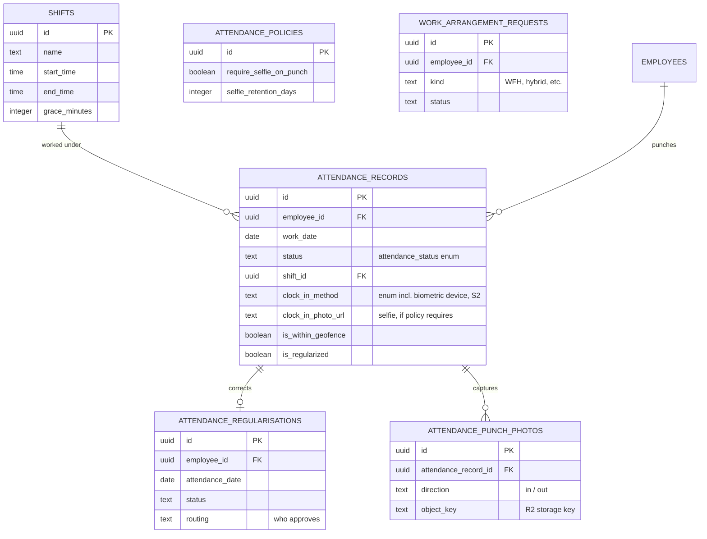
```mermaid
erDiagram
    SHIFTS {
        uuid id PK
        text name
        time start_time
        time end_time
        integer grace_minutes
    }
    ATTENDANCE_RECORDS {
        uuid id PK
        uuid employee_id FK
        date work_date
        text status "attendance_status enum"
        uuid shift_id FK
        text clock_in_method "enum incl. biometric device, S2"
        text clock_in_photo_url "selfie, if policy requires"
        boolean is_within_geofence
        boolean is_regularized
    }
    ATTENDANCE_REGULARISATIONS {
        uuid id PK
        uuid employee_id FK
        date attendance_date
        text status
        text routing "who approves"
    }
    ATTENDANCE_POLICIES {
        uuid id PK
        boolean require_selfie_on_punch
        integer selfie_retention_days
    }
    ATTENDANCE_PUNCH_PHOTOS {
        uuid id PK
        uuid attendance_record_id FK
        text direction "in / out"
        text object_key "R2 storage key"
    }
    WORK_ARRANGEMENT_REQUESTS {
        uuid id PK
        uuid employee_id FK
        text kind "WFH, hybrid, etc."
        text status
    }
    SHIFTS ||--o{ ATTENDANCE_RECORDS : "worked under"
    EMPLOYEES ||--o{ ATTENDANCE_RECORDS : punches
    ATTENDANCE_RECORDS ||--o| ATTENDANCE_REGULARISATIONS : corrects
    ATTENDANCE_RECORDS ||--o{ ATTENDANCE_PUNCH_PHOTOS : captures
```

### 7.4 Rostering and scheduling (8 tables)

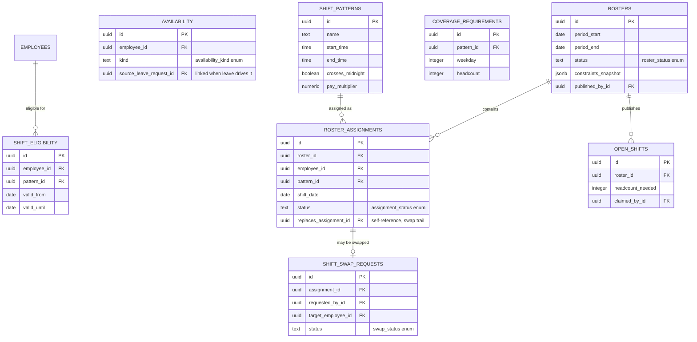
```mermaid
erDiagram
    SHIFT_PATTERNS {
        uuid id PK
        text name
        time start_time
        time end_time
        boolean crosses_midnight
        numeric pay_multiplier
    }
    SHIFT_ELIGIBILITY {
        uuid id PK
        uuid employee_id FK
        uuid pattern_id FK
        date valid_from
        date valid_until
    }
    AVAILABILITY {
        uuid id PK
        uuid employee_id FK
        text kind "availability_kind enum"
        uuid source_leave_request_id FK "linked when leave drives it"
    }
    ROSTERS {
        uuid id PK
        date period_start
        date period_end
        text status "roster_status enum"
        jsonb constraints_snapshot
        uuid published_by_id FK
    }
    ROSTER_ASSIGNMENTS {
        uuid id PK
        uuid roster_id FK
        uuid employee_id FK
        uuid pattern_id FK
        date shift_date
        text status "assignment_status enum"
        uuid replaces_assignment_id FK "self-reference, swap trail"
    }
    SHIFT_SWAP_REQUESTS {
        uuid id PK
        uuid assignment_id FK
        uuid requested_by_id FK
        uuid target_employee_id FK
        text status "swap_status enum"
    }
    OPEN_SHIFTS {
        uuid id PK
        uuid roster_id FK
        integer headcount_needed
        uuid claimed_by_id FK
    }
    COVERAGE_REQUIREMENTS {
        uuid id PK
        uuid pattern_id FK
        integer weekday
        integer headcount
    }
    SHIFT_PATTERNS ||--o{ ROSTER_ASSIGNMENTS : "assigned as"
    ROSTERS ||--o{ ROSTER_ASSIGNMENTS : contains
    ROSTER_ASSIGNMENTS ||--o| SHIFT_SWAP_REQUESTS : "may be swapped"
    ROSTERS ||--o{ OPEN_SHIFTS : publishes
    EMPLOYEES ||--o{ SHIFT_ELIGIBILITY : "eligible for"
```

### 7.5 Payroll, compensation and loans (15 tables)

Every money column below is `bigint ..._minor` (integer paise) — the schema
itself never stores a float. The one place a float appears is inside
`payroll.neon.ts`, not in any table (§14 D-03, shown again in §8.4).
`salary_structures.gratuity_minor` is one of **three independent gratuity
implementations** (`statutory-india.ts`, the largely-dead `payroll-engine.ts`,
and `hr-utils.ts`) that nothing checks agree with each other — D-12 confirms
two of the three (`payroll-engine.ts`, `hr-utils.ts`) are dead code with zero
callers, yet both are still exported; only `statutory-india.ts`'s is wired
into `settlement.ts` and actually runs (§4).

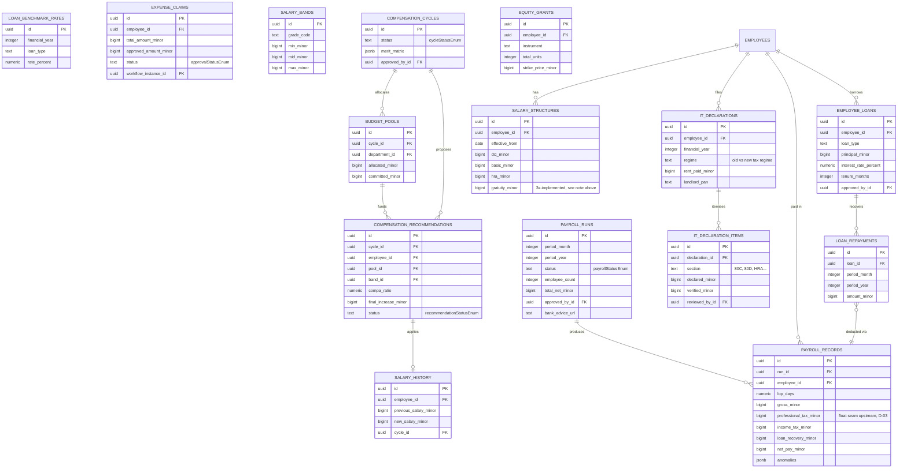
```mermaid
erDiagram
    IT_DECLARATIONS {
        uuid id PK
        uuid employee_id FK
        integer financial_year
        text regime "old vs new tax regime"
        bigint rent_paid_minor
        text landlord_pan
    }
    IT_DECLARATION_ITEMS {
        uuid id PK
        uuid declaration_id FK
        text section "80C, 80D, HRA..."
        bigint declared_minor
        bigint verified_minor
        uuid reviewed_by_id FK
    }
    SALARY_STRUCTURES {
        uuid id PK
        uuid employee_id FK
        date effective_from
        bigint ctc_minor
        bigint basic_minor
        bigint hra_minor
        bigint gratuity_minor "3x-implemented, see note above"
    }
    PAYROLL_RUNS {
        uuid id PK
        integer period_month
        integer period_year
        text status "payrollStatusEnum"
        integer employee_count
        bigint total_net_minor
        uuid approved_by_id FK
        text bank_advice_url
    }
    PAYROLL_RECORDS {
        uuid id PK
        uuid run_id FK
        uuid employee_id FK
        numeric lop_days
        bigint gross_minor
        bigint professional_tax_minor "float seam upstream, D-03"
        bigint income_tax_minor
        bigint loan_recovery_minor
        bigint net_pay_minor
        jsonb anomalies
    }
    EMPLOYEE_LOANS {
        uuid id PK
        uuid employee_id FK
        text loan_type
        bigint principal_minor
        numeric interest_rate_percent
        integer tenure_months
        uuid approved_by_id FK
    }
    LOAN_REPAYMENTS {
        uuid id PK
        uuid loan_id FK
        integer period_month
        integer period_year
        bigint amount_minor
    }
    LOAN_BENCHMARK_RATES {
        uuid id PK
        integer financial_year
        text loan_type
        numeric rate_percent
    }
    EXPENSE_CLAIMS {
        uuid id PK
        uuid employee_id FK
        bigint total_amount_minor
        bigint approved_amount_minor
        text status "approvalStatusEnum"
        uuid workflow_instance_id FK
    }
    SALARY_BANDS {
        uuid id PK
        text grade_code
        bigint min_minor
        bigint mid_minor
        bigint max_minor
    }
    COMPENSATION_CYCLES {
        uuid id PK
        text status "cycleStatusEnum"
        jsonb merit_matrix
        uuid approved_by_id FK
    }
    BUDGET_POOLS {
        uuid id PK
        uuid cycle_id FK
        uuid department_id FK
        bigint allocated_minor
        bigint committed_minor
    }
    COMPENSATION_RECOMMENDATIONS {
        uuid id PK
        uuid cycle_id FK
        uuid employee_id FK
        uuid pool_id FK
        uuid band_id FK
        numeric compa_ratio
        bigint final_increase_minor
        text status "recommendationStatusEnum"
    }
    EQUITY_GRANTS {
        uuid id PK
        uuid employee_id FK
        text instrument
        integer total_units
        bigint strike_price_minor
    }
    SALARY_HISTORY {
        uuid id PK
        uuid employee_id FK
        bigint previous_salary_minor
        bigint new_salary_minor
        uuid cycle_id FK
    }
    EMPLOYEES ||--o{ SALARY_STRUCTURES : has
    EMPLOYEES ||--o{ IT_DECLARATIONS : files
    IT_DECLARATIONS ||--o{ IT_DECLARATION_ITEMS : itemises
    PAYROLL_RUNS ||--o{ PAYROLL_RECORDS : produces
    EMPLOYEES ||--o{ PAYROLL_RECORDS : "paid in"
    EMPLOYEES ||--o{ EMPLOYEE_LOANS : borrows
    EMPLOYEE_LOANS ||--o{ LOAN_REPAYMENTS : recovers
    LOAN_REPAYMENTS }o--|| PAYROLL_RECORDS : "deducted via"
    COMPENSATION_CYCLES ||--o{ BUDGET_POOLS : allocates
    COMPENSATION_CYCLES ||--o{ COMPENSATION_RECOMMENDATIONS : proposes
    BUDGET_POOLS ||--o{ COMPENSATION_RECOMMENDATIONS : funds
    COMPENSATION_RECOMMENDATIONS ||--o| SALARY_HISTORY : applies
```

### 7.6 Performance management (10 tables)

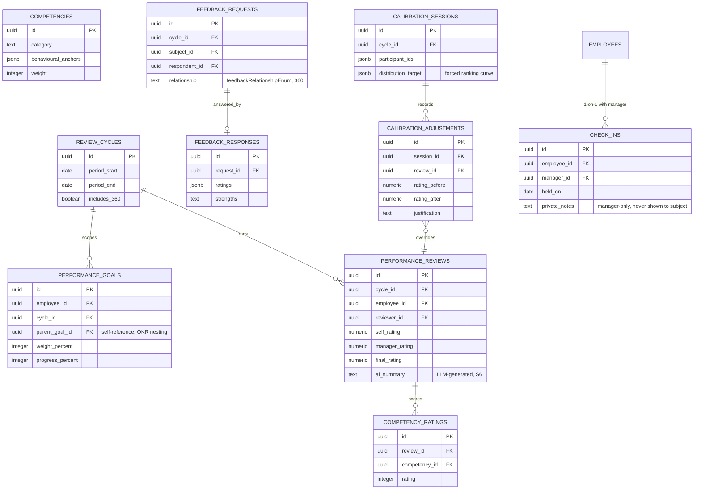
```mermaid
erDiagram
    REVIEW_CYCLES {
        uuid id PK
        date period_start
        date period_end
        boolean includes_360
    }
    PERFORMANCE_GOALS {
        uuid id PK
        uuid employee_id FK
        uuid cycle_id FK
        uuid parent_goal_id FK "self-reference, OKR nesting"
        integer weight_percent
        integer progress_percent
    }
    PERFORMANCE_REVIEWS {
        uuid id PK
        uuid cycle_id FK
        uuid employee_id FK
        uuid reviewer_id FK
        numeric self_rating
        numeric manager_rating
        numeric final_rating
        text ai_summary "LLM-generated, S6"
    }
    COMPETENCIES {
        uuid id PK
        text category
        jsonb behavioural_anchors
        integer weight
    }
    COMPETENCY_RATINGS {
        uuid id PK
        uuid review_id FK
        uuid competency_id FK
        integer rating
    }
    FEEDBACK_REQUESTS {
        uuid id PK
        uuid cycle_id FK
        uuid subject_id FK
        uuid respondent_id FK
        text relationship "feedbackRelationshipEnum, 360"
    }
    FEEDBACK_RESPONSES {
        uuid id PK
        uuid request_id FK
        jsonb ratings
        text strengths
    }
    CALIBRATION_SESSIONS {
        uuid id PK
        uuid cycle_id FK
        jsonb participant_ids
        jsonb distribution_target "forced ranking curve"
    }
    CALIBRATION_ADJUSTMENTS {
        uuid id PK
        uuid session_id FK
        uuid review_id FK
        numeric rating_before
        numeric rating_after
        text justification
    }
    CHECK_INS {
        uuid id PK
        uuid employee_id FK
        uuid manager_id FK
        date held_on
        text private_notes "manager-only, never shown to subject"
    }
    REVIEW_CYCLES ||--o{ PERFORMANCE_REVIEWS : runs
    REVIEW_CYCLES ||--o{ PERFORMANCE_GOALS : scopes
    PERFORMANCE_REVIEWS ||--o{ COMPETENCY_RATINGS : scores
    FEEDBACK_REQUESTS ||--o| FEEDBACK_RESPONSES : answered_by
    CALIBRATION_SESSIONS ||--o{ CALIBRATION_ADJUSTMENTS : records
    CALIBRATION_ADJUSTMENTS }o--|| PERFORMANCE_REVIEWS : overrides
    EMPLOYEES ||--o{ CHECK_INS : "1-on-1 with manager"
```

---

### 7.7 Recruitment — the ATS overlap (9 tables)

These nine tables are HRMS's *own* recruitment module — separate from, and a
source of confusion with, ATS's independent applicant-tracking product that
writes into this same schema (§16). `job_postings`, `candidates`,
`applications`, `interviews` and `offers` are five of the seven tables ATS
borrows; the other two are `employees` (§7.1) and `diversity_responses` —
a table that exists in the shared `hrms` schema but appears in NEITHER
this Drizzle schema NOR any HRMS migration (§16).

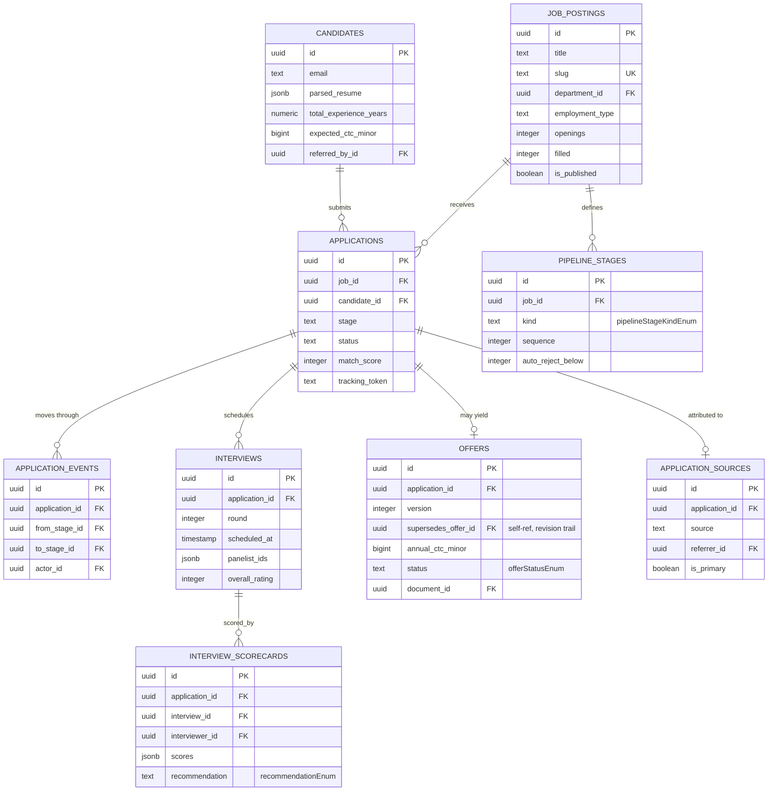
```mermaid
erDiagram
    JOB_POSTINGS {
        uuid id PK
        text title
        text slug UK
        uuid department_id FK
        text employment_type
        integer openings
        integer filled
        boolean is_published
    }
    CANDIDATES {
        uuid id PK
        text email
        jsonb parsed_resume
        numeric total_experience_years
        bigint expected_ctc_minor
        uuid referred_by_id FK
    }
    APPLICATIONS {
        uuid id PK
        uuid job_id FK
        uuid candidate_id FK
        text stage
        text status
        integer match_score
        text tracking_token
    }
    PIPELINE_STAGES {
        uuid id PK
        uuid job_id FK
        text kind "pipelineStageKindEnum"
        integer sequence
        integer auto_reject_below
    }
    APPLICATION_EVENTS {
        uuid id PK
        uuid application_id FK
        uuid from_stage_id FK
        uuid to_stage_id FK
        uuid actor_id FK
    }
    INTERVIEWS {
        uuid id PK
        uuid application_id FK
        integer round
        timestamp scheduled_at
        jsonb panelist_ids
        integer overall_rating
    }
    INTERVIEW_SCORECARDS {
        uuid id PK
        uuid application_id FK
        uuid interview_id FK
        uuid interviewer_id FK
        jsonb scores
        text recommendation "recommendationEnum"
    }
    OFFERS {
        uuid id PK
        uuid application_id FK
        integer version
        uuid supersedes_offer_id FK "self-ref, revision trail"
        bigint annual_ctc_minor
        text status "offerStatusEnum"
        uuid document_id FK
    }
    APPLICATION_SOURCES {
        uuid id PK
        uuid application_id FK
        text source
        uuid referrer_id FK
        boolean is_primary
    }
    JOB_POSTINGS ||--o{ APPLICATIONS : receives
    CANDIDATES ||--o{ APPLICATIONS : submits
    JOB_POSTINGS ||--o{ PIPELINE_STAGES : defines
    APPLICATIONS ||--o{ APPLICATION_EVENTS : "moves through"
    APPLICATIONS ||--o{ INTERVIEWS : schedules
    INTERVIEWS ||--o{ INTERVIEW_SCORECARDS : scored_by
    APPLICATIONS ||--o| OFFERS : "may yield"
    APPLICATIONS ||--o| APPLICATION_SOURCES : "attributed to"
```

### 7.8 Documents and e-signature (6 tables)

`doc_store` is the one table with no Drizzle definition at all — raw SQL only
(`drizzle/0023_doc_store.sql`), shaped at runtime.

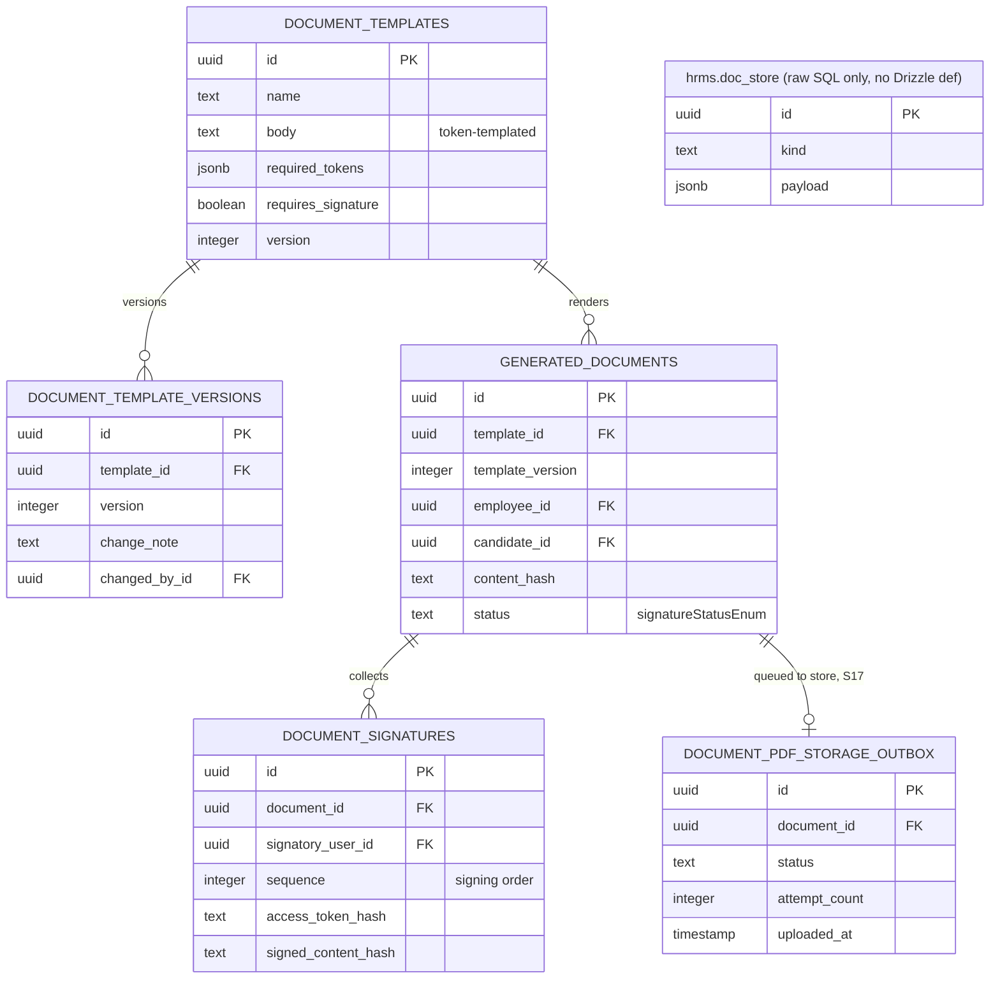
```mermaid
erDiagram
    DOCUMENT_TEMPLATES {
        uuid id PK
        text name
        text body "token-templated"
        jsonb required_tokens
        boolean requires_signature
        integer version
    }
    DOCUMENT_TEMPLATE_VERSIONS {
        uuid id PK
        uuid template_id FK
        integer version
        text change_note
        uuid changed_by_id FK
    }
    GENERATED_DOCUMENTS {
        uuid id PK
        uuid template_id FK
        integer template_version
        uuid employee_id FK
        uuid candidate_id FK
        text content_hash
        text status "signatureStatusEnum"
    }
    DOCUMENT_SIGNATURES {
        uuid id PK
        uuid document_id FK
        uuid signatory_user_id FK
        integer sequence "signing order"
        text access_token_hash
        text signed_content_hash
    }
    DOCUMENT_PDF_STORAGE_OUTBOX {
        uuid id PK
        uuid document_id FK
        text status
        integer attempt_count
        timestamp uploaded_at
    }
    DOC_STORE["hrms.doc_store (raw SQL only, no Drizzle def)"] {
        uuid id PK
        text kind
        jsonb payload
    }
    DOCUMENT_TEMPLATES ||--o{ DOCUMENT_TEMPLATE_VERSIONS : versions
    DOCUMENT_TEMPLATES ||--o{ GENERATED_DOCUMENTS : renders
    GENERATED_DOCUMENTS ||--o{ DOCUMENT_SIGNATURES : collects
    GENERATED_DOCUMENTS ||--o| DOCUMENT_PDF_STORAGE_OUTBOX : "queued to store, S17"
```

### 7.9 Learning and referrals (8 tables)

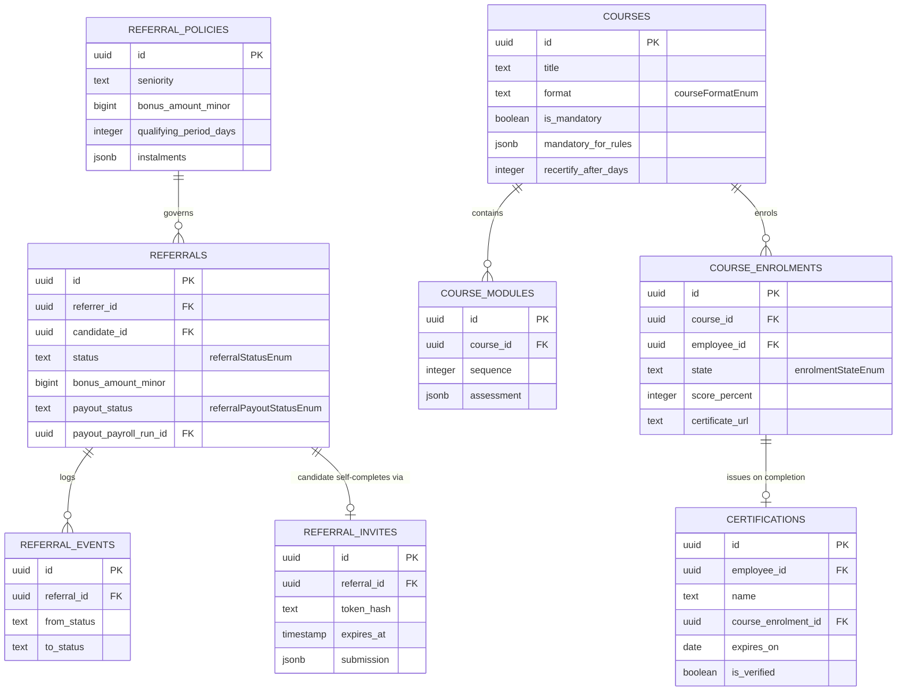
```mermaid
erDiagram
    REFERRALS {
        uuid id PK
        uuid referrer_id FK
        uuid candidate_id FK
        text status "referralStatusEnum"
        bigint bonus_amount_minor
        text payout_status "referralPayoutStatusEnum"
        uuid payout_payroll_run_id FK
    }
    REFERRAL_POLICIES {
        uuid id PK
        text seniority
        bigint bonus_amount_minor
        integer qualifying_period_days
        jsonb instalments
    }
    REFERRAL_EVENTS {
        uuid id PK
        uuid referral_id FK
        text from_status
        text to_status
    }
    REFERRAL_INVITES {
        uuid id PK
        uuid referral_id FK
        text token_hash
        timestamp expires_at
        jsonb submission
    }
    COURSES {
        uuid id PK
        text title
        text format "courseFormatEnum"
        boolean is_mandatory
        jsonb mandatory_for_rules
        integer recertify_after_days
    }
    COURSE_MODULES {
        uuid id PK
        uuid course_id FK
        integer sequence
        jsonb assessment
    }
    COURSE_ENROLMENTS {
        uuid id PK
        uuid course_id FK
        uuid employee_id FK
        text state "enrolmentStateEnum"
        integer score_percent
        text certificate_url
    }
    CERTIFICATIONS {
        uuid id PK
        uuid employee_id FK
        text name
        uuid course_enrolment_id FK
        date expires_on
        boolean is_verified
    }
    REFERRALS ||--o{ REFERRAL_EVENTS : logs
    REFERRAL_POLICIES ||--o{ REFERRALS : governs
    REFERRALS ||--o| REFERRAL_INVITES : "candidate self-completes via"
    COURSES ||--o{ COURSE_MODULES : contains
    COURSES ||--o{ COURSE_ENROLMENTS : enrols
    COURSE_ENROLMENTS ||--o| CERTIFICATIONS : "issues on completion"
```

### 7.10 Benefits (6 tables)

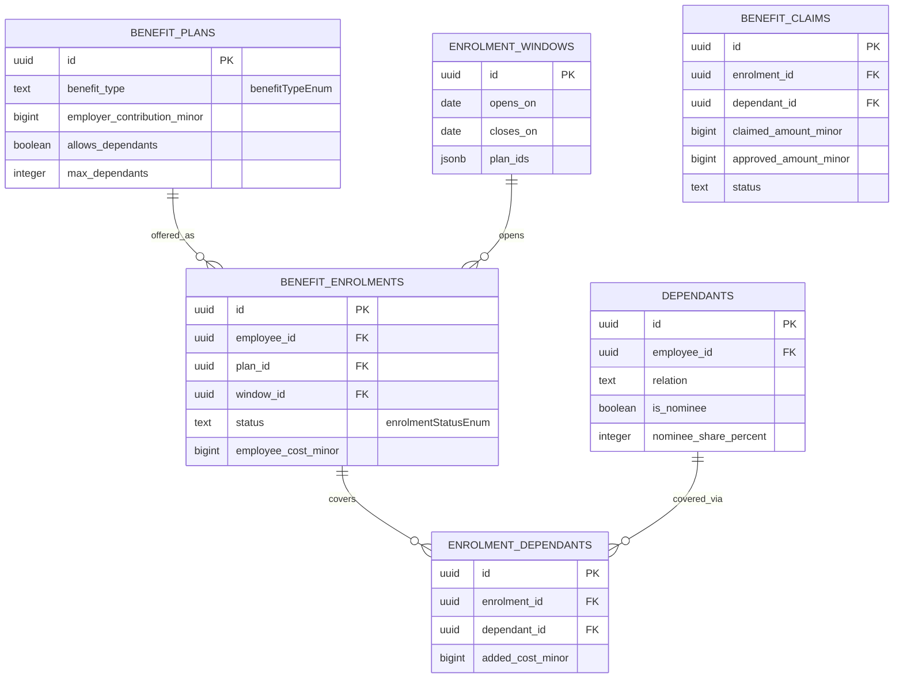
```mermaid
erDiagram
    BENEFIT_PLANS {
        uuid id PK
        text benefit_type "benefitTypeEnum"
        bigint employer_contribution_minor
        boolean allows_dependants
        integer max_dependants
    }
    ENROLMENT_WINDOWS {
        uuid id PK
        date opens_on
        date closes_on
        jsonb plan_ids
    }
    BENEFIT_ENROLMENTS {
        uuid id PK
        uuid employee_id FK
        uuid plan_id FK
        uuid window_id FK
        text status "enrolmentStatusEnum"
        bigint employee_cost_minor
    }
    DEPENDANTS {
        uuid id PK
        uuid employee_id FK
        text relation
        boolean is_nominee
        integer nominee_share_percent
    }
    ENROLMENT_DEPENDANTS {
        uuid id PK
        uuid enrolment_id FK
        uuid dependant_id FK
        bigint added_cost_minor
    }
    BENEFIT_CLAIMS {
        uuid id PK
        uuid enrolment_id FK
        uuid dependant_id FK
        bigint claimed_amount_minor
        bigint approved_amount_minor
        text status
    }
    BENEFIT_PLANS ||--o{ BENEFIT_ENROLMENTS : offered_as
    ENROLMENT_WINDOWS ||--o{ BENEFIT_ENROLMENTS : opens
    BENEFIT_ENROLMENTS ||--o{ ENROLMENT_DEPENDANTS : covers
    DEPENDANTS ||--o{ ENROLMENT_DEPENDANTS : covered_via
```

---

### 7.11 Identity and federation (14 tables)

The `identity` schema is HRMS-owned but suite-wide: every other application
reads it for who-is-who and reads `identity.audit_log` for the append-only
trail (§17). `organizations` is the one table that has no `org_id` column —
it *is* the tenant. `sso_*`/`scim_*` back federation (§6).

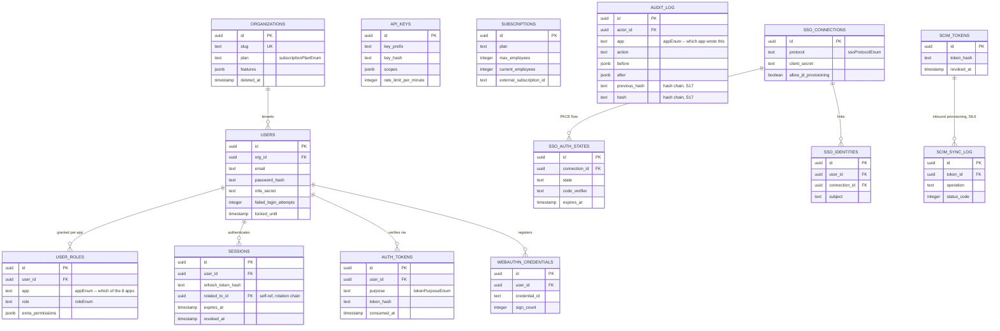
```mermaid
erDiagram
    ORGANIZATIONS {
        uuid id PK
        text slug UK
        text plan "subscriptionPlanEnum"
        jsonb features
        timestamp deleted_at
    }
    USERS {
        uuid id PK
        uuid org_id FK
        text email
        text password_hash
        text mfa_secret
        integer failed_login_attempts
        timestamp locked_until
    }
    USER_ROLES {
        uuid id PK
        uuid user_id FK
        text app "appEnum -- which of the 8 apps"
        text role "roleEnum"
        jsonb extra_permissions
    }
    SESSIONS {
        uuid id PK
        uuid user_id FK
        text refresh_token_hash
        uuid rotated_to_id FK "self-ref, rotation chain"
        timestamp expires_at
        timestamp revoked_at
    }
    AUTH_TOKENS {
        uuid id PK
        uuid user_id FK
        text purpose "tokenPurposeEnum"
        text token_hash
        timestamp consumed_at
    }
    API_KEYS {
        uuid id PK
        text key_prefix
        text key_hash
        jsonb scopes
        integer rate_limit_per_minute
    }
    SUBSCRIPTIONS {
        uuid id PK
        text plan
        integer max_employees
        integer current_employees
        text external_subscription_id
    }
    AUDIT_LOG {
        uuid id PK
        uuid actor_id FK
        text app "appEnum -- which app wrote this"
        text action
        jsonb before
        jsonb after
        text previous_hash "hash chain, S17"
        text hash "hash chain, S17"
    }
    WEBAUTHN_CREDENTIALS {
        uuid id PK
        uuid user_id FK
        text credential_id
        integer sign_count
    }
    SSO_CONNECTIONS {
        uuid id PK
        text protocol "ssoProtocolEnum"
        text client_secret
        boolean allow_jit_provisioning
    }
    SSO_AUTH_STATES {
        uuid id PK
        uuid connection_id FK
        text state
        text code_verifier
        timestamp expires_at
    }
    SSO_IDENTITIES {
        uuid id PK
        uuid user_id FK
        uuid connection_id FK
        text subject
    }
    SCIM_TOKENS {
        uuid id PK
        text token_hash
        timestamp revoked_at
    }
    SCIM_SYNC_LOG {
        uuid id PK
        uuid token_id FK
        text operation
        integer status_code
    }
    ORGANIZATIONS ||--o{ USERS : tenants
    USERS ||--o{ USER_ROLES : "granted per app"
    USERS ||--o{ SESSIONS : authenticates
    USERS ||--o{ AUTH_TOKENS : "verifies via"
    USERS ||--o{ WEBAUTHN_CREDENTIALS : registers
    SSO_CONNECTIONS ||--o{ SSO_AUTH_STATES : "PKCE flow"
    SSO_CONNECTIONS ||--o{ SSO_IDENTITIES : links
    SCIM_TOKENS ||--o{ SCIM_SYNC_LOG : "inbound provisioning, S8.6"
```

### 7.12 Governance and compliance (6 tables)

The DPDP/GDPR toolchain: retention, legal holds, DSAR intake, and the erasure
ledger that proves *what* was pseudonymised and *why* it was allowed to be.

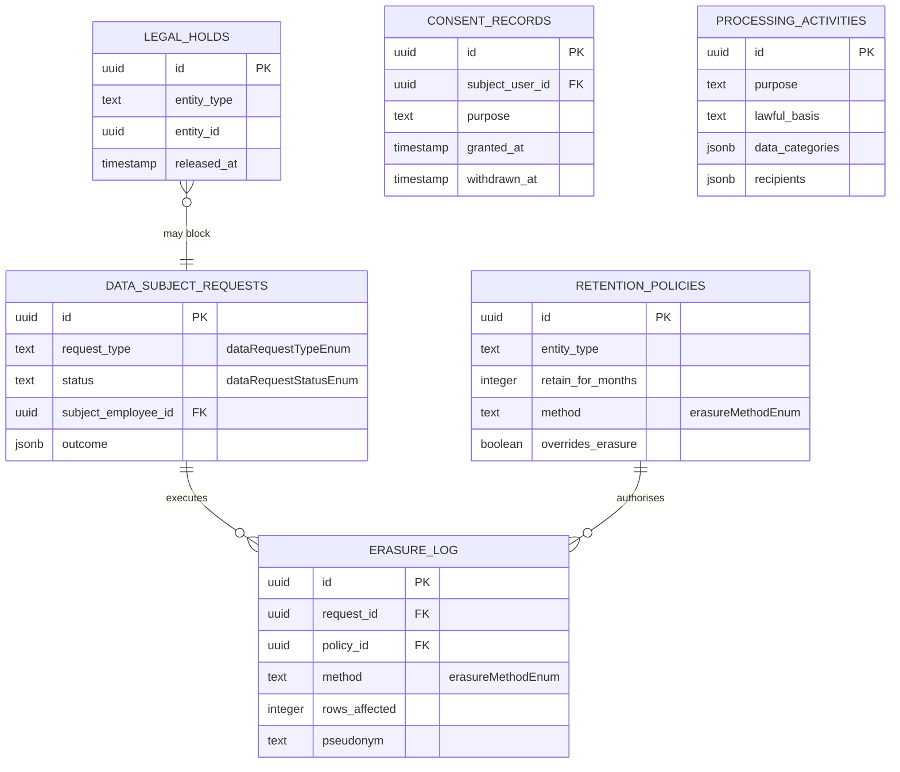
```mermaid
erDiagram
    RETENTION_POLICIES {
        uuid id PK
        text entity_type
        integer retain_for_months
        text method "erasureMethodEnum"
        boolean overrides_erasure
    }
    LEGAL_HOLDS {
        uuid id PK
        text entity_type
        uuid entity_id
        timestamp released_at
    }
    DATA_SUBJECT_REQUESTS {
        uuid id PK
        text request_type "dataRequestTypeEnum"
        text status "dataRequestStatusEnum"
        uuid subject_employee_id FK
        jsonb outcome
    }
    ERASURE_LOG {
        uuid id PK
        uuid request_id FK
        uuid policy_id FK
        text method "erasureMethodEnum"
        integer rows_affected
        text pseudonym
    }
    CONSENT_RECORDS {
        uuid id PK
        uuid subject_user_id FK
        text purpose
        timestamp granted_at
        timestamp withdrawn_at
    }
    PROCESSING_ACTIVITIES {
        uuid id PK
        text purpose
        text lawful_basis
        jsonb data_categories
        jsonb recipients
    }
    DATA_SUBJECT_REQUESTS ||--o{ ERASURE_LOG : executes
    RETENTION_POLICIES ||--o{ ERASURE_LOG : authorises
    LEGAL_HOLDS }o--|| DATA_SUBJECT_REQUESTS : "may block"
```

### 7.13 Assets (5 tables)

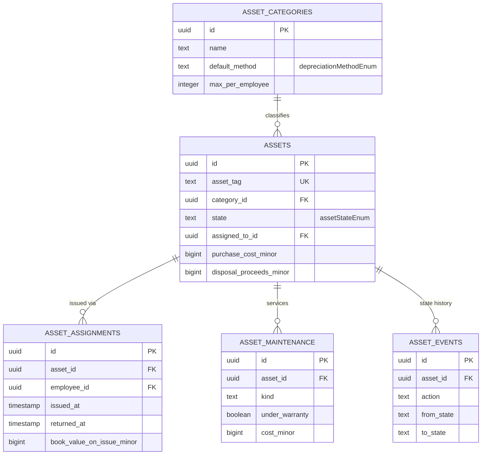
```mermaid
erDiagram
    ASSET_CATEGORIES {
        uuid id PK
        text name
        text default_method "depreciationMethodEnum"
        integer max_per_employee
    }
    ASSETS {
        uuid id PK
        text asset_tag UK
        uuid category_id FK
        text state "assetStateEnum"
        uuid assigned_to_id FK
        bigint purchase_cost_minor
        bigint disposal_proceeds_minor
    }
    ASSET_ASSIGNMENTS {
        uuid id PK
        uuid asset_id FK
        uuid employee_id FK
        timestamp issued_at
        timestamp returned_at
        bigint book_value_on_issue_minor
    }
    ASSET_MAINTENANCE {
        uuid id PK
        uuid asset_id FK
        text kind
        boolean under_warranty
        bigint cost_minor
    }
    ASSET_EVENTS {
        uuid id PK
        uuid asset_id FK
        text action
        text from_state
        text to_state
    }
    ASSET_CATEGORIES ||--o{ ASSETS : classifies
    ASSETS ||--o{ ASSET_ASSIGNMENTS : "issued via"
    ASSETS ||--o{ ASSET_MAINTENANCE : services
    ASSETS ||--o{ ASSET_EVENTS : "state history"
```

### 7.14 Helpdesk (7 tables)

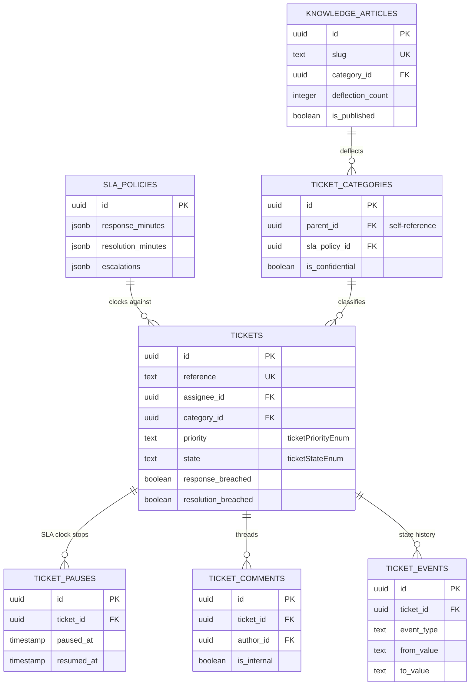
```mermaid
erDiagram
    SLA_POLICIES {
        uuid id PK
        jsonb response_minutes
        jsonb resolution_minutes
        jsonb escalations
    }
    TICKET_CATEGORIES {
        uuid id PK
        uuid parent_id FK "self-reference"
        uuid sla_policy_id FK
        boolean is_confidential
    }
    TICKETS {
        uuid id PK
        text reference UK
        uuid assignee_id FK
        uuid category_id FK
        text priority "ticketPriorityEnum"
        text state "ticketStateEnum"
        boolean response_breached
        boolean resolution_breached
    }
    TICKET_PAUSES {
        uuid id PK
        uuid ticket_id FK
        timestamp paused_at
        timestamp resumed_at
    }
    TICKET_COMMENTS {
        uuid id PK
        uuid ticket_id FK
        uuid author_id FK
        boolean is_internal
    }
    TICKET_EVENTS {
        uuid id PK
        uuid ticket_id FK
        text event_type
        text from_value
        text to_value
    }
    KNOWLEDGE_ARTICLES {
        uuid id PK
        text slug UK
        uuid category_id FK
        integer deflection_count
        boolean is_published
    }
    SLA_POLICIES ||--o{ TICKETS : "clocks against"
    TICKET_CATEGORIES ||--o{ TICKETS : classifies
    TICKETS ||--o{ TICKET_PAUSES : "SLA clock stops"
    TICKETS ||--o{ TICKET_COMMENTS : threads
    TICKETS ||--o{ TICKET_EVENTS : "state history"
    KNOWLEDGE_ARTICLES ||--o{ TICKET_CATEGORIES : deflects
```

### 7.15 Platform, workflow, notifications and outboxes (14 tables)

Custom fields, the generic approval-workflow engine, employee lifecycle
journeys (§9.1), and — the four transactional outboxes plus one non-retrying
reminder log — the integration edges detailed fully in §17.

```mermaid
erDiagram
    CUSTOM_FIELD_DEFINITIONS {
        uuid id PK
        text entity_type
        text data_type "customFieldTypeEnum"
        boolean is_pii
        jsonb visible_to_roles
    }
    CUSTOM_FIELD_VALUES {
        uuid id PK
        uuid definition_id FK
        uuid entity_id
        jsonb value
    }
    CUSTOM_FIELD_AUDIT {
        uuid id PK
        uuid definition_id FK
        jsonb before
        jsonb after
    }
    INTEGRATIONS {
        uuid id PK
        text kind
        text endpoint_url
        text secret_encrypted
        text last_status
    }
    ANNOUNCEMENTS {
        uuid id PK
        text title
        text priority "priorityEnum"
        jsonb audience_department_ids
    }
    NOTIFICATIONS {
        uuid id PK
        uuid user_id
        jsonb channels
        timestamp read_at
    }
    WORKFLOW_DEFINITIONS {
        uuid id PK
        text entity_type
        jsonb steps
        integer version
    }
    WORKFLOW_INSTANCES {
        uuid id PK
        uuid definition_id FK
        uuid entity_id
        integer current_step_index
        text status "approvalStatusEnum"
    }
    LIFECYCLE_JOURNEYS {
        uuid id PK
        uuid employee_id FK
        text kind "lifecycleKindEnum: onboard/exit"
        text status
    }
    LIFECYCLE_TASKS {
        uuid id PK
        uuid journey_id FK
        text task_key
        boolean mandatory
        boolean completed
    }
    INTERN_REMINDER_LOG {
        uuid id PK
        uuid employee_id FK
        integer lead_days
        timestamp sent_at
    }
    PAYSTUB_EMPLOYEE_SYNC_OUTBOX {
        uuid id PK
        uuid employee_id FK
        text status
        integer attempt_count
        timestamp synced_at
    }
    DIRECTORY_GROUP_JOIN_OUTBOX {
        uuid id PK
        uuid employee_id FK
        text group_address
        text status
        integer attempt_count
    }
    DIRECTORY_GROUP_LEAVE_OUTBOX {
        uuid id PK
        uuid employee_id FK
        text group_address
        text status
        integer attempt_count
    }
    WORKFLOW_DEFINITIONS ||--o{ WORKFLOW_INSTANCES : instantiates
    LIFECYCLE_JOURNEYS ||--o{ LIFECYCLE_TASKS : checklists
    EMPLOYEES ||--o{ LIFECYCLE_JOURNEYS : "onboarding / exit"
    EMPLOYEES ||--o| PAYSTUB_EMPLOYEE_SYNC_OUTBOX : "fans out to, S17"
    EMPLOYEES ||--o| DIRECTORY_GROUP_JOIN_OUTBOX : "fans out to, S17"
    EMPLOYEES ||--o| DIRECTORY_GROUP_LEAVE_OUTBOX : "fans out to, S17"
```

### 7.16 Complete table name index

The ASCII index below lists all 123 tables, grouped identically to 7.1–7.15
above, so every table this document claims exists can be checked by name in
one place with no `erDiagram` required to find it.

```
HRMS DATA MODEL -- COMPLETE TABLE INDEX (123 tables across 15 domains)
============================================================================

7.1  PEOPLE & ORGANIZATION CORE (5)
-------------------------------------
  locations                     departments
  employees                     resignations
  employee_documents

7.2  LEAVE & HOLIDAYS (4)
---------------------------
  leave_policies                leave_requests
  leave_balances                holidays

7.3  ATTENDANCE (6)
---------------------
  shifts                        attendance_records
  attendance_regularisations    attendance_policies
  attendance_punch_photos       work_arrangement_requests

7.4  ROSTERING & SCHEDULING (8)
---------------------------------
  shift_patterns                shift_eligibility
  availability                  rosters
  roster_assignments            shift_swap_requests
  open_shifts                   coverage_requirements

7.5  PAYROLL, COMPENSATION & LOANS (15)
----------------------------------------
  it_declarations               it_declaration_items
  salary_structures             payroll_runs
  payroll_records               employee_loans
  loan_repayments               loan_benchmark_rates
  expense_claims                salary_bands
  compensation_cycles           budget_pools
  compensation_recommendations  equity_grants
  salary_history

7.6  PERFORMANCE MANAGEMENT (10)
---------------------------------
  review_cycles                 performance_goals
  performance_reviews           competencies
  competency_ratings            feedback_requests
  feedback_responses            calibration_sessions
  calibration_adjustments       check_ins

7.7  RECRUITMENT (ATS OVERLAP) (9)
------------------------------------
  job_postings                  candidates
  applications                  pipeline_stages
  application_events            interviews
  interview_scorecards          offers
  application_sources

7.8  DOCUMENTS & E-SIGNATURE (6)
----------------------------------
  document_templates            document_template_versions
  generated_documents           document_signatures
  document_pdf_storage_outbox   doc_store

7.9  LEARNING & REFERRALS (8)
-------------------------------
  referrals                     referral_policies
  referral_events               referral_invites
  courses                       course_modules
  course_enrolments             certifications

7.10 BENEFITS (6)
-------------------
  benefit_plans                 enrolment_windows
  benefit_enrolments            dependants
  enrolment_dependants          benefit_claims

7.11 IDENTITY & FEDERATION (14)
--------------------------------
  organizations                 users
  user_roles                    sessions
  auth_tokens                   api_keys
  subscriptions                 audit_log
  webauthn_credentials          sso_connections
  sso_auth_states               sso_identities
  scim_tokens                   scim_sync_log

7.12 GOVERNANCE & COMPLIANCE (6)
----------------------------------
  retention_policies            legal_holds
  data_subject_requests         erasure_log
  consent_records               processing_activities

7.13 ASSETS (5)
-----------------
  asset_categories              assets
  asset_assignments             asset_maintenance
  asset_events

7.14 HELPDESK (7)
-------------------
  sla_policies                  ticket_categories
  tickets                       ticket_pauses
  ticket_comments               ticket_events
  knowledge_articles

7.15 PLATFORM, WORKFLOW, NOTIFICATIONS & OUTBOXES (14)
-------------------------------------------------------
  custom_field_definitions      custom_field_values
  custom_field_audit            integrations
  announcements                 notifications
  workflow_definitions          workflow_instances
  lifecycle_journeys            lifecycle_tasks
  intern_reminder_log           paystub_employee_sync_outbox
  directory_group_join_outbox   directory_group_leave_outbox

============================================================================
TOTAL: 123 tables (117 audited + 6 found by direct enumeration)
```

---

## 8. Workflows, end to end

### 8.1 Login and session establishment — password, MFA, SSO

```mermaid
sequenceDiagram
    autonumber
    actor U as User
    participant LR as /auth/login [R]
    participant S as auth/session.ts
    participant T as auth/tokens.ts
    participant DB as identity.users/sessions
    participant SS as /auth/sso/start [R]
    participant IDP as Okta / Entra ID
    participant CB as /auth/callback [R]

    rect rgb(219, 234, 254)
    Note over U,DB: PATH 1 — password + optional MFA
    U->>LR: POST email, password, totpCode?
    LR->>S: signIn({email, password, ...})
    S->>DB: findLoginRow(email) — NO tenant context,<br/>uses withTenant(superuser)
    DB-->>S: user row (or none)
    S->>S: check lockout, verify password hash
    alt MFA enrolled
        S->>S: verify TOTP or backup code
    end
    S->>S: roleFor() resolves app role
    S->>T: issueSession() — generateToken() + signAccessToken()
    T->>DB: insert identity.sessions (refreshTokenHash, ip, ua)
    T-->>S: { accessJwt, refreshToken }
    S-->>LR: session pair
    LR-->>U: Set-Cookie cv_access, cv_refresh<br/>(HttpOnly, Secure prod, SameSite=Lax)
    end

    rect rgb(254, 243, 199)
    Note over U,CB: PATH 2 — SSO, OIDC Authorization Code + PKCE (not SAML)
    U->>SS: GET /auth/sso/start?app=
    SS->>SS: generate verifier, state, nonce cookies
    SS-->>U: 302 to IdP authorizeUrl(code_challenge=S256)
    U->>IDP: authenticate at the IdP
    IDP-->>U: 302 back with code, state
    U->>CB: GET /auth/callback?code&state
    CB->>CB: validate state cookie, clear temp cookies
    CB->>IDP: exchangeCode(code, verifier)
    IDP-->>CB: id_token
    CB->>CB: verifyToken() checks signature + nonce
    CB->>S: signInWithSso({email, subject, ssoRole, ...})
    S->>S: provisionFromDirectory() if first sight
    S->>S: strongestRole(localRole, ssoRole)
    S->>T: issueSession() — same code path as PATH 1
    T-->>CB: session pair
    CB-->>U: Set-Cookie, 302 to /dashboard
    end
```

```
   JWT CLAIMS (auth/tokens.ts, HS256 via jose):
     sub    user id            org   organisation id (tenant)
     role   resolved app role  sid   session id (identity.sessions.id)
     email  for display        mfa   whether this session cleared MFA

   The org claim is the seed for row-level security: every tenant-scoped
   query later calls withTenant(), which does set_config('app.org_id', ...,
   true) inside the SAME transaction the query runs in — see section 14.

   Password lookup deliberately bypasses tenant scoping (a user does not
   know their org before they authenticate) but every subsequent call does
   not: findLoginRow() runs with an explicit superuser context, not a leak.
```

### 8.2 SCIM inbound provisioning — the identity provider pushes, HRMS never pulls

```mermaid
sequenceDiagram
    autonumber
    actor IDP as Okta / Entra ID
    participant SU as /scim/v2/Users [R]
    participant SI as /scim/v2/Users/[id] [R]
    participant A as authenticateScim()
    participant REPO as NeonScimRepository
    participant DB as identity.users/sessions

    IDP->>SU: POST Users {userName, name, emails, active}
    SU->>A: bearer token -> hash -> scim_tokens lookup
    A-->>SU: { orgId, tokenId } or 401
    SU->>REPO: create(payload)
    REPO->>REPO: toProvisionedUser() + duplicate-email check
    REPO->>DB: insert identity.users (passwordHash: null)
    REPO->>DB: insert scim_sync_log {operation:"create"}
    REPO-->>SU: SCIM User resource
    SU-->>IDP: 201 Created

    Note over IDP,DB: identity.users only — SCIM create does NOT<br/>touch hrms.employees; HR still hires separately

    IDP->>SI: PATCH Users/[id] {active:false}
    SI->>A: bearer token check (same as above)
    SI->>REPO: patch(id, ops) — row locked first
    REPO->>DB: update identity.users.status = deactivated
    REPO->>DB: revoke identity.sessions for this user
    REPO->>DB: update hrms.employees.status if linked
    REPO->>DB: insert scim_sync_log {operation:"patch"}
    REPO-->>SI: 200
    SI-->>IDP: 200
```

```
   AUTH: Authorization: ****** header, checked against a HASHED token in
   scim_tokens — never a session cookie. maxResults 200, bulk NOT supported,
   changePassword NOT supported (ServiceProviderConfig route.ts:12-43).

   scim_sync_log is written on every single operation, success or failure —
   list, get, create, replace, patch, delete — with an operation column, so
   the entire provisioning history for a tenant is reconstructable.

   DEACTIVATE (PATCH active:false or DELETE) is the only SCIM path that
   touches BOTH identity.users and hrms.employees in the same call — it
   revokes live sessions AND flips the employee row to inactive.
```

### 8.3 Employee onboarding — one transaction, four outbox rows, a cron sweep

```mermaid
sequenceDiagram
    autonumber
    actor HR as HR admin
    participant EP as /employees [R]
    participant REPO as NeonEmployeeRepository
    participant DB as hrms.* (one transaction)
    participant SP as SAVEPOINT (groups)
    participant CRON as /cron [CRON]
    participant PAY as Paystub
    participant DIR as Directory (Auth's IdP)

    HR->>EP: POST /employees {name, dept, employmentType, email}
    EP->>REPO: create(data)
    REPO->>DB: SELECT hrms.next_employee_code(employmentType)
    Note right of DB: "CVI-" prefix for interns, else "CV-"
    REPO->>DB: INSERT employees
    REPO->>DB: provisionLeave() — seed leaveBalances rows
    REPO->>SP: provisionGroups() if shouldAutoJoin(status, email)
    SP->>DB: INSERT directory_group_join_outbox (pending)
    Note right of SP: SAVEPOINT — a group-outbox failure does<br/>NOT roll back the hire itself
    REPO->>DB: INSERT paystub_employee_sync_outbox (pending)
    DB-->>REPO: COMMIT — employee + both outbox rows durable
    REPO-->>EP: employee record

    par best-effort immediate attempts, post-commit
        REPO->>PAY: queueAndAttemptPaystubEmployeeSync()
        PAY-->>REPO: 200 or left pending for the sweep
    and
        REPO->>DIR: drainDueGroupJoins() -> addGroupMember()
        DIR-->>REPO: 200 or left pending for the sweep
    end
    EP-->>HR: 201 Created

    Note over CRON: hours later, Vercel cron 03:00 daily
    CRON->>CRON: authenticate CRON_SECRET
    CRON->>CRON: sweepOutboxes() — per active org, in order:
    CRON->>PAY: 1. drainDuePaystubSyncs()
    CRON->>DIR: 2. drainDueGroupJoins()
    CRON->>DIR: 3. drainDueGroupLeaves()
    CRON->>CRON: 4. drainDueDocumentPdfStorage() (see 8.6)
```

```
   WHY THE SAVEPOINT MATTERS: provisionGroups() runs inside a nested
   transaction. If the directory call construction throws, only the group
   outbox insert unwinds — the employee row and the Paystub outbox row,
   already committed to the OUTER transaction's work, are unaffected. Hiring
   someone can never fail because a distribution-list address was malformed.

   THE SWEEP IS THE ONLY SAFETY NET FOR A DEAD PROCESS: if the post-commit
   "best-effort immediate attempt" never runs (serverless function recycled,
   process killed), the row sits in the outbox with status=pending and
   next_attempt_at=now — the next cron tick picks it up. Nothing is lost.
```

### 8.4 Leave request — apply, hold the balance, decide, notify

```mermaid
sequenceDiagram
    autonumber
    actor E as Employee
    participant LP as /leave [R]
    participant REPO as NeonLeaveRepository
    participant DB as leave_requests/leave_balances
    actor M as Manager
    participant DP as /leave/[id]/decision [R]
    participant N as notify.ts

    E->>LP: POST /leave {leaveType, startDate, endDate, reason}
    LP->>REPO: apply({...})
    REPO->>DB: BEGIN — overlap check
    REPO->>DB: policy lookup for leaveType
    REPO->>DB: SELECT leave_balances FOR UPDATE (row lock)
    REPO->>REPO: balance sufficiency check
    REPO->>DB: leave_balances.pendingDays += days
    REPO->>DB: INSERT leave_requests (status default "pending")
    DB-->>REPO: COMMIT
    REPO-->>LP: leave request record
    LP-->>E: 201 Created

    M->>DP: GET pendingFor(managerId)
    Note right of M: direct reports only —<br/>employees.reportingToId = managerId
    DP-->>M: pending requests awaiting this manager

    M->>DP: POST /leave/[id]/decision {action: approve|reject|cancel}
    DP->>DP: block self-approval
    DP->>REPO: approve() / reject() / cancel()
    REPO->>DB: SELECT ... FOR UPDATE, forbid non-pending transition
    alt approve
        REPO->>DB: pendingDays -= days, usedDays += days
    else reject or cancel
        REPO->>DB: pendingDays -= days (release the hold)
    end
    REPO->>DB: leave_requests.status = approved|rejected|cancelled
    DP-->>M: 200 OK
    DP-->>N: notifyEmployee() — best-effort, async
    N-->>E: email/notification (failure never rolls back the decision)
```

```
   leave_requests.status (approval_status enum): pending, approved,
   rejected, cancelled — four values, see the state machine in section 9.2.

   APPROVAL IS SINGLE-LEVEL in this code path: pendingFor(managerId) only
   ever looks at the direct reporting line. The schema HAS a generic
   workflow_definitions/workflow_instances engine (multi-step, used
   elsewhere for expense/travel/loans/offboarding per its own comments) but
   the leave repository does not route through it — leave approval is a
   flat manager-approves-report model, not a configurable chain.
```

### 8.5 Payroll run — process, approve, pay — and the float seam

```mermaid
sequenceDiagram
    autonumber
    actor PA as Payroll admin
    participant PR as /payroll/runs/[id] [R]
    participant REPO as NeonPayrollRepository
    participant SI as statutory-india.ts (bigint/Minor)
    participant PE as payroll-engine.ts (float)
    participant DB as payroll_runs/payroll_records
    actor AP as Approver (must differ)

    PA->>PR: POST action="process"
    PR->>REPO: processRun(runId)
    REPO->>SI: calculatePf(), calculateEsi() — inline, bigint minor units
    SI-->>REPO: PfResult / EsiResult (...Minor fields)
    REPO->>REPO: minorToMajor(gross) — Minor -> float
    REPO->>PE: calculateProfessionalTax(floatGross)
    PE-->>REPO: float rupees
    REPO->>REPO: Math.round(float * 100) -> Minor  [DEFECT: float seam]
    REPO->>PE: calculateNewRegimeIncomeTax(minorToMajor(ctc))
    PE-->>REPO: float annual tax
    REPO->>REPO: Math.round((annualTax/12) * 100) -> Minor
    REPO->>DB: INSERT payroll_records (one row per employee)
    REPO->>DB: UPDATE payroll_runs SET status="processed"
    PR-->>PA: 200 processed

    AP->>PR: POST action="approve"
    PR->>REPO: approveRun(runId, approverId)
    REPO->>REPO: require status=="processed" AND approverId != processorId
    REPO->>DB: payroll_runs.status="approved"<br/>payroll_records.status="approved"
    PR-->>AP: 200 approved

    AP->>PR: POST action="pay" {transactionRef}
    PR->>REPO: markPaid(runId, transactionRef)
    REPO->>REPO: require status=="approved"
    REPO->>DB: payroll_runs.status="paid", paidAt=now<br/>payroll_records.status="paid"
    PR-->>AP: 200 paid
```

```
   payroll_status enum: draft, processing, processed, approved, paid,
   on_hold, error — a strict forward gate: process needs draft, approve
   needs processed (and a DIFFERENT approver), pay needs approved.

   THE FLOAT SEAM, PRECISELY (D-03): PF and ESI are computed by
   statutory-india.ts and never leave bigint Minor units. Professional tax
   and new-regime income tax are computed by payroll-engine.ts, which is
   plain `number` (float) throughout — so the pipeline converts Minor to
   float with minorToMajor(), calls the float function, then converts back
   with Math.round(x * 100). Two conversions per payroll run, per employee,
   for exactly these two components — everything else in the run never
   leaves integer arithmetic. See section 4 for the full module picture.
```

### 8.6 Document generation, e-sign and PDF storage — three outboxed steps

```mermaid
sequenceDiagram
    autonumber
    actor HR as HR admin
    participant GP as /documents/generate [R]
    participant REPO as NeonDocumentsRepository
    participant DB as generated_documents/document_signatures
    actor C as Candidate/employee
    participant SG as /sign/[id] [R] (public, token-gated)
    participant OB as document_pdf_storage_outbox
    participant R2 as Cloudflare R2

    HR->>GP: POST /documents/generate {templateId, targetId}
    GP->>REPO: generate(data)
    REPO->>DB: render template -> renderedBody + contentHash
    REPO->>DB: INSERT document_signatures (if signature required)
    REPO->>DB: send() -> accessTokenHash stored, status="sent"
    GP-->>HR: 201 Created — signing link issued out of band

    C->>SG: GET /sign/[id]?token=...
    SG->>REPO: openForSigning(id, token)
    REPO-->>SG: document preview (token not yet consumed)
    C->>SG: POST {action:"sign", evidence}
    SG->>REPO: sign(id, token, evidence)
    REPO->>REPO: hashToken(token)
    REPO->>REPO: timingSafeEqualHex(stored, presented)
    REPO->>REPO: verifyIntegrity(renderedBody, contentHash)
    REPO->>DB: document_signatures.signedAt = now, clear accessTokenHash
    REPO->>OB: queueDocumentPdfStorage() — SAME transaction
    DB-->>REPO: COMMIT
    REPO-->>SG: signed
    SG-->>C: 200 OK

    REPO->>OB: queueAndAttemptDocumentPdfStorage() — post-commit, best-effort
    OB->>OB: renderDocumentPdf() -> hash bytes -> documentPdfKey()
    OB->>R2: putObject(key, bytes)
    R2-->>OB: ok
    OB->>DB: generated_documents.blobUrl = key, outbox row succeeded
    Note over OB,R2: on failure the row stays pending — the 03:00<br/>cron sweep (8.3) retries it as outbox #4
```

```
   THE TOKEN IS NEVER COMPARED IN PLAIN TEXT: hashToken() then
   timingSafeEqualHex() — a constant-time compare defeats a timing attack
   against the stored accessTokenHash. Signing also re-verifies
   contentHash, so a signature cannot be attached to a document whose
   rendered body silently changed between generation and signing.

   THE PDF ITSELF IS NEVER GENERATED INLINE: it is queued to
   document_pdf_storage_outbox in the SAME transaction as the signature,
   then rendered and uploaded to R2 out of band — a slow render or an R2
   outage cannot block or fail the e-sign HTTP response.
```

---

## 9. State machines

Two enums drive most of the product: `employee_status` (`src/db/schema/hrms.ts:48`)
and `leave_requests.status` — really `approval_status` (`hrms.ts:64`). What
follows is not the enum's shape, which is trivial, but **who actually writes
each transition**, verified by grepping every `.set({ status: ...` call in
`src/db/repositories/`. Several edges below are the honest result of that
grep coming up empty where a reader would expect a hit.

### 9.1 Employee lifecycle — `employee_status`

```mermaid
stateDiagram-v2
    [*] --> active: create()<br/>employee.neon.ts:277, default when status omitted
    [*] --> probation: create()<br/>employee.neon.ts:277, if caller passes it

    probation --> active: manual PATCH only
    active --> on_leave: manual PATCH only
    on_leave --> active: manual PATCH only

    active --> notice_period: resignation.accept()<br/>SAME tx as resignations.status="accepted"
    probation --> notice_period: resignation.accept()
    on_leave --> notice_period: resignation.accept()

    notice_period --> terminated: manual PATCH only<br/>(no repository code writes this value)
    active --> terminated: manual PATCH only
    probation --> terminated: manual PATCH only

    active --> inactive: remove()<br/>soft delete, exitDate, exit-doc outbox (8.6-adjacent)
    probation --> inactive: remove()
    on_leave --> inactive: remove()
    notice_period --> inactive: remove()
    terminated --> inactive: remove()

    inactive --> [*]: terminal in practice

    note right of terminated
        "terminated" is validated by both
        /api/employees route schemas and read
        by every workforce/analytics/offboarding
        filter in the UI, but grep of
        db/repositories/*.neon.ts for
        status:"terminated" returns ZERO writers.
        It is reachable only through the generic
        PATCH, never through a dedicated code path.
    end note

    note right of on_leave
        Approving a leave_requests row (8.4) never
        touches the employees table at all --
        leave.neon.ts has no update(employees)
        call anywhere in the file. This state is
        set only by a human editing the record.
    end note

    note right of inactive
        remove() sets deletedAt and status=
        "inactive" together and no code path ever
        clears deletedAt (no grep hit for
        "deletedAt: null" in employee.neon.ts).
        There is no rehire button -- a returning
        employee gets a brand-new row and a new
        CV- code.
    end note
```

```
   EMPLOYEE STATUS — WHO ACTUALLY WRITES THE TRANSITION
   ─────────────────────────────────────────────────────────────────────
   EDGE                        WRITER                          KIND
   ─────────────────────────────────────────────────────────────────────
   (new)      -> active        employee.neon.ts create()       system, default
   (new)      -> probation     employee.neon.ts create()       system, if asked
   any        -> notice_period resignation.neon.ts accept()    system, same tx
   any        -> inactive      employee.neon.ts remove()       system, soft-del
   any        -> any           PATCH /api/employees/[id]       MANUAL, unguarded
   ─────────────────────────────────────────────────────────────────────
   THINGS THAT DO NOT HAPPEN, VERIFIED BY GREP:
     - nothing ever writes status="terminated"          (0 hits)
     - leave approval never writes status="on_leave"    (0 hits, wrong file)
     - nothing ever clears deletedAt                     (0 hits, no rehire)
   ─────────────────────────────────────────────────────────────────────
   The resignation->notice_period edge is the one genuine cross-aggregate
   write in this whole state machine, and its own inline comment says why
   it exists: "until this line, nothing ever wrote it. A resignation
   could be accepted and still be invisible everywhere except the
   resignations table." (resignation.neon.ts, above line 311.)
```

### 9.2 Leave-request lifecycle — `approval_status`

Every edge below is enforced by ONE method, `transition()` in
`leave.neon.ts:323-412`, under a `SELECT ... FOR UPDATE` row lock, and every
edge also carries a `leaveBalances` side effect — this state machine and the
balance ledger are not two systems, they are one `UPDATE` statement apart.

```mermaid
stateDiagram-v2
    [*] --> pending: apply()<br/>leaveBalances.pendingDays += totalDays

    pending --> approved: approve()<br/>pendingDays -= days, usedDays += days
    pending --> rejected: reject(reason)<br/>pendingDays -= days, no usedDays change
    pending --> cancelled: cancel(reason)<br/>pendingDays -= days

    approved --> cancelled: cancel(reason)<br/>usedDays -= days, wasApproved branch

    rejected --> [*]
    cancelled --> [*]
    approved --> [*]: until cancelled

    note right of approved
        approved -> rejected and approved ->
        approved are both BLOCKED (409): the
        method's first guard throws unless
        next=="cancelled" or status=="pending".
        leave.neon.ts:340-345
    end note

    note right of rejected
        rejected -> cancelled is explicitly
        BLOCKED (409): "A rejected request
        cannot be cancelled." leave.neon.ts:349
    end note

    note right of cancelled
        cancelled -> cancelled is BLOCKED (409):
        "This request is already cancelled."
        leave.neon.ts:346
    end note
```

```
   LEAVE BALANCE LEDGER EFFECT OF EACH EDGE (leave.neon.ts:355-397)
   ─────────────────────────────────────────────────────────────────────
   EDGE                    pendingDays        usedDays
   ─────────────────────────────────────────────────────────────────────
   (new) -> pending        += totalDays       unchanged
   pending -> approved     -= days             += days
   pending -> rejected     -= days             unchanged
   pending -> cancelled    -= days             unchanged
   approved -> cancelled   unchanged           -= days   (returned)
   ─────────────────────────────────────────────────────────────────────
   All four terminal-ward writes use greatest(0, ...) — a double-drain
   (e.g. two concurrent cancels racing the FOR UPDATE lock) floors at
   zero instead of driving a balance negative.

   notifyEmployee() fires after every transition and is fire-and-forget:
   its own try/catch means a broken mail server changes what the
   employee is told, never whether the transition itself commits (8.4).
```

---

## 10. Cross-cutting concerns

### 10.1 Defense in depth — and the one layer that is missing entirely

```mermaid
flowchart TB
    REQ["Inbound HTTP request"]

    subgraph L0["Layer 0 — transport/browser hardening"]
        HDR["next.config.ts headers()<br/>0 (zero) security headers configured"]
    end

    subgraph L1["Layer 1 — identity"]
        JWT["cv_access cookie, HS256 JWT<br/>HttpOnly, Secure(prod), SameSite=Lax"]
        SVC["OR a static service-secret header<br/>x-service-token / Authorization: Bearer"]
    end

    subgraph L2["Layer 2 — authorization"]
        ROLE["requireRole() / requireUserOrService()<br/>src/lib/server-auth.ts"]
    end

    subgraph L3["Layer 3 — tenancy (the backstop, 14)"]
        GUC["withTenant() SET LOCAL app.org_id<br/>assertConnectionIsolatesTenants()"]
        RLS["Postgres FORCE ROW LEVEL SECURITY<br/>tenant_isolation policy, all 117 tables"]
    end

    DATA[("hrms / identity schemas")]

    REQ --> HDR --> JWT
    REQ -.-> SVC
    JWT --> ROLE
    SVC --> ROLE
    ROLE --> GUC --> RLS --> DATA

    style HDR fill:#4a1010,color:#ffb0b0
```

```
   FOUR LAYERS, ONE OF THEM EMPTY
   ─────────────────────────────────────────────────────────────────────
   LAYER 0  Browser hardening      next.config.ts headers()  ->  NONE.
            No CSP, no HSTS, no X-Frame-Options / frame-ancestors, no
            X-Content-Type-Options, no Referrer-Policy, no
            Permissions-Policy. Doc 05, D-05 — "the single cheapest
            high-value fix available" for the app holding salary, bank
            details and national identifiers for the whole suite.
   LAYER 1  Identity               JWT cookie OR static service secret
            (10.3). Two different trust models sharing one perimeter.
   LAYER 2  Authorization          role string on the JWT claim, checked
            per route by requireRole()/requireUserOrService().
   LAYER 3  Tenancy                the ONE layer that cannot be
            individually forgotten per route: FORCE RLS means even a
            route with a bug in Layer 2 still cannot cross a tenant
            boundary, so long as the connection itself is not
            BYPASSRLS (15). See 14 for the full mechanism.
   ─────────────────────────────────────────────────────────────────────
   Layer 3 is the suite reference specifically because it does not trust
   Layers 0-2 to be bug-free on every route; Layer 0 shows what happens
   when there is no equivalent backstop for browser-side attacks.
```

### 10.2 Field-level encryption at rest — 4 targets, 1 deliberate gap

```mermaid
flowchart LR
    PLAIN["plaintext string"] --> ENC["encryptField()<br/>AES-256-GCM, src/lib/crypto/field-encryption.ts"]
    ENC --> ENV["enc.v1.&lt;keyFingerprint&gt;.&lt;iv&gt;.&lt;ciphertext+tag&gt;<br/>base64url, stored in a text column"]

    subgraph T["THE 4 ENCRYPTED COLUMNS — scripts/encrypt-fields.ts:48-53"]
        T1["identity.users.mfa_secret — TOTP secrets"]
        T2["identity.sso_connections.client_secret"]
        T3["hrms.employees.aadhaar_number"]
        T4["hrms.employees.pan_number"]
    end

    subgraph GAP["THE DELIBERATE GAP — D-07"]
        BD["hrms.employees.bank_details — jsonb, PLAINTEXT<br/>excluded because encrypting it needs a text-column<br/>schema change, not a backfill; tracked, unscheduled"]
    end

    ENV -.-> T
    ENC -.->|"never called on"| BD

    style BD fill:#4a1010,color:#ffb0b0
```

```
   KEY ROTATION, WITHOUT A FLAG DAY
   ─────────────────────────────────────────────────────────────────────
   decryptField() returns a non-envelope value UNCHANGED (isEncrypted()
   checks the "enc.v1." prefix) — so turning encryption on protects only
   rows written from that moment forward. `db:encrypt-fields` (also
   scripts/encrypt-fields.ts) is the backfill: it runs AS SUPERUSER,
   because it must cross every tenant, which the comment calls out as
   "the one thing application code must never do, and it is why this
   is a script" — the single sanctioned superuser code path in the repo.

   Rotation: set ENCRYPTION_KEY_PREVIOUS to the old key, ENCRYPTION_KEY
   to the new one, run the backfill, then drop the old key once nothing
   is left needing it. decryptField() matches ciphertext to whichever
   key's fingerprint it was written under, so old and new rows are both
   readable throughout the migration window.

   bank_details stays real jsonb, in cleartext, in the database today —
   confirmed by grep: employee.neon.ts reads and writes bankDetails as
   plain object fields, and nothing in the repository layer calls
   encryptField on it. A database dump or a compromised read replica
   exposes it exactly as stored.
```

### 10.3 The two static shared secrets

```mermaid
sequenceDiagram
    autonumber
    participant CALLER as Paystub / Vercel Cron
    participant RT as HRMS route
    participant ENV as process.env

    rect rgb(60, 20, 20)
        Note over CALLER,ENV: /api/cron — CRON_SECRET
        CALLER->>RT: GET /api/cron<br/>Authorization: Bearer CRON_SECRET
        RT->>ENV: read CRON_SECRET
        alt not configured
            RT-->>CALLER: 503 fail CLOSED
        else configured
            RT->>RT: timingSafeEqual(provided, expected)
            alt mismatch
                RT-->>CALLER: 401
            else match
                RT->>RT: sweepOutboxes() (8.3, 17)
                RT-->>CALLER: 200 + counts
            end
        end
    end

    rect rgb(60, 20, 20)
        Note over CALLER,ENV: /api/documents/reminders + Paystub push<br/>CROSS_APP_SYNC_TOKEN
        CALLER->>RT: x-service-token OR Authorization: Bearer
        RT->>ENV: read CROSS_APP_SYNC_TOKEN
        RT->>RT: requireServiceToken()<br/>timingSafeEqual, constant-time
        RT-->>CALLER: 200 / 403 — no rate limit call on this path
    end
```

```
   BOTH SECRETS SHARE THE SAME THREE PROPERTIES
   ─────────────────────────────────────────────────────────────────────
   SECRET                  USED BY                          COMPARE
   ─────────────────────────────────────────────────────────────────────
   CRON_SECRET             GET /api/cron only                timingSafeEqual
   CROSS_APP_SYNC_TOKEN    /api/documents/reminders,          timingSafeEqual
                           Paystub employee-sync push
   ─────────────────────────────────────────────────────────────────────
   1. REPLAYABLE INDEFINITELY. The check is "does the bearer value equal
      the env var", full stop — no nonce, no timestamp, no signature
      expiry. Anyone who captures one request can resend it forever
      until the operator rotates the value by hand (04, section 12:
      "Rotate CRON_SECRET and CROSS_APP_SYNC_TOKEN — neither has replay
      protection").
   2. UNRATE-LIMITED. Neither /api/cron nor /api/documents/reminders
      calls checkRateLimit() (10.5) — confirmed by grep of both route
      files. A leaked secret can be hammered with no in-app backpressure.
   3. TIMING-SAFE BUT STILL A BARE SHARED SECRET. Both use
      timingSafeEqual, which closes a timing side-channel on the compare
      itself — it does nothing about interception, logging, or a leaked
      .env file.
   ─────────────────────────────────────────────────────────────────────
   This is Doc 05's D-17 (cron) and D-02 (reminders/CROSS_APP_SYNC_TOKEN)
   read together — the audit calls out each endpoint individually; this
   diagram is the reminder that they are architecturally the same gap
   twice, once per suite integration point (cron sweep, Paystub bridge).
```

### 10.4 Rate limiting — in-memory, per-instance, and not everywhere

```
   checkRateLimit() — src/lib/api-context.ts:126-153
   ─────────────────────────────────────────────────────────────────────
   Fixed-window counter in a module-level Map<string, {count, resetAt}>.
   clientIdentifier() keys it by "user:<id>" when known, else
   "ip:<x-forwarded-for>". An opportunistic sweep runs once the map
   passes 10,000 entries so a long-lived instance does not leak memory.

   APPLIED TO:            /api/v1/* (api-v1-context.ts) — the public,
                           API-key-authenticated integration surface.
   NOT APPLIED TO:         /api/cron, /api/documents/reminders (10.3),
                           or any session-cookie route.

   THE LIMIT IS PER SERVERLESS INSTANCE, NOT GLOBAL. The module comment
   says it plainly: "the real ceiling is roughly limit x instances."
   On Vercel that means the effective ceiling scales with however many
   instances the platform happens to be running, not with the number in
   the config. Doc 05, D-25. The comment also names the intended fix —
   Upstash Redis — as a call-site-compatible swap, not yet done.
```

### 10.5 Error handling — one exception hierarchy, one HTTP mapping

```mermaid
flowchart LR
    THROW["Repository throws"] --> RE["RepositoryError(message, status=500)<br/>src/db/repositories/types.ts:70"]
    RE --> NF["NotFoundError extends RepositoryError<br/>always status=404"]
    RE --> AUTH["AuthError — src/lib/server-auth.ts<br/>401/403"]

    RE --> MAP["authErrorResponse(e) / route catch block<br/>maps .status -> NextResponse.json(..., {status})"]
    NF --> MAP
    AUTH --> MAP
    MAP --> CLIENT["JSON: { error: message }"]
```

```
   Every repository method that can fail for a business reason (not
   found, conflicting state transition, validation) throws a typed
   RepositoryError carrying the HTTP status it should surface as — the
   409s seen throughout 9.2 (transition() guards) are this same class.
   Route handlers do not re-derive status codes from message text; they
   read `.status` off the caught error and hand it straight to
   NextResponse.json(). This is why the leave/payroll/resignation state
   guards in 9 and 8.5 are diagrammable as clean, discrete HTTP outcomes
   rather than "some error, somehow surfaced."
```

---

## 11. Deployment topology

```mermaid
flowchart TB
    DEV["local dev<br/>develop branch"] -->|"git push"| GH["GitHub"]

    subgraph CI["GitHub Actions — verify.yml (18)"]
        VJOB["verify job — 13 steps"]
        SJOB["secrets job — gitleaks"]
    end

    GH --> CI
    CI -->|"green"| VC["Vercel build<br/>Next 16.1, Turbopack, Node 22"]

    VC --> RT["Vercel runtime<br/>serverless functions per route"]
    VC --> CRON["vercel.json crons<br/>0 3 * * * -> GET /api/cron"]

    RT -->|"@neondatabase/serverless"| NEON[("Neon Postgres<br/>identity + hrms schemas, FORCE RLS")]
    CRON -->|"CRON_SECRET (10.3)"| RT

    RT -->|"@aws-sdk/client-s3"| R2[("Cloudflare R2 / S3-compatible<br/>generated PDFs, blobUrl")]
    RT -->|"nodemailer"| SMTP["SMTP relay<br/>fails SOFT if unset"]
    RT <-->|"CROSS_APP_SYNC_TOKEN (10.3)"| PAYSTUB["paystub.circuvent.com<br/>PAYSTUB_SYNC_URL"]
    RT <-->|"AUTH_ISSUER, SSO_* (11.1)"| SSOAPP["auth.circuvent.com<br/>OIDC IdP + directory service"]
    RT <-->|"shared schema (16)"| ATS["ATS.circuvent<br/>writes into hrms DB directly"]

    style CRON fill:#1a2a4a
    style R2 fill:#1a2a4a
```

```
   ┌────────────┐  push   ┌───────────┐  green  ┌──────────────────────┐
   │  develop   │────────▶│  verify   │────────▶│  Vercel build        │
   │  (local)   │         │  .yml     │         │  Next 16, Turbopack  │
   └────────────┘         └───────────┘         └──────────┬───────────┘
                                                            │
                       ┌────────────────────────────────────┼──────────────┐
                       ▼                                    ▼              ▼
              ┌────────────────┐                 ┌──────────────────┐  ┌───────┐
              │ Vercel runtime │                 │ vercel.json cron │  │  ...  │
              │ (serverless    │◀────CRON_SECRET──│ 03:00 daily      │  │       │
              │  functions)    │                 │ GET /api/cron    │  │       │
              └───┬───┬───┬────┘                 └──────────────────┘  └───────┘
                  │   │   │
     @neondatabase│   │   │@aws-sdk/client-s3
       /serverless│   │   └───────────────▶ Cloudflare R2 (generated PDFs)
                  │   │nodemailer
                  │   └──────────────────▶ SMTP relay (fails soft)
                  ▼
        ┌──────────────────────┐    CROSS_APP_SYNC_TOKEN   ┌───────────────┐
        │  Neon Postgres       │◀─────────────────────────▶│  paystub app  │
        │  identity + hrms     │                            └───────────────┘
        │  FORCE RLS, 117 tbl  │    shared schema, no contract (16)
        │                      │◀─────────────────────────▶  ATS.circuvent
        └──────────────────────┘
                  ▲
                  │  AUTH_ISSUER / SSO_CLIENT_* / DIRECTORY_SERVICE_TOKEN
        ┌──────────────────────┐
        │  auth.circuvent.com  │   OIDC IdP + directory (group) service
        └──────────────────────┘
```

### 11.1 Environment variables — required, load-bearing, and undocumented

```
   REQUIRED — refuses to start meaningfully without these
   ─────────────────────────────────────────────────────────────────────
   DATABASE_URL        MUST name a role WITHOUT BYPASSRLS, or
                        assertConnectionIsolatesTenants() throws (14.4).
   AUTH_JWT_SECRET      HS256, shared across the whole Circuvent suite.
   ENCRYPTION_KEY       32 bytes, base64 — AES-256-GCM (10.2).

   OPTIONAL BUT LOAD-BEARING — absent means a feature silently degrades
   ─────────────────────────────────────────────────────────────────────
   ENCRYPTION_KEY_PREVIOUS   comma-separated retired keys, decrypt-only.
   CRON_SECRET               /api/cron fails CLOSED (503) if unset (10.3).
   CROSS_APP_SYNC_TOKEN      Paystub push + documents/reminders (10.3).
   PAYSTUB_SYNC_URL          https://paystub.circuvent.com/api/sync/...
   SMTP_*                    nodemailer — fails SOFT (no email sent).
   S3_* / R2 credentials     object storage — fails HARD if a PDF or
                             document upload is actually requested.
   DATABASE_POOL_MAX         default 10.

   READ BY CODE, ABSENT FROM .env.example — undocumented, verified live
   ─────────────────────────────────────────────────────────────────────
   SSO_CLIENT_ID        circuvent-sso.ts:50 — OIDC client_id.
   SSO_CLIENT_SECRET    circuvent-sso.ts:57 — OIDC client_secret.
   SSO_REDIRECT_URI     circuvent-sso.ts:51 — OIDC redirect_uri.
   AUTH_ISSUER          circuvent-sso.ts:15, directory-sdk.ts:16 —
                        defaults to https://auth.circuvent.com if unset.
   DIRECTORY_SERVICE_TOKEN   directory-sdk.ts:20 — bearer token for the
                        group-directory service behind onboarding's
                        auto-join (8.3); explicit soft error if unset,
                        e.g. "cannot read/write the directory."
   ─────────────────────────────────────────────────────────────────────
   Five real, load-bearing settings that a fresh clone's .env.example
   gives no hint exists — the closest thing to a stack trace saying
   "you are missing a variable" is a runtime error message that names it
   in prose, not a documented reference.
```

### 11.2 Observability — what exists, what does not

```
   WHAT EXISTS                              WHAT DOES NOT EXIST
   ─────────────────────────────────────    ─────────────────────────────
   identity.audit_log — hash-chained,       APM / distributed tracing
     append-only at the DB level (17)
   scim_sync_log — every SCIM call logged   Sentry or equivalent
   outbox tables' own attempt_count,        Alerting on outbox depth
     next_attempt_at, last_error columns
   GET /api/health                          Structured JSON logging
   Vercel platform logs                     Dashboards of any kind
   ─────────────────────────────────────────────────────────────────────
   The practical consequence: the only way to learn that, say, the
   paystub outbox has been failing silently for three days is to query
   the table directly. Nothing raises a hand on its own. Doc 05, D-18.
```

---

## 12. Test map

91 `*.test.ts`/`*.test.tsx` files found directly under `src/` (audited figure:
"~92" — Doc 04, section 1) run under `vitest.config.ts`'s single `include`
glob (`src/**/*.{test,spec}.{ts,tsx}`, plus `tests/**` and `mobile/src/**`,
which this app's `src/` count does not double as). 2,664 total assertions
across them, per the same audit.

```mermaid
flowchart TB
    subgraph UNIT["Business-rule unit tests — 84 files under src/lib/"]
        U1["statutory-india.test.ts, payroll-engine.test.ts<br/>settlement.test.ts, rbac.test.ts (90pct threshold)"]
        U2["auth/*.test.ts — mfa-enrolment, webauthn, role-rank<br/>crypto/field-encryption.test.ts"]
        U3["scim.test.ts, sso.test.ts, outbox-sweep.test.ts<br/>document-*.test.ts (7 files), reporting/builder.test.ts"]
    end

    subgraph REPO["Repository-level tests — 4 files under src/db/"]
        R1["domain-logic.test.ts, document-templates.test.ts<br/>run against in-memory PGlite, no real DB needed"]
        R2["employee.neon.live.test.ts<br/>describe.skip UNLESS process.env.DATABASE_URL is set"]
    end

    subgraph SELFSKIP["Self-skipping LIVE tests — 2 files, CI never sets DATABASE_URL"]
        L1["employee.neon.live.test.ts"]
        L2["employee-code.live.test.ts"]
    end

    subgraph SCRIPTS["scripts/*.ts — NOT vitest, run by npm run db:verify*"]
        S1["db:verify — 39 migrations onto PGlite, IN CI"]
        S2["db:verify:encryption, :modules, :plans — IN CI"]
        S3["db:verify:live, db:verify:reach, db:smoke<br/>NOT IN CI — need a real DATABASE_URL (14, 18)"]
    end

    subgraph MISC["app/, stores/, middleware — 5 files"]
        M1["middleware.test.ts, stores/*.test.ts (2)<br/>app/**/*.test.ts (2)"]
    end

    UNIT --> CI["npm test == vitest run<br/>step 13 of verify.yml (18) — GREEN GATE"]
    REPO --> CI
    MISC --> CI
    CI -.->|"describe.skip fires here"| SELFSKIP
    SCRIPTS -.->|"S1, S2 only"| CI

    style SELFSKIP fill:#4a1010,color:#ffb0b0
    style S3 fill:#4a1010,color:#ffb0b0
```

```
   TEST INVENTORY, BY DIRECTORY (src/ only, direct count)
   ─────────────────────────────────────────────────────────────────────
   src/lib/          84 files    business rules, no I/O, the bulk of it
   src/db/            2 files    domain-logic + document-templates
   src/app/           2 files    route-guard / referral-contract checks
   src/stores/        2 files    unified-store, sync-contract
   src/ (root)        1 file     middleware.test.ts
   ─────────────────────────────────────────────────────────────────────
   TOTAL                91 files (audited: ~92) · 2,664 assertions
   ─────────────────────────────────────────────────────────────────────
   COVERAGE THRESHOLDS ENFORCED (vitest.config.ts:28-31) — ONLY 2 FILES:
     src/lib/payroll-engine.ts   80% statements/functions/lines, 70% branch
     src/lib/rbac.ts             90% statements/functions/lines, 80% branch
   Every other module in the 91-file suite has no enforced floor.

   THE describe.skip PATTERN (employee.neon.live.test.ts,
   employee-code.live.test.ts): both read process.env.DATABASE_URL and
   fall back to describe.skip when it is unset. verify.yml's Test step
   runs `npm test` with no DATABASE_URL in the job's env and no Postgres
   service container — so both files execute ZERO assertions in CI on
   every single run, green or not, for exactly the same underlying
   reason db:verify:live never executes (14.5, 15): nothing in this
   repository's automation ever hands a real database to a test that
   asks for one. Locally, running them (with a real DATABASE_URL
   exported first) is the only way their claims are ever checked.

   SCRIPTS ARE NOT TESTS, AND THREE OF THEM NEVER RUN: db:verify,
   db:verify:encryption, db:verify:modules and db:verify:plans are `tsx`
   scripts invoked directly by verify.yml, not by vitest — they are
   assertions with process.exit() codes, and CI treats a non-zero exit
   as a failed step. db:verify:live, db:verify:reach and db:smoke are
   the same shape of script and are just as capable of failing a build,
   but no workflow step calls them (18).
```

---

## 13. Everything, on one page

The suite-wide picture from Doc 01, condensed to one page: what HRMS owns,
what it does well, where the outbound arrows go, and the defects that are
tracked rather than hidden.

```
   ╔════════════════════════════════════════════════════════════════════════════╗
   ║                        HRMS.CIRCUVENT — COMPLETE                           ║
   ╠════════════════════════════════════════════════════════════════════════════╣
   ║                                                                            ║
   ║ EMPLOYEE/HR --> VERCEL EDGE --> NEXT.js 16 --> 153 ROUTES --> 33 REPOS     ║
   ║ AUTH.CIRCUVENT <-- OIDC+PKCE / SCIM --> identity.* (owned, read by suite)  ║
   ║ ATS.CIRCUVENT  <-- 22 own + 7 BORROWED from hrms, no contract test (16)    ║
   ║ PAYSTUB.CIRCUVENT <- payroll push outbox; statutory calc NOT delegated     ║
   ║                                                                            ║
   ║ -- 15 DOMAINS, 123 T -- │-- GOOD DESIGN (KEEP) --│-- KNOWN DEFECTS (05) -- ║
   ║ identity          14    │apply_tenant_rls() one  │D-05 zero security       ║
   ║ people             5    │ fn, FORCE RLS x 123    │ headers, most           ║
   ║ leave              4    │txn GUC app.org_id via  │ sensitive app here      ║
   ║ attendance         6    │ withTenant() SET LOCAL │D-03 payroll float       ║
   ║ rostering          8    │assertConnection-       │ round-trip seam         ║
   ║ payroll           15    │ IsolatesTenants() (14) │D-07 bank_details        ║
   ║ performance       10    │4 outboxes, at-least-   │ unencrypted at rest     ║
   ║ recruitment        9    │ once, cron-drained     │D-12 gratuity x3         ║
   ║ documents          6    │audit_log: hash-chain,  │ code, 1 actually live   ║
   ║ learning           8    │ append-only, DB-trigger│D-13 ~1,166 dead         ║
   ║ benefits           6    │verify.yml: only working│ lines, 0 importers      ║
   ║ governance         6    │ CI in the suite (18)   │D-02/17 2 static         ║
   ║ assets             5    │contain-database-       │ secrets, no replay      ║
   ║ helpdesk           7    │ access.ts: 1 DB/app    │ protection              ║
   ║ platform/outbox   14    │91 test files, 2,664    │D-25 in-memory,          ║
   ║                         │ assertions (12)        │ per-instance limiter    ║
   ║ TOTAL: 123 tables       │                        │                         ║
   ║ ------------------------┴------------------------┴-------------------------║
   ║                                                                            ║
   ║ THE BYPASSRLS INCIDENT (15): 91 correct policies, 75 passing isolation     ║
   ║ tests, DATABASE_URL pointed at neondb_owner (BYPASSRLS) the whole time.    ║
   ║ hrms_app was never granted LOGIN. Fixed by migration 0028. db:verify:live  ║
   ║ and db:verify:reach are STILL not wired into verify.yml (14, 18).          ║
   ║                                                                            ║
   ║ OWNS: identity schema (suite system of record), the RLS reference          ║
   ║       design, the only CI pipeline in the eight-app suite, 4 outboxes,     ║
   ║       the hash-chained audit log.                                          ║
   ║ OWNS NOT: a security header, an encrypted bank_details column, a single    ║
   ║       source of truth for gratuity, or a contract test with ATS.           ║
   ╚════════════════════════════════════════════════════════════════════════════╝
```

---

## 14. Row-level security — the suite reference design

This is the design the other seven applications in the suite are meant to
copy. Tenant isolation is enforced by Postgres itself, not by an
`organizationId` filter an application query can forget to add — the same
class of bug that leaked data under the earlier Firestore design referenced in
`src/db/client.ts`'s own comments. Three parts make it work together: one
function that applies the same policy to every tenant-scoped table, one GUC
that carries the tenant through a pooled connection without leaking into the
next request, and one runtime assertion that refuses to run at all if the
connected role could ignore the policies anyway.

### 14.1 `apply_tenant_rls()` — one function, every table

```sql
CREATE OR REPLACE FUNCTION apply_tenant_rls(
  target_schemas text[] DEFAULT ARRAY['identity','hrms']
) RETURNS int LANGUAGE plpgsql AS $$
  -- for every BASE TABLE in target_schemas with an org_id column:
  --   ALTER TABLE ... ENABLE ROW LEVEL SECURITY
  --   ALTER TABLE ... FORCE ROW LEVEL SECURITY   -- binds the table owner too
  --   CREATE POLICY tenant_isolation ON ...
  --     USING      (app_is_superuser() OR org_id = app_current_org())
  --     WITH CHECK (app_is_superuser() OR org_id = app_current_org())
  --   GRANT SELECT, INSERT, UPDATE, DELETE ON ... TO hrms_app
$$;
SELECT apply_tenant_rls();   -- called with defaults at the bottom of 0003
```

```mermaid
flowchart TB
    MIG["17 migration files call apply_tenant_rls()<br/>0003 through 0041, every time a table is added"]
    SCAN["information_schema scan:<br/>every BASE TABLE in {identity, hrms}<br/>with a column named org_id"]
    ENABLE["ALTER TABLE ... ENABLE ROW LEVEL SECURITY"]
    FORCE["ALTER TABLE ... FORCE ROW LEVEL SECURITY<br/>the table OWNER is bound too - a migration<br/>script's own mistake cannot read cross-tenant"]
    POLICY["CREATE POLICY tenant_isolation<br/>USING/WITH CHECK:<br/>app_is_superuser() OR org_id = app_current_org()"]
    GRANT_["GRANT SELECT,INSERT,UPDATE,DELETE TO hrms_app"]
    ALL117["Every one of the 117-123 tenant-scoped tables<br/>identity.organizations gets its own hand-written<br/>policy keyed on id, not org_id"]

    MIG --> SCAN --> ENABLE --> FORCE --> POLICY --> GRANT_ --> ALL117

    style FORCE fill:#ECFDF5,stroke:#15803D
    style POLICY fill:#ECFDF5,stroke:#15803D
```

```
   WHY FORCE MATTERS (drizzle/0003_rls_for_talent_tables.sql:26-27)
   ─────────────────────────────────────────────────────────────────────
   ENABLE ROW LEVEL SECURITY alone   -> table OWNER still bypasses every
                                        policy on the table it owns
   + FORCE ROW LEVEL SECURITY        -> owner is bound by the policy too
   ─────────────────────────────────────────────────────────────────────
   This is the difference between "RLS in general" and the specific
   guarantee the BYPASSRLS incident needed and did not have at the ROLE
   layer (15) — FORCE closes the OWNER loophole, but a role with the
   separate BYPASSRLS attribute ignores FORCE as well. Both layers are
   required; this migration only supplies one of them.
```

### 14.2 The transactional GUC — `withTenant()`

```mermaid
sequenceDiagram
    autonumber
    participant Route as API route
    participant WT as withTenant()<br/>(src/db/client.ts:148)
    participant Tx as Postgres transaction
    participant RLS as tenant_isolation policy

    Route->>WT: withTenant({ orgId, userId }, fn)
    WT->>WT: assertConnectionIsolatesTenants()<br/>memoised, once per pool (14.3)
    WT->>Tx: BEGIN
    rect rgb(230, 245, 255)
    WT->>Tx: SET LOCAL app.org_id = orgId<br/>SET LOCAL app.user_id = userId<br/>SET LOCAL app.superuser = off
    Note over Tx: set_config(..., true) - the "true"<br/>argument means transaction-local.<br/>Parameterised, not string-interpolated:<br/>an attacker-controlled orgId cannot<br/>inject SQL into the GUC statement.
    end
    Route->>Tx: fn(tx) - the actual query
    Tx->>RLS: every row checked against<br/>org_id = app_current_org()
    RLS-->>Tx: only this tenant's rows
    Tx-->>Route: result
    WT->>Tx: COMMIT
    Note over Tx: SET LOCAL is discarded here.<br/>Connection returns to the pool bare -<br/>the next request's SET LOCAL starts<br/>from nothing, never from a leftover org_id.
```

```
   WHY SET LOCAL, NOT SET (src/db/client.ts:182-190)
   ─────────────────────────────────────────────────────────────────────
   neon-http driver     one HTTP call per query, no session -> cannot
                         hold SET LOCAL, cannot carry a tenant GUC.
                         Used ONLY for reads already scoped another way.
   node-pg pool          a real TCP connection, reused across requests
                         by the pool. A plain SET would survive past
                         COMMIT and leak org A's context into whichever
                         request next borrows that same connection.
   SET LOCAL (used here)  scoped to the current transaction only;
                         Postgres resets it automatically at COMMIT or
                         ROLLBACK, before the connection is recycled.
   ─────────────────────────────────────────────────────────────────────
   withTenant() throws before starting a transaction at all if ctx has
   neither orgId nor superuser: "refusing to query across tenants."
```

### 14.3 The role model and `assertConnectionIsolatesTenants()`

```mermaid
flowchart LR
    subgraph before["Before migration 0028 (the incident, 15)"]
        HA1["hrms_app<br/>rolbypassrls=false<br/>NOLOGIN - unusable"]
        NO1["neondb_owner<br/>rolbypassrls=TRUE<br/>the only role that<br/>could actually connect"]
        DB1[("DATABASE_URL<br/>pointed here")]
        HA1 -.->|"never reachable"| DB1
        NO1 -->|"the fallback,<br/>by accident"| DB1
    end

    subgraph after["After migration 0028"]
        HA2["hrms_app<br/>LOGIN granted<br/>rolbypassrls=false<br/>NOBYPASSRLS stated explicitly"]
        DB2[("DATABASE_URL<br/>repointed here")]
        HA2 --> DB2
    end

    subgraph guard["Guarded going forward"]
        ACIT["assertConnectionIsolatesTenants()<br/>src/db/client.ts:120-140<br/>SELECT rolbypassrls FROM pg_roles<br/>WHERE rolname = current_user"]
        THROW["throws before ANY tenant query runs<br/>if the connected role bypasses RLS"]
        ESCAPE["ALLOW_RLS_BYPASS=true<br/>the ONLY sanctioned override -<br/>single-tenant deploys, migrations"]
        ACIT --> THROW
        ESCAPE -.->|"must be set deliberately"| ACIT
    end

    style NO1 fill:#FEE2E2,stroke:#B91C1C
    style HA2 fill:#ECFDF5,stroke:#15803D
    style ACIT fill:#ECFDF5,stroke:#15803D
```

```
   ROLE MODEL, TWO ROLES, ONE DATABASE
   ─────────────────────────────────────────────────────────────────────
   neondb_owner   owns every table -> RLS-exempt by Postgres default,
                  regardless of FORCE. Used ONLY for migrations, seeding,
                  and the tooling in scripts/*.ts. Never the application's
                  own DATABASE_URL in a correct deployment.
   hrms_app       created NOLOGIN in migration 0001 (deliberately inert
                  until explicitly turned on); migration 0028 grants
                  LOGIN, states NOBYPASSRLS explicitly ("a future ALTER
                  that grants BYPASSRLS would reopen the hole silently"),
                  and re-grants table/sequence privileges plus EXECUTE on
                  app_current_org()/app_is_superuser().
   ─────────────────────────────────────────────────────────────────────
   assertConnectionIsolatesTenants() — ONE QUERY, MEMOISED PER POOL
     SELECT rolname, rolbypassrls FROM pg_roles WHERE rolname=current_user
   If bypasses = true and ALLOW_RLS_BYPASS != "true": throws, naming the
   exact fix (ALTER ROLE hrms_app WITH LOGIN PASSWORD ..., point
   DATABASE_URL at it, see drizzle/0028_app_role_login.sql). Skipped only
   for withTenant({ superuser: true }) — migrations and platform
   maintenance, which must run as the owner and are the paths the
   guard exists to constrain everyone else against, not itself.

   A SEPARATE, RELATED FIX: contain-database-access.ts
   Postgres grants CONNECT on a database to PUBLIC by default. Auth and
   HRMS share one Neon endpoint, so Auth's credential could open `hrms`
   too — and did so as neondb_owner, i.e. with BYPASSRLS, giving it
   unrestricted read/write over every tenant's HRMS records. The fix:
   GRANT CONNECT ON DATABASE "hrms" TO hrms_app; REVOKE CONNECT ... FROM
   PUBLIC — per database, so a leaked credential for one application is
   not a credential for the others. Same incident family as the BYPASSRLS
   role failure (15); different vector (endpoint-level CONNECT, not
   table-level policy exemption).
```

---

## 15. The BYPASSRLS incident

Verbatim from this repository's own `scripts/smoke-live.ts` (lines 9-12):
"That distinction has already cost this project once: ninety-one correct
policies and seventy-five passing isolation tests, while `DATABASE_URL`
pointed at a role with BYPASSRLS and every query returned every tenant's
rows. Nothing that ran in CI could have noticed." Every number in this
section is quoted from that comment or from `drizzle/0028_app_role_login.sql`
and `src/db/client.ts`, not reconstructed after the fact.

### 15.1 What every green checkmark implied

```mermaid
sequenceDiagram
    autonumber
    participant Dev as Developer
    participant CI as verify.yml (18)
    participant PGlite as In-memory PGlite<br/>(db:verify)
    participant Prod as Production DATABASE_URL

    Dev->>CI: push / open PR
    rect rgb(230, 245, 255)
    CI->>PGlite: apply all migrations
    CI->>PGlite: connect as a non-superuser test role
    PGlite-->>CI: 91 tenant_isolation policies present
    CI->>PGlite: run 75 isolation tests
    PGlite-->>CI: 75 passing - tenant B never sees tenant A's rows
    CI-->>Dev: green build
    end
    Note over Dev,Prod: Believed: "91/91 policies exist and 75/75 tests<br/>prove they work, so production - same migrations,<br/>same policies - is isolated too."
    Dev->>Prod: deploy (same migrations, believed same guarantee)
```

```
   THE INFERENCE THAT SEEMED SAFE
   ─────────────────────────────────────────────────────────────────────
   db:verify proves: the POLICIES, as SQL text, are correct — applied to
   the right tables, with the right USING/WITH CHECK expressions — when
   evaluated by a role that does not bypass RLS.
   It does NOT prove: which role DATABASE_URL in any given deployment
   actually names, or whether that role bypasses RLS.
   These are different claims. CI could only ever test the first one.
```

### 15.2 What was actually happening

```mermaid
sequenceDiagram
    autonumber
    participant OrgA as Org A request
    participant OrgB as Org B request
    participant App as withTenant()
    participant DB as Production Postgres<br/>(role: neondb_owner)

    Note over App,DB: hrms_app existed with the CORRECT property<br/>(rolbypassrls=false) but had never been<br/>granted LOGIN - so it could never be the<br/>role DATABASE_URL actually connected as.
    OrgA->>App: withTenant({orgId: A}, ...)
    App->>DB: SET LOCAL app.org_id = 'A'; SELECT * FROM hrms.departments
    rect rgb(255, 230, 230)
    Note over DB: connected as neondb_owner - the DATABASE<br/>OWNER, which Postgres exempts from RLS<br/>regardless of FORCE. tenant_isolation is<br/>still listed by \d, still "present", inert.
    DB-->>App: ALL rows, every org, not just A
    end
    App-->>OrgA: org B's payroll, salary, Aadhaar numbers too
    OrgB->>App: withTenant({orgId: B}, ...)
    App->>DB: SET LOCAL app.org_id = 'B'; SELECT * FROM hrms.departments
    rect rgb(255, 230, 230)
    DB-->>App: ALL rows again - org_id predicate never evaluated
    end
    App-->>OrgB: org A's payroll, salary, Aadhaar numbers too
```

```
   PROVEN, NOT THEORISED (drizzle/0028_app_role_login.sql:12-14)
   ─────────────────────────────────────────────────────────────────────
   Setting app.org_id to organisation B and selecting from
   hrms.departments returned organisation A's rows. Two organisations
   shared the database; either could read the other's payroll, salary
   and statutory identifiers (Aadhaar/PAN — the two fields §10.2's
   encryption covers, held in cleartext in this same exposed table set).

   ROOT CAUSE, ONE LINE: hrms_app was CREATE ROLE ... NOLOGIN (migration
   0001) and never altered. No password, no LOGIN privilege, so the only
   role that could open a connection at all was the table owner,
   neondb_owner - and ownership is itself an RLS exemption, FORCE or not.
```

### 15.3 The fix and what still is not closed

```mermaid
flowchart TB
    FOUND["Discovered by asking the actual-deployment question:<br/>connect as whoever DATABASE_URL names, plant a row<br/>in tenant A, ask as tenant B, see if it comes back"]
    FIX1["drizzle/0028_app_role_login.sql:<br/>ALTER ROLE hrms_app WITH LOGIN<br/>ALTER ROLE hrms_app WITH NOBYPASSRLS (explicit)<br/>re-grants table/sequence/function privileges"]
    FIX2["Operator sets a password, repoints DATABASE_URL<br/>at hrms_app (never committed - own incident class)"]
    GUARD["assertConnectionIsolatesTenants() added to<br/>src/db/client.ts - fails closed on every future<br/>withTenant() call if the connected role bypasses RLS"]
    STILLOPEN["db:verify:live and db:verify:reach: written,<br/>exist in package.json, STILL NOT in verify.yml (18)"]
    NEVERRUN["The cross-tenant assertion inside<br/>verify-live-isolation.ts itself: only executes<br/>its two real checks if 2+ organisations exist -<br/>this deployment has exactly one, so that branch<br/>has NEVER actually run, in CI or otherwise"]

    FOUND --> FIX1 --> FIX2
    FIX1 --> GUARD
    GUARD -.->|"protects the NEXT incident"| STILLOPEN
    STILLOPEN -.->|"even if run manually"| NEVERRUN

    style FIX1 fill:#ECFDF5,stroke:#15803D
    style GUARD fill:#ECFDF5,stroke:#15803D
    style STILLOPEN fill:#FEF3C7,stroke:#B45309
    style NEVERRUN fill:#FEE2E2,stroke:#B91C1C
```

```
   STATUS TODAY - THREE LAYERS, ONE STILL GENUINELY UNTESTED
   ─────────────────────────────────────────────────────────────────────
   FIXED                assertConnectionIsolatesTenants() runs on every
                        withTenant() call; fails closed unless
                        ALLOW_RLS_BYPASS=true is set deliberately.
   WRITTEN, NOT WIRED   db:verify:live and db:verify:reach exist as npm
                        scripts and as scripts/verify-live-isolation.ts
                        but no verify.yml step invokes either (18) -
                        the exact gap this incident should have closed.
   WRITTEN, NEVER RUN   verify-live-isolation.ts's own cross-tenant
                        probe (line ~130: `if (orgs.length < 2)`) skips
                        planting/reading across tenants and prints
                        "(only 1 organisation; cross-tenant read not
                        exercised)" whenever fewer than 2 orgs exist -
                        true of this deployment today, so the single
                        check that would catch a repeat of this exact
                        incident has never once actually executed.
   ─────────────────────────────────────────────────────────────────────
   The honest summary: the ROLE is fixed and GUARDED against recurrence
   at the connection layer. The AUTOMATED PROOF that it stays fixed is
   written but not run anywhere, on any schedule, by anyone.
```

---
