# hrms.circuvent.com — Architecture & Technical Audit

> **Organisation:** Circuvent Technologies  
> **Generated:** 2026-08-20  
> **Scope:** full technical audit and architecture reverse-engineering.


This is the aggregated master reference. The same content is maintained as five focused documents in this directory; edit those, then re-run `generate_docs.py` to rebuild this file and the Word, PDF and PowerPoint deliverables.


---


## Contents

1. [Part 1 · System Overview](#part-1-system-overview)
2. [Part 2 · Database & Data Models](#part-2-database-data-models)
3. [Part 3 · Integrations & Ecosystem](#part-3-integrations-ecosystem)
4. [Part 4 · Maintenance & Operations](#part-4-maintenance-operations)
5. [Part 5 · Areas of Enhancement](#part-5-areas-of-enhancement)
6. [Part 6 · Architecture Diagram Atlas](#part-6-architecture-diagram-atlas)

---


<a id="part-1-system-overview"></a>


# Part 1 · System Overview

> **Audience:** everyone. An intern reads §1–§4; a CTO reads §1 and §10.
> **System:** `hrms.circuvent.com` — the system of record for **who works here**. The largest application in the Circuvent suite.

---

## 1. Executive summary

This is a full multi-tenant HRMS: employees, leave, attendance, rostering, payroll, recruitment, performance, learning, documents and e-signature, helpdesk, assets, benefits, compensation, expenses, governance — plus a shipped native Android app.

```
   ╔══════════════════════════════════════════════════════════════════════╗
   ║  THE MOST IMPORTANT SENTENCE IN THIS ENTIRE AUDIT                    ║
   ╠══════════════════════════════════════════════════════════════════════╣
   ║                                                                      ║
   ║  From the header of scripts/smoke-live.ts:                           ║
   ║                                                                      ║
   ║    "ninety-one correct policies and seventy-five passing isolation   ║
   ║     tests, while DATABASE_URL pointed at a role with BYPASSRLS and   ║
   ║     every query returned every tenant's rows.                        ║
   ║     Nothing that ran in CI could have noticed."                      ║
   ║                                                                      ║
   ║  The policies were right. The tests were right. The tests passed.    ║
   ║  And every tenant could read every other tenant's data, because      ║
   ║  the CREDENTIAL the application actually connected with was exempt   ║
   ║  from the policies being tested.                                     ║
   ║                                                                      ║
   ║  This is the defining lesson of the codebase, and the reason it now  ║
   ║  has nine verification scripts instead of a test suite alone.        ║
   ╚══════════════════════════════════════════════════════════════════════╝
```

### At a glance

| | |
| --- | --- |
| **Type** | Multi-tenant HRMS with subscription plans · web + native Android |
| **Framework** | Next.js 16.1 App Router (Turbopack) · React 19.2 · TypeScript 5 strict |
| **Scale** | 1,454 files · **574 src TypeScript files** · **144,146 lines** · 150 API routes · 102 pages |
| **Database** | Neon Postgres · Drizzle ORM · **39 migrations** · row-level security |
| **Tests** | **92 test files · 2,664 tests passing**, 12 skipped, 1 flaky |
| **CI** | ✅ **`.github/workflows/verify.yml`** — the only real CI in the suite |
| **Guards** | **9 custom verification scripts** + gitleaks |
| **Mobile** | `android/` Kotlin Multiplatform — **shipped, v1.8.0, versionCode 10** |
| **Repository** | `github.com/Hemakotibonthada/HRMS.circuvent` · `main` + `develop` · 122 commits |
| **Identity** | Four sign-in paths converging on one HS256 suite session |

### The five decisions that define it

| # | Decision | Why it matters |
| --- | --- | --- |
| 1 | **Verify the credential, not just the policy** | 91 correct RLS policies meant nothing while the app connected as a `BYPASSRLS` role. `verify-credential-reach` and `smoke-live` exist because of that. |
| 2 | **Pure rule modules, impure shells** | ~40 domain modules take arguments and return values. That is why 2,664 tests run in under a minute with no database. |
| 3 | **Money is `bigint` minor units** | `money/minor.ts`: *"floats lose money, and the number it loses it by is somebody's raise."* Held everywhere except one legacy seam — see §7. |
| 4 | **Refuse rather than invent** | A missing document token refuses to render. A lunisolar holiday is not computed. The assistant will say *"I cannot see that"* rather than answer. |
| 5 | **Every fix is documented in the file it fixed** | An unusual number of modules open with a comment naming the *specific* bug they exist to prevent. |

> ⚠️ **A fact worth stating plainly:** all 122 commits are dated **2026-08-19**, several titled `chore: auto-sync HH:MM`. The working tree is currently dirty with in-flight work. Commit count here is a proxy for change volume, not project age — this system has not yet run a payroll cycle in anger.

---

## 2. What it owns, and what it does not

```
   HRMS OWNS                              DELEGATED / ELSEWHERE
   ---------                              ---------------------
   employees, org structure               identity federation  -> auth.circuvent.com
   leave, attendance, rostering           multi-country payroll -> paystub.circuvent
   its OWN payroll module (India)         mail transport        -> shared SMTP relay
   recruitment (its own ATS module)       object storage        -> Cloudflare R2
   performance, learning, documents
   helpdesk, assets, benefits             NOTE: ATS.circuvent, Mail.circuvent and
   compensation, expenses, governance     DevOps.circuvent appear in ecosystem.ts
   subscriptions and plans                only as NAV LINKS. There are no direct
                                          REST calls to them from this codebase.
```

> **A correction worth making early.** `src/lib/payroll-client.ts` is *not* a bridge to Paystub — it is a browser client for HRMS's *own* `/api/payroll/*` routes. The real cross-app link is `src/lib/paystub-client.ts`, and it is a **one-way outbound push of employee master data only**. HRMS does not delegate a single payroll calculation to Paystub. Both applications compute Indian statutory figures independently.

---

## 3. Technology stack

| Layer | Choice | Note |
| --- | --- | --- |
| Framework | Next.js 16.1 App Router, Turbopack | uses `middleware.ts`, **not** the Next 16 `proxy.ts` rename |
| Language | TypeScript 5 strict | **0 TODO · 0 `@ts-ignore` · 0 `eslint-disable` · 0 `console.log`** in `src/` |
| ORM | Drizzle 0.45 + drizzle-kit 0.31 | 39 migrations |
| Database | Neon Postgres | row-level security, per-app least-privilege roles |
| Passwords | **Argon2id** via `@noble/hashes` | 19 MiB, t=2, p=1, PHC string, auto-rehash on param drift |
| Sessions | `jose` HS256 (own) + RS256/JWKS (external IdPs) | |
| MFA | `otpauth` TOTP + `qrcode` | secret encrypted at rest |
| PDF | `pdf-lib` | hand-laid-out — **no headless Chromium on serverless** |
| Mail | `nodemailer` | direct SMTP, fails soft |
| Storage | `@aws-sdk/client-s3` → Cloudflare R2 | fails **hard**, deliberately |
| Tests | Vitest 4 + Testing Library + `@electric-sql/pglite` | PGlite powers the *verify scripts*, not the test suite |
| Mobile | Kotlin Multiplatform + Jetpack Compose | `android/` — shipped |

---

## 4. Topology

```
        ┌──────────────────────┐        ┌────────────────────────────┐
        │  auth.circuvent.com  │        │  Per-tenant customer IdPs  │
        │  suite OIDC provider │        │  Okta · Entra · Google     │
        └──────────┬───────────┘        └─────────────┬──────────────┘
                   │ RS256 / JWKS                     │ RS256 / JWKS
                   └────────────────┬─────────────────┘
                                    ▼
   ┌────────────┐          ┌─────────────────────────────────────┐
   │  Browser   │─────────▶│      hrms.circuvent.com             │
   │  Android   │  cv_access│                                     │
   │  (v1.8.0)  │  cv_refresh│  middleware.ts  ── the gate        │
   └────────────┘          │  150 API routes · 102 pages         │
                           │  ~40 PURE rule modules              │
   ┌────────────┐  SCIM 2.0│  Drizzle repositories               │
   │  IdP SCIM  │─────────▶│                                     │
   └────────────┘          └──┬─────────┬──────────┬─────────┬───┘
                              │         │          │         │
              ┌───────────────┘         │          │         └──────────────┐
              ▼                         ▼          ▼                        ▼
   ┌────────────────────┐  ┌──────────────────┐ ┌──────────┐  ┌──────────────────────┐
   │  Neon Postgres     │  │  Cloudflare R2   │ │   SMTP   │  │  paystub.circuvent   │
   │  ONE suite project │  │  signed PDFs     │ │ fails    │  │  employee master     │
   │  identity + hrms   │  │  FAILS HARD      │ │ SOFT     │  │  push, via OUTBOX    │
   │  RLS + least-priv  │  └──────────────────┘ └──────────┘  └──────────────────────┘
   └────────────────────┘
```

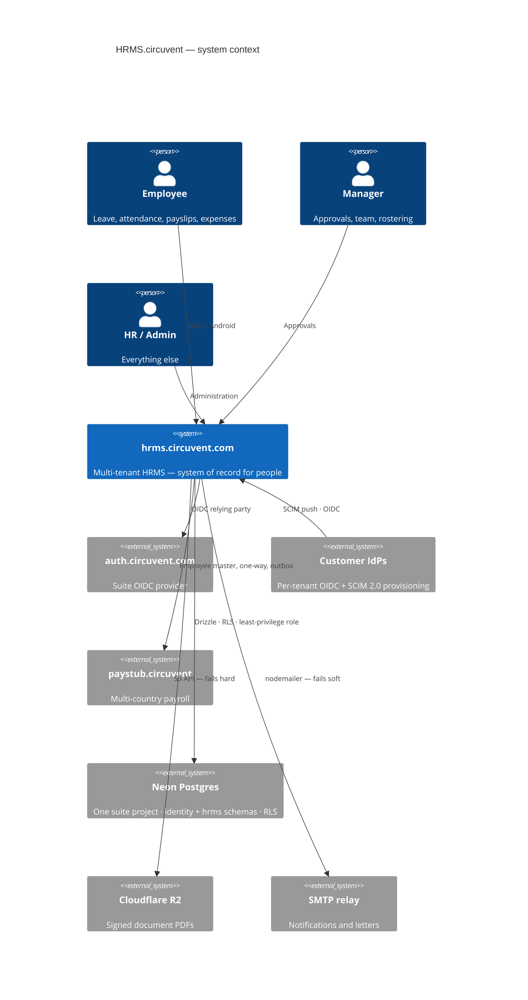

### Module map

```
   src/
     middleware.ts        THE GATE. Overwrites x-user-id / x-org-id / x-user-role.
     lib/
       auth/              session · tokens · password (Argon2id) · mfa · webauthn
       crypto/            AES-256-GCM field encryption
       rbac.ts            ~90 permissions across 4 roles (+ `owner` above them)
       api-context.ts     session principal  -> role
       api-v1-context.ts  API-key principal  -> scopes
       ── ~40 PURE rule modules ──
       statutory-india.ts   PF · ESI · PT · TDS · gratuity      bigint, dated config
       compensation.ts      bands · compa-ratio · vesting        bigint
       settlement.ts        full & final                         bigint
       rostering.ts         shifts · constraints · swaps         pure
       workflow/engine.ts   one approval engine for everything   pure
       reporting/builder.ts allow-listed report compiler         pure
       governance.ts        retention · erasure — PLANS only     pure
       sla.ts  assets.ts  benefits-rules.ts  learning-rules.ts
       performance.ts  ats.ts  offer-rules.ts  lifecycle-rules.ts
       document-rules.ts  custom-fields.ts  intelligence/  ...
       ── impure shells ──
       *-client.ts        browser fetch wrappers
       paystub-client.ts  + paystub-sync-outbox.ts
       notifications/     engine (decide) → notify (write) → transport (deliver)
     db/
       schema/            Drizzle definitions — hrms.ts is 1,440 lines
       repositories/      *.neon.ts — the only code that queries
     app/
       (dashboard)/       102 pages
       api/               150 route handlers
   android/               Kotlin Multiplatform — SHIPPED v1.8.0
   mobile/                Expo — ABANDONED precursor, same package id
   scripts/               9 verification scripts + ~25 operational tools
```

---

## 5. The security model

```
   ┌──────────────────────────────────────────────────────────────────────┐
   │  LAYER 1 — FOUR SIGN-IN PATHS, ONE SESSION                           │
   │    local Argon2id · suite OIDC · per-tenant customer OIDC · passkeys │
   │    all converge on one HS256 token: sub · orgId · role · email       │
   │    cv_access 15 min · cv_refresh 30 d, SHA-256 hashed, single-use,   │
   │    rotated on every use, with FAMILY REVOCATION on reuse             │
   ├──────────────────────────────────────────────────────────────────────┤
   │  LAYER 2 — THE GATE                                                  │
   │    middleware.ts verifies signature/exp/iss/aud with no DB call,     │
   │    then ALWAYS OVERWRITES x-user-id, x-org-id and x-user-role.       │
   │    Client-supplied values are discarded. 36 assertions cover this.   │
   ├──────────────────────────────────────────────────────────────────────┤
   │  LAYER 3 — AUTHORIZATION                                             │
   │    ~90 dot-notation permissions · 4 roles in rbac.ts                 │
   │    + `owner` as a de facto super-role at the API layer               │
   │    canAccessModule() FAILS CLOSED on an unmapped module              │
   ├──────────────────────────────────────────────────────────────────────┤
   │  LAYER 4 — TENANCY                                                   │
   │    orgId is derived from the VERIFIED TOKEN, never from the request  │
   │    — with exactly one exception, and it is a finding (§8)            │
   │    plus Postgres RLS, plus per-app least-privilege database roles    │
   ├──────────────────────────────────────────────────────────────────────┤
   │  LAYER 5 — DATA AT REST                                              │
   │    AES-256-GCM field encryption (PAN, UAN, MFA secrets, …)           │
   │    ⚠ bank_details is jsonb and is NOT encrypted — masked on read     │
   └──────────────────────────────────────────────────────────────────────┘
```

### MFA, done carefully

```
   3-state machine:  off → pending → active

   • The secret is minted and stored ENCRYPTED at `pending`.
   • Backup codes are issued ONLY after a live code proves the secret works.
     Codes are never handed out for a secret not yet verified.
   • `pending` is deliberately NOT enforced at sign-in — anti-lockout, and it
     grants no elevated trust either.
   • Disabling MFA requires the current password AND a live TOTP code.
     A stolen session cookie alone cannot turn the control off.
   • Enrol/confirm/disable are rate limited 10/min per user, explicitly so a
     six-digit code over a 90-second window cannot become a brute-force
     surface that bypasses the sign-in lockout.

   VERIFIED: both sign-in paths — password and SSO/passkey — independently
   call mfaRequiredAtSignIn(). There is NO bypass.

   ⚠ The trade is fail-closed: an MFA-enabled user currently cannot complete
     SSO or passkey login at all, because neither accepts a TOTP parameter.
     An availability gap, not a security gap. Doc 05, D-09.
```

---

## 6. Core workflows

### 6.1 A request, end to end

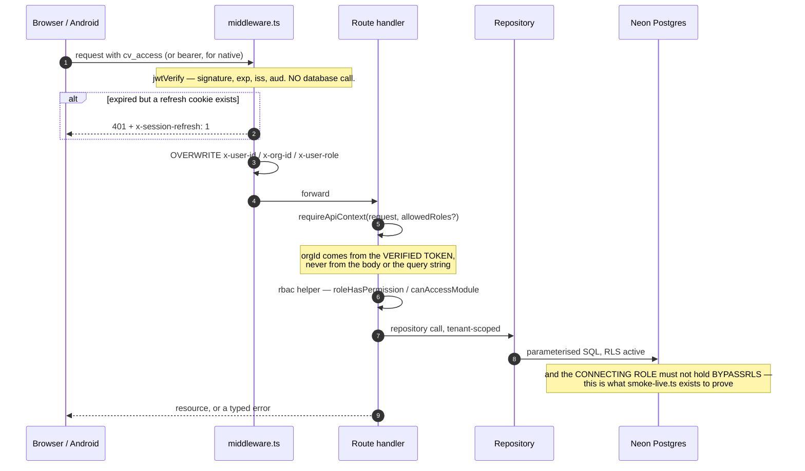

### 6.2 The approval engine

One configurable engine (`workflow/engine.ts`, pure, 493 lines with a 495-line test) serves leave, expense, travel, loan and offboarding approvals — rather than each module hard-coding its own routing. `startWorkflow`, `advanceWorkflow`, `resolveApprovers`, `findBreaches`.

### 6.3 Cross-application sync uses a transactional outbox

```
   Employee changes in HRMS
        │
        ├─ row written to paystub_sync_outbox IN THE SAME TRANSACTION
        │
        └─ HTTP POST to paystub.circuvent/api/sync/employees
             X-Service-Token: <CROSS_APP_SYNC_TOKEN>
             exponential backoff, capped around 17 hours
             drained by /api/cron

   The same pattern appears three more times:
     document-pdf-outbox · directory-group-outbox · outbox-sweep

   PAN is decrypted immediately before transmission. Department and location
   cross as CODE + NAME strings, never internal UUIDs, because Paystub owns
   its own independent tables.
```

---

## 7. Money — mostly right, with one honest seam

```
   ✅  src/lib/money/minor.ts

       /** A whole number of paise, as a decimal string. Never a float. */
       export type MinorUnits = string;

       Header rationale, verbatim:
         "the comment on the type said the result must never be summed or
          compared for equality on the client. That is a rule a type cannot
          enforce and a reviewer has to remember, and it was already being
          broken: the payroll dashboard adds every payslip's net pay together
          to render the headline Net Payroll figure."

   ✅  bigint throughout: statutory-india.ts · compensation.ts · assets.ts ·
       expense-rules.ts · settlement.ts

   🔴  src/lib/payroll-engine.ts is entirely `number`-based.
       580 lines of Math.round on plain floats. It is LEGACY: five of its
       seven major functions have zero callers anywhere in src/.

   🔴  But two of them are still wired into the real pipeline, through a
       currency-unsafe seam in payroll.neon.ts:

         const professionalTax =
           BigInt(Math.round(calculateProfessionalTax(minorToMajor(gross)) * 100));

       bigint → minorToMajor() → float math → BigInt(Math.round(x*100))

       minorToMajor() is money/minor.ts's own DISPLAY-ONLY helper, whose
       doc comment warns it "must never be summed or compared for equality."
```

Doc 05, D-03. Values are rounded back to whole paise, so this is not demonstrably producing a wrong figure today — but it is a direct violation of the codebase's own stated invariant, in the one place money is actually computed.

**And gratuity exists three times:** the correct bigint, Act-compliant version in `statutory-india.ts` (used by `settlement.ts`), plus two naive float duplicates in `payroll-engine.ts` and `hr-utils.ts` with no part-year rounding and no death/disablement waiver. Both duplicates have zero callers — but both are still exported.

> The codebase already fixed this exact problem once, for income tax, and wrote it down: *"There were three implementations of the Indian slabs in this codebase — payroll's old regime, the tax page's own inline copy, and the real one — and three copies of a slab table is three different answers to 'what is my tax', of which at most one is right."* Gratuity is the same story, not yet finished.

---

## 8. Design patterns actually in use

| Pattern | Where | Note |
| --- | --- | --- |
| **Pure core / impure shell** | ~40 rule modules vs `*-client.ts` and `*.neon.ts` | nearly every module header states this in its own words |
| **Decide → write → deliver** | `notifications/engine` → `notify` → `transport`; `document-notify` → `document-dispatch` | |
| **State machines as allow-list data** | `lifecycle-rules`, `referral-rules`, `assets`, `expense-rules` | `Record<State, State[]>`, not `if` chains |
| **Return every violation, not the first** | `rostering`, `offer-rules`, `custom-fields`, `assets` | *"a form filled in once should not need five round trips"* |
| **Config as a dated parameter** | `statutory-india.ts`'s `PfConfig`, `EsiConfig` | *"a payroll run for March 2025 must still compute with March 2025's rates"* |
| **Plan, then execute** | `governance.ts` returns an erasure *plan*; locked-month attendance corrections route to arrears rather than mutating a paid month | irreversibility safeguards |
| **Allow-list, not escaping** | `reporting/builder.ts` — every field must exist in a fixed catalogue; values always bound | SQL-injection-safe by construction |
| **Transactional outbox** | 4 separate outboxes + a sweeper | cross-system reliability |
| **Self-documented regression history** | `expense-rules`, `leave-provisioning`, `income-tax-declaration`, `assistant`, `money/minor`, `catalog` | each opens by naming the specific bug it prevents |

**Two patterns worth calling out as unusually good:**

- **`assistant.ts` refuses to invent.** It replaced a chatbot that fabricated answers — a hardcoded *"Casual Leave: 6 remaining"*, a fake performance rating. The new rule: never state a fact about a person that has not been fetched. Only two answer kinds are allowed — `fetched` (real API data, sourced) or `navigation` (a link, no figures). Anything else returns an honest *"I cannot see that."*
- **`ap-holidays.ts` refuses to guess.** It categorises each holiday by how its date is *known* — Gregorian-fixed, solar, or lunisolar/Islamic — and deliberately does not compute the third category, because those dates require confirmation rather than arithmetic.

---

## 9. Where reality diverges from the documentation

```
   docs/PLATFORM-ARCHITECTURE.md  — "Status: Phase 0 — Plan", describes HRMS
                                    as FIRESTORE-backed, 52k LOC, "zero
                                    automated tests"
   docs/DEPLOYMENT.md             — "No Neon project exists yet", "No Vercel
                                    project exists yet", "main has not been
                                    created"
   docs/PLAY-STORE.md             — describes the Expo app as never run on a
                                    device

   ACTUAL REALITY
   ──────────────
   Postgres + Drizzle. ~144,000 lines. 92 test files, 2,664 passing tests.
   A `main` branch with a shipped "Release 1.8.0" commit.
   A live cron entry in vercel.json.
   A signed, tested Kotlin Android app at versionCode 10.

   A new engineer reading docs/ first would misunderstand the entire system.
   docs/ROADMAP.md (96 KB) and README.md are the accurate ones.
```

Doc 05, D-06.

---

## 10. Health assessment

```
   Verification discipline  ████████████████████░  9/10  9 guard scripts, real CI
   Test coverage            ██████████████████░░░  8/10  2,664 tests, 92 files
   Code hygiene             ██████████████████░░░  8/10  0 TODO/ts-ignore/disable
   Domain rigour            ██████████████████░░░  8/10  pure modules, dated config
   Auth & session design    ██████████████████░░░  8/10  4 paths, family revocation
   Tenancy enforcement      ████████████████░░░░░  7/10  token-derived, one exception
   ─────────────────────────────────────────────────
   Money consistency        ████████████░░░░░░░░░  6/10  🔴 one float seam, 3 gratuities
   CI completeness          ████████████░░░░░░░░░  6/10  9 of 12 checks; misses 3
   Documentation accuracy   ████████░░░░░░░░░░░░░  4/10  🔴 two docs wholesale obsolete
   Dead code                ████████░░░░░░░░░░░░░  4/10  ~1,583 lines never imported
   Rule-source singularity  ██████░░░░░░░░░░░░░░░  3/10  🔴 rules exist in 3 codebases
   Response headers         ████░░░░░░░░░░░░░░░░░  2/10  🔴 no security headers at all
```

**What is genuinely excellent:** nine verification scripts that check things a test suite structurally cannot; Argon2id with auto-rehash; refresh-token family revocation; MFA that will not issue backup codes for an unproven secret; `orgId` derived from the token everywhere but one route; a single approval engine; an allow-list report compiler; and a documentation convention where modules name the bug they exist to prevent.

**What needs attention:** the float seam in the payroll pipeline, three parallel implementations of the same business rules (web TypeScript, Expo TypeScript, Kotlin), two architecture documents that describe a system that no longer exists, `bank_details` stored unencrypted, and `next.config.ts` with no security headers whatsoever.

---

## 11. Where to start reading

```
   1. README.md                        the accurate one
   2. docs/ROADMAP.md                  96 KB, and the real history
   3. .github/workflows/verify.yml     what actually gates a merge
   4. scripts/smoke-live.ts            read the header. Twice.
   5. src/middleware.ts                the gate, plus its 36-assertion test
   6. src/lib/rbac.ts                  ~90 permissions, 4 roles
   7. src/lib/money/minor.ts           and then payroll-engine.ts, for contrast
   8. src/lib/statutory-india.ts       670 lines, the most rigorous module here
   9. src/db/schema/hrms.ts            1,440 lines
```

---

*Next: **02_DATABASE_AND_DATA_MODELS.md** · **03_INTEGRATIONS_AND_ECOSYSTEM.md** · **04_MAINTENANCE_AND_OPERATIONS.md** · **05_AREAS_OF_ENHANCEMENT.md***


---


<a id="part-2-database-data-models"></a>


# Part 2 · Database & Data Models

> **Audience:** engineers and DBAs. §1–§3 are the map; §4–§6 are the enforcement machinery; §8 is the debt.
> **Engine:** Neon Postgres · Drizzle ORM 0.45 · drizzle-kit 0.31 · **two drivers, deliberately**

---

## 1. Shape of the database

```
   ╔══════════════════════════════════════════════════════════════════════╗
   ║  117 PHYSICAL TABLES · 44 ENUM TYPES · 2 SCHEMAS                     ║
   ╠══════════════════════════════════════════════════════════════════════╣
   ║                                                                      ║
   ║   116 defined in Drizzle TypeScript  (src/db/schema/*.ts, 13 files)  ║
   ║   + 1 that exists ONLY as raw SQL    (hrms.doc_store, in 0023)       ║
   ║   ────────────────────────────────                                   ║
   ║   = 117 tables                                                       ║
   ║                                                                      ║
   ║   schema `identity`  20 tables   cross-app: orgs, users, sessions,   ║
   ║                                  SSO, SCIM, API keys, audit log      ║
   ║   schema `hrms`      97 tables   every HR domain + doc_store         ║
   ║                                                                      ║
   ║   116 of 117 carry org_id. The one exception is `organizations`      ║
   ║   itself — it IS the tenant.                                         ║
   ╚══════════════════════════════════════════════════════════════════════╝
```

### The conventions, stated once

Every table follows these, so they are omitted from the tables below:

| Convention | Definition |
| --- | --- |
| Primary key | `id uuid PRIMARY KEY DEFAULT gen_random_uuid()` |
| Tenant key | `org_id uuid NOT NULL REFERENCES identity.organizations(id) ON DELETE CASCADE` |
| Timestamps | `created_at timestamptz DEFAULT now()` on most tables |
| Money | `*_minor bigint` — a whole number of paise. **Never `numeric`, never `float`.** |
| Deletes | `CASCADE` or `SET NULL`, with exactly **three** `RESTRICT` exceptions (§7) |

### Domains by table count

```
   Employees & org structure   ████████        8
   Attendance & shifts         ████████████   12
   Identity / auth / SSO       ████████████   12 + organizations
   Performance                 ██████████     10
   Recruitment (own ATS)       █████████       9
   Helpdesk                    ███████         7
   Compensation                ██████          6
   Benefits                    ██████          6
   Governance / privacy        ██████          6
   Assets                      █████           5
   Loans & IT declarations     █████           5
   Leave                       ████            4
   Referrals                   ████            4
   Learning                    ████            4
   Documents & e-signature     ████            4
   Workflow / announcements    ████            4
   Custom fields               ███             3
   Payroll                     ███             3
   Expenses                    █               1
   Integrations                █               1
   doc_store (raw SQL)         █               1
```

---

## 2. Entity relationship — the core spine

```mermaid
erDiagram
    ORGANIZATIONS ||--o{ USERS : "employs"
    ORGANIZATIONS ||--|| SUBSCRIPTIONS : "has one"
    ORGANIZATIONS ||--o{ EVERYTHING_ELSE : "org_id on 116 tables"

    USERS ||--o{ USER_ROLES : "per-app role"
    USERS ||--o{ SESSIONS : "refresh chain"
    USERS ||--o{ WEBAUTHN_CREDENTIALS : "passkeys"
    USERS ||--o| EMPLOYEES : "may be"

    EMPLOYEES ||--o{ ATTENDANCE_RECORDS : "one per work day"
    EMPLOYEES ||--o{ LEAVE_REQUESTS : "applies"
    EMPLOYEES ||--o{ LEAVE_BALANCES : "per year, per type"
    EMPLOYEES ||--o{ SALARY_STRUCTURES : "dated"
    EMPLOYEES ||--o{ PAYROLL_RECORDS : "one per run"
    EMPLOYEES ||--o{ EXPENSE_CLAIMS : "submits"
    EMPLOYEES ||--o{ ASSET_ASSIGNMENTS : "holds"
    EMPLOYEES ||--o{ LIFECYCLE_JOURNEYS : "onboard/offboard"
    EMPLOYEES ||--o{ PAYSTUB_SYNC_OUTBOX : "queued push"

    DEPARTMENTS ||--o{ EMPLOYEES : "belongs to"
    LOCATIONS ||--o{ EMPLOYEES : "sits at"

    PAYROLL_RUNS ||--o{ PAYROLL_RECORDS : "one per employee"

    JOB_POSTINGS ||--o{ APPLICATIONS : "receives"
    CANDIDATES ||--o{ APPLICATIONS : "submits"
    APPLICATIONS ||--o{ INTERVIEWS : "schedules"
    APPLICATIONS ||--o{ INTERVIEW_SCORECARDS : "collects"
    APPLICATIONS ||--o{ OFFERS : "versioned"

    ROSTERS ||--o{ ROSTER_ASSIGNMENTS : "publishes"
    SHIFT_PATTERNS ||--o{ ROSTER_ASSIGNMENTS : "RESTRICT"
    ROSTER_ASSIGNMENTS ||--o{ SHIFT_SWAP_REQUESTS : "may be swapped"

    GENERATED_DOCUMENTS ||--o{ DOCUMENT_SIGNATURES : "sequenced"
    GENERATED_DOCUMENTS ||--o{ DOCUMENT_PDF_OUTBOX : "archival queue"

    REVIEW_CYCLES ||--o{ PERFORMANCE_REVIEWS : "contains"
    FEEDBACK_REQUESTS ||--|| FEEDBACK_RESPONSES : "1:1, split on purpose"
```

> **Why `FEEDBACK_REQUESTS` and `FEEDBACK_RESPONSES` are two tables in a strict 1:1.** They are split so that aggregating 360° feedback never has to touch the respondent's identity. The request holds *who was asked*; the response holds *what was said*. An anonymised roll-up reads only the second table.

---

## 3. Table inventory, by domain

> Only non-obvious columns, foreign keys, uniques and indexes are listed. `casc` = `ON DELETE CASCADE`, `set0` = `SET NULL`, `big` = `bigint`, `j` = `jsonb`, `t` = `text`, `d` = `date`, `ts` = `timestamptz`, `u` = `uuid`.

### 3.1 `identity` — tenancy, auth, federation (20 tables)

| Table | Notable columns | FK → | Unique | Index |
| --- | --- | --- | --- | --- |
| `organizations` | `slug`, `plan`, `features` j, `settings` j, `deleted_at` | *(none — this is the tenant)* | `slug` | — |
| `users` | `email`, `password_hash`, `legacy_firebase_uid`, **`mfa_secret` (encrypted)**, `mfa_backup_codes` j, `status` | — | `email` **globally**, `legacy_firebase_uid` | `org_id`, `(org_id,status)` |
| `user_roles` | `app` enum, `role` enum, `extra_permissions` j | `user_id`→users casc | `(user_id,app)` | `(org_id,app)` |
| `sessions` | `refresh_token_hash`, **`rotated_to_id`**, `ip_address` inet, `expires_at` | `user_id`→users casc | `refresh_token_hash` | `user_id`, `expires_at` |
| `auth_tokens` | `email`, `purpose` enum, `token_hash` | users casc·null, orgs casc·null | `token_hash` | `(email,purpose)` |
| `api_keys` | `key_prefix`, `key_hash`, `scopes` j, `rate_limit_per_minute` | — | `key_hash` | `org_id` |
| `subscriptions` | `plan`, `status`, `max_employees`, `current_employees` | — | `org_id` (1:1) | — |
| `audit_log` | `actor_id`, `app`, `action`, `before`/`after` j, **`previous_hash`, `hash`** | — | — | `(org_id,created_at)`, `(entity_type,entity_id)`, `actor_id` |
| `webauthn_credentials` | `credential_id`, `public_key`, `sign_count` | `user_id`→users casc | `credential_id` **globally** | `user_id` |
| `sso_connections` | `protocol` enum, **`client_secret` (encrypted)**, `domains` j | — | — | `(org_id,is_active)` |
| `sso_auth_states` | `state`, `nonce`, `code_verifier`, `expires_at` | `connection_id` casc | `state` | `expires_at` |
| `sso_identities` | `subject`, `email_at_link` | users casc, connections casc | `(connection_id,subject)` | `user_id` |
| `scim_tokens` | `token_hash`, `token_prefix`, `revoked_at` | — | `token_hash` | `org_id` |
| `scim_sync_log` | `operation`, `payload` j, `status_code` | tokens set0, users set0 | — | `(org_id,received_at)`, `(org_id,external_id)` |

### 3.2 Employees and org structure (8 tables)

| Table | Notable columns | FK → | Unique | Index |
| --- | --- | --- | --- | --- |
| `locations` | `code`, `lat`/`long` num(10,7), `geofence_radius_meters` | — | `(org_id,code)` | — |
| `departments` | `code`, `head_id` u **(no FK)**, `parent_id` u **(no FK, self-ref)**, `budget_minor` big | — | `(org_id,code)` | `org_id` |
| **`employees`** | `employee_code`, `work_email`, `reporting_to_id` u **(no FK — "deferred FK in migration")**, **`bank_details` j (PLAINTEXT)**, `pan_number`, `aadhaar_number`, `uan_number`, `pf_number`, `esi_number` | users set0, departments set0, locations set0 | `(org_id,employee_code)`, `(org_id,work_email)`, `user_id` | `(org_id,status)`, `(org_id,department_id)`, `reporting_to_id` |
| `employee_documents` | `blob_url`, `is_verified` | employees casc | — | `employee_id` |
| `paystub_employee_sync_outbox` | `status`, `attempt_count`, `next_attempt_at` | employees casc | `(org_id,employee_id)` | `(status,next_attempt_at)` |
| `directory_group_join_outbox` | `group_address`, `member_email` | employees casc | `(org_id,employee_id,group_address)` | `(status,next_attempt_at)` |
| `lifecycle_journeys` | `kind` enum, `anchor_date` | employees casc | `(employee_id,kind)` | `(org_id,status)` |
| `lifecycle_tasks` | `task_key`, `mandatory`, `due_offset_days` | journeys casc | `(journey_id,task_key)` | `journey_id`, `(org_id,completed)` |

### 3.3 Attendance and scheduling (12 tables)

| Table | Notable columns | FK → | Unique | Index |
| --- | --- | --- | --- | --- |
| `shifts` | `code`, `start_time`/`end_time`, `weekly_off_days` j | — | `(org_id,code)` | — |
| `attendance_records` | `work_date`, `status`, `clock_in_method`/`out_method`, `is_within_geofence`, **`requires_location_review`**, `location_signals` j | employees casc, shifts set0 | `(employee_id,work_date)` | `(org_id,work_date)`, `(org_id,status,work_date)`, **partial idx on `requires_location_review`** |
| `attendance_regularisations` | `attendance_date`, `reason`, `routing`, `has_proof` | employees casc, decided_by set0 | — | `(employee_id,attendance_date)`, `(org_id,status)` |
| `work_arrangement_requests` | `kind` (wfh / on_duty), `start_date`/`end_date` | employees casc | — | `(employee_id,start_date)` |
| `shift_patterns` | `code`, **`crosses_midnight`**, `pay_multiplier` num(5,3) | departments set0, locations set0 | `(org_id,code)` | `(org_id,is_active)` |
| `shift_eligibility` | `valid_from`/`valid_until` | employees casc, patterns casc | `(employee_id,pattern_id)` | `org_id` |
| `availability` | `kind` enum, `start_date`/`end_date` | employees casc | — | `(org_id,start_date,end_date)` |
| `rosters` | `status`, **`constraints_snapshot` j**, `accepted_warnings` j | departments set0, locations set0 | — | `(org_id,period_start,period_end)` |
| `roster_assignments` | `shift_date`, `starts_at`/`ends_at`, `status` | rosters casc, employees casc, **patterns RESTRICT** | — | `roster_id`, `(employee_id,shift_date)` |
| `shift_swap_requests` | `status`, `expires_at` | assignments casc, employees casc | — | `(org_id,status)`, `assignment_id` |
| `open_shifts` | `shift_date`, `headcount_needed` | rosters casc, patterns casc | — | `(org_id,shift_date)` |
| `coverage_requirements` | `weekday`, `headcount` | patterns casc, departments casc, locations casc | — | `(org_id,pattern_id)` |

> `rosters.constraints_snapshot` stores the rules **as they were when the roster was published**. A later policy change cannot retroactively make a published roster non-compliant.

### 3.4 Leave (4 tables)

| Table | Notable columns | FK → | Unique |
| --- | --- | --- | --- |
| `leave_policies` | `leave_type` enum, `annual_quota_days` num | — | `(org_id,leave_type)` |
| `leave_requests` | `leave_type`, `status`, `start_date`/`end_date` | employees casc | — |
| `leave_balances` | `year`, `leave_type`, `opening_days` / **`accrued_days`** / `used_days` | employees casc | `(employee_id,year,leave_type)` |
| `holidays` | `holiday_date`, `year`, `is_optional` | locations casc | — |

> ⚠️ **`accrued_days` is always 0.** Provisioning is annual-upfront, and the monthly accrual job that would populate this column *does not exist yet*. The column is present, correct and unused. Doc 05, D-07.
>
> ⚠️ The `leave_type` enum has **11 values**; only **9** have a seeded default policy. `wfh` and `study` have none.

### 3.5 Payroll, loans, tax (8 tables)

| Table | Notable columns | Unique |
| --- | --- | --- |
| `salary_structures` | `effective_from`/`to`, `ctc_minor`, `basic_minor`, `hra_minor` … 9 bigint columns | — |
| `payroll_runs` | `period_month`/`year`, `run_type`, `status`, `processed_by_id`, **`approved_by_id`** | `(org_id,period_year,period_month,run_type)` |
| `payroll_records` | `working_days`/`present_days`/`lop_days`, **~20 bigint earning + deduction columns**, `net_pay_minor`, `anomalies` j | `(run_id,employee_id)` |
| `employee_loans` | `principal_minor`, `interest_rate_percent` | — |
| `loan_repayments` | `period_month`/`year`, `amount_minor` | `(loan_id,period_year,period_month)` |
| `loan_benchmark_rates` | `financial_year`, `loan_type`, `rate_percent` | `(org_id,financial_year,loan_type)` |
| `it_declarations` | `financial_year`, `regime`, `rent_paid_minor` | `(employee_id,financial_year)` |
| `it_declaration_items` | `section`, `declared_minor`, `verified_minor` | `(declaration_id,section)` |

> `payroll_runs` carries `processed_by_id` **and** `approved_by_id` — the schema shape for maker-checker. `loan_benchmark_rates` is keyed by financial year for the same reason `PfConfig` is a dated parameter: a run for FY2024 must compute with FY2024's rates.

### 3.6 Compensation (6 tables)

`salary_bands` (grade × location, min/mid/max minor) · `compensation_cycles` (status, **`merit_matrix` j**, `prorate_new_joiners`) · `budget_pools` (`allocated_minor`, `committed_minor`) · `compensation_recommendations` (`compa_ratio`, `system_percent` → `proposed_percent` → `final_percent`, **`override_reason`**) · `equity_grants` (`total_units`, `vesting_months`, `exercised_units`) · `salary_history` (**insert-only**).

> The three-percent progression on `compensation_recommendations` is the audit trail: what the *system* suggested, what the *manager* proposed, what *calibration* settled on — with a mandatory reason when a human overrides the model.

### 3.7 Recruitment — HRMS's own ATS module (9 tables)

`job_postings` · `candidates` · `applications` (`tracking_token` unique, `match_score`) · `interviews` (`panelist_ids` j) · `pipeline_stages` · `application_events` (insert-only) · **`interview_scorecards`** · **`offers`** (versioned, `supersedes_offer_id` with no FK) · `application_sources`.

> `interview_scorecards.submitted_at` **gates visibility**: an interviewer cannot see other panellists' scores until their own is submitted. That is anchoring bias prevented in the data model rather than in a UI rule.
>
> This is *not* `ATS.circuvent` — it is a separate, internal recruitment module inside HRMS. See doc 03.

### 3.8 Referrals (4 tables)

`referrals` · `referral_policies` (`instalments` j) · `referral_events` (insert-only) · **`referral_invites`**.

```
   ╔══════════════════════════════════════════════════════════════════════╗
   ║  referral_invites — documented in-code as:                           ║
   ║                                                                      ║
   ║  "the only table in the schema that grants an unauthenticated        ║
   ║   write into a tenant's data"                                        ║
   ║                                                                      ║
   ║  The mailed token IS the entire authority. Only its SHA-256 is       ║
   ║  stored — never the token. Plus expires_at, revoked_at,              ║
   ║  submitted_at and consent_given_at.                                  ║
   ║                                                                      ║
   ║  This is the single highest-scrutiny table in the database.          ║
   ╚══════════════════════════════════════════════════════════════════════╝
```

### 3.9 Performance (10 tables)

`review_cycles` · `performance_goals` (self-referencing `parent_goal_id`, no FK) · `performance_reviews` · `competencies` (`behavioural_anchors` j) · `competency_ratings` · `feedback_requests` · `feedback_responses` · `calibration_sessions` (`distribution_target` j, a snapshot) · **`calibration_adjustments`** (insert-only, `rating_before`/`after`, **`justification` NOT NULL**) · `check_ins` (`private_notes`, `mood_rating`).

> A calibration cannot silently change a rating: the adjustment row is insert-only and the justification column is `NOT NULL`.
>
> ⚠️ `competency_ratings.review_id` and `calibration_adjustments.review_id` are plain `uuid`, **not foreign keys** to `performance_reviews` — most likely cross-file circular-import avoidance, but undocumented as deliberate, unlike `custom_field_values.entity_id` which is. Doc 05, D-13.

### 3.10 Learning, benefits, documents (14 tables)

`courses` / `course_modules` / `course_enrolments` (`expires_on` drives recertification) / `certifications` · `benefit_plans` / `enrolment_windows` / `benefit_enrolments` (**plan FK is `RESTRICT`**) / `dependants` / `enrolment_dependants` / `benefit_claims` · `document_templates` (`required_tokens` j) / `generated_documents` (`content_hash` sha-256) / `document_signatures` (`access_token_hash`, `signed_content_hash`, sequenced) / `document_pdf_storage_outbox`.

> Signing captures **`signed_content_hash`** — proof of *what* was signed, not merely *that* something was. Change the document afterwards and the hashes diverge.

### 3.11 Helpdesk, assets, expenses, workflow (17 tables)

`sla_policies` / `ticket_categories` (**`is_confidential`, `confidential_to_roles`**) / `tickets` / **`ticket_pauses`** / `ticket_comments` (`is_internal`) / `ticket_events` / `knowledge_articles` (`deflection_count`) · `asset_categories` / `assets` / `asset_assignments` (**`book_value_on_issue_minor`**) / `asset_maintenance` / `asset_events` · `expense_claims` · `workflow_definitions` / **`workflow_instances`** (polymorphic `entity_type` + `entity_id`, definition FK is `RESTRICT`) / `announcements` / `notifications`.

> `ticket_pauses` exists so SLA clocks stop while a ticket waits on the requester. Without it, "pending requester" time would count against the team's resolution target.

### 3.12 Governance and privacy (6 tables)

`retention_policies` (`anchor` enum, `method` enum, **`basis`**) · `legal_holds` (blanket when `entity_id` is null) · `data_subject_requests` (`plan` j, `outcome` j, **`refused_areas` j**, `due_on`) · `erasure_log` (insert-only) · `consent_records` (append-only — `granted_at` and `withdrawn_at`, never an update) · `processing_activities` (`lawful_basis`, `transfers` j).

> A GDPR-shaped design throughout: consent is *appended*, never mutated, so the history of what a person agreed to and when is reconstructible; and a DSAR can be **partially refused** with the refused areas recorded, which is what the regulation actually contemplates.

### 3.13 Custom fields, integrations, doc_store (5 tables)

| Table | Note |
| --- | --- |
| `custom_field_definitions` | `entity_type` + `key`, `data_type` enum (11 kinds), `is_pii` |
| `custom_field_values` | `entity_id` is **deliberately not a FK** — documented polymorphic gap; orphans cleaned by the entity's own delete path. `is_unique` is **trigger-maintained** — the schema comment says *"never write from application code."* |
| `custom_field_audit` | before / after |
| `integrations` | `kind` CHECK-constrained to slack / teams / generic webhook, `endpoint_url`, `secret_encrypted` |
| **`hrms.doc_store`** | See below |

```
   hrms.doc_store — the only table with no TypeScript definition
   ──────────────────────────────────────────────────────────────
     org_id  ·  collection text  ·  data jsonb  ·  deleted_at

     GIN (data jsonb_path_ops)
     partial (org_id, collection, created_at DESC) WHERE deleted_at IS NULL

   A deliberate schemaless catch-all for ~20 legacy Firestore collections
   — kudos, wellness, badges, celebrations, visitors, grievances — that
   "have no relational table and never will."

   It is read and written purely through raw `sql` tagged templates,
   OUTSIDE Drizzle's type-checked query builder.

   Its own migration header records that it was originally numbered 0012
   and was found MISSING FROM THE JOURNAL — the exact defect that is still
   live today for two other migrations (§5).
```

---

## 4. Multi-tenancy: row-level security, for real

This is the most rigorous part of the codebase. It is also the part that once failed completely.

### 4.1 The mechanism

```sql
CREATE OR REPLACE FUNCTION app_current_org() RETURNS uuid
LANGUAGE sql STABLE AS $$
  SELECT NULLIF(current_setting('app.org_id', true), '')::uuid
$$;

CREATE OR REPLACE FUNCTION app_is_superuser() RETURNS boolean
LANGUAGE sql STABLE AS $$
  SELECT COALESCE(current_setting('app.superuser', true), 'off') = 'on'
$$;
```

Rather than repeat a policy 117 times, migration `0003` defines a **sweeping function** that is then called by **17 later migrations**:

```sql
CREATE OR REPLACE FUNCTION apply_tenant_rls(
  target_schemas text[] DEFAULT ARRAY['identity','hrms']
) RETURNS int LANGUAGE plpgsql AS $$
DECLARE target record; applied int := 0;
BEGIN
  FOR target IN
    SELECT c.table_schema, c.table_name FROM information_schema.columns c
    JOIN information_schema.tables t
      ON t.table_schema = c.table_schema AND t.table_name = c.table_name
     AND t.table_type = 'BASE TABLE'
    WHERE c.column_name = 'org_id' AND c.table_schema = ANY(target_schemas)
  LOOP
    EXECUTE format('ALTER TABLE %I.%I ENABLE ROW LEVEL SECURITY', ...);
    EXECUTE format('ALTER TABLE %I.%I FORCE  ROW LEVEL SECURITY', ...);
    EXECUTE format('DROP POLICY IF EXISTS tenant_isolation ON %I.%I', ...);
    EXECUTE format(
      'CREATE POLICY tenant_isolation ON %I.%I'
      ' USING      (app_is_superuser() OR org_id = app_current_org())'
      ' WITH CHECK (app_is_superuser() OR org_id = app_current_org())', ...);
    EXECUTE format('GRANT SELECT, INSERT, UPDATE, DELETE ON %I.%I TO hrms_app', ...);
    applied := applied + 1;
  END LOOP;
  RETURN applied;
END $$;
```

**`FORCE ROW LEVEL SECURITY` is deliberate.** Plain `ENABLE` exempts the table *owner*. `FORCE` binds the owner too — the stated reason: *"a mistake in a migration script must not be able to read across tenants either."*

**Live-verified: 117 `tenant_isolation` policies exist.**

### 4.2 There is no `WHERE org_id = ?` convention

```
   ┌────────────────────────────────────────────────────────────────────┐
   │  Application code NEVER writes a tenant filter.                    │
   │  There is exactly one sanctioned entry point:                      │
   │                                                                    │
   │      withTenant(ctx, async (tx) => { ... })                        │
   │                                                                    │
   │  which requires ctx.orgId (unless superuser), opens a transaction, │
   │  and sets three GUCs:                                              │
   │                                                                    │
   │      set_config('app.org_id',    ctx.orgId,  true)                 │
   │      set_config('app.user_id',   ctx.userId, true)                 │
   │      set_config('app.superuser', 'on'|'off', true)                 │
   │                       ────────────────────────┘                    │
   │                       the `true` is SET LOCAL semantics:           │
   │                       TRANSACTION-SCOPED, reverts on commit        │
   │                                                                    │
   │  Isolation is delegated entirely to Postgres. Application code     │
   │  CANNOT forget it — it can only bypass withTenant() entirely.      │
   └────────────────────────────────────────────────────────────────────┘
```

Because the GUC is `SET LOCAL`, it reverts **before the physical connection returns to the pool**. A later request borrowing the same `pg.Pool` connection cannot inherit the previous tenant's `org_id`. This is the correct design.

And the failure mode of *forgetting* `withTenant()` is fail-closed, not a leak: `app_current_org()` returns `NULL`, and `org_id = NULL` is `NULL`/false — the query returns **zero rows**, a visible bug rather than a silent cross-tenant read.

### 4.3 The incident

```
   ╔══════════════════════════════════════════════════════════════════════╗
   ║  WHAT ACTUALLY HAPPENED — documented in src/db/client.ts             ║
   ╠══════════════════════════════════════════════════════════════════════╣
   ║                                                                      ║
   ║   The role `hrms_app` existed.                                       ║
   ║   It correctly had rolbypassrls = false.                             ║
   ║   The 117 policies were correct.                                     ║
   ║   75 isolation tests passed.                                         ║
   ║                                                                      ║
   ║   But `hrms_app` was NEVER GRANTED LOGIN.                            ║
   ║                                                                      ║
   ║   So DATABASE_URL pointed at `neondb_owner` — the table owner,       ║
   ║   which bypasses RLS regardless of what the policies say.            ║
   ║                                                                      ║
   ║   Two organisations shared the database.                             ║
   ║   Either could read the other's payroll.                             ║
   ║                                                                      ║
   ║   "ninety-one correct policies, seventy-five passing isolation       ║
   ║    tests, and a DATABASE_URL pointing at the database owner…         ║
   ║    every policy was inert."                                          ║
   ╚══════════════════════════════════════════════════════════════════════╝

   THE FIX — drizzle/0028_app_role_login.sql
      ALTER ROLE hrms_app WITH LOGIN;
      ALTER ROLE hrms_app NOBYPASSRLS;
      + grants

   THE GUARD — assertConnectionIsolatesTenants(), src/db/client.ts
      Queries pg_roles.rolbypassrls for current_user on first use.
      Throws with remediation text unless the role does not bypass RLS,
      or ALLOW_RLS_BYPASS=true is explicitly set.
      Memoized per process; the promise is CLEARED ON REJECTION so a
      transient failure does not permanently poison the pool.
      Skipped for superuser context, so migrations are not blocked.
```

### 4.4 Two more hardened objects

| Object | Hardening |
| --- | --- |
| `identity.login_lookup` | A **`security_barrier` view** used for pre-authentication sign-in, when there is no `org_id` context yet |
| `identity.audit_log` | **Append-only**: `REVOKE UPDATE, DELETE … FROM hrms_app` *plus* a `BEFORE UPDATE OR DELETE` trigger. **Hash-chained**: `sha256(prev_hash ‖ org_id ‖ actor_id ‖ action ‖ entity_type ‖ entity_id ‖ after ‖ created_at)` — tampering with any earlier row breaks every subsequent hash |

---

## 5. Migrations — 39 files, and a ledger that does not work

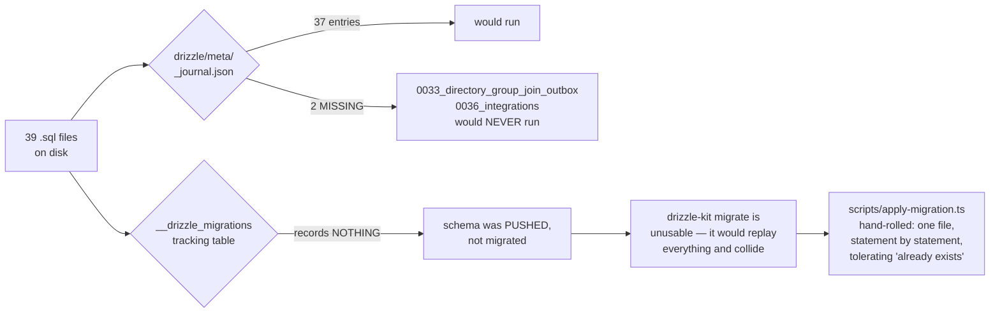

### Highlights of the sequence

| # | File | What it did |
| --- | --- | --- |
| 0001 | `row_level_security` | `app_current_org()`, `app_is_superuser()`, the `hrms_app` role, RLS swept over every `org_id` table |
| 0003 | `rls_for_talent_tables` | Defines the reusable `apply_tenant_rls()` — called by 17 later migrations |
| 0006–0007 | `custom_fields` | Adds the tables, **drops** the jsonb `custom_fields` columns, and **backfills** the blob into rows |
| 0010 | `federation` | SSO/SCIM tables; **drops** placeholder tables `CASCADE` |
| 0016 | `assets` | **Backfills** the new `state` enum from the old free-text `status` |
| 0023 | `doc_store` | The schemaless catch-all — **renumbered from an original 0012** after it was found missing from the journal |
| 0026 | `list_query_indexes` | A deliberate performance migration, then *proved* by `verify-query-plans.ts` |
| **0028** | **`app_role_login`** | **`ALTER ROLE hrms_app WITH LOGIN; NOBYPASSRLS`** — the fix for §4.3 |
| 0033b | `directory_group_join_outbox` | ⚠️ Applies RLS correctly — **but is missing from the journal** |
| 0036 | `integrations` | ⚠️ Applies RLS correctly — **but is missing from the journal** |
| 0037 | `document_pdf_storage_outbox` | The most recent |

### Findings

```
   🔴 JOURNAL DRIFT — LIVE AND CURRENTLY FAILING
      39 files on disk · 37 journal entries.
      0033_directory_group_join_outbox and 0036_integrations are absent.
      In a fresh environment, drizzle-kit migrate would SILENTLY SKIP both.
      This is the one failing check in verify-migrations.ts's 75.
      Per 0023's own comment, this mistake has now happened THREE times.

   🔴 NO WORKING LEDGER
      __drizzle_migrations "records nothing on this deployment, while
      almost every table exists" — the schema was pushed, not migrated.
      There is no authoritative record of what has run against any database.

   🟠 SNAPSHOT DRIFT
      *_snapshot.json exists for 0000–0005 and 0008 only — 7 of 37.

   🟠 HAND-WRITTEN BY NECESSITY
      0005, 0007, 0009, 0010, 0011, 0012, 0014 and others are hand-written
      "because drizzle-kit needs an interactive terminal to resolve
       rename-versus-replace and has none here."

   ✅ DESTRUCTIVE OPERATIONS ARE RARE AND DELIBERATE
      DROP COLUMN in 0006/0007 (jsonb placeholders, with a backfill first).
      DROP TABLE CASCADE in 0010/0014 (placeholder tables only).
      NO `ALTER TYPE` and NO `TRUNCATE` anywhere in all 39 files.
```

---

## 6. Field-level encryption

```
   ENVELOPE FORMAT
   ───────────────
      enc.v1.<keyId>.<iv-base64url>.<ciphertext+tag-base64url>
      ─── ── ─────── ─────────────  ────────────────────────
       │   │     │          │                  │
       │   │     │          │                  └─ AES-256-GCM, 16-byte tag
       │   │     │          └──── 12 random bytes, per encryption
       │   │     └─── 8-hex SHA-256 fingerprint of the key = KEY VERSION
       │   └─── format version
       └─── prefix; isEncrypted() tests for exactly this

   KEYS
      ENCRYPTION_KEY           current, 32 bytes base64 — encrypt + decrypt
      ENCRYPTION_KEY_PREVIOUS  comma-separated retired keys — DECRYPT ONLY

   BEHAVIOUR
      decryptField() on a NON-prefixed value returns it UNCHANGED
        → deliberate backward compatibility with pre-encryption plaintext
      needsReEncryption() flags plaintext OR a retired key → drives backfill

   ⚠ NO AAD. createCipheriv is called without .setAAD(), so the GCM tag
     authenticates the ciphertext but not the row/column it belongs to —
     a theoretical ciphertext-substitution risk within one key.

   ⚠ NO BLIND INDEX. Acknowledged in the module header as an accepted gap,
     because no encrypted field is currently searched or filtered.
```

### What is actually encrypted — and the drift

`scripts/encrypt-fields.ts` names exactly **four** target columns:

| Column | Backfill target? | Reality |
| --- | :-: | --- |
| `identity.users.mfa_secret` | ✅ | Encrypted at write; the **only** column proven end-to-end by `verify-encryption.ts` |
| `identity.sso_connections.client_secret` | ✅ | Claimed encrypted at write by its schema comment |
| `hrms.employees.pan_number` | ✅ | Encrypted on the `updateBankDetails` path — *"every earlier row and every other write path left it in the clear"* |
| `hrms.employees.aadhaar_number` | ✅ | 🔴 **Has no capture path anywhere in the product.** The backfill targets a column nothing populates |
| `talent.dependants.identifier` | ❌ | 🔴 Comment says *"encrypted at rest"* — **absent from `TARGETS` entirely** |
| `hrms.employees.bank_details` (jsonb) | ❌ | 🔴 **Plaintext account number and IFSC in Postgres.** Masked to last-4 only on read, by `toBankDetailsView`. A `jsonb`→ciphertext change needs a column type migration, not a backfill |
| `uan_number`, `pf_number`, `esi_number` | ❌ | Deliberate — *"scheme membership numbers, quoted on statutory filings, left in the clear"* |

The schema's own comment is the most honest source here:

> *"PAN is a national identifier and, as of `updateBankDetails`, is the one of these five actually encrypted at rest… **Aadhaar has no capture path anywhere in the product yet, encrypted or otherwise, despite once being claimed encrypted by this same comment.**"*

---

## 7. Referential integrity — the deliberate gaps

| Pattern | Where | Verdict |
| --- | --- | --- |
| `ON DELETE RESTRICT` (3 only) | `roster_assignments.pattern_id`, `benefit_enrolments.plan_id`, `workflow_instances.definition_id` | ✅ correct — a shift pattern, benefit plan or workflow definition in use must be *deactivated*, never deleted |
| Documented polymorphic gap | `custom_field_values.entity_id` | ✅ intentional, and said so |
| Undocumented soft FKs | `competency_ratings.review_id`, `calibration_adjustments.review_id` | 🟠 probably circular-import avoidance; not stated |
| Unenforced self-references | `employees.reporting_to_id`, `departments.parent_id`/`head_id`, `performance_goals.parent_goal_id`, `ticket_categories.parent_id`, `offers.supersedes_offer_id` | 🟠 `employees.reporting_to_id` at least says *"deferred FK in migration"* |
| Polymorphic `entity_type` + `entity_id` | `workflow_instances`, `legal_holds`, `erasure_log`, `application_events` | ✅ genuinely polymorphic — a FK is not expressible |
| Trigger-maintained column | `custom_field_values.is_unique` | ✅ *"never write from application code"* |

---

## 8. Connection handling — two drivers, one unused

```
   src/db/client.ts

   edgeDb()   drizzle-orm/neon-http over @neondatabase/serverless
              One HTTP round-trip per query. Stateless. Edge-compatible.
              ❌ CANNOT hold a transaction open, so CANNOT carry the tenant GUC.
              ⚠ ZERO CALL SITES — grep for `edgeDb(` across all 574 src files
                finds only the function's own definition.

   db()       drizzle-orm/node-postgres over a pg.Pool
              A real pooled TCP connection. Required for transactions and
              therefore for anything relying on RLS, since SET LOCAL
              app.org_id only survives inside a transaction.
              Memoized on globalThis — "Next.js dev server hot-reloads
              modules; without this the pool leaks a new set of connections
              on every reload."
              max 10 (DATABASE_POOL_MAX) · idle 30 s · connect timeout 10 s

   withTenant(ctx, fn)   the sanctioned entry point — see §4.2
```

---

## 9. The five database guard scripts

All five were executed live against the real Neon instance during this audit.

```
   ┌───────────────────────────┬─────────┬────────────────────────────────┐
   │ Script                    │ Result  │ What it proves                 │
   ├───────────────────────────┼─────────┼────────────────────────────────┤
   │ verify-migrations.ts      │ 74 / 75 │ All 39 migrations apply to a   │
   │   1,647 lines · PGlite    │  1 FAIL │ real in-memory Postgres; 117   │
   │   npm run db:verify       │         │ policies created; TS schema    │
   │                           │         │ matches SQL. THE FAILURE IS    │
   │                           │         │ the journal gap (§5).          │
   ├───────────────────────────┼─────────┼────────────────────────────────┤
   │ verify-encryption.ts      │ 13 / 13 │ Backfill encrypts exactly the  │
   │   npm run db:verify:      │         │ plaintext rows, is idempotent, │
   │   encryption              │         │ key rotation works, and the    │
   │                           │         │ retired key becomes optional.  │
   │                           │         │ ⚠ mfa_secret ONLY.             │
   ├───────────────────────────┼─────────┼────────────────────────────────┤
   │ verify-live-isolation.ts  │  3 / 3  │ Connected as `hrms_app`,       │
   │   npm run db:verify:live  │ that    │ rolbypassrls = false ✓,        │
   │   ⚠ NOT in `npm run       │ could   │ policies present ✓, no table   │
   │      verify`              │ run     │ uncovered ✓.                   │
   │                           │         │ 🔴 Only 1 organisation exists, │
   │                           │         │ so the plant-a-row-as-A-and-   │
   │                           │         │ read-as-B experiment — the one │
   │                           │         │ that matters most — DID NOT    │
   │                           │         │ EXECUTE. It was skipped, not   │
   │                           │         │ passed.                        │
   ├───────────────────────────┼─────────┼────────────────────────────────┤
   │ verify-credential-reach   │  2 / 2  │ HRMS's credential opens `hrms` │
   │   .ts                     │         │ and CANNOT open `neondb`.      │
   │   ⚠ NOT in `npm run       │         │ ⚠ Auth.circuvent's half was    │
   │      verify`              │         │ skipped (no local .env.local). │
   ├───────────────────────────┼─────────┼────────────────────────────────┤
   │ verify-query-plans.ts     │  4 / 4  │ Seeds 4,000 expense_claims,    │
   │   npm run db:verify:plans │         │ EXPLAINs, then DROPS THE INDEX │
   │                           │         │ as a counterfactual and proves │
   │                           │         │ the Sort comes back.           │
   │                           │         │ ⚠ ONE table only.              │
   └───────────────────────────┴─────────┴────────────────────────────────┘
```

The counterfactual in `verify-query-plans.ts` is worth quoting, because it is the difference between asserting and proving:

```ts
check("the newest-first list uses an index", /Index (Scan|Only Scan)/.test(listPlan));
check("and no longer sorts the whole tenant to return fifty rows", !/\bSort\b/.test(listPlan));
await db.exec(`DROP INDEX hrms.expense_claims_org_created_idx`);
check("dropping the index brings the sort back, so the index is what removed it",
      /\bSort\b/.test(withoutIndex) || /Seq Scan/.test(withoutIndex));
```

And `verify-live-isolation.ts` states its own purpose better than any summary could:

> *"`db:verify` proves the RLS policies are correct… That is not a proof of the deployment: it says nothing about the role `DATABASE_URL` actually names. This script asks the only question that matters in production: connect as whoever we really connect as, plant a row in one tenant, ask as another, and see whether it comes back."*

---

## 10. Caching

**There is none.** No Redis, no Upstash, no `unstable_cache`, no materialised views. Every read goes to Postgres.

For the current scale this is the right call — it removes an entire class of stale-data and cache-key-tenancy bugs, and the composite indexes are doing the work. It is a scaling item, not a defect. Doc 05, D-16.

> The one place an in-memory cache *does* exist is `checkRateLimit` in `api-context.ts` — and it is per-serverless-instance, which is exactly why it is flagged as a stopgap in its own comment.

---

## 11. Data-layer debt, ranked

| # | Finding | Severity |
| --- | --- | --- |
| 1 | **Journal drift** — 2 migrations would never run in a fresh environment; currently failing CI's own check | 🔴 |
| 2 | **No `__drizzle_migrations` ledger** — no authoritative record of what has run anywhere | 🔴 |
| 3 | **`bank_details` jsonb is plaintext** — masked on read only | 🔴 |
| 4 | **Encryption scope drift** — Aadhaar targeted but uncapturable; `dependants.identifier` claimed but untargeted | 🟠 |
| 5 | **`verify-live-isolation`'s core test never executed** — only one organisation exists | 🟠 |
| 6 | **Snapshot drift** — 7 of 37 | 🟠 |
| 7 | **No AAD in the GCM envelope** | 🟡 |
| 8 | **`edgeDb()` has zero call sites** — and structurally cannot carry the tenant GUC if ever wired | 🟡 |
| 9 | **Query-plan proof covers one table** — `attendance_records`, `payroll_records`, `tickets` are asserted by convention only | 🟡 |
| 10 | **Undocumented soft FKs** on the two `review_id` columns | 🟡 |
| 11 | **Tenant isolation hinges on one fact** — that `DATABASE_URL` names a `NOBYPASSRLS` role. The runtime guard is strong, but it is also an admission that 117 correct policies once depended on an unchecked assumption for an unknown period **in production** | 🔴 |

---

*Next: **03_INTEGRATIONS_AND_ECOSYSTEM.md** · Back to **01_SYSTEM_OVERVIEW.md***


---


<a id="part-3-integrations-ecosystem"></a>


# Part 3 · Integrations & Ecosystem

> **Audience:** integration engineers, security reviewers, and anyone tracing where a piece of data goes.
> **One-line summary:** HRMS is a **relying party** to two OIDC systems, a **receiver** of SCIM provisioning, a **publisher** of employee master data to Paystub, and a **consumer** of four infrastructure services. It is never an identity provider, and it receives no third-party webhooks.

---

## 1. The map

```
                        UPSTREAM — things that push INTO HRMS
   ┌─────────────────────────────────────────────────────────────────────┐
   │                                                                     │
   │   auth.circuvent.com          Customer IdPs             IdP SCIM    │
   │   (suite OIDC provider)       (Okta/Entra/Google,       clients     │
   │          │                     one per tenant)             │        │
   │          │ RS256/JWKS                 │ RS256/JWKS          │ SCIM 2.0│
   └──────────┼────────────────────────────┼─────────────────────┼───────┘
              ▼                            ▼                     ▼
   ╔══════════════════════════════════════════════════════════════════════╗
   ║                        hrms.circuvent.com                            ║
   ║                                                                      ║
   ║       150 API routes    ·    102 pages    ·    Android v1.8.0        ║
   ║                                                                      ║
   ║   128 routes  requireApiContext   session cookie / bearer JWT        ║
   ║     3 routes  requireApiKey       cvk_ API keys, scope-based         ║
   ║     2 routes  authenticateScim    hashed per-org bearer              ║
   ║    17 routes  public / bespoke    health, openapi, tokens, cron      ║
   ╚══════════════════════════════════════════════════════════════════════╝
              │              │              │              │
              ▼              ▼              ▼              ▼
   ┌──────────────┐ ┌──────────────┐ ┌────────────┐ ┌──────────────────┐
   │ Neon Postgres│ │ Cloudflare R2│ │ SMTP relay │ │ paystub.circuvent│
   │ THE backbone │ │ signed PDFs  │ │ nodemailer │ │ employee master  │
   │ identity +   │ │ FAILS HARD   │ │ FAILS SOFT │ │ ONE-WAY, OUTBOX  │
   │ hrms schemas │ │              │ │            │ │                  │
   └──────────────┘ └──────────────┘ └────────────┘ └──────────────────┘
              │
              ▼  also read directly by
   ┌───────────────────────────────────────────────────────────────────┐
   │  auth · mail · ats · website · devops — the shared identity schema │
   │  THIS, not any API, is the real backbone of "suite single sign-on" │
   └───────────────────────────────────────────────────────────────────┘

                        DOWNSTREAM — nav links only
   ┌───────────────────────────────────────────────────────────────────┐
   │  ATS.circuvent · Mail.circuvent · DevOps.circuvent                │
   │  appear in src/lib/ecosystem.ts as APP-SWITCHER URLs.             │
   │  NO direct REST calls to any of them exist in this codebase.      │
   └───────────────────────────────────────────────────────────────────┘
```

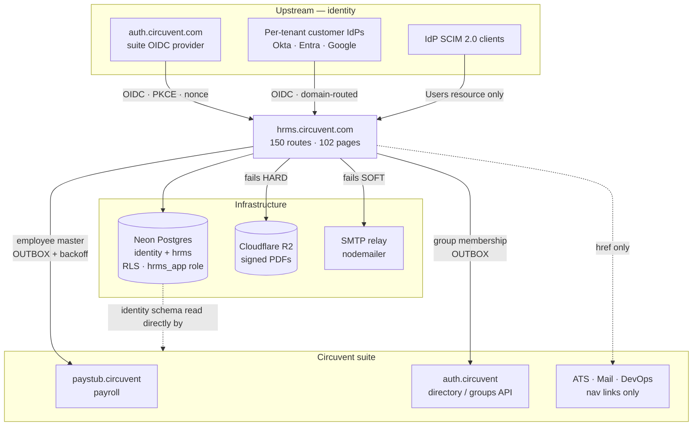

---

## 2. The four ways in

```
   ┌──────────────────┬───────────────┬──────────┬──────────────────────┐
   │ Path             │ Credential    │ # routes │ Principal            │
   ├──────────────────┼───────────────┼──────────┼──────────────────────┤
   │ Session          │ cv_access     │   128    │ a PERSON with a ROLE │
   │                  │ cookie, or a  │          │ ApiContext           │
   │                  │ bearer JWT    │          │ { orgId, userId,     │
   │                  │ (native)      │          │   email?, role }     │
   ├──────────────────┼───────────────┼──────────┼──────────────────────┤
   │ API key          │ cvk_live_…    │     3    │ a SYSTEM with SCOPES │
   │                  │ SHA-256 at    │          │ ApiKeyContext        │
   │                  │ rest          │          │ { orgId, keyId,      │
   │                  │               │          │   scopes }           │
   ├──────────────────┼───────────────┼──────────┼──────────────────────┤
   │ SCIM             │ per-org       │     2    │ an IdP provisioning  │
   │                  │ bearer,       │          │ users                │
   │                  │ SHA-256       │          │                      │
   ├──────────────────┼───────────────┼──────────┼──────────────────────┤
   │ Public / bespoke │ none, or a    │    17    │ health probes, spec  │
   │                  │ single-use    │          │ documents, mailed    │
   │                  │ hashed token, │          │ tokens, and two      │
   │                  │ or a static   │          │ static shared        │
   │                  │ shared secret │          │ secrets              │
   └──────────────────┴───────────────┴──────────┴──────────────────────┘
                                        ───
                                        150   ← reconciles exactly
```

### Why two context modules

`api-context.ts` and `api-v1-context.ts` exist separately because **two different kinds of principal need two different shapes**. A session belongs to a *person* who has a *role*; an API key belongs to an *integration* that has *scopes*. The header of `api-v1-context.ts` states the reason plainly: reusing the role model for API keys would over-permission integrations.

```ts
// api-context.ts — 128 routes
export type ApiRole = "owner" | "admin" | "hr" | "manager" | "employee";
export interface ApiContext { orgId: string; userId: string; email?: string; role: ApiRole }
export async function requireApiContext(request: NextRequest, allowedRoles?: ApiRole[]): Promise<ApiContext>

// api-v1-context.ts — 3 routes
export interface ApiKeyContext { orgId: string; keyId: string; scopes: ApiKeyScope[]; superuser?: false }
export async function requireApiKey(request: NextRequest, requiredScopes?: ApiKeyScope[]): Promise<ApiKeyContext>
```

Both throw typed errors, and both share the same in-memory `checkRateLimit`.

---

## 3. The 150 routes, grouped

| Prefix | # | Auth | Purpose |
| --- | :-: | --- | --- |
| `/api/auth/*` | 15 | mixed | login · register · logout · refresh · me · MFA · SSO · passkey |
| `/api/performance/*` | 11 | session | reviews, goals, self-assessment, ratings |
| `/api/compensation/*` | 8 | session | pay bands, revisions, structures |
| `/api/roster/*` | 8 | session | shift and roster scheduling |
| `/api/documents/*` | 8 | session ×7, **service token** ×1 | generation, e-sign lifecycle, reminders |
| `/api/learning/*` | 7 | session | courses, enrolments, completions |
| `/api/assets/*` | 6 | session | IT and company asset tracking |
| `/api/ats/*` | 6 | session | **HRMS's own internal recruitment pipeline** |
| `/api/governance/*` | 6 | session | retention, legal hold, DSAR, consent |
| `/api/employees/*` | 5 | session | core employee CRUD |
| `/api/referrals/*` | 5 | session ×4, **public token** ×1 | employee referral programme |
| `/api/helpdesk/*` | 5 | session | internal IT/HR ticketing |
| `/api/attendance/*` | 5 | session | check-in/out, regularisation |
| `/api/v1/*` | 4 | **API key** ×3, public ×1 | public partner API + OpenAPI spec |
| `/api/benefits/*` | 4 | session | enrolment and administration |
| `/api/reports/*` | 3 | session | canned reports |
| `/api/leave/*` | 3 | session | apply, approve, balance |
| `/api/lifecycle/*` | 3 | session | onboarding / offboarding |
| `/api/integrations/*` | 3 | session (`settings.manage`) | configure **outbound** webhooks |
| `/api/expenses/*` | 3 | session | claims and approval |
| `/api/custom-fields/*` | 3 | session | tenant-defined schema extensions |
| `/api/scim/*` | 3 | **SCIM token** ×2, public ×1 | inbound SCIM 2.0 provisioning |
| `/api/payroll/*` | 3 | session | HRMS's own payroll module |
| `/api/sync/*` | 2 | session | **inbound** — sibling apps querying HRMS |
| `/api/tax/*` | 2 | session | declarations and computation |
| `/api/workflows/*` · `/api/holidays/*` · `/api/groups/*` · `/api/collections/*` | 2 each | session | configuration and generic data |
| 10 further single-route groups | 1 each | session | loans, recruitment, work-arrangements, departments, team, notifications, announcements |
| `/api/health` | 1 | **none** | status probe |
| `/api/sign/[id]` | 1 | **single-use hashed token** | e-signature by a non-account holder |
| `/api/cron` | 1 | **`CRON_SECRET` bearer** | outbox sweeps, reminder triggers |
| **Total** | **150** | | |

### Exactly three routes have no authentication at all

| Route | Why that is correct |
| --- | --- |
| `GET /api/health` | Status only. No tenant data. |
| `GET /api/v1/openapi` | The API's shape — needed *before* an integrator has a key. |
| `GET /api/scim/v2/ServiceProviderConfig` | Capability metadata. **Unauthenticated per RFC 7644 §4.** |

Two more accept no session but *do* require a secret — a single-use hashed token, not "no auth":

```
   GET/POST /api/public/referral/[token]     GET/POST /api/sign/[id]
   ─────────────────────────────────────     ────────────────────────
   256-bit token                             same pattern
   only its SHA-256 is stored                constant-time comparison
   uniform 404 on any mismatch               wrong id and wrong token
   rate limited 30/min GET, 5/min POST       return the SAME 404
```

The uniform-404 discipline matters: a distinguishable "wrong token" response would confirm that a valid document id had been guessed.

---

## 4. Suite identity — how single sign-on actually works

```
   THE THING PEOPLE ASSUME                THE THING THAT IS TRUE
   ───────────────────────                ──────────────────────
   "The apps call each other's            The apps SHARE ONE POSTGRES
    APIs to share sessions."              PROJECT and read the SAME
                                          `identity` schema DIRECTLY.

                                          identity.users
                                          identity.organizations
                                          identity.sessions
                                          identity.user_roles

                                          A shared HS256 AUTH_JWT_SECRET
                                          then makes one app's cookie
                                          verifiable by all of them.
```

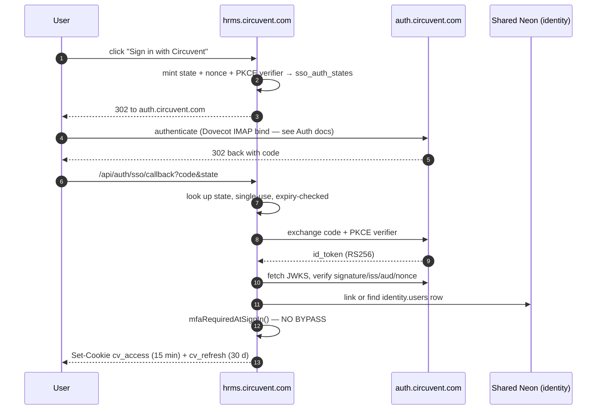

### Two SSO systems, both relying-party

| Module | Role | Notes |
| --- | --- | --- |
| `src/lib/circuvent-sso.ts` | RP to **`auth.circuvent.com`** | The suite IdP. PKCE + state + nonce, RS256/JWKS. |
| `src/lib/sso.ts` | RP to **each tenant's own IdP** | Okta / Entra / Google, selected by email domain. **Explicitly not SAML** — the header documents the reason (the XML signature-wrapping attack class), so this is a decision, not an omission. |

**HRMS is never itself an OIDC provider or a SAML IdP for anyone.**

---

## 5. Inbound SCIM 2.0

```
   IdP (Okta / Entra)  ──── SCIM 2.0 ────▶  /api/scim/v2/Users
                                            /api/scim/v2/Users/[id]
                                            /api/scim/v2/ServiceProviderConfig

   AUTHENTICATION
     bearer token → SHA-256 → per-org scimTokens lookup
                  → TIMING-SAFE compare → revoked? expired?
     600 requests/min/org
     EVERY call written to scim_sync_log — operation, payload, status code

   COVERAGE
     ✅ Users resource
     ✅ ServiceProviderConfig  (unauthenticated, per RFC 7644 §4)
     🔴 NO Groups resource — an IdP configured to push SCIM groups has
        nothing to call. Common in Okta/Entra SCIM apps. Doc 05, D-12.
```

---

## 6. API keys

```
   FORMAT     cvk_<live|test>_<32 hex>_<48 hex>
                              ─────────  ─────────
                              16 random  24 random bytes = the SECRET
                              bytes, an  192 bits of entropy
                              INDEXED
                              LOOKUP
                              PREFIX

   AT REST    SHA-256 — justified in-code precisely BECAUSE the secret
              carries 192 bits of entropy, so no KDF is needed (unlike
              a password, which is low-entropy and therefore needs Argon2id)

   LOOKUP     prefix indexes the row → hash compared with
              timingSafeEqualHex() — constant time

   SCOPES     employees:read/write · leave:read/write ·
              attendance:read/write · payroll:read/write ·
              reports:read · webhooks:manage

              ⚠ `write` DOES NOT imply `read`. requireScopes() checks
                each one explicitly. An integration that only writes
                cannot read back.

   LIFECYCLE  expiresAt and revokedAt, both checked at request time,
              and revoked keys excluded at the SQL layer too

   LIMITS     per-key bucket: checkRateLimit(`apikey:${keyId}`,
              key.rateLimitPerMinute, 60_000) — configurable per key
```

> 🟡 **One inconsistency.** `requireApiKey` distinguishes *"expired"* from *"invalid"* in its client-facing error, while login, SCIM and the referral/sign tokens all deliberately collapse failure reasons to prevent enumeration. Low severity, but worth aligning. Doc 05, D-14.

---

## 7. The Paystub integration — and a common misconception

```
   ╔══════════════════════════════════════════════════════════════════════╗
   ║  HRMS DOES NOT DELEGATE PAYROLL TO PAYSTUB.                          ║
   ║                                                                      ║
   ║  Both applications compute Indian statutory figures independently.   ║
   ║  HRMS has its own payroll module, its own payroll_runs and           ║
   ║  payroll_records tables, and its own statutory-india.ts.             ║
   ║                                                                      ║
   ║  The only link is a ONE-WAY PUSH OF EMPLOYEE MASTER DATA.            ║
   ╚══════════════════════════════════════════════════════════════════════╝

   ⚠ AND: src/lib/payroll-client.ts is NOT the Paystub client.
     It is a browser fetch wrapper for HRMS's own /api/payroll/* routes.
     The real one is src/lib/paystub-client.ts.
```

### What crosses, and how

```
   TRIGGER   an employee record changes
      │
      ▼
   ┌────────────────────────────────────────────────────────────┐
   │  paystub_employee_sync_outbox                              │
   │  row written IN THE SAME DATABASE TRANSACTION as the change│
   └────────────────────────────────────────────────────────────┘
      │  after commit
      ▼
   POST  $PAYSTUB_SYNC_URL        (https://paystub.circuvent.com/api/sync/employees)
   Header  X-Service-Token: $CROSS_APP_SYNC_TOKEN

   PAYLOAD   name · date of birth · address · phone
             PAN / UAN / PF / ESI  ── DECRYPTED immediately before sending
             department + location as CODE and NAME
                                    ─────────────────
                                    never internal UUIDs, because Paystub
                                    owns its own independent tables and
                                    HRMS's primary keys mean nothing there

   ON FAILURE  exponential backoff, capped around 17 hours,
               drained by /api/cron
```

The **transactional outbox** pattern appears four times in this codebase:

| Outbox | Purpose |
| --- | --- |
| `paystub-sync-outbox.ts` | employee master → Paystub |
| `document-pdf-outbox.ts` | signed PDF → Cloudflare R2 |
| `directory-group-outbox.ts` | group membership → auth.circuvent directory |
| `outbox-sweep.ts` | the shared drainer, invoked by `/api/cron` |

Its value: the queue row and the business change either both commit or neither does. There is no window where an employee is updated but the sync was never queued.

---

## 8. Every outbound dependency, and its failure mode

| System | Protocol / auth | What crosses | Failure mode |
| --- | --- | --- | --- |
| **paystub.circuvent** | HTTPS POST, `X-Service-Token` | employee master data | **Durable** — outbox + backoff |
| **auth.circuvent.com** (OIDC) | OIDC redirect, RS256/JWKS | ID-token claims only | Blocks that login attempt; password login unaffected |
| **auth.circuvent.com** (directory API) | HTTPS, `Bearer` **and** `X-Service-Token` (`DIRECTORY_SERVICE_TOKEN`) — `directory-sdk.ts` | group membership for mail-list expansion | **Fails soft** on read (empty directory); writes queue in an outbox |
| **SMTP relay** | direct SMTP via `nodemailer` | notifications, letters | **Fails soft** — logs, returns `false`, callers proceed |
| **Cloudflare R2** | `@aws-sdk/client-s3` | signed document PDFs | **Fails hard** — throws |
| **Neon Postgres** | direct connection, `hrms_app` role | everything | N/A — this *is* the system |
| ATS · Mail · DevOps | **none** | — | `ecosystem.ts` nav links only |

```
   WHY MAIL FAILS SOFT AND STORAGE FAILS HARD — the reasoning is explicit:

     A delayed notification email is an inconvenience.
     A signed document that was never persisted is unrecoverable.

     So the mailer swallows and logs; the object store throws.
```

---

## 9. Outbound webhooks — and the absence of inbound ones

```
   ┌────────────────────────────────────────────────────────────────────┐
   │  WHAT EXISTS: outbound                                             │
   │    /api/integrations/*  (3 routes, gated on `settings.manage`)     │
   │    Configure Slack / Teams / generic webhook DESTINATIONS that     │
   │    HRMS calls out to when events fire.                             │
   │    Destination URLs pass an SSRF checkEndpoint() validation.       │
   ├────────────────────────────────────────────────────────────────────┤
   │  WHAT DOES NOT EXIST: inbound                                      │
   │    A repository-wide search across all 150 routes for              │
   │    x-hub-signature · stripe-signature · x-*-signature ·            │
   │    HMAC verification helpers                                       │
   │    returned ZERO matches.                                          │
   │                                                                    │
   │    There is no endpoint anywhere that receives and verifies a      │
   │    third-party webhook callback. "Webhook signature verification"  │
   │    is therefore not applicable today.                              │
   └────────────────────────────────────────────────────────────────────┘
```

Good practice to carry forward: if an inbound receiver is ever added, it should reuse the SCIM/API-key pattern — hash at rest, constant-time compare, uniform failure.

---

## 10. Two static shared secrets

```
   /api/cron                            CRON_SECRET
     • timingSafeEqual comparison ✅
     • fails CLOSED (503) if the env var is unset ✅
     • 🔴 NO nonce, NO timestamp — replayable indefinitely until rotated
     • 🔴 NO rate limit found on this route

   /api/documents/reminders             CROSS_APP_SYNC_TOKEN
     • requireServiceToken() checks x-service-token (or bearer)
     • timingSafeEqual ✅, fails CLOSED (403) if unset ✅
     • falls back to requireApiContext + ["owner","admin","hr"] for humans
     • 🔴 NO rate limit
     • 🔴 THE ONE TENANCY EXCEPTION — see below
```

```
   ╔══════════════════════════════════════════════════════════════════════╗
   ║  THE ONE PLACE orgId IS NOT DERIVED FROM A VERIFIED IDENTITY         ║
   ╠══════════════════════════════════════════════════════════════════════╣
   ║                                                                      ║
   ║  In 149 of 150 routes, orgId comes from requireApiContext() or       ║
   ║  requireApiKey() — that is, from the VERIFIED TOKEN. Never from the  ║
   ║  request body. Never from the query string. This is stated as the    ║
   ║  design rationale in api-context.ts's own header, and it holds.      ║
   ║                                                                      ║
   ║  /api/documents/reminders is the exception. Once the static          ║
   ║  CROSS_APP_SYNC_TOKEN is accepted, the tenant to act on is read      ║
   ║  from  ?orgId=  in the query string.                                 ║
   ║                                                                      ║
   ║  Anyone holding that shared token can name ANY tenant and trigger    ║
   ║  mass reminder emails for it. With no rate limit.                    ║
   ║                                                                      ║
   ║  → Doc 05, D-02                                                      ║
   ╚══════════════════════════════════════════════════════════════════════╝
```

`requireUserOrService()` — a helper in `server-auth.ts` that accepts either credential — is **defined but never called anywhere**. The one route that needs the dual path reimplements it inline. Doc 05, D-15.

---

## 11. Environment variables

| Variable | Purpose | In `.env.example`? |
| --- | --- | :-: |
| `DATABASE_URL` | Neon connection — **must name a `NOBYPASSRLS` role** | ✅ |
| `DATABASE_POOL_MAX` | pg pool size, default 10 | ✅ |
| `AUTH_JWT_SECRET` | **HS256 suite session secret — shared across all apps** | ✅ |
| `ENCRYPTION_KEY` | AES-256-GCM current key, base64 | ✅ |
| `ENCRYPTION_KEY_PREVIOUS` | comma-separated retired keys, decrypt-only | ✅ |
| `CRON_SECRET` | `/api/cron` bearer | ✅ |
| `CROSS_APP_SYNC_TOKEN` | Paystub push + `/api/documents/reminders` | ✅ |
| `PAYSTUB_SYNC_URL` | Paystub endpoint | ✅ |
| `SMTP_*` | nodemailer transport | ✅ |
| `S3_*` / R2 credentials | object storage | ✅ |
| `SSO_CLIENT_ID` | suite OIDC client | 🔴 **undocumented** |
| `SSO_CLIENT_SECRET` | suite OIDC client | 🔴 **undocumented** |
| `SSO_REDIRECT_URI` | suite OIDC callback | 🔴 **undocumented** |
| `AUTH_ISSUER` | expected `iss` | 🔴 **undocumented** |
| `DIRECTORY_SERVICE_TOKEN` | directory/groups API | 🔴 **undocumented** |
| `ALLOW_RLS_BYPASS` | escape hatch for the RLS guard — **never set in production** | ✅ |
| `NEXT_PUBLIC_USE_LOCAL_CREDS` | 🔴 **dead** — points at `src/lib/local-auth.ts`, which does not exist | ✅ |

Five variables are read by code but absent from `.env.example`. Each fails soft or disables its feature when unset, so severity is low — but it is exactly the kind of drift that makes a fresh deployment quietly lose SSO. Doc 05, D-11.

---

## 12. Integration risk register

| # | Risk | Severity |
| --- | --- | --- |
| 1 | **`/api/documents/reminders` takes `orgId` from the query string** after a static token, with no rate limit — cross-tenant blast radius | 🔴 |
| 2 | **`AUTH_JWT_SECRET` is one symmetric key shared suite-wide** — a leak in *any* sibling app forges sessions everywhere; no per-app key separation is visible from this repository | 🔴 |
| 3 | **`/api/cron`'s secret is replayable** — no nonce, no timestamp, no rate limit | 🟠 |
| 4 | **Five required env vars are undocumented** — SSO silently disables on a fresh deploy | 🟠 |
| 5 | **In-memory rate limiting** — per serverless instance, so the real ceiling scales with instance count. Flagged as a stopgap in its own comment; a Redis swap is planned | 🟠 |
| 6 | **SCIM has no Groups resource** — an IdP expecting group push has nothing to call | 🟠 |
| 7 | **`requireUserOrService()` is dead code** — the intended pattern was never applied | 🟡 |
| 8 | **`NEXT_PUBLIC_USE_LOCAL_CREDS` is a dead security toggle** — harmless only because nothing implements it, and `NEXT_PUBLIC_*` is client-visible by definition | 🟡 |
| 9 | **API-key error messages distinguish expired from invalid** — inconsistent with the uniform-failure discipline used elsewhere | 🟡 |

### And the positive control, stated explicitly

> Outside of risk #1, `orgId` is **always** derived from the verified token in `requireApiContext` / `requireApiKey` — never trusted from a request body or query string. This is the stated design rationale in `api-context.ts`'s header and it is consistently applied across 149 of 150 routes. Combined with Postgres RLS and a `NOBYPASSRLS` connection role, it is a genuinely strong defence in depth.

---

*Next: **04_MAINTENANCE_AND_OPERATIONS.md** · Back to **02_DATABASE_AND_DATA_MODELS.md***


---


<a id="part-4-maintenance-operations"></a>


# Part 4 · Maintenance & Operations

> **Audience:** anyone who has to run, deploy, debug or extend this system.
> **The distinguishing fact:** this is the **only application in the Circuvent suite with a working CI pipeline** — and even so, it runs 9 of its own 12 verification checks.

---

## 1. Local setup

```
   ┌──────────────────────────────────────────────────────────────────────┐
   │  PREREQUISITES                                                       │
   │    Node 22 (CI pins it; 20 will build but is not what ships)         │
   │    A Neon Postgres database                                          │
   │    JDK 17 + Android SDK — ONLY if you touch android/                 │
   └──────────────────────────────────────────────────────────────────────┘

   git clone https://github.com/Hemakotibonthada/HRMS.circuvent
   cd HRMS.circuvent
   npm install

   cp .env.example .env.local        ← then fill it in, see §2
   npm run db:verify                 ← 39 migrations onto in-memory PGlite
   npm run dev                       ← Next 16 + Turbopack, port 3000

   FIRST-RUN SANITY, in order:
     npm run typecheck               tsc --noEmit
     npm run test                    2,664 tests, ~92 files
     npm run db:verify:live          ⚠ needs a REAL DATABASE_URL
```

> ⚠️ **`npm run db:verify:live` is the one that matters and the one that is not in CI.** Everything else runs against in-memory PGlite. Run it against a real database after any change to roles, grants or connection strings. It is the check that would have caught the BYPASSRLS incident.

---

## 2. Configuration

`.env.local` is git-ignored and has never been committed. `.vercelignore` exists specifically because, before it did, `.env.local` and database backups were uploaded to every Vercel deployment.

```
   REQUIRED
     DATABASE_URL             ⚠ MUST name a role WITHOUT BYPASSRLS.
                                The app refuses to start otherwise —
                                assertConnectionIsolatesTenants() throws.
     AUTH_JWT_SECRET          HS256, shared across the whole suite
     ENCRYPTION_KEY           32 bytes, base64 — AES-256-GCM

   OPTIONAL BUT LOAD-BEARING
     ENCRYPTION_KEY_PREVIOUS  comma-separated retired keys (decrypt only)
     CRON_SECRET              /api/cron — fails CLOSED (503) if unset
     CROSS_APP_SYNC_TOKEN     Paystub push + documents/reminders
     PAYSTUB_SYNC_URL         https://paystub.circuvent.com/api/sync/employees
     SMTP_*                   nodemailer — fails SOFT if unset
     S3_* / R2 credentials    object storage — fails HARD if a PDF is needed
     DATABASE_POOL_MAX        default 10

   READ BY CODE, ABSENT FROM .env.example  🔴
     SSO_CLIENT_ID  ·  SSO_CLIENT_SECRET  ·  SSO_REDIRECT_URI
     AUTH_ISSUER    ·  DIRECTORY_SERVICE_TOKEN

   ESCAPE HATCHES — never in production
     ALLOW_RLS_BYPASS=true          disables the tenancy guard
     NEXT_PUBLIC_USE_LOCAL_CREDS    🔴 DEAD — src/lib/local-auth.ts
                                       does not exist
```

---

## 3. The npm script surface

```
   DEVELOPMENT              dev · build · start · lint · typecheck

   STRICTNESS               lint:strict   --max-warnings 0, but only over
                                          an explicit ALLOW-LIST of paths
                            lint:a11y     jsx-a11y rules
                            typecheck:mobile

   DATABASE                 db:verify              39 migrations → PGlite, 75 checks
                            db:verify:encryption   13 checks, key rotation
                            db:verify:modules      65 checks, route reality
                            db:verify:plans        4 checks, EXPLAIN + counterfactual
                            db:verify:live      ⚠ needs a real DB — RLS in production
                            db:verify:reach     ⚠ needs two apps' creds

   AUDITS                   audit:data-paths     91 pages vs their data sources
                            audit:fabricated     hardcoded data that looks real
                            audit:unwired        built but never dispatched

   AGGREGATE                verify        ← 12 checks
   ```

```
   npm run verify   — the 12 checks
   ┌────────────────────────────────┬──────────────┐
   │ typecheck                      │  ✅ in CI    │
   │ typecheck:mobile               │  🔴 NOT      │
   │ lint:strict                    │  ✅ in CI    │
   │ lint:a11y                      │  🔴 NOT      │
   │ lint                           │  ✅ advisory │
   │ db:verify                      │  ✅ in CI    │
   │ db:verify:encryption           │  ✅ in CI    │
   │ db:verify:modules              │  ✅ in CI    │
   │ db:verify:plans                │  ✅ in CI    │
   │ audit:data-paths               │  ✅ in CI    │
   │ audit:fabricated               │  ✅ in CI    │
   │ audit:unwired                  │  🔴 NOT      │
   │ test                           │  ✅ in CI    │
   │ build                          │  ✅ in CI    │
   └────────────────────────────────┴──────────────┘
        A developer running `npm run verify` locally gets MORE
        coverage than CI provides. Doc 05, D-04.
```

---

## 4. Continuous integration

`.github/workflows/verify.yml` — the only real CI in the Circuvent suite.

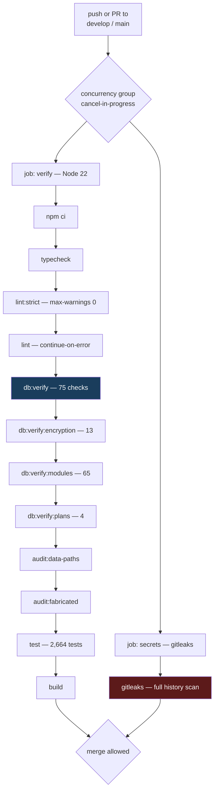

```
   ┌──────────────────────────────────────────────────────────────────────┐
   │  WHAT CI CANNOT SEE — and this is the whole lesson                   │
   │                                                                      │
   │  Every db:verify* step in CI runs against IN-MEMORY PGlite.          │
   │  No live database is ever contacted.                                 │
   │                                                                      │
   │  That is precisely why the BYPASSRLS incident was invisible:         │
   │  PGlite connects as its own superuser, so RLS policy correctness     │
   │  tests pass regardless of which role production actually uses.       │
   │                                                                      │
   │  db:verify:live and db:verify:reach are the two checks that would    │
   │  have caught it — and they are the two that need real credentials,   │
   │  and therefore the two NOT in CI.                                    │
   │                                                                      │
   │  This is a genuine, unresolved gap. Doc 05, D-01.                    │
   └──────────────────────────────────────────────────────────────────────┘
```

---

## 5. The nine guard scripts

These check things a unit test structurally cannot.

### 5.1 `audit-data-paths.ts` — does the page have a data source?

```
   Walks 91 dashboard pages and reconciles each against
     12 ENTITY_ROUTES  +  29 allow-listed doc_store collections

   THE FAILURE IT PREVENTS:
     A page fetches /api/kudos. That route does not exist. The fetch
     404s. The component's catch block renders an empty state.

     The user sees "No kudos yet."
     Not "something is broken."

     A silent 404 that renders as an empty state is indistinguishable
     from genuinely having no data — and no test would ever catch it,
     because the component behaves exactly as written.
```

### 5.2 `audit-fabricated-data.ts` — is this number real?

Scans for hardcoded values that look like live data. **Currently 0 findings.**

> Its own history is the point: an earlier version scanned **2 of 9 directories** and reported clean while real fabricated data sat in the 7 it never opened. A guard that only appears to work is worse than none.

### 5.3 `audit-unwired.ts` — is it wired up?

Checks that anything built to be dispatched actually is, across 6 effect modules. Current verdict: *"Everything built to be dispatched is dispatched."*

### 5.4 `verify-modules.ts` — is the route real?

65 checks. Its rationale:

> *"two routes were once fakes that returned 201 and wrote nothing."*

A route returning `201 Created` while persisting nothing passes every integration test that only asserts the status code.

### 5.5–5.9 The five database guards

Covered in detail in doc 02 §9. Summary of the live run performed during this audit:

```
   verify-migrations.ts        74 / 75    🔴 1 FAIL — journal drift
   verify-encryption.ts        13 / 13    ✅
   verify-live-isolation.ts     3 / 3     ⚠ core cross-tenant test SKIPPED
                                            (only 1 organisation exists)
   verify-credential-reach.ts   2 / 2     ⚠ Auth.circuvent half skipped
   verify-query-plans.ts        4 / 4     ✅ with a DROP INDEX counterfactual
```

---

## 6. The test suite

```
   92 test files  ·  2,664 tests passing  ·  12 skipped  ·  1 flaky

   Vitest 4 + Testing Library + @electric-sql/pglite

   WHY IT IS FAST: ~40 domain modules are PURE. They take arguments and
   return values. No database, no clock, no network — so the statutory,
   rostering, workflow, expense and settlement suites are plain function
   calls.

   NOTABLE COVERAGE
     middleware.test.ts        36 assertions across 6 describes, including
                               look-alike prefix rejection (/loginish must
                               NOT match the /login public prefix) and
                               header-overwrite protection
     rbac.test.ts              36 assertions — role completeness, privilege
                               boundaries, canAccessModule fail-closed,
                               and "a reporting line does not imply pay
                               visibility"
     workflow/engine.test.ts   495 lines for a 493-line module

   ⚠ FLAKY: paystub-sync-outbox.test.ts passes standalone, intermittently
     fails in a full-suite run — a shared-state or timing dependency.
     Doc 05, D-17.

   ⚠ UNTESTED: document-dispatch.ts · notifications/notify.ts · hr-utils.ts
     — all three have real side effects.
```

---

## 7. Code quality

```
   IN src/  —  measured, not estimated
   ┌─────────────────────────────────┬─────────┐
   │ TODO / FIXME comments           │    0    │
   │ @ts-ignore / @ts-expect-error   │    0    │
   │ eslint-disable                  │    0    │
   │ literal console.log             │    0    │
   │ files using `any`               │   ~9    │
   └─────────────────────────────────┴─────────┘

   That is an unusually clean tree. But:

   🔴 lint:strict --max-warnings 0 covers only an EXPLICIT ALLOW-LIST.
      Outside it — and therefore never strictly linted:
        almost all  src/app/(dashboard)/**/page.tsx
        all         src/components/**
        all         src/hooks/**
        all         src/stores/**
        about half  src/app/api/**

      The plain `lint` run reports ~925 warnings and is
      `continue-on-error` in CI. README says "~936".

   LARGEST FILES
     src/db/schema/hrms.ts                        1,440
     src/db/repositories/ats.neon.ts              1,292
     src/lib/document-templates/catalog.ts        1,139
     src/db/repositories/rostering.neon.ts        1,012
     src/app/(dashboard)/admin/page.tsx             919
```

---

## 8. The other ~25 scripts

| Script | What it does |
| --- | --- |
| `apply-app-role.ts` | Creates/repairs `hrms_app` — the fix from migration 0028 |
| `contain-database-access.ts` | 🔴 Written because **Auth's credential could open the `hrms` database as `neondb_owner` with BYPASSRLS** |
| `smoke-live.ts` | End-to-end against a live deployment. **Read its header.** |
| `apply-migration.ts` | Hand-rolled migration runner — one file, statement by statement, tolerating "already exists" |
| `encrypt-fields.ts` | Backfills the 4 encryption targets |
| `sync-employees-to-paystub.ts` | Manual outbox drain |
| `sweep-routes.ts` | Route inventory |
| `test-e2e.ts` | E2E harness |
| `audit-suite-connections.ts` | 🟠 contains a **hardcoded absolute path** `C:\Users\v-hbonthada\…` — works on exactly one machine |
| `clean-prod-keep-applicants.mjs`, `seat-the-founder.mjs`, `merge-duplicate-org.cjs`, `purge-demo-tenants.mjs` | ⚠️ Destructive production data tools. Read before running. |

---

## 9. Deployment

```
   ┌──────────┐   git push    ┌──────────┐   build   ┌──────────────────┐
   │  local   │──────────────▶│  GitHub  │──────────▶│  Vercel          │
   │  develop │               │  verify  │           │  Next 16 runtime │
   └──────────┘               │  gitleaks│           └────────┬─────────┘
                              └──────────┘                    │
                                                              ▼
                                              ┌──────────────────────────┐
                                              │  vercel.json             │
                                              │  crons: [{               │
                                              │    "path": "/api/cron",  │
                                              │    "schedule":"0 3 * * *"│
                                              │  }]                      │
                                              └──────────────────────────┘
                                                    ONE cron, daily 03:00
                                                    drains ALL FOUR outboxes
```

```
   🔴 next.config.ts HAS NO SECURITY HEADERS.

      No Content-Security-Policy.
      No Strict-Transport-Security.
      No X-Frame-Options / frame-ancestors.
      No X-Content-Type-Options.
      No Referrer-Policy · No Permissions-Policy.

      Also absent: serverExternalPackages, and any image remote-pattern
      allow-list.

      For an application holding salary, bank details and national
      identifiers, this is the single cheapest high-value fix available.
      Doc 05, D-05.
```

### Mobile

```
   ┌────────────────────────────┬────────────────────────────────────────┐
   │  mobile/                   │  android/                              │
   │  Expo ~52 · RN 0.76.6      │  Kotlin Multiplatform                  │
   │                            │    shared/  — business logic           │
   │  v1.0.0 / versionCode 1    │    app/     — Jetpack Compose          │
   │                            │    iosApp/  — SwiftUI, NEVER COMPILED  │
   │  "has never been run on a  │                                        │
   │   device" — its own docs   │  v1.8.0 / versionCode 10               │
   │                            │  SIGNED AND READY (HRMS Upload.md)     │
   │  ❌ ABANDONED PRECURSOR     │  ✅ THE ONE THAT SHIPS                  │
   └────────────────────────────┴────────────────────────────────────────┘
              ⚠ BOTH DECLARE THE SAME APP ID: com.circuvent.hrms

   CONSEQUENCE: business rules now exist independently in THREE codebases
     web TypeScript  ·  Expo TypeScript  ·  Kotlin
   A statutory rate change must be made three times, correctly, in three
   languages. Nothing checks that they agree. Doc 05, D-08.
```

---

## 10. Debugging playbook

### 10.1 Every query returns zero rows

```
   SYMPTOM   A page renders empty. No error. The data exists in the DB.

   CAUSE #1  The code path did not go through withTenant().
             app_current_org() returns NULL, `org_id = NULL` is NULL,
             the RLS policy denies everything.
             FIX: route the repository call through withTenant(ctx, fn).

   CAUSE #2  ctx.orgId is empty string rather than a uuid.
             set_config('app.org_id', '', true) → NULLIF gives NULL.
             Same outcome.

   ✅ This is FAIL-CLOSED. An empty result is the safe failure. The
      dangerous failure — seeing OTHER tenants' rows — means the
      connecting role has BYPASSRLS. Run: npm run db:verify:live
```

### 10.2 The app refuses to start

```
   "the connected role bypasses row-level security"
       → DATABASE_URL names a superuser or the table owner.
       → npx tsx scripts/apply-app-role.ts, then repoint DATABASE_URL
         at hrms_app.
       → Do NOT set ALLOW_RLS_BYPASS=true to make it go away.
```

### 10.3 A user cannot sign in

```
   ┌─ Password rejected? ─────────────────────────────────────────────┐
   │  Argon2id auto-rehashes on parameter drift. A hash written under │
   │  older parameters still verifies. Check the PHC prefix.          │
   └──────────────────────────────────────────────────────────────────┘
   ┌─ SSO or passkey silently refuses? ───────────────────────────────┐
   │  🔴 MOST LIKELY: the user has MFA active. Neither SSO nor        │
   │     passkey accepts a TOTP parameter, so mfaRequiredAtSignIn()   │
   │     fails them closed. This is the known UX gap, not a bug in    │
   │     the IdP. Workaround: password + TOTP. Doc 05, D-09.          │
   └──────────────────────────────────────────────────────────────────┘
   ┌─ 401 with x-session-refresh: 1 ──────────────────────────────────┐
   │  Normal. Access token expired, refresh cookie present. The       │
   │  client should call /api/auth/refresh and retry once.            │
   └──────────────────────────────────────────────────────────────────┘
   ┌─ Refresh returns 401 unexpectedly? ──────────────────────────────┐
   │  A refresh token was REUSED. That triggers FAMILY REVOCATION —   │
   │  every session in the chain is killed. Usually two tabs racing;  │
   │  occasionally a real theft. Check sessions.rotated_to_id.        │
   └──────────────────────────────────────────────────────────────────┘
```

### 10.4 The Paystub sync is not arriving

```
   1  SELECT status, attempt_count, next_attempt_at, last_error
        FROM hrms.paystub_employee_sync_outbox
       WHERE org_id = :org AND status <> 'sent';

   2  Backoff caps around 17 HOURS. A row can legitimately sit
      untouched for most of a day.

   3  Only /api/cron drains it — once daily at 03:00 UTC.
      Manual drain: npx tsx scripts/sync-employees-to-paystub.ts

   4  Check CROSS_APP_SYNC_TOKEN matches on BOTH sides.
```

### 10.5 A migration did not run

```
   npm run db:verify

   Expect: "missing from _journal.json: 0033_directory_group_join_outbox,
            0036_integrations"

   🔴 THIS IS THE KNOWN, CURRENT, REAL FAILURE. Doc 05, D-10.
      Those two files apply RLS correctly but would never execute in a
      fresh environment, because drizzle reads the journal, not the
      directory.

   Fix: add both entries to drizzle/meta/_journal.json.
```

### 10.6 A page shows an empty state that should have data

```
   npm run audit:data-paths

   This is exactly the failure it was written to find: a fetch to a
   route that does not exist, 404ing into a component's catch block,
   rendering "no items" instead of "broken".
```

---

## 11. Observability

```
   WHAT EXISTS                          WHAT DOES NOT
   ───────────                          ─────────────
   ✅ identity.audit_log — hash-chained  ❌ APM / distributed tracing
      and append-only at the DB level    ❌ Sentry or equivalent
   ✅ scim_sync_log — every SCIM call    ❌ structured JSON logging
   ✅ outbox tables with attempt_count,  ❌ alerting on outbox depth
      next_attempt_at, last_error        ❌ uptime monitoring beyond
   ✅ /api/health                           /api/health existing
   ✅ Vercel platform logs               ❌ dashboards of any kind

   Practically: the ONLY way to learn that the Paystub outbox has been
   failing for three days is to query the table. Nothing raises a hand.
   Doc 05, D-18.
```

---

## 12. Routine maintenance

| Cadence | Task |
| --- | --- |
| **Every deploy** | `npm run verify` locally — it covers 3 more checks than CI does |
| **Every deploy** | Confirm `DATABASE_URL` still names `hrms_app` |
| **Weekly** | Query all four outbox tables for rows with a high `attempt_count` |
| **Monthly** | `npm run db:verify:live` against production — **once there is more than one organisation, so the cross-tenant test actually executes** |
| **Monthly** | `npm run db:verify:reach` with both apps' credentials present |
| **Quarterly** | Rotate `ENCRYPTION_KEY`; move the old key to `ENCRYPTION_KEY_PREVIOUS`; run `encrypt-fields.ts`; only then drop the retired key |
| **Quarterly** | Rotate `CRON_SECRET` and `CROSS_APP_SYNC_TOKEN` — neither has replay protection |
| **Per statutory change** | Update `statutory-india.ts` **and** the Kotlin `shared/` module **and** the Expo copy, or delete the latter two |
| **Per migration** | Add the journal entry. This has been missed three times. |

---

*Next: **05_AREAS_OF_ENHANCEMENT.md** · Back to **03_INTEGRATIONS_AND_ECOSYSTEM.md***


---


<a id="part-5-areas-of-enhancement"></a>


# Part 5 · Areas of Enhancement

> **Audience:** engineering leadership and whoever owns the next two quarters.
> **Method:** every item below is traceable to a file, a script's live output, or a comment in the codebase itself. Nothing here is speculative.

---

## 1. Gap analysis

```
   ┌─────────────────────────┬────────┬────────┬────────────────────────┐
   │ Dimension               │  Now   │ Target │ Gap                    │
   ├─────────────────────────┼────────┼────────┼────────────────────────┤
   │ Verification discipline │ ████████│████████│ best in the suite      │
   │ Test coverage           │ ███████ │████████│ 3 side-effect modules  │
   │ Code hygiene            │ ███████ │████████│ lint allow-list gaps   │
   │ Domain rigour           │ ███████ │████████│ leave accrual missing  │
   │ Auth & session design   │ ███████ │████████│ MFA blocks SSO         │
   │ Tenancy enforcement     │ ██████  │████████│ 1 route reads ?orgId=  │
   │ Money consistency       │ █████   │████████│ 🔴 float seam          │
   │ CI completeness         │ █████   │████████│ 🔴 no live-DB check    │
   │ Encryption at rest      │ ████    │████████│ 🔴 bank_details plain  │
   │ Documentation accuracy  │ ███     │████████│ 🔴 2 docs obsolete     │
   │ Dead code               │ ███     │████████│ ~1,583 lines           │
   │ Rule-source singularity │ ██      │████████│ 🔴 rules in 3 languages│
   │ Response headers        │ █       │████████│ 🔴 none at all         │
   │ Observability           │ █       │██████  │ 🔴 nothing raises a hand│
   └─────────────────────────┴────────┴────────┴────────────────────────┘
```

---

## 2. The one thing to internalise before anything else

```
   ╔══════════════════════════════════════════════════════════════════════╗
   ║                                                                      ║
   ║   "ninety-one correct policies and seventy-five passing isolation    ║
   ║    tests, while DATABASE_URL pointed at a role with BYPASSRLS and    ║
   ║    every query returned every tenant's rows.                         ║
   ║    Nothing that ran in CI could have noticed."                       ║
   ║                                                                      ║
   ║                          — scripts/smoke-live.ts                     ║
   ║                                                                      ║
   ╠══════════════════════════════════════════════════════════════════════╣
   ║                                                                      ║
   ║   Every artefact was correct:                                        ║
   ║     ✅ the policies                                                   ║
   ║     ✅ the tests                                                      ║
   ║     ✅ the test results                                               ║
   ║                                                                      ║
   ║   And the system was completely broken, because the CREDENTIAL       ║
   ║   the application actually connected with was exempt from the        ║
   ║   policies being tested.                                             ║
   ║                                                                      ║
   ║   The lesson is not "add a test."                                    ║
   ║   The lesson is: SOME PROPERTIES ARE ONLY TRUE OF A DEPLOYMENT,      ║
   ║   AND A TEST SUITE CANNOT SEE THEM.                                  ║
   ║                                                                      ║
   ║   This codebase learned that and grew nine verification scripts.     ║
   ║   Two of them — the two that would have caught this — are still      ║
   ║   NOT in CI, because they need real credentials. That is the         ║
   ║   single most important open item in this document.                  ║
   ╚══════════════════════════════════════════════════════════════════════╝
```

A second, related incident is recorded in `scripts/contain-database-access.ts`: **Auth's credential could open the `hrms` database as `neondb_owner` with BYPASSRLS.** Same class of failure — a credential reaching further than intended — but across applications rather than across tenants.

---

## 3. Technical debt log

Severity: 🔴 critical · 🟠 high · 🟡 medium · ⚪ low

| ID | Finding | Sev | Effort |
| --- | --- | :-: | :-: |
| **D-01** | **`db:verify:live` and `db:verify:reach` are not in CI.** Every DB check in CI runs against in-memory PGlite, which connects as its own superuser — structurally unable to detect the exact failure that already happened once | 🔴 | M |
| **D-02** | **`/api/documents/reminders` reads `orgId` from the query string** after a static token, with no rate limit. The one place in 150 routes where a tenant is not derived from a verified identity | 🔴 | S |
| **D-03** | **Float seam in the live payroll pipeline.** `payroll.neon.ts` does `BigInt(Math.round(calculateProfessionalTax(minorToMajor(gross)) * 100))` — round-tripping through the codebase's own display-only helper, whose doc comment forbids exactly this | 🔴 | M |
| **D-04** | **CI runs 9 of the 12 `npm run verify` checks.** Omits `typecheck:mobile`, `lint:a11y`, `audit:unwired`. A local run is stricter than the merge gate | 🔴 | S |
| **D-05** | **`next.config.ts` has no security headers.** No CSP, HSTS, X-Frame-Options, X-Content-Type-Options, Referrer-Policy or Permissions-Policy — on an app holding salary, bank details and national identifiers | 🔴 | S |
| **D-06** | **`docs/PLATFORM-ARCHITECTURE.md` and `docs/DEPLOYMENT.md` are wholesale obsolete.** They describe a Firestore-backed system with "zero automated tests", "no Neon project", "no Vercel project" and "`main` has not been created" — none of which is true | 🔴 | S |
| **D-07** | **`bank_details` is unencrypted `jsonb`.** Full account number and IFSC in plaintext in Postgres; masked only on read. Needs a column type migration, not a backfill | 🔴 | L |
| **D-08** | **Business rules exist independently in three codebases** — web TypeScript, Expo TypeScript, Kotlin — all shipping under app id `com.circuvent.hrms`. Nothing checks that they agree | 🔴 | L |
| **D-09** | **MFA blocks SSO and passkey sign-in entirely.** No bypass exists (correct), but neither path accepts a TOTP parameter, so an MFA-enabled user cannot use them at all | 🟠 | M |
| **D-10** | **Migration journal drift.** 39 files, 37 journal entries; `0033_directory_group_join_outbox` and `0036_integrations` would never run in a fresh environment. **This is currently the one failing check in `verify-migrations.ts`.** Per `0023`'s own comment, this has now happened three times | 🟠 | S |
| **D-11** | **Five required env vars are undocumented** — `SSO_CLIENT_ID`, `SSO_CLIENT_SECRET`, `SSO_REDIRECT_URI`, `AUTH_ISSUER`, `DIRECTORY_SERVICE_TOKEN`. SSO silently disables on a fresh deploy | 🟠 | S |
| **D-12** | **Three gratuity implementations.** One correct (bigint, Act-compliant, `statutory-india.ts`); two naive float duplicates in `payroll-engine.ts` and `hr-utils.ts` with no part-year rounding and no death/disablement waiver. Both are dead — and both are still exported | 🟠 | S |
| **D-13** | **~1,583 lines of dead modules.** `employee-lifecycle.ts` (469), `compliance-engine.ts` (475), `reporting-engine.ts` (639) — zero importers, zero tests | 🟠 | S |
| **D-14** | **No monthly leave accrual.** `leave_balances.accrued_days` exists and is always 0. Provisioning is annual-upfront; the accrual job "does not exist yet" | 🟠 | M |
| **D-15** | **No leave-request-vs-balance validation anywhere in `src/lib`.** Nothing in the pure rule layer prevents applying for more leave than is held | 🟠 | M |
| **D-16** | **`lint:strict` covers an explicit allow-list only.** Almost all dashboard pages, all of `components/`, `hooks/`, `stores/`, and about half of `app/api/` are never strictly linted. ~925 warnings sit behind `continue-on-error` | 🟠 | M |
| **D-17** | **`/api/cron`'s secret is replayable** — constant-time compared, but no nonce, no timestamp, no rate limit | 🟠 | S |
| **D-18** | **No observability.** No APM, no error tracking, no structured logs, no alerting. The only way to learn an outbox has been failing for three days is to query the table | 🟠 | M |
| **D-19** | **`dev2.log` and `build_output2.txt` are committed** and absent from `.gitignore` — swept in by an unattended `chore: auto-sync` commit | 🟡 | S |
| **D-20** | **No working `__drizzle_migrations` ledger.** The schema was pushed, not migrated; there is no authoritative record of what has run against any database | 🟡 | M |
| **D-21** | **Encryption scope drift.** `aadhaar_number` is a backfill target with no capture path anywhere in the product; `dependants.identifier` claims encryption-at-rest but is absent from `TARGETS` | 🟡 | S |
| **D-22** | **`verify-live-isolation`'s core test has never executed.** Only one organisation exists, so the plant-as-A-read-as-B experiment is skipped, not passed | 🟡 | S |
| **D-23** | **Three side-effect modules are untested** — `document-dispatch.ts`, `notifications/notify.ts`, `hr-utils.ts` | 🟡 | M |
| **D-24** | **`paystub-sync-outbox.test.ts` is flaky** — passes standalone, intermittently fails in a full-suite run | 🟡 | S |
| **D-25** | **In-memory rate limiting.** Per serverless instance, so the real ceiling scales with instance count. Flagged as a stopgap in its own comment | 🟡 | M |
| **D-26** | **SCIM has no Groups resource.** An IdP configured for group push has nothing to call | 🟡 | M |
| **D-27** | **`edgeDb()` has zero call sites** — and structurally cannot carry the tenant GUC if ever wired up | 🟡 | S |
| **D-28** | **Query-plan proof covers one table.** `expense_claims` is verified by EXPLAIN with a `DROP INDEX` counterfactual; `attendance_records`, `payroll_records` and `tickets` are asserted by naming convention only | 🟡 | M |
| **D-29** | **`audit-suite-connections.ts` hardcodes an absolute path** `C:\Users\v-hbonthada\…` — works on exactly one machine | ⚪ | S |
| **D-30** | **`requireUserOrService()` is dead code** — the intended dual-credential pattern was never applied | ⚪ | S |
| **D-31** | **`NEXT_PUBLIC_USE_LOCAL_CREDS` is a dead security toggle** pointing at a non-existent `src/lib/local-auth.ts`. Harmless only because nothing implements it | ⚪ | S |
| **D-32** | **No AAD in the GCM envelope** — the tag authenticates ciphertext but not the row or column it belongs to | ⚪ | M |
| **D-33** | **Undocumented soft FKs** on `competency_ratings.review_id` and `calibration_adjustments.review_id` | ⚪ | S |
| **D-34** | **API-key errors distinguish expired from invalid**, inconsistent with the uniform-failure discipline used by login, SCIM and the token routes | ⚪ | S |
| **D-35** | **Snapshot drift** — `drizzle/meta/*_snapshot.json` exists for 7 of 37 journal entries | ⚪ | M |
| **D-36** | **`mobile/` (Expo) is an abandoned precursor** sharing an app id with the shipping Kotlin app. Delete it or archive it | ⚪ | S |

---

## 4. The float seam, in full

This deserves its own section because it sits in the one place money is actually computed.

```
   THE RULE THE CODEBASE SET FOR ITSELF — src/lib/money/minor.ts

     /** A whole number of paise, as a decimal string. Never a float. */
     export type MinorUnits = string;

     …and on minorToMajor(), the display helper:
       "the result must never be summed or compared for equality"


   WHERE IT HOLDS  ✅
     statutory-india.ts   compensation.ts   settlement.ts
     assets.ts            expense-rules.ts


   WHERE IT BREAKS  🔴  — src/db/repositories/payroll.neon.ts

     const professionalTax =
       BigInt(Math.round(calculateProfessionalTax(minorToMajor(gross)) * 100));
                         ─────────────────────── ─────────────────  ─────
                                 │                       │            │
       a FLOAT function from ────┘                       │            │
       payroll-engine.ts                                 │            │
                                                         │            │
       fed by the DISPLAY-ONLY helper ───────────────────┘            │
       whose own comment forbids this                                 │
                                                                      │
       then forced back into bigint ─────────────────────────────────┘

     Same shape for calculateNewRegimeIncomeTax.
     bigint → float → bigint, twice, per employee, per run.


   WHY payroll-engine.ts IS STILL THERE
     580 lines, entirely number-based, a legacy remnant.
     FIVE of its seven major functions have ZERO callers.
     Only these two are still wired in — through this seam.
```

**The codebase has already solved this exact problem once, and wrote down how.** From `income-tax-declaration.ts`:

> *"There were three implementations of the Indian slabs in this codebase — payroll's old regime, the tax page's own inline copy, and the real one — and three copies of a slab table is three different answers to 'what is my tax', of which at most one is right."*

Income tax slabs were consolidated. **Gratuity was not.** Professional tax was not. The pattern is understood; the work is unfinished.

---

## 5. Three codebases, one set of rules

```
                        ┌──────────────────────────┐
                        │  Indian statutory rules  │
                        │  PF · ESI · PT · TDS ·   │
                        │  gratuity · leave        │
                        └────────────┬─────────────┘
                                     │
              ┌──────────────────────┼──────────────────────┐
              ▼                      ▼                      ▼
   ┌────────────────────┐ ┌────────────────────┐ ┌────────────────────┐
   │  web TypeScript    │ │  Expo TypeScript   │ │  Kotlin            │
   │  src/lib/          │ │  mobile/src/lib/   │ │  android/shared/   │
   │  statutory-india   │ │  leave-rules       │ │                    │
   │  .ts               │ │  shift-rules       │ │  v1.8.0            │
   │                    │ │  attendance-rules  │ │  versionCode 10    │
   │  ✅ SHIPS           │ │  ❌ ABANDONED       │ │  ✅ SHIPS           │
   └────────────────────┘ └────────────────────┘ └────────────────────┘
              └──────────────────────┴──────────────────────┘
                    all three declare com.circuvent.hrms

   ⚠ NOTHING CHECKS THAT THEY AGREE.

   A PF wage-ceiling change must be made three times, correctly, in two
   languages, by people who may not know the other two copies exist.

   NOTE ON NAMING: leave-rules.ts, shift-rules.ts and attendance-rules.ts
   do NOT exist in src/lib. Those names point ONLY at mobile/src/lib/*.
   The web equivalents are leave-provisioning.ts, rostering.ts and
   attendance-regularisation.ts. A search for the former names finds the
   ABANDONED copy first.
```

**Recommendation:** delete `mobile/` outright (it has never run on a device and its own docs say so), then extract the statutory rules into a versioned specification that both the web and Kotlin implementations are tested against — a shared fixture file of inputs and expected outputs, run by both suites.

---

## 6. Phased roadmap

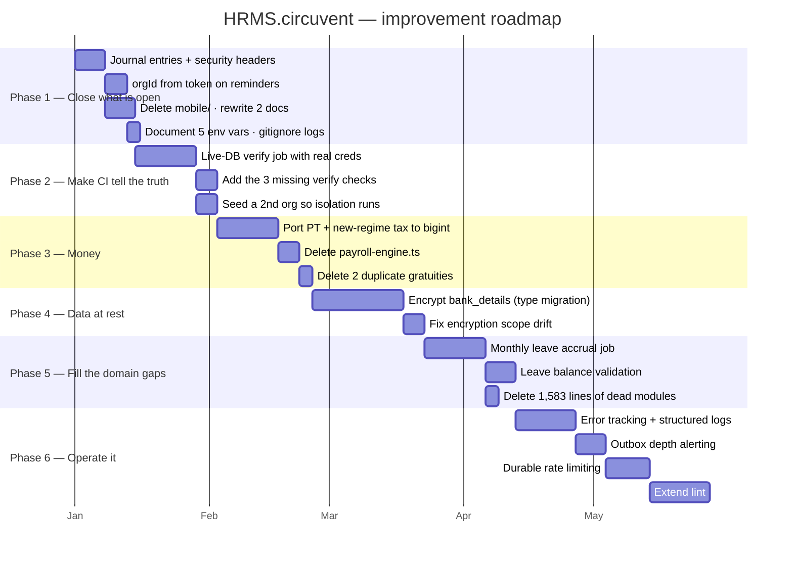

### Phase 1 — Close what is already open (about a week)

Everything here is small, and every item is a known-broken thing rather than an improvement.

| Task | Debt | Why now |
| --- | --- | --- |
| Add two journal entries | D-10 | It is the one **currently failing** check. Two lines of JSON. |
| Add security headers to `next.config.ts` | D-05 | Highest value-per-hour item in this document |
| Derive `orgId` from the token on `/api/documents/reminders`, and rate-limit it | D-02 | Closes the only tenancy exception in 150 routes |
| Delete `mobile/`, rewrite `PLATFORM-ARCHITECTURE.md` and `DEPLOYMENT.md` | D-36, D-06 | Both actively mislead new engineers today |
| Document the 5 env vars; gitignore `dev2.log` and `build_output2.txt` | D-11, D-19 | Trivial |

### Phase 2 — Make CI tell the truth (2–3 weeks)

```
   ADD A JOB THAT CONNECTS TO A REAL DATABASE.

   A dedicated CI Neon branch, seeded with TWO organisations, with
   DATABASE_URL pointing at hrms_app. Then run:

     npm run db:verify:live      ← the plant-as-A-read-as-B experiment
                                   FINALLY EXECUTES
     npm run db:verify:reach     ← proves credential containment

   Plus the three checks CI currently skips:
     typecheck:mobile (or drop it with mobile/)
     lint:a11y
     audit:unwired

   OUTCOME: CI becomes capable of catching the class of failure that
   already occurred once. Right now it is not.
```

### Phase 3 — Finish the money migration (3 weeks)

1. Port `calculateProfessionalTax` and `calculateNewRegimeIncomeTax` to bigint, in `statutory-india.ts` alongside their siblings.
2. Repoint `payroll.neon.ts` at them. **Delete the `minorToMajor()` round-trip.**
3. Delete `payroll-engine.ts` entirely — the other five functions already have no callers.
4. Delete `calculateGratuity` from `payroll-engine.ts` and `hr-utils.ts`. One implementation, in `statutory-india.ts`.
5. Add a regression test asserting there is exactly one gratuity implementation.

### Phase 4 — Data at rest (3–4 weeks)

`bank_details` is `jsonb`. Encrypting it means a column type change, a backfill and a read-path change — not a one-line addition to `TARGETS`. Sequence: add `bank_details_encrypted text` → dual-write → backfill → switch reads → drop the old column. While in there, resolve the encryption scope drift (D-21).

### Phase 5 — Fill the domain gaps (3 weeks)

Monthly accrual (`accrued_days` finally does something) · a pure `validateLeaveRequest(request, balance, policy)` in `src/lib` · delete the three dead modules.

### Phase 6 — Operate it (6–8 weeks)

Error tracking · structured logs · alerting on outbox depth and age · durable rate limiting (Redis/Upstash — already planned in-code) · extend `lint:strict` past the allow-list.

---

## 7. What not to change

```
   ✅ THE PURE-CORE / IMPURE-SHELL SPLIT
      It is why 2,664 tests run in under a minute with no database.

   ✅ THE NINE VERIFICATION SCRIPTS
      They check things a test suite structurally cannot. Adding more
      unit tests would not have caught the BYPASSRLS incident. These do.

   ✅ THE TRANSACTIONAL OUTBOX, ALL FOUR TIMES
      The queue row and the business change commit together, or neither.

   ✅ assertConnectionIsolatesTenants()
      The single best line of defence in the codebase.

   ✅ FORCE ROW LEVEL SECURITY
      "a mistake in a migration script must not be able to read across
       tenants either."

   ✅ THE HASH-CHAINED, APPEND-ONLY AUDIT LOG
      Revoked at the grant level AND trigger-protected AND hash-chained.

   ✅ MFA THAT WILL NOT ISSUE BACKUP CODES FOR AN UNPROVEN SECRET
      Rare, and correct.

   ✅ interview_scorecards.submitted_at GATING VISIBILITY
      Anchoring bias prevented in the data model, not a UI rule.

   ✅ THE "SELF-DOCUMENTED REGRESSION HISTORY" COMMENT CONVENTION
      Modules that open by naming the specific bug they exist to prevent.
      This audit was materially easier because of it, and so is every
      future one.

   ✅ assistant.ts REFUSING TO INVENT, AND ap-holidays.ts REFUSING TO GUESS
      Two systems that would rather say "I cannot see that" than be
      confidently wrong. Keep both.
```

---

## 8. If you only do five things

```
   ┌────┬─────────────────────────────────────────────────┬────────────┐
   │ 1  │ Add the two missing migration journal entries   │ 10 minutes │
   │    │ — it is a currently failing check               │            │
   ├────┼─────────────────────────────────────────────────┼────────────┤
   │ 2  │ Add security headers to next.config.ts          │ 1 hour     │
   ├────┼─────────────────────────────────────────────────┼────────────┤
   │ 3  │ Derive orgId from the token on                  │ half a day │
   │    │ /api/documents/reminders, and rate-limit it     │            │
   ├────┼─────────────────────────────────────────────────┼────────────┤
   │ 4  │ Add a CI job with a real two-organisation       │ 1 week     │
   │    │ database, running db:verify:live + :reach       │            │
   ├────┼─────────────────────────────────────────────────┼────────────┤
   │ 5  │ Delete payroll-engine.ts and the two duplicate  │ 1 week     │
   │    │ gratuity implementations                        │            │
   └────┴─────────────────────────────────────────────────┴────────────┘

   #4 is the one that matters most. Everything else on this list is a
   defect. #4 is the capability to notice the next one.
```

---

*Back to **01_SYSTEM_OVERVIEW.md** · **02_DATABASE_AND_DATA_MODELS.md** · **03_INTEGRATIONS_AND_ECOSYSTEM.md** · **04_MAINTENANCE_AND_OPERATIONS.md***


---


<a id="part-6-architecture-diagram-atlas"></a>


# Part 6 · Architecture Diagram Atlas

> **What this is.** Every other document in this folder explains. This one *shows*.
> It is a complete visual inventory of HRMS.circuvent — every module, every route,
> every table, every external call, every workflow, every state machine — with
> nothing summarised away. HRMS is the largest and most sensitive application in
> the suite: 1,454 files, 144,146 lines, 150 audited API routes (153 found by
> direct enumeration in this pass), 117 audited database tables (123 found by
> direct enumeration — see §7), and 2,664 tests. It is the system of record for
> people: employees, leave, attendance, rostering, payroll, performance and
> documents. It owns the `identity` schema the rest of the eight-application
> suite reads, it is the only application with a working CI pipeline, and its
> tenant-isolation design is the reference the other seven applications should
> copy. Where the source disagreed with the audit in docs 01–05, this document
> says so and gives the source-verified figure — the deltas are small and are
> called out individually, not hidden.
>
> **How to read it.** Each section gives the same information twice: an
> ASCII/Unicode diagram that renders anywhere (a terminal, a diff, a plain-text
> email), and a Mermaid block that renders as an interactive graphic on GitHub,
> in VS Code, and in most wikis. Sections 14–18 exist beyond the standard atlas
> structure because this application's risk surface — row-level security, the
> BYPASSRLS incident, the ATS shared-schema boundary, four outboxes and an
> append-only audit log, and the only real CI pipeline in the suite — earns
> dedicated treatment.

### Legend

```
   ┌──────────┐          a component that exists in this repository
   │  solid   │
   └──────────┘

   ╭┈┈┈┈┈┈┈┈┈┈╮          a component that lives somewhere else
   ┊  dashed  ┊          (Auth, ATS.circuvent, paystub, Neon, a browser, a device)
   ╰┈┈┈┈┈┈┈┈┈┈╯

   ──────▶               a synchronous call, made and awaited
   ┈┈┈┈┈▶                an asynchronous, queued or cron-driven signal
   ══════▶               a redirect, or a schema/tenant boundary crossing

   [D]    dynamic page    a "use client" page under (dashboard), fetching its
                          own data from this app's /api routes — there are no
                          React Server Components fetching data and no
                          "use server" actions anywhere in this repository
   [R]    route handler   an HTTP endpoint under src/app/api/**/route.ts
   [CRON] scheduled job   runs on Vercel's daily cron, not on a user request
   [RLS]  tenant isolation FORCE ROW LEVEL SECURITY is enabled on this table
   DEFECT  a verified, real problem — diagrammed honestly, not hidden
   DEAD    code or schema that exists on disk but is never exercised
```

---

## 1. C4 Level 1 — System context

```
                    ╭┈┈┈┈┈┈┈┈┈┈┈┈┈┈┈┈┈┈┈┈┈┈┈┈┈┈┈┈┈┈┈┈┈┈┈┈┈┈┈┈┈┈┈╮
                    ┊  EMPLOYEE · MANAGER · HR ADMIN · PAYROLL   ┊
                    ┊  ADMIN · CANDIDATE (offer letters only)    ┊
                    ┊  browser, or the Android attendance app    ┊
                    ╰┈┈┈┈┈┈┈┈┈┈┈┈┈┈┈┈┈┈┈┬┈┈┈┈┈┈┈┈┈┈┈┈┈┈┈┈┈┈┈┈┈┈┈╯
                                        │ HTTPS · cookie or bearer JWT
                                        ▼
   ╭┈┈┈┈┈┈┈┈┈┈┈┈┈╮     ┌─────────────────────────────────────────────────┐
   ┊  Okta /     ┊────▶│              HRMS.circuvent                    │
   ┊  Entra ID   ┊SCIM │                                                 │
   ┊ (SCIM push) ┊     │  Next.js 16 App Router · 584 src files          │
   ╰┈┈┈┈┈┈┈┈┈┈┈┈┈╯     │  91 dashboard routes · 153 API routes           │
                       │  System of record for employees, leave,         │
   ╭┈┈┈┈┈┈┈┈┈┈┈┈┈╮     │  attendance, rostering, payroll, performance,   │
   ┊  Biometric  ┊◀────│  documents. Owns the `identity` schema.         │
   ┊  attendance ┊pull └───┬──────────┬──────────┬──────────┬───────────┘
   ┊  devices    ┊         │          │          │          │
   ╰┈┈┈┈┈┈┈┈┈┈┈┈┈╯         │          │          │          │
                          ▼          ▼          ▼          ▼
                 ╭┈┈┈┈┈┈┈┈┈┈╮ ╭┈┈┈┈┈┈┈┈┈╮ ╭┈┈┈┈┈┈┈┈┈┈╮ ╭┈┈┈┈┈┈┈┈┈┈┈╮
                 ┊  Neon    ┊ ┊  Auth   ┊ ┊  ATS     ┊ ┊  paystub  ┊
                 ┊ Postgres ┊ ┊(shared  ┊ ┊(writes   ┊ ┊(indep.    ┊
                 ┊ 123      ┊ ┊ Neon    ┊ ┊ into 7   ┊ ┊ statutory ┊
                 ┊ tables   ┊ ┊ endpoint)┊ ┊ borrowed ┊ ┊ payroll — ┊
                 ┊ FORCE RLS┊ ┊         ┊ ┊ tables)  ┊ ┊no delegate)┊
                 ╰┈┈┈┈┈┈┈┈┈┈╯ ╰┈┈┈┈┈┈┈┈┈╯ ╰┈┈┈┈┈┈┈┈┈┈╯ ╰┈┈┈┈┈┈┈┈┈┈┈╯
                                             │
                                             │ outbox: paystub employee sync
                                             ▼
                                       (drained by /api/cron, daily)

   ALSO REACHED: object/blob storage (documents, punch photos), an SMTP
   sender (notifications, offer letters), and a mail-exchange target for
   directory-group provisioning (see §17).

   THE ONE-LINE VERSION
   HRMS is the only application in the suite with a working CI pipeline and
   the only one that FORCES row-level security everywhere. ATS writes
   straight into its schema with no contract test. Auth's credential could
   once open this database directly — that hole is closed (§16, §14).
```

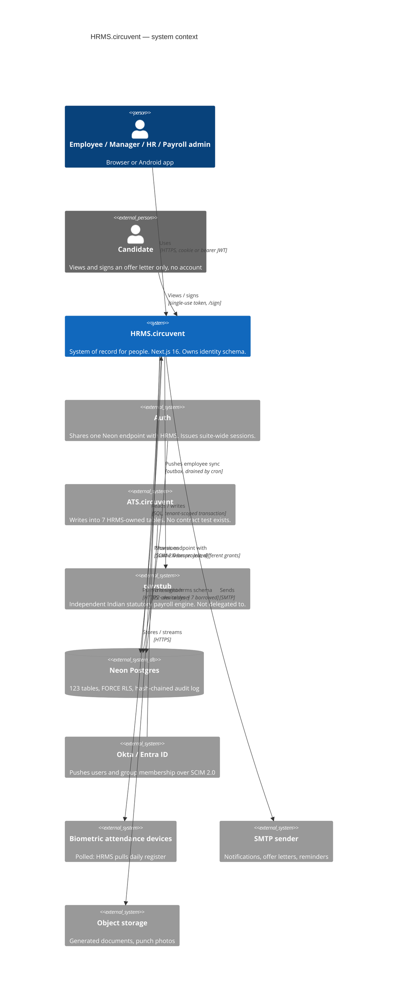

---

## 2. C4 Level 2 — Containers

```
   ┌═══════════════════════════════════════════════════════════════════════╗
   ║                       VERCEL EDGE + CRON                                ║
   ║  ┌────────────────┐  ┌─────────────────────┐  ┌───────────────────┐   ║
   ║  │ Static assets  │  │  Edge middleware     │  │  Daily cron        │   ║
   ║  │ /public        │  │  signed-JWT check,   │  │  GET /api/cron     │   ║
   ║  │                │  │  no DB round-trip    │  │  [CRON]            │   ║
   ║  └────────────────┘  └──────────┬───────────┘  └─────────┬──────────┘   ║
   ╚══════════════════════════════════╪════════════════════════╪═════════════╝
                                      │                        │
   ┌──────────────────────────────────▼════════════════════════▼═════════════┐
   │                    NEXT.js 16 APP ROUTER RUNTIME                        │
   │                                                                         │
   │  ┌───────────────────────┐   ┌────────────────────────────────────┐    │
   │  │  DASHBOARD PAGES [D]  │   │        API ROUTE HANDLERS [R]      │    │
   │  │  91 route folders,    │──▶│  153 route.ts files, 41 top-level  │    │
   │  │  all "use client",    │   │  groups — the ONLY way a page      │    │
   │  │  fetch their own data │   │  reaches data (no RSC data fetch,  │    │
   │  │  (auth, employees,    │   │  no "use server" actions anywhere) │    │
   │  │  leave, attendance,   │   └──────────────┬─────────────────────┘    │
   │  │  payroll, roster, …)  │                  │                          │
   │  └───────────────────────┘                  ▼                          │
   │                                  ┌────────────────────────────────┐    │
   │                                  │  db/repositories/*.neon.ts      │    │
   │                                  │  25 files, one per domain       │    │
   │                                  │  every call wrapped in          │    │
   │                                  │  withTenant() — see §14          │    │
   │                                  └──────────────┬───────────────────┘    │
   │                                                 │                       │
   │  ┌───────────────────────────────────────────┐  │                       │
   │  │  lib/ — 81 modules + 54 tests, 16 dirs:    │  │                       │
   │  │  statutory-india, payroll-engine,          │  │                       │
   │  │  settlement, compliance-engine,            │  │                       │
   │  │  employee-lifecycle, outbox-sweep,         │◀─┘                       │
   │  │  document-templates, crypto, rbac, auth    │                          │
   │  └───────────────────────────────────────────┘                          │
   └──────────────────────────────────┬──────────────────────────────────────┘
                                      │  SQL, one transaction per request,
                                      │  SET LOCAL app.org_id (the GUC)
                                      ▼
                       ┌──────────────────────────────────────┐
                       │   NEON POSTGRES — database `hrms`     │
                       │   schema `identity` — 14 tables       │
                       │   schema `hrms`     — 109 tables      │
                       │   FORCE RLS on every one (§14)         │
                       └──────────────────────────────────────┘

   OUTSIDE THE RUNTIME: object/blob storage for documents and punch photos,
   an SMTP sender, the SCIM inbound surface (Okta/Entra push to
   /api/scim/v2/*), and the attendance device control plane — HRMS PULLS
   from it via /api/attendance/device-sync, not the other way round.
```

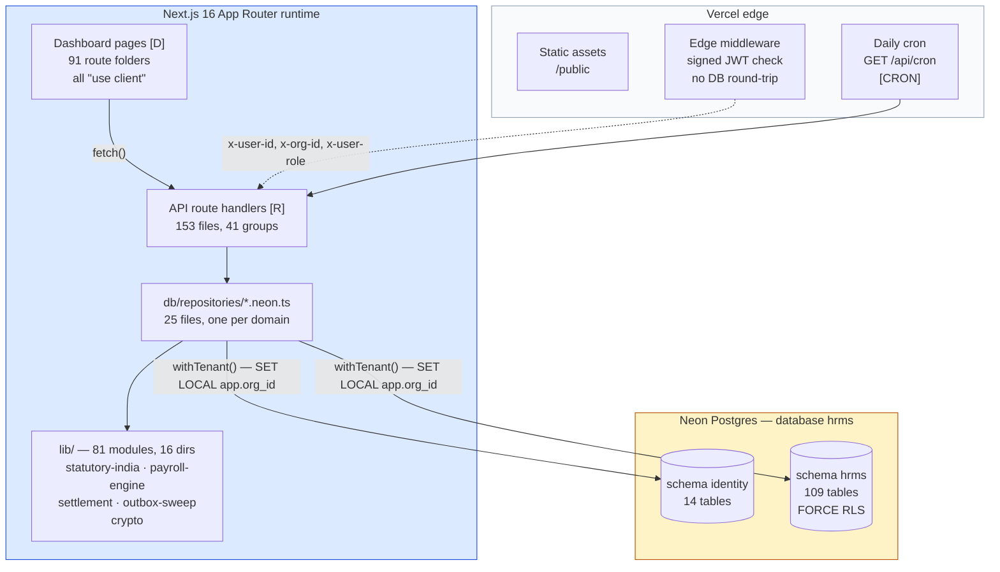

---

## 3. C4 Level 3 — The complete file map

The tree below is the whole repository, one folder per line, with a file count
where a folder is too large to list. Nothing in `src/` is omitted at the
directory level; the three largest leaves (`app/(dashboard)`, `app/api`,
`lib`) are broken out fully in §5, §7 and their own call-outs rather than
repeated here twice.

```
HRMS.circuvent/                             1,454 files, 144,146 lines (audited)
├── .github/workflows/
│   └── verify.yml                          the only CI pipeline in the suite — §18
├── Architecture_Docs/
│   ├── 01_SYSTEM_OVERVIEW.md .. 05_AREAS_OF_ENHANCEMENT.md   fact base for this atlas
│   ├── 06_ARCHITECTURE_DIAGRAMS.md         this document
│   ├── Architecture_Guide.{md,docx,pdf}    generated narrative export
│   ├── Architecture_Overview.pptx          generated slide export
│   └── generate_docs.py                    builds the exports above
├── android/                                Capacitor native shell (Kotlin + iosApp/)
├── docs/                                   DEPLOYMENT, PLATFORM-ARCHITECTURE,
│                                            PLAY-STORE, ROADMAP
├── drizzle/
│   ├── 0000_*.sql .. 0041_*.sql            43 migrations, two share number "0033" — §12
│   └── meta/_journal.json                  ledger read by verify-migrations.ts
├── mobile/                                 Expo/React Native client (app.json,
│                                            eas.json)
├── public/                                 12 static assets
├── scripts/                                42 operational scripts — db:verify:*,
│                                            smoke-live, contain-database-access,
│                                            audit:*, seed, backfill
└── src/
    ├── middleware.ts                       edge JWT check, RBAC gate, headers — §10
    ├── app/
    │   ├── (auth)/                         forgot-password, login, register,
    │   │                                   reset-password
    │   ├── (dashboard)/                    91 route folders, 91 pages, all client — §5
    │   ├── api/                            41 route groups, 153 route.ts files — §5
    │   ├── careers/ privacy/ refer/        5 public, unauthenticated surfaces
    │   │   sign/ terms/
    │   └── globals.css, layout.tsx, page.tsx
    ├── components/
    │   ├── shared/hr-components.tsx        ONE file — every shared component
    │   └── ui/                             31 files — shadcn/radix primitives
    ├── db/
    │   ├── schema/                         14 files, 122 Drizzle tables +
    │   │                                   doc_store — §7
    │   ├── repositories/                   25 files — one *.neon.ts per domain
    │   └── client.ts                       pool, withTenant(), assertConnection-
    │                                       IsolatesTenants()
    ├── hooks/                              7 files — use-auth, use-rbac, use-hr-metrics
    ├── lib/                                81 modules + 54 tests, 16 subdirs — §4
    ├── stores/                             12 files — Zustand, one per domain slice
    └── types/index.ts                      shared TS types barrel
```

No Server Actions exist anywhere in `src/` (`grep "use server"` returns zero
matches). Every dashboard page is a client component that calls the app's own
route handlers with `fetch()` — a client-rendered pattern, unlike an
RSC-plus-Server-Action design. `components/shared/` is a single 1-file module,
which is itself a fact worth recording: there is no per-domain component
library, so every dashboard feature either reaches into that one file or into
`components/ui/`.

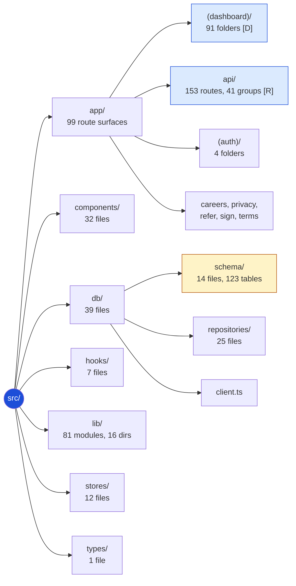

---

## 4. The module/library layer

`src/lib` is 81 non-test modules plus 54 colocated `*.test.ts` files at its
top level, and 16 further subdirectories of the same shape. Grouped by theme:

```
GROUP                          KEY FILES                            CONSUMED BY
────────────────────────────── ──────────────────────────────────── ─────────
Statutory payroll & pay        statutory-india.ts (gratuity #1, PT,  payroll.neon.ts,
  (14 files + money/ 4)        PF, ESI), payroll-engine.ts           payslip routes,
                                (gratuity #2), payroll-client.ts,     settlement page
                                arrears.ts, form16.ts,
                                income-tax-declaration.ts,
                                bank-advice/-rules/-client.ts,
                                compensation.ts, settlement.ts,
                                employee-loans.ts, ap-holidays.ts,
                                paystub-client.ts · money/format.ts,
                                money/minor.ts (bigint <-> paise)
Attendance, rostering,         attendance-regularisation.ts,         attendance/*,
  devices (4 + attendance/ 6)  attendance-selfie.ts, rostering.ts,   rostering/*,
                                date-keys.ts · attendance/           schedulehub routes
                                device-client.ts, device-sync.ts,
                                work-log.ts
Identity, auth, SSO, SCIM      rbac.ts, server-auth.ts, api-keys.ts, middleware.ts,
  (8 + auth/ 13)               api-context.ts, api-v1-context.ts,    every route [R]
                                sso.ts, scim.ts, circuvent-sso.ts ·
                                auth/session.ts, tokens.ts, mfa.ts,
                                mfa-enrolment.ts, passkey-ceremony.ts,
                                password.ts, role-rank.ts, webauthn.ts,
                                directory-org.ts
Lifecycle & onboarding          employee-lifecycle.ts (0 importers,    onboarding,
  (7 files)                     D-13 dead code), employee-rules.ts,   offboarding,
                                employee-code.ts, intern-lifecycle.ts, journey routes
                                lifecycle-rules, onboarding-groups.ts,
                                offer-rules.ts
Documents, letters, e-sign      document-rules/-mail/-notify/         documents,
  (7 + templates 2 + docs 2)   -dispatch/-pdf-outbox.ts,              letters,
                                letters-client.ts, mailer.ts ·         offboarding,
                                document-templates/catalog.ts,         recruitment
                                documents/render-pdf.ts,               routes
                                documents/signature-image.ts
Outbox & cross-app sync        outbox-sweep.ts (sweeps 3 of 4         /api/cron [CRON],
  (6 files)                     outboxes — §17), directory-group-      §6, §17
                                outbox.ts, directory-sdk.ts,
                                cross-app-sync.ts, employee-client.ts,
                                paystub-sync-outbox.ts
Recruitment / ATS boundary     ats.ts — the one module that reads     ats routes, §16
  (1 file)                     and writes the 7 HRMS-owned tables
                                ATS.circuvent also writes to
Governance & custom fields     governance.ts, compliance-engine.ts   compliance,
  (3 files)                    (0 importers, D-13 dead), custom-      compliancehub
                                fields.ts                             routes
Workforce services             assets.ts, expense-rules.ts,           assets,
  (11 files)                   benefits-rules/-client.ts,             expenses,
                                learning-rules.ts, referral-rules.ts,  mybenefits,
                                referral-invite(-email).ts,            referrals,
                                holiday-import.ts, celebrations.ts,    helpdesk
                                sla.ts                                 routes
Reporting & intelligence       reporting-engine.ts (0 importers,      reports,
  (3 + intelligence 2          D-13 dead), insights-reporter.ts,       orghealth,
  + reporting/ 1)              assistant.ts · intelligence/anomaly.ts, chatbot
                                attrition.ts · reporting/builder.ts    routes
Security, encryption, a11y     crypto/field-encryption.ts (PAN        auth, settings,
  (1 + crypto 1 + a11y 1       only — bank_details is not covered),   bankdetails routes
  + color 1)                   color/contrast.ts, a11y/clickable.ts
Mobile, storage, notify,       mobile-app.ts · mobile/api-client.ts,   Android/Expo
  workflow, integrations       geofence.ts, offline-queue.ts ·        apps,
  (1 + 4 subdirs, 19 files)    storage/object-store.ts ·              notifications,
                                notifications/engine.ts, notify.ts,   provisioning
                                transport.ts · workflow/engine.ts ·   routes
                                integrations/deliver.ts, endpoint.ts,
                                permissions.ts, provisioning.ts
Shared infrastructure          constants.ts, utils.ts,                everywhere
  (12 files)                   validations.ts, validation-response.ts,
                                form-schemas.ts, form-validations.ts,
                                seo.ts, og-fonts.ts, brand-logo.ts,
                                ecosystem.ts, settings-sections.ts,
                                collection-service.ts (doc_store — §7)
```

The float seam (§5 of `05_AREAS_OF_ENHANCEMENT.md`) sits exactly at the
boundary drawn below: `payroll.neon.ts` is a repository, not a `lib` module,
and it is the only caller that steps outside bigint minor units to reach
`payroll-engine.ts`'s two float-typed functions.

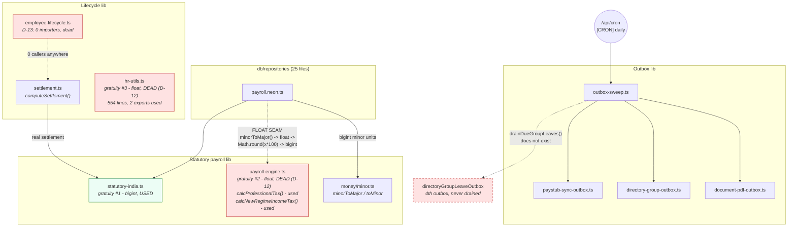

---

## 5. The complete route map

Direct enumeration of `src/app/api/**/route.ts` finds **153 routes across 41 groups** —
three more than the ~150 the last audit counted; the small delta is not reconciled against
the audit's own methodology and is noted here rather than silently absorbed. Every route is
a request-time function — there is no static/ISR split to draw here the way a public
marketing site would have one; that distinction belongs to Career.circuvent, not to a
system of record. All 153 are listed below, grouped identically to the file tree in §3.

### 5.1 Every route, complete

```
/api/announcements/                         (1 route)
    /api/announcements                            GET,POST

/api/assets/                                (6 routes)
    /api/assets                                   GET
    /api/assets/[id]                              POST
    /api/assets/[id]/history                      GET
    /api/assets/[id]/schedule                     GET
    /api/assets/clearance                         GET
    /api/assets/valuation                         GET

/api/ats/                                   (6 routes)
    /api/ats/applications                         POST,GET
    /api/ats/applications/[id]                    GET,POST
    /api/ats/applications/[id]/scorecards         GET,POST
    /api/ats/offers                               POST,GET
    /api/ats/offers/[id]                          POST
    /api/ats/reports                              GET

/api/attendance/                            (7 routes)
    /api/attendance                               GET
    /api/attendance/[id]/photo                    GET
    /api/attendance/clock                         POST,GET
    /api/attendance/device-sync                   POST
    /api/attendance/policy                        GET,PUT
    /api/attendance/regularisation                GET,POST,PATCH
    /api/attendance/summary                       GET

/api/auth/                                  (15 routes)
    /api/auth/callback                            GET
    /api/auth/forgot-password                     POST
    /api/auth/login                               POST
    /api/auth/logout                              POST
    /api/auth/me                                  GET
    /api/auth/mfa                                 GET,POST,DELETE
    /api/auth/mfa/confirm                         POST
    /api/auth/passkey/login                       GET,POST
    /api/auth/passkey/register                    GET,POST
    /api/auth/refresh                             POST
    /api/auth/register                            POST
    /api/auth/reset-password                      POST
    /api/auth/sso                                 GET
    /api/auth/sso/start                           GET
    /api/auth/validate-employee                   POST,GET

/api/benefits/                              (4 routes)
    /api/benefits/claims                          GET,POST
    /api/benefits/dependants                      GET,POST
    /api/benefits/enrolments                      GET,POST
    /api/benefits/plans                           GET

/api/collections/                           (2 routes)
    /api/collections/[collection]                 GET,POST
    /api/collections/[collection]/[id]            GET,PATCH,PUT,DELETE

/api/compensation/                          (8 routes)
    /api/compensation/bands                       GET,POST
    /api/compensation/cycles                      POST,GET
    /api/compensation/cycles/[id]/apply           POST
    /api/compensation/cycles/[id]/approve         POST
    /api/compensation/cycles/[id]/budget          GET
    /api/compensation/cycles/[id]/recommendations GET,POST
    /api/compensation/equity                      GET
    /api/compensation/recommendations/[id]        PATCH

/api/cron/                                  (1 route)
    /api/cron                                     GET

/api/custom-fields/                         (3 routes)
    /api/custom-fields/definitions                GET,POST
    /api/custom-fields/definitions/[id]           PATCH
    /api/custom-fields/values                     GET,PUT

/api/departments/                           (1 route)
    /api/departments                              GET,POST

/api/documents/                             (8 routes)
    /api/documents                                GET
    /api/documents/[id]                           GET
    /api/documents/[id]/pdf                       GET
    /api/documents/[id]/send                      POST
    /api/documents/[id]/void                      POST
    /api/documents/generate                       POST
    /api/documents/reminders                      POST
    /api/documents/templates                      GET,POST

/api/employees/                             (5 routes)
    /api/employees                                GET,POST
    /api/employees/[id]                           GET,PATCH,DELETE
    /api/employees/[id]/direct-reports            GET
    /api/employees/bank-details                   GET,PUT
    /api/employees/stats/by-status                GET

/api/expenses/                              (3 routes)
    /api/expenses                                 GET,POST
    /api/expenses/[id]                            GET
    /api/expenses/[id]/decision                   POST

/api/governance/                            (6 routes)
    /api/governance/consent                       GET,POST
    /api/governance/holds                         POST,DELETE,GET
    /api/governance/policies                      GET,POST
    /api/governance/requests                      GET,POST
    /api/governance/requests/[id]                 POST
    /api/governance/subject-access                GET

/api/groups/                                (2 routes)
    /api/groups                                   GET
    /api/groups/mail                              POST

/api/health/                                (1 route)
    /api/health                                   GET

/api/helpdesk/                              (5 routes)
    /api/helpdesk                                 GET,POST
    /api/helpdesk/[id]                            GET,PATCH
    /api/helpdesk/[id]/comments                   POST
    /api/helpdesk/escalations                     POST
    /api/helpdesk/knowledge                       GET

/api/holidays/                              (2 routes)
    /api/holidays                                 GET,POST
    /api/holidays/bulk                            POST

/api/icon/                                  (1 route)
    /api/icon                                     GET

/api/integrations/                          (3 routes)
    /api/integrations                             GET,POST
    /api/integrations/[id]                        PATCH,DELETE
    /api/integrations/[id]/test                   POST

/api/learning/                              (7 routes)
    /api/learning/certifications                  GET
    /api/learning/compliance                      GET
    /api/learning/courses                         GET
    /api/learning/courses/[id]                    GET
    /api/learning/enrolments                      GET,POST
    /api/learning/enrolments/[id]/assessment      POST
    /api/learning/enrolments/[id]/progress        POST

/api/leave/                                 (3 routes)
    /api/leave                                    GET,POST
    /api/leave/[id]/decision                      POST
    /api/leave/balances                           GET

/api/lifecycle/                             (3 routes)
    /api/lifecycle                                GET,POST
    /api/lifecycle/[id]                           GET,POST
    /api/lifecycle/tasks/[taskId]                 PATCH

/api/loans/                                 (1 route)
    /api/loans                                    GET,POST

/api/notifications/                         (1 route)
    /api/notifications                            GET

/api/payroll/                               (3 routes)
    /api/payroll/payslips                         GET
    /api/payroll/runs                             GET,POST
    /api/payroll/runs/[id]                        GET,POST

/api/performance/                           (11 routes)
    /api/performance/calibration                  POST
    /api/performance/check-ins                    GET,POST
    /api/performance/cycles                       GET
    /api/performance/cycles/[id]/distribution     GET
    /api/performance/cycles/[id]/grid             GET
    /api/performance/cycles/[id]/reviews          POST
    /api/performance/feedback                     GET,POST
    /api/performance/feedback/[id]                POST
    /api/performance/feedback/aggregate           GET
    /api/performance/goals                        GET,PATCH
    /api/performance/goals/[id]                   PATCH

/api/public/                                (1 route)
    /api/public/referral/[token]                  GET,POST

/api/recruitment/                           (1 route)
    /api/recruitment                              GET,POST,PATCH

/api/referrals/                             (5 routes)
    /api/referrals                                GET,POST
    /api/referrals/[id]/payout                    POST
    /api/referrals/[id]/transition                POST
    /api/referrals/payable                        GET
    /api/referrals/stats                          GET

/api/reports/                               (3 routes)
    /api/reports                                  GET
    /api/reports/fields                           GET
    /api/reports/run                              POST

/api/roster/                                (8 routes)
    /api/roster/my-shifts                         GET
    /api/roster/patterns                          GET,POST
    /api/roster/rosters                           POST,GET
    /api/roster/rosters/[id]                      GET
    /api/roster/rosters/[id]/generate             POST
    /api/roster/rosters/[id]/publish              POST
    /api/roster/swaps                             POST,GET
    /api/roster/swaps/[id]                        POST

/api/scim/                                  (3 routes)
    /api/scim/v2/ServiceProviderConfig            GET
    /api/scim/v2/Users                            GET,POST
    /api/scim/v2/Users/[id]                       GET,PUT,PATCH,DELETE

/api/sign/                                  (1 route)
    /api/sign/[id]                                GET,POST

/api/sync/                                  (2 routes)
    /api/sync/bulk                                POST
    /api/sync/employee                            GET

/api/tax/                                   (2 routes)
    /api/tax/declaration                          GET,PUT
    /api/tax/form16                               GET

/api/team/                                  (1 route)
    /api/team/pulse                               GET

/api/v1/                                    (4 routes)
    /api/v1/attendance                            GET,POST
    /api/v1/employees                             GET,POST
    /api/v1/leave                                 GET
    /api/v1/openapi                               GET

/api/work-arrangements/                     (1 route)
    /api/work-arrangements                        GET,POST,PATCH

/api/workflows/                             (2 routes)
    /api/workflows/[id]/decision                  POST
    /api/workflows/pending                        GET
```

### 5.2 The groups that carry the sharpest edges

Every route above resolves its tenant from a verified credential via `requireApiContext()`
or `requireApiKey()`, then narrows further with an inline role check — confirmed directly in
the route source for every group tabled below. Nine groups are worth a closer look: three for
security load-bearing (auth, SCIM, the two static secrets), two for the schema boundaries this
atlas must diagram (ats, payroll), and the rest for scale or an unusual auth shape.

**Auth — 15 routes, the widest attack surface in the application**

| Route | Method | Auth | Purpose |
| --- | :-: | --- | --- |
| `/api/auth/register` | POST | none | Creates an organisation and its first user, signs them in |
| `/api/auth/login` | POST | none | Password sign-in; token set as an httpOnly cookie, never in the body |
| `/api/auth/logout` | POST | session | Clears the cookie **and** revokes the refresh token in the database |
| `/api/auth/refresh` | POST | refresh cookie | Rotates the refresh token, mints a fresh access token |
| `/api/auth/me` | GET | session | Reads the signed access token only — no database round-trip |
| `/api/auth/forgot-password` | POST | none | Issues a single-use password-reset link |
| `/api/auth/reset-password` | POST | reset token | Consumes the token once, sets a new password |
| `/api/auth/mfa` | GET,POST,DELETE | session | Enrol/inspect/disable TOTP — own account only, no `userId` param |
| `/api/auth/mfa/confirm` | POST | session | Proves the authenticator works; activates 2FA, issues recovery codes |
| `/api/auth/passkey/register` | GET,POST | session | WebAuthn passkey enrolment ceremony |
| `/api/auth/passkey/login` | GET,POST | none | WebAuthn passkey sign-in ceremony |
| `/api/auth/sso` | GET | none, CORS-scoped | Tells another suite app (ATS, Office) whether SSO is enabled here |
| `/api/auth/sso/start` | GET | none | Begins the federation handshake with the configured IdP |
| `/api/auth/callback` | GET | IdP-signed response | IdP approved sign-in; HRMS still refuses a suspended employee |
| `/api/auth/validate-employee` | POST,GET | service caller | Confirms an email is an active employee here — called by another suite app |

**SCIM — 3 routes, inbound identity provisioning**

| Route | Method | Auth | Purpose |
| --- | :-: | --- | --- |
| `/api/scim/v2/ServiceProviderConfig` | GET | none | SCIM 2.0 capability discovery document |
| `/api/scim/v2/Users` | GET,POST | SCIM bearer token | List / create users — IdP-driven provisioning |
| `/api/scim/v2/Users/[id]` | GET,PUT,PATCH,DELETE | SCIM bearer token | Read / replace / patch / deprovision one user |

**ATS — 6 routes, the shared-schema boundary (full diagram in §16)**

| Route | Method | Auth | Purpose |
| --- | :-: | --- | --- |
| `/api/ats/applications` | POST,GET | hr+ (POST), manager+ (GET) | Create / list candidate applications |
| `/api/ats/applications/[id]` | GET,POST | manager+ | Read one application, advance its stage |
| `/api/ats/applications/[id]/scorecards` | GET,POST | hiring team | Interview scorecards |
| `/api/ats/offers` | POST,GET | hr+ | Create / list offers |
| `/api/ats/offers/[id]` | POST | owner/admin | Approve, countersign, or void one offer |
| `/api/ats/reports` | GET | manager+ | Recruitment funnel reporting |

**Payroll — 3 routes, the float seam lives one layer below these (§4)**

| Route | Method | Auth | Purpose |
| --- | :-: | --- | --- |
| `/api/payroll/payslips` | GET | self, or hr+ for anyone | Own payslip history — **managers are deliberately excluded**: a reporting line is not authority to see someone's pay |
| `/api/payroll/runs` | GET,POST | hr+ | List runs / kick off a new one |
| `/api/payroll/runs/[id]` | GET,POST | hr+ (GET), owner/admin (approve) | Inspect a run; advance its state machine |

**Roster — 8 routes, the scheduling engine's surface**

| Route | Method | Auth | Purpose |
| --- | :-: | --- | --- |
| `/api/roster/my-shifts` | GET | session | The caller's own upcoming shifts |
| `/api/roster/patterns` | GET,POST | session, role-gated | Shift-pattern templates — list / create |
| `/api/roster/rosters` | POST,GET | session, role-gated | Create / list roster periods |
| `/api/roster/rosters/[id]` | GET | session | One roster's assignments |
| `/api/roster/rosters/[id]/generate` | POST | session, role-gated | Auto-assign shifts from a pattern |
| `/api/roster/rosters/[id]/publish` | POST | owner/admin/hr/manager | Locks the roster and notifies staff |
| `/api/roster/swaps` | POST,GET | session | Request / list shift swaps |
| `/api/roster/swaps/[id]` | POST | session, role-gated | Approve or reject a swap |

**Performance — 11 routes, the largest single group**

| Route | Method | Auth | Purpose |
| --- | :-: | --- | --- |
| `/api/performance/calibration` | POST | owner/admin/hr | Cross-team rating calibration session |
| `/api/performance/check-ins` | GET,POST | self, manager+ for reports | 1:1 check-in notes |
| `/api/performance/cycles` | GET | self, manager+ for all | List review cycles |
| `/api/performance/cycles/[id]/distribution` | GET | manager+ | Rating distribution across a cycle |
| `/api/performance/cycles/[id]/grid` | GET | owner/hr only | The 9-box grid — tighter than distribution |
| `/api/performance/cycles/[id]/reviews` | POST | owner/admin/hr | Opens a cycle's review tasks |
| `/api/performance/feedback` | GET,POST | self, manager+ for others' | Peer / 360 feedback |
| `/api/performance/feedback/[id]` | POST | session | Respond to one feedback request |
| `/api/performance/feedback/aggregate` | GET | owner/hr only | Aggregated feedback across the org |
| `/api/performance/goals` | GET,PATCH | self, manager+ for reports | OKR / goal list and update |
| `/api/performance/goals/[id]` | PATCH | manager+ | Update one goal |

**Collections — 2 routes, the generic `doc_store` backend (see §7, §17)**

| Route | Method | Auth | Purpose |
| --- | :-: | --- | --- |
| `/api/collections/[collection]` | GET,POST | session | CRUD for one allow-listed small collection |
| `/api/collections/[collection]/[id]` | GET,PATCH,PUT,DELETE | session | Same, single-record operations |

**v1 — 4 routes, the only scoped-API-key surface in the app**

| Route | Method | Auth | Purpose |
| --- | :-: | --- | --- |
| `/api/v1/attendance` | GET,POST | API key, `attendance:read`/`write` scope | External attendance integration |
| `/api/v1/employees` | GET,POST | API key, `employees:read`/`write` scope | External directory sync |
| `/api/v1/leave` | GET | API key, `leave:read` scope | External leave-balance read |
| `/api/v1/openapi` | GET | none | This API's own OpenAPI 3 document |

**Cron and the one tenancy exception — 2 routes, Doc 05 D-02 and D-17**

| Route | Method | Auth | Purpose |
| --- | :-: | --- | --- |
| `/api/cron` | GET | `CRON_SECRET` bearer, `timingSafeEqual`, fails **closed** (503) if unset | Daily sweep: outboxes, reminders, retention |
| `/api/documents/reminders` | POST | `CROSS_APP_SYNC_TOKEN` bearer, or session hr+ | The one route where `orgId` comes from the query string, not the token — see §5.3 |

### 5.3 Auth tiers, end to end

```mermaid
flowchart TB
    subgraph pub["No credential at all — 11 routes"]
        p1["health, icon, v1/openapi<br/>scim/ServiceProviderConfig"]
        p1b["auth/sso, auth/sso/start, auth/callback<br/>auth/login, auth/register<br/>auth/forgot-password, auth/passkey/login"]
    end
    subgraph resToken["Per-resource single-use token — 3 routes"]
        r1["sign/[id] — 256-bit, hash-compared<br/>public/referral/[token] — 256-bit, rate-limited<br/>auth/reset-password — single-use reset token"]
    end
    subgraph svc["Service-to-service caller — 1 route"]
        s1["auth/validate-employee<br/>(called by another suite app)"]
    end
    subgraph def["Session + role gate — the default, 131 routes"]
        d1["everything else:<br/>employees, leave, attendance, payroll,<br/>performance, roster, ats, compensation,<br/>governance, helpdesk, learning, collections .."]
    end
    subgraph scimTier["SCIM bearer token — 2 routes"]
        sc1["scim/Users, scim/Users/[id]<br/>hash at rest, constant-time compare"]
    end
    subgraph keyTier["Scoped API key — 3 routes"]
        k1["v1/attendance, v1/employees, v1/leave<br/>per-key scopes + rate-limit bucket"]
    end
    subgraph staticTier["Static shared secret — flagged, 2 routes"]
        cronN["cron<br/>CRON_SECRET · no nonce · no rate limit"]
        remN["documents/reminders<br/>CROSS_APP_SYNC_TOKEN, orgId from query string"]
    end

    style remN fill:#FEE2E2,stroke:#B91C1C
    style cronN fill:#FEF3C7,stroke:#B45309
    style sc1 fill:#ECFDF5,stroke:#15803D
    style k1 fill:#ECFDF5,stroke:#15803D
```

> In 152 of 153 routes the tenant is read from a verified credential — never the request
> body, never the query string. `/api/documents/reminders` is the sole exception: once the
> static `CROSS_APP_SYNC_TOKEN` is accepted, `orgId` is read from `?orgId=` in the query
> string. Anyone holding that shared, unrotated, unrate-limited token can name any tenant and
> trigger mass reminder e-mails for it. Doc 05, D-02 (critical) and D-17 (high) for `/api/cron`.

---

## 6. The complete external contract

Every network call HRMS makes or receives that is *not* the shared-database read
described in §16. HRMS is unusual in the suite: it is simultaneously a relying party
(two OIDC systems trust it to authenticate humans) and the schema owner every other
app reads from directly. This section is the network edge only — sockets, not tables.

```
   ┌────────────────────────────────────────────────────────────────────────┐
   │  INBOUND — things that call HRMS over HTTPS                            │
   ├────────────────────────────────────────────────────────────────────────┤
   │  auth.circuvent.com   OIDC · PKCE+state+nonce · RS256/JWKS · suite SSO  │
   │  Per-tenant IdP       OIDC · same protocol · Okta/Entra/Google,         │
   │                       selected by e-mail domain, NOT SAML (deliberate) │
   │  Okta / Entra SCIM    bearer → SHA-256 → per-org lookup, Users only,   │
   │                       no Groups resource (Doc 05, D-12)                │
   │  cvk_ API keys        3 routes, scope-checked, SHA-256 at rest         │
   │  CRON_SECRET          1 route, `timingSafeEqual`, no nonce/rate-limit  │
   │  CROSS_APP_SYNC_TOKEN 1 route, same env var HRMS also sends OUTBOUND   │
   ├────────────────────────────────────────────────────────────────────────┤
   │  OUTBOUND — things HRMS calls over HTTPS                                │
   ├────────────────────────────────────────────────────────────────────────┤
   │  paystub.circuvent    POST employee master · X-Service-Token:          │
   │                       CROSS_APP_SYNC_TOKEN · outbox + ~17h backoff cap │
   │  auth.circuvent.com   POST group membership · Bearer + X-Service-     │
   │  (directory API)      Token: DIRECTORY_SERVICE_TOKEN · outbox on write│
   │  Device control plane GET register/sites · Bearer ATTENDANCE_DEVICE_  │
   │  api.circuvent.com    TOKEN · pulled by admin action or daily cron    │
   │  SMTP relay           nodemailer · notifications, offer letters ·     │
   │                       FAILS SOFT — logs, returns false, caller proceeds│
   │  Cloudflare R2        @aws-sdk/client-s3 · signed document PDFs ·     │
   │                       FAILS HARD — throws, nothing is silently lost   │
   │  Slack/Teams/webhook  3 routes under /api/integrations/*, admin-only, │
   │  (outbound only)      destination URL passed through checkEndpoint()  │
   │                       — an SSRF guard against internal-network targets│
   ├────────────────────────────────────────────────────────────────────────┤
   │  NAV LINKS ONLY — no REST call exists in this codebase                 │
   │  ATS.circuvent · Mail.circuvent · DevOps.circuvent — ecosystem.ts URLs │
   └────────────────────────────────────────────────────────────────────────┘

   No inbound webhook receiver exists anywhere in 153 routes. A repo-wide
   search for signature headers (x-hub-signature, stripe-signature, HMAC
   verification helpers) returns zero matches — there is nothing today for a
   third party to attack by forging a callback, because there is no callback.
```

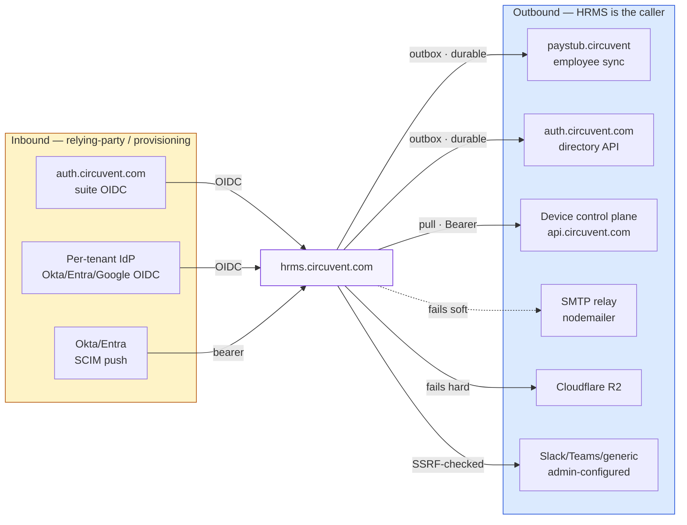

> **The one shared secret that runs both ways.** `CROSS_APP_SYNC_TOKEN` is the header
> HRMS *sends* to authenticate itself to Paystub (`X-Service-Token`, in
> `paystub-client.ts`) and the header HRMS *accepts* to authenticate an inbound caller
> on `/api/documents/reminders` (`server-auth.ts`). One environment variable, two
> trust directions, no distinct rotation path for either. See §5 and Doc 05, D-02/D-17.

> **Why the mailer fails soft and the object store fails hard.** A delayed
> notification is a minor inconvenience the retry queue can absorb quietly. A
> signed document that the outbox believed it had persisted but did not is
> unrecoverable — so `object-store.ts` throws instead of swallowing the error.

---

## 7. Data model — all 123 tables across 15 domains

HRMS owns **123** tables: 122 defined in Drizzle across the 15 files under
`src/db/schema/` (§3), plus one, `hrms.doc_store`, that exists only as raw SQL
(`drizzle/0023_doc_store.sql`) with no Drizzle definition — it is shaped at
runtime from `information_schema`, the same pattern ATS's own `doc_store` uses
one schema over (§16). This exceeds the audited **117** by six; every table
below is traced to a live file or migration, so the gap looks like
under-counting in the original audit rather than tables added since.

**The convention, stated once so it is not repeated 123 times.** Every table
carries `id uuid PK DEFAULT gen_random_uuid()`, `org_id uuid` referencing
`identity.organizations.id` — the FORCE-RLS tenant column, §14 — and
`created_at timestamp`. The one exception is `identity.organizations` itself,
which *is* the tenant. Entities below show only the columns that matter beyond
that convention. Unlike ATS's own tables in this same Postgres instance
(§16 — three of which enable but never FORCE), **every** HRMS-owned table gets
FORCE RLS uniformly through the one sweeping `apply_tenant_rls()` function
(§14); that is not repeated per domain below because the audit found no
exception to it.

### 7.1 People and organization core (5 tables)

`employees` is the hub nearly every other domain references by `employee_id`.

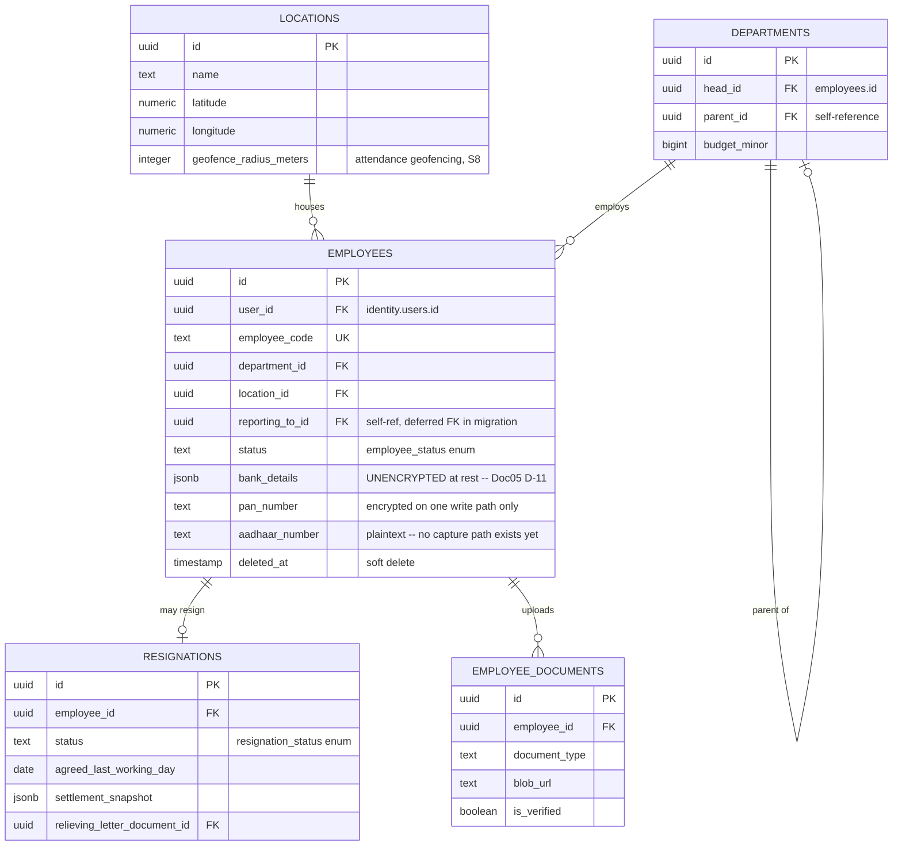

### 7.2 Leave and holidays (4 tables)

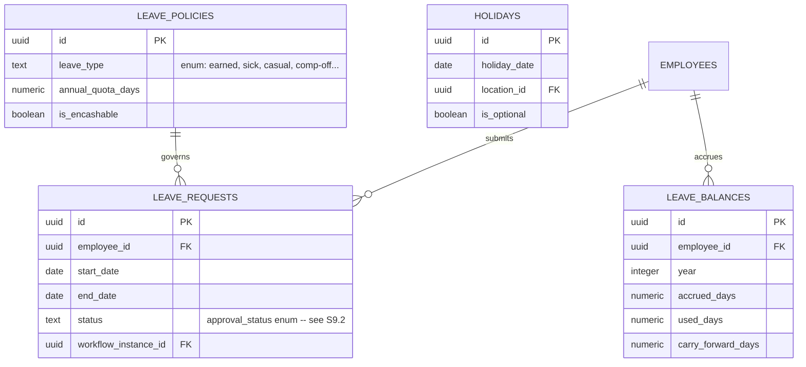

### 7.3 Attendance (6 tables)

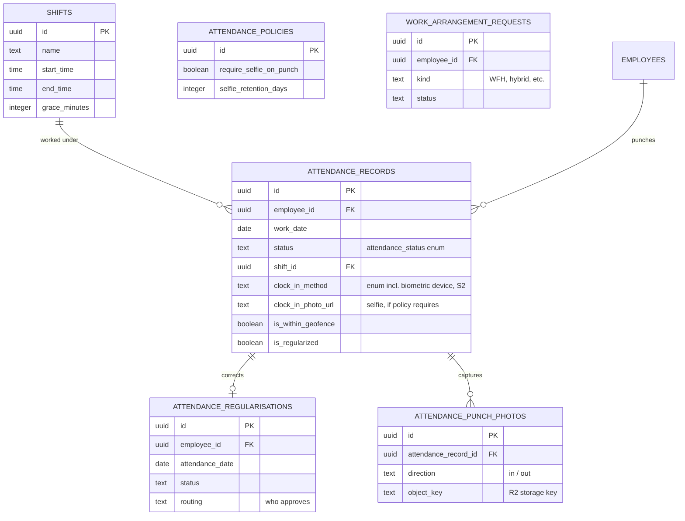

### 7.4 Rostering and scheduling (8 tables)

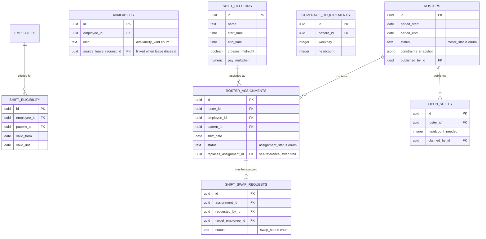

### 7.5 Payroll, compensation and loans (15 tables)

Every money column below is `bigint ..._minor` (integer paise) — the schema
itself never stores a float. The one place a float appears is inside
`payroll.neon.ts`, not in any table (§14 D-03, shown again in §8.4).
`salary_structures.gratuity_minor` is one of **three independent gratuity
implementations** (`statutory-india.ts`, the largely-dead `payroll-engine.ts`,
and `hr-utils.ts`) that nothing checks agree with each other — D-12 confirms
two of the three (`payroll-engine.ts`, `hr-utils.ts`) are dead code with zero
callers, yet both are still exported; only `statutory-india.ts`'s is wired
into `settlement.ts` and actually runs (§4).

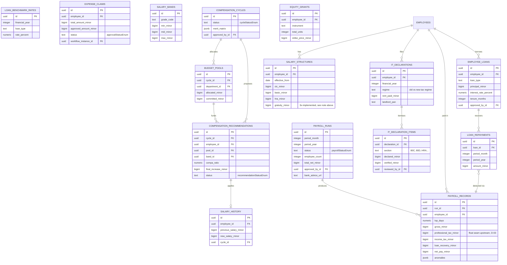

### 7.6 Performance management (10 tables)

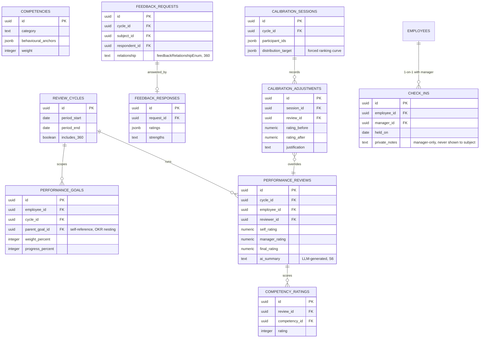

---

### 7.7 Recruitment — the ATS overlap (9 tables)

These nine tables are HRMS's *own* recruitment module — separate from, and a
source of confusion with, ATS's independent applicant-tracking product that
writes into this same schema (§16). `job_postings`, `candidates`,
`applications`, `interviews` and `offers` are five of the seven tables ATS
borrows; the other two are `employees` (§7.1) and `diversity_responses` —
a table that exists in the shared `hrms` schema but appears in NEITHER
this Drizzle schema NOR any HRMS migration (§16).

```mermaid
erDiagram
    JOB_POSTINGS {
        uuid id PK
        text title
        text slug UK
        uuid department_id FK
        text employment_type
        integer openings
        integer filled
        boolean is_published
    }
    CANDIDATES {
        uuid id PK
        text email
        jsonb parsed_resume
        numeric total_experience_years
        bigint expected_ctc_minor
        uuid referred_by_id FK
    }
    APPLICATIONS {
        uuid id PK
        uuid job_id FK
        uuid candidate_id FK
        text stage
        text status
        integer match_score
        text tracking_token
    }
    PIPELINE_STAGES {
        uuid id PK
        uuid job_id FK
        text kind "pipelineStageKindEnum"
        integer sequence
        integer auto_reject_below
    }
    APPLICATION_EVENTS {
        uuid id PK
        uuid application_id FK
        uuid from_stage_id FK
        uuid to_stage_id FK
        uuid actor_id FK
    }
    INTERVIEWS {
        uuid id PK
        uuid application_id FK
        integer round
        timestamp scheduled_at
        jsonb panelist_ids
        integer overall_rating
    }
    INTERVIEW_SCORECARDS {
        uuid id PK
        uuid application_id FK
        uuid interview_id FK
        uuid interviewer_id FK
        jsonb scores
        text recommendation "recommendationEnum"
    }
    OFFERS {
        uuid id PK
        uuid application_id FK
        integer version
        uuid supersedes_offer_id FK "self-ref, revision trail"
        bigint annual_ctc_minor
        text status "offerStatusEnum"
        uuid document_id FK
    }
    APPLICATION_SOURCES {
        uuid id PK
        uuid application_id FK
        text source
        uuid referrer_id FK
        boolean is_primary
    }
    JOB_POSTINGS ||--o{ APPLICATIONS : receives
    CANDIDATES ||--o{ APPLICATIONS : submits
    JOB_POSTINGS ||--o{ PIPELINE_STAGES : defines
    APPLICATIONS ||--o{ APPLICATION_EVENTS : "moves through"
    APPLICATIONS ||--o{ INTERVIEWS : schedules
    INTERVIEWS ||--o{ INTERVIEW_SCORECARDS : scored_by
    APPLICATIONS ||--o| OFFERS : "may yield"
    APPLICATIONS ||--o| APPLICATION_SOURCES : "attributed to"
```

### 7.8 Documents and e-signature (6 tables)

`doc_store` is the one table with no Drizzle definition at all — raw SQL only
(`drizzle/0023_doc_store.sql`), shaped at runtime.

```mermaid
erDiagram
    DOCUMENT_TEMPLATES {
        uuid id PK
        text name
        text body "token-templated"
        jsonb required_tokens
        boolean requires_signature
        integer version
    }
    DOCUMENT_TEMPLATE_VERSIONS {
        uuid id PK
        uuid template_id FK
        integer version
        text change_note
        uuid changed_by_id FK
    }
    GENERATED_DOCUMENTS {
        uuid id PK
        uuid template_id FK
        integer template_version
        uuid employee_id FK
        uuid candidate_id FK
        text content_hash
        text status "signatureStatusEnum"
    }
    DOCUMENT_SIGNATURES {
        uuid id PK
        uuid document_id FK
        uuid signatory_user_id FK
        integer sequence "signing order"
        text access_token_hash
        text signed_content_hash
    }
    DOCUMENT_PDF_STORAGE_OUTBOX {
        uuid id PK
        uuid document_id FK
        text status
        integer attempt_count
        timestamp uploaded_at
    }
    DOC_STORE["hrms.doc_store (raw SQL only, no Drizzle def)"] {
        uuid id PK
        text kind
        jsonb payload
    }
    DOCUMENT_TEMPLATES ||--o{ DOCUMENT_TEMPLATE_VERSIONS : versions
    DOCUMENT_TEMPLATES ||--o{ GENERATED_DOCUMENTS : renders
    GENERATED_DOCUMENTS ||--o{ DOCUMENT_SIGNATURES : collects
    GENERATED_DOCUMENTS ||--o| DOCUMENT_PDF_STORAGE_OUTBOX : "queued to store, S17"
```

### 7.9 Learning and referrals (8 tables)

```mermaid
erDiagram
    REFERRALS {
        uuid id PK
        uuid referrer_id FK
        uuid candidate_id FK
        text status "referralStatusEnum"
        bigint bonus_amount_minor
        text payout_status "referralPayoutStatusEnum"
        uuid payout_payroll_run_id FK
    }
    REFERRAL_POLICIES {
        uuid id PK
        text seniority
        bigint bonus_amount_minor
        integer qualifying_period_days
        jsonb instalments
    }
    REFERRAL_EVENTS {
        uuid id PK
        uuid referral_id FK
        text from_status
        text to_status
    }
    REFERRAL_INVITES {
        uuid id PK
        uuid referral_id FK
        text token_hash
        timestamp expires_at
        jsonb submission
    }
    COURSES {
        uuid id PK
        text title
        text format "courseFormatEnum"
        boolean is_mandatory
        jsonb mandatory_for_rules
        integer recertify_after_days
    }
    COURSE_MODULES {
        uuid id PK
        uuid course_id FK
        integer sequence
        jsonb assessment
    }
    COURSE_ENROLMENTS {
        uuid id PK
        uuid course_id FK
        uuid employee_id FK
        text state "enrolmentStateEnum"
        integer score_percent
        text certificate_url
    }
    CERTIFICATIONS {
        uuid id PK
        uuid employee_id FK
        text name
        uuid course_enrolment_id FK
        date expires_on
        boolean is_verified
    }
    REFERRALS ||--o{ REFERRAL_EVENTS : logs
    REFERRAL_POLICIES ||--o{ REFERRALS : governs
    REFERRALS ||--o| REFERRAL_INVITES : "candidate self-completes via"
    COURSES ||--o{ COURSE_MODULES : contains
    COURSES ||--o{ COURSE_ENROLMENTS : enrols
    COURSE_ENROLMENTS ||--o| CERTIFICATIONS : "issues on completion"
```

### 7.10 Benefits (6 tables)

```mermaid
erDiagram
    BENEFIT_PLANS {
        uuid id PK
        text benefit_type "benefitTypeEnum"
        bigint employer_contribution_minor
        boolean allows_dependants
        integer max_dependants
    }
    ENROLMENT_WINDOWS {
        uuid id PK
        date opens_on
        date closes_on
        jsonb plan_ids
    }
    BENEFIT_ENROLMENTS {
        uuid id PK
        uuid employee_id FK
        uuid plan_id FK
        uuid window_id FK
        text status "enrolmentStatusEnum"
        bigint employee_cost_minor
    }
    DEPENDANTS {
        uuid id PK
        uuid employee_id FK
        text relation
        boolean is_nominee
        integer nominee_share_percent
    }
    ENROLMENT_DEPENDANTS {
        uuid id PK
        uuid enrolment_id FK
        uuid dependant_id FK
        bigint added_cost_minor
    }
    BENEFIT_CLAIMS {
        uuid id PK
        uuid enrolment_id FK
        uuid dependant_id FK
        bigint claimed_amount_minor
        bigint approved_amount_minor
        text status
    }
    BENEFIT_PLANS ||--o{ BENEFIT_ENROLMENTS : offered_as
    ENROLMENT_WINDOWS ||--o{ BENEFIT_ENROLMENTS : opens
    BENEFIT_ENROLMENTS ||--o{ ENROLMENT_DEPENDANTS : covers
    DEPENDANTS ||--o{ ENROLMENT_DEPENDANTS : covered_via
```

---

### 7.11 Identity and federation (14 tables)

The `identity` schema is HRMS-owned but suite-wide: every other application
reads it for who-is-who and reads `identity.audit_log` for the append-only
trail (§17). `organizations` is the one table that has no `org_id` column —
it *is* the tenant. `sso_*`/`scim_*` back federation (§6).

```mermaid
erDiagram
    ORGANIZATIONS {
        uuid id PK
        text slug UK
        text plan "subscriptionPlanEnum"
        jsonb features
        timestamp deleted_at
    }
    USERS {
        uuid id PK
        uuid org_id FK
        text email
        text password_hash
        text mfa_secret
        integer failed_login_attempts
        timestamp locked_until
    }
    USER_ROLES {
        uuid id PK
        uuid user_id FK
        text app "appEnum -- which of the 8 apps"
        text role "roleEnum"
        jsonb extra_permissions
    }
    SESSIONS {
        uuid id PK
        uuid user_id FK
        text refresh_token_hash
        uuid rotated_to_id FK "self-ref, rotation chain"
        timestamp expires_at
        timestamp revoked_at
    }
    AUTH_TOKENS {
        uuid id PK
        uuid user_id FK
        text purpose "tokenPurposeEnum"
        text token_hash
        timestamp consumed_at
    }
    API_KEYS {
        uuid id PK
        text key_prefix
        text key_hash
        jsonb scopes
        integer rate_limit_per_minute
    }
    SUBSCRIPTIONS {
        uuid id PK
        text plan
        integer max_employees
        integer current_employees
        text external_subscription_id
    }
    AUDIT_LOG {
        uuid id PK
        uuid actor_id FK
        text app "appEnum -- which app wrote this"
        text action
        jsonb before
        jsonb after
        text previous_hash "hash chain, S17"
        text hash "hash chain, S17"
    }
    WEBAUTHN_CREDENTIALS {
        uuid id PK
        uuid user_id FK
        text credential_id
        integer sign_count
    }
    SSO_CONNECTIONS {
        uuid id PK
        text protocol "ssoProtocolEnum"
        text client_secret
        boolean allow_jit_provisioning
    }
    SSO_AUTH_STATES {
        uuid id PK
        uuid connection_id FK
        text state
        text code_verifier
        timestamp expires_at
    }
    SSO_IDENTITIES {
        uuid id PK
        uuid user_id FK
        uuid connection_id FK
        text subject
    }
    SCIM_TOKENS {
        uuid id PK
        text token_hash
        timestamp revoked_at
    }
    SCIM_SYNC_LOG {
        uuid id PK
        uuid token_id FK
        text operation
        integer status_code
    }
    ORGANIZATIONS ||--o{ USERS : tenants
    USERS ||--o{ USER_ROLES : "granted per app"
    USERS ||--o{ SESSIONS : authenticates
    USERS ||--o{ AUTH_TOKENS : "verifies via"
    USERS ||--o{ WEBAUTHN_CREDENTIALS : registers
    SSO_CONNECTIONS ||--o{ SSO_AUTH_STATES : "PKCE flow"
    SSO_CONNECTIONS ||--o{ SSO_IDENTITIES : links
    SCIM_TOKENS ||--o{ SCIM_SYNC_LOG : "inbound provisioning, S8.6"
```

### 7.12 Governance and compliance (6 tables)

The DPDP/GDPR toolchain: retention, legal holds, DSAR intake, and the erasure
ledger that proves *what* was pseudonymised and *why* it was allowed to be.

```mermaid
erDiagram
    RETENTION_POLICIES {
        uuid id PK
        text entity_type
        integer retain_for_months
        text method "erasureMethodEnum"
        boolean overrides_erasure
    }
    LEGAL_HOLDS {
        uuid id PK
        text entity_type
        uuid entity_id
        timestamp released_at
    }
    DATA_SUBJECT_REQUESTS {
        uuid id PK
        text request_type "dataRequestTypeEnum"
        text status "dataRequestStatusEnum"
        uuid subject_employee_id FK
        jsonb outcome
    }
    ERASURE_LOG {
        uuid id PK
        uuid request_id FK
        uuid policy_id FK
        text method "erasureMethodEnum"
        integer rows_affected
        text pseudonym
    }
    CONSENT_RECORDS {
        uuid id PK
        uuid subject_user_id FK
        text purpose
        timestamp granted_at
        timestamp withdrawn_at
    }
    PROCESSING_ACTIVITIES {
        uuid id PK
        text purpose
        text lawful_basis
        jsonb data_categories
        jsonb recipients
    }
    DATA_SUBJECT_REQUESTS ||--o{ ERASURE_LOG : executes
    RETENTION_POLICIES ||--o{ ERASURE_LOG : authorises
    LEGAL_HOLDS }o--|| DATA_SUBJECT_REQUESTS : "may block"
```

### 7.13 Assets (5 tables)

```mermaid
erDiagram
    ASSET_CATEGORIES {
        uuid id PK
        text name
        text default_method "depreciationMethodEnum"
        integer max_per_employee
    }
    ASSETS {
        uuid id PK
        text asset_tag UK
        uuid category_id FK
        text state "assetStateEnum"
        uuid assigned_to_id FK
        bigint purchase_cost_minor
        bigint disposal_proceeds_minor
    }
    ASSET_ASSIGNMENTS {
        uuid id PK
        uuid asset_id FK
        uuid employee_id FK
        timestamp issued_at
        timestamp returned_at
        bigint book_value_on_issue_minor
    }
    ASSET_MAINTENANCE {
        uuid id PK
        uuid asset_id FK
        text kind
        boolean under_warranty
        bigint cost_minor
    }
    ASSET_EVENTS {
        uuid id PK
        uuid asset_id FK
        text action
        text from_state
        text to_state
    }
    ASSET_CATEGORIES ||--o{ ASSETS : classifies
    ASSETS ||--o{ ASSET_ASSIGNMENTS : "issued via"
    ASSETS ||--o{ ASSET_MAINTENANCE : services
    ASSETS ||--o{ ASSET_EVENTS : "state history"
```

### 7.14 Helpdesk (7 tables)

```mermaid
erDiagram
    SLA_POLICIES {
        uuid id PK
        jsonb response_minutes
        jsonb resolution_minutes
        jsonb escalations
    }
    TICKET_CATEGORIES {
        uuid id PK
        uuid parent_id FK "self-reference"
        uuid sla_policy_id FK
        boolean is_confidential
    }
    TICKETS {
        uuid id PK
        text reference UK
        uuid assignee_id FK
        uuid category_id FK
        text priority "ticketPriorityEnum"
        text state "ticketStateEnum"
        boolean response_breached
        boolean resolution_breached
    }
    TICKET_PAUSES {
        uuid id PK
        uuid ticket_id FK
        timestamp paused_at
        timestamp resumed_at
    }
    TICKET_COMMENTS {
        uuid id PK
        uuid ticket_id FK
        uuid author_id FK
        boolean is_internal
    }
    TICKET_EVENTS {
        uuid id PK
        uuid ticket_id FK
        text event_type
        text from_value
        text to_value
    }
    KNOWLEDGE_ARTICLES {
        uuid id PK
        text slug UK
        uuid category_id FK
        integer deflection_count
        boolean is_published
    }
    SLA_POLICIES ||--o{ TICKETS : "clocks against"
    TICKET_CATEGORIES ||--o{ TICKETS : classifies
    TICKETS ||--o{ TICKET_PAUSES : "SLA clock stops"
    TICKETS ||--o{ TICKET_COMMENTS : threads
    TICKETS ||--o{ TICKET_EVENTS : "state history"
    KNOWLEDGE_ARTICLES ||--o{ TICKET_CATEGORIES : deflects
```

### 7.15 Platform, workflow, notifications and outboxes (14 tables)

Custom fields, the generic approval-workflow engine, employee lifecycle
journeys (§9.1), and — the four transactional outboxes plus one non-retrying
reminder log — the integration edges detailed fully in §17.

```mermaid
erDiagram
    CUSTOM_FIELD_DEFINITIONS {
        uuid id PK
        text entity_type
        text data_type "customFieldTypeEnum"
        boolean is_pii
        jsonb visible_to_roles
    }
    CUSTOM_FIELD_VALUES {
        uuid id PK
        uuid definition_id FK
        uuid entity_id
        jsonb value
    }
    CUSTOM_FIELD_AUDIT {
        uuid id PK
        uuid definition_id FK
        jsonb before
        jsonb after
    }
    INTEGRATIONS {
        uuid id PK
        text kind
        text endpoint_url
        text secret_encrypted
        text last_status
    }
    ANNOUNCEMENTS {
        uuid id PK
        text title
        text priority "priorityEnum"
        jsonb audience_department_ids
    }
    NOTIFICATIONS {
        uuid id PK
        uuid user_id
        jsonb channels
        timestamp read_at
    }
    WORKFLOW_DEFINITIONS {
        uuid id PK
        text entity_type
        jsonb steps
        integer version
    }
    WORKFLOW_INSTANCES {
        uuid id PK
        uuid definition_id FK
        uuid entity_id
        integer current_step_index
        text status "approvalStatusEnum"
    }
    LIFECYCLE_JOURNEYS {
        uuid id PK
        uuid employee_id FK
        text kind "lifecycleKindEnum: onboard/exit"
        text status
    }
    LIFECYCLE_TASKS {
        uuid id PK
        uuid journey_id FK
        text task_key
        boolean mandatory
        boolean completed
    }
    INTERN_REMINDER_LOG {
        uuid id PK
        uuid employee_id FK
        integer lead_days
        timestamp sent_at
    }
    PAYSTUB_EMPLOYEE_SYNC_OUTBOX {
        uuid id PK
        uuid employee_id FK
        text status
        integer attempt_count
        timestamp synced_at
    }
    DIRECTORY_GROUP_JOIN_OUTBOX {
        uuid id PK
        uuid employee_id FK
        text group_address
        text status
        integer attempt_count
    }
    DIRECTORY_GROUP_LEAVE_OUTBOX {
        uuid id PK
        uuid employee_id FK
        text group_address
        text status
        integer attempt_count
    }
    WORKFLOW_DEFINITIONS ||--o{ WORKFLOW_INSTANCES : instantiates
    LIFECYCLE_JOURNEYS ||--o{ LIFECYCLE_TASKS : checklists
    EMPLOYEES ||--o{ LIFECYCLE_JOURNEYS : "onboarding / exit"
    EMPLOYEES ||--o| PAYSTUB_EMPLOYEE_SYNC_OUTBOX : "fans out to, S17"
    EMPLOYEES ||--o| DIRECTORY_GROUP_JOIN_OUTBOX : "fans out to, S17"
    EMPLOYEES ||--o| DIRECTORY_GROUP_LEAVE_OUTBOX : "fans out to, S17"
```

### 7.16 Complete table name index

The ASCII index below lists all 123 tables, grouped identically to 7.1–7.15
above, so every table this document claims exists can be checked by name in
one place with no `erDiagram` required to find it.

```
HRMS DATA MODEL -- COMPLETE TABLE INDEX (123 tables across 15 domains)
============================================================================

7.1  PEOPLE & ORGANIZATION CORE (5)
-------------------------------------
  locations                     departments
  employees                     resignations
  employee_documents

7.2  LEAVE & HOLIDAYS (4)
---------------------------
  leave_policies                leave_requests
  leave_balances                holidays

7.3  ATTENDANCE (6)
---------------------
  shifts                        attendance_records
  attendance_regularisations    attendance_policies
  attendance_punch_photos       work_arrangement_requests

7.4  ROSTERING & SCHEDULING (8)
---------------------------------
  shift_patterns                shift_eligibility
  availability                  rosters
  roster_assignments            shift_swap_requests
  open_shifts                   coverage_requirements

7.5  PAYROLL, COMPENSATION & LOANS (15)
----------------------------------------
  it_declarations               it_declaration_items
  salary_structures             payroll_runs
  payroll_records               employee_loans
  loan_repayments               loan_benchmark_rates
  expense_claims                salary_bands
  compensation_cycles           budget_pools
  compensation_recommendations  equity_grants
  salary_history

7.6  PERFORMANCE MANAGEMENT (10)
---------------------------------
  review_cycles                 performance_goals
  performance_reviews           competencies
  competency_ratings            feedback_requests
  feedback_responses            calibration_sessions
  calibration_adjustments       check_ins

7.7  RECRUITMENT (ATS OVERLAP) (9)
------------------------------------
  job_postings                  candidates
  applications                  pipeline_stages
  application_events            interviews
  interview_scorecards          offers
  application_sources

7.8  DOCUMENTS & E-SIGNATURE (6)
----------------------------------
  document_templates            document_template_versions
  generated_documents           document_signatures
  document_pdf_storage_outbox   doc_store

7.9  LEARNING & REFERRALS (8)
-------------------------------
  referrals                     referral_policies
  referral_events               referral_invites
  courses                       course_modules
  course_enrolments             certifications

7.10 BENEFITS (6)
-------------------
  benefit_plans                 enrolment_windows
  benefit_enrolments            dependants
  enrolment_dependants          benefit_claims

7.11 IDENTITY & FEDERATION (14)
--------------------------------
  organizations                 users
  user_roles                    sessions
  auth_tokens                   api_keys
  subscriptions                 audit_log
  webauthn_credentials          sso_connections
  sso_auth_states               sso_identities
  scim_tokens                   scim_sync_log

7.12 GOVERNANCE & COMPLIANCE (6)
----------------------------------
  retention_policies            legal_holds
  data_subject_requests         erasure_log
  consent_records               processing_activities

7.13 ASSETS (5)
-----------------
  asset_categories              assets
  asset_assignments             asset_maintenance
  asset_events

7.14 HELPDESK (7)
-------------------
  sla_policies                  ticket_categories
  tickets                       ticket_pauses
  ticket_comments               ticket_events
  knowledge_articles

7.15 PLATFORM, WORKFLOW, NOTIFICATIONS & OUTBOXES (14)
-------------------------------------------------------
  custom_field_definitions      custom_field_values
  custom_field_audit            integrations
  announcements                 notifications
  workflow_definitions          workflow_instances
  lifecycle_journeys            lifecycle_tasks
  intern_reminder_log           paystub_employee_sync_outbox
  directory_group_join_outbox   directory_group_leave_outbox

============================================================================
TOTAL: 123 tables (117 audited + 6 found by direct enumeration)
```

---

## 8. Workflows, end to end

### 8.1 Login and session establishment — password, MFA, SSO

```mermaid
sequenceDiagram
    autonumber
    actor U as User
    participant LR as /auth/login [R]
    participant S as auth/session.ts
    participant T as auth/tokens.ts
    participant DB as identity.users/sessions
    participant SS as /auth/sso/start [R]
    participant IDP as Okta / Entra ID
    participant CB as /auth/callback [R]

    rect rgb(219, 234, 254)
    Note over U,DB: PATH 1 — password + optional MFA
    U->>LR: POST email, password, totpCode?
    LR->>S: signIn({email, password, ...})
    S->>DB: findLoginRow(email) — NO tenant context,<br/>uses withTenant(superuser)
    DB-->>S: user row (or none)
    S->>S: check lockout, verify password hash
    alt MFA enrolled
        S->>S: verify TOTP or backup code
    end
    S->>S: roleFor() resolves app role
    S->>T: issueSession() — generateToken() + signAccessToken()
    T->>DB: insert identity.sessions (refreshTokenHash, ip, ua)
    T-->>S: { accessJwt, refreshToken }
    S-->>LR: session pair
    LR-->>U: Set-Cookie cv_access, cv_refresh<br/>(HttpOnly, Secure prod, SameSite=Lax)
    end

    rect rgb(254, 243, 199)
    Note over U,CB: PATH 2 — SSO, OIDC Authorization Code + PKCE (not SAML)
    U->>SS: GET /auth/sso/start?app=
    SS->>SS: generate verifier, state, nonce cookies
    SS-->>U: 302 to IdP authorizeUrl(code_challenge=S256)
    U->>IDP: authenticate at the IdP
    IDP-->>U: 302 back with code, state
    U->>CB: GET /auth/callback?code&state
    CB->>CB: validate state cookie, clear temp cookies
    CB->>IDP: exchangeCode(code, verifier)
    IDP-->>CB: id_token
    CB->>CB: verifyToken() checks signature + nonce
    CB->>S: signInWithSso({email, subject, ssoRole, ...})
    S->>S: provisionFromDirectory() if first sight
    S->>S: strongestRole(localRole, ssoRole)
    S->>T: issueSession() — same code path as PATH 1
    T-->>CB: session pair
    CB-->>U: Set-Cookie, 302 to /dashboard
    end
```

```
   JWT CLAIMS (auth/tokens.ts, HS256 via jose):
     sub    user id            org   organisation id (tenant)
     role   resolved app role  sid   session id (identity.sessions.id)
     email  for display        mfa   whether this session cleared MFA

   The org claim is the seed for row-level security: every tenant-scoped
   query later calls withTenant(), which does set_config('app.org_id', ...,
   true) inside the SAME transaction the query runs in — see section 14.

   Password lookup deliberately bypasses tenant scoping (a user does not
   know their org before they authenticate) but every subsequent call does
   not: findLoginRow() runs with an explicit superuser context, not a leak.
```

### 8.2 SCIM inbound provisioning — the identity provider pushes, HRMS never pulls

```mermaid
sequenceDiagram
    autonumber
    actor IDP as Okta / Entra ID
    participant SU as /scim/v2/Users [R]
    participant SI as /scim/v2/Users/[id] [R]
    participant A as authenticateScim()
    participant REPO as NeonScimRepository
    participant DB as identity.users/sessions

    IDP->>SU: POST Users {userName, name, emails, active}
    SU->>A: bearer token -> hash -> scim_tokens lookup
    A-->>SU: { orgId, tokenId } or 401
    SU->>REPO: create(payload)
    REPO->>REPO: toProvisionedUser() + duplicate-email check
    REPO->>DB: insert identity.users (passwordHash: null)
    REPO->>DB: insert scim_sync_log {operation:"create"}
    REPO-->>SU: SCIM User resource
    SU-->>IDP: 201 Created

    Note over IDP,DB: identity.users only — SCIM create does NOT<br/>touch hrms.employees; HR still hires separately

    IDP->>SI: PATCH Users/[id] {active:false}
    SI->>A: bearer token check (same as above)
    SI->>REPO: patch(id, ops) — row locked first
    REPO->>DB: update identity.users.status = deactivated
    REPO->>DB: revoke identity.sessions for this user
    REPO->>DB: update hrms.employees.status if linked
    REPO->>DB: insert scim_sync_log {operation:"patch"}
    REPO-->>SI: 200
    SI-->>IDP: 200
```

```
   AUTH: Authorization: ****** header, checked against a HASHED token in
   scim_tokens — never a session cookie. maxResults 200, bulk NOT supported,
   changePassword NOT supported (ServiceProviderConfig route.ts:12-43).

   scim_sync_log is written on every single operation, success or failure —
   list, get, create, replace, patch, delete — with an operation column, so
   the entire provisioning history for a tenant is reconstructable.

   DEACTIVATE (PATCH active:false or DELETE) is the only SCIM path that
   touches BOTH identity.users and hrms.employees in the same call — it
   revokes live sessions AND flips the employee row to inactive.
```

### 8.3 Employee onboarding — one transaction, four outbox rows, a cron sweep

```mermaid
sequenceDiagram
    autonumber
    actor HR as HR admin
    participant EP as /employees [R]
    participant REPO as NeonEmployeeRepository
    participant DB as hrms.* (one transaction)
    participant SP as SAVEPOINT (groups)
    participant CRON as /cron [CRON]
    participant PAY as Paystub
    participant DIR as Directory (Auth's IdP)

    HR->>EP: POST /employees {name, dept, employmentType, email}
    EP->>REPO: create(data)
    REPO->>DB: SELECT hrms.next_employee_code(employmentType)
    Note right of DB: "CVI-" prefix for interns, else "CV-"
    REPO->>DB: INSERT employees
    REPO->>DB: provisionLeave() — seed leaveBalances rows
    REPO->>SP: provisionGroups() if shouldAutoJoin(status, email)
    SP->>DB: INSERT directory_group_join_outbox (pending)
    Note right of SP: SAVEPOINT — a group-outbox failure does<br/>NOT roll back the hire itself
    REPO->>DB: INSERT paystub_employee_sync_outbox (pending)
    DB-->>REPO: COMMIT — employee + both outbox rows durable
    REPO-->>EP: employee record

    par best-effort immediate attempts, post-commit
        REPO->>PAY: queueAndAttemptPaystubEmployeeSync()
        PAY-->>REPO: 200 or left pending for the sweep
    and
        REPO->>DIR: drainDueGroupJoins() -> addGroupMember()
        DIR-->>REPO: 200 or left pending for the sweep
    end
    EP-->>HR: 201 Created

    Note over CRON: hours later, Vercel cron 03:00 daily
    CRON->>CRON: authenticate CRON_SECRET
    CRON->>CRON: sweepOutboxes() — per active org, in order:
    CRON->>PAY: 1. drainDuePaystubSyncs()
    CRON->>DIR: 2. drainDueGroupJoins()
    CRON->>DIR: 3. drainDueGroupLeaves()
    CRON->>CRON: 4. drainDueDocumentPdfStorage() (see 8.6)
```

```
   WHY THE SAVEPOINT MATTERS: provisionGroups() runs inside a nested
   transaction. If the directory call construction throws, only the group
   outbox insert unwinds — the employee row and the Paystub outbox row,
   already committed to the OUTER transaction's work, are unaffected. Hiring
   someone can never fail because a distribution-list address was malformed.

   THE SWEEP IS THE ONLY SAFETY NET FOR A DEAD PROCESS: if the post-commit
   "best-effort immediate attempt" never runs (serverless function recycled,
   process killed), the row sits in the outbox with status=pending and
   next_attempt_at=now — the next cron tick picks it up. Nothing is lost.
```

### 8.4 Leave request — apply, hold the balance, decide, notify

```mermaid
sequenceDiagram
    autonumber
    actor E as Employee
    participant LP as /leave [R]
    participant REPO as NeonLeaveRepository
    participant DB as leave_requests/leave_balances
    actor M as Manager
    participant DP as /leave/[id]/decision [R]
    participant N as notify.ts

    E->>LP: POST /leave {leaveType, startDate, endDate, reason}
    LP->>REPO: apply({...})
    REPO->>DB: BEGIN — overlap check
    REPO->>DB: policy lookup for leaveType
    REPO->>DB: SELECT leave_balances FOR UPDATE (row lock)
    REPO->>REPO: balance sufficiency check
    REPO->>DB: leave_balances.pendingDays += days
    REPO->>DB: INSERT leave_requests (status default "pending")
    DB-->>REPO: COMMIT
    REPO-->>LP: leave request record
    LP-->>E: 201 Created

    M->>DP: GET pendingFor(managerId)
    Note right of M: direct reports only —<br/>employees.reportingToId = managerId
    DP-->>M: pending requests awaiting this manager

    M->>DP: POST /leave/[id]/decision {action: approve|reject|cancel}
    DP->>DP: block self-approval
    DP->>REPO: approve() / reject() / cancel()
    REPO->>DB: SELECT ... FOR UPDATE, forbid non-pending transition
    alt approve
        REPO->>DB: pendingDays -= days, usedDays += days
    else reject or cancel
        REPO->>DB: pendingDays -= days (release the hold)
    end
    REPO->>DB: leave_requests.status = approved|rejected|cancelled
    DP-->>M: 200 OK
    DP-->>N: notifyEmployee() — best-effort, async
    N-->>E: email/notification (failure never rolls back the decision)
```

```
   leave_requests.status (approval_status enum): pending, approved,
   rejected, cancelled — four values, see the state machine in section 9.2.

   APPROVAL IS SINGLE-LEVEL in this code path: pendingFor(managerId) only
   ever looks at the direct reporting line. The schema HAS a generic
   workflow_definitions/workflow_instances engine (multi-step, used
   elsewhere for expense/travel/loans/offboarding per its own comments) but
   the leave repository does not route through it — leave approval is a
   flat manager-approves-report model, not a configurable chain.
```

### 8.5 Payroll run — process, approve, pay — and the float seam

```mermaid
sequenceDiagram
    autonumber
    actor PA as Payroll admin
    participant PR as /payroll/runs/[id] [R]
    participant REPO as NeonPayrollRepository
    participant SI as statutory-india.ts (bigint/Minor)
    participant PE as payroll-engine.ts (float)
    participant DB as payroll_runs/payroll_records
    actor AP as Approver (must differ)

    PA->>PR: POST action="process"
    PR->>REPO: processRun(runId)
    REPO->>SI: calculatePf(), calculateEsi() — inline, bigint minor units
    SI-->>REPO: PfResult / EsiResult (...Minor fields)
    REPO->>REPO: minorToMajor(gross) — Minor -> float
    REPO->>PE: calculateProfessionalTax(floatGross)
    PE-->>REPO: float rupees
    REPO->>REPO: Math.round(float * 100) -> Minor  [DEFECT: float seam]
    REPO->>PE: calculateNewRegimeIncomeTax(minorToMajor(ctc))
    PE-->>REPO: float annual tax
    REPO->>REPO: Math.round((annualTax/12) * 100) -> Minor
    REPO->>DB: INSERT payroll_records (one row per employee)
    REPO->>DB: UPDATE payroll_runs SET status="processed"
    PR-->>PA: 200 processed

    AP->>PR: POST action="approve"
    PR->>REPO: approveRun(runId, approverId)
    REPO->>REPO: require status=="processed" AND approverId != processorId
    REPO->>DB: payroll_runs.status="approved"<br/>payroll_records.status="approved"
    PR-->>AP: 200 approved

    AP->>PR: POST action="pay" {transactionRef}
    PR->>REPO: markPaid(runId, transactionRef)
    REPO->>REPO: require status=="approved"
    REPO->>DB: payroll_runs.status="paid", paidAt=now<br/>payroll_records.status="paid"
    PR-->>AP: 200 paid
```

```
   payroll_status enum: draft, processing, processed, approved, paid,
   on_hold, error — a strict forward gate: process needs draft, approve
   needs processed (and a DIFFERENT approver), pay needs approved.

   THE FLOAT SEAM, PRECISELY (D-03): PF and ESI are computed by
   statutory-india.ts and never leave bigint Minor units. Professional tax
   and new-regime income tax are computed by payroll-engine.ts, which is
   plain `number` (float) throughout — so the pipeline converts Minor to
   float with minorToMajor(), calls the float function, then converts back
   with Math.round(x * 100). Two conversions per payroll run, per employee,
   for exactly these two components — everything else in the run never
   leaves integer arithmetic. See section 4 for the full module picture.
```

### 8.6 Document generation, e-sign and PDF storage — three outboxed steps

```mermaid
sequenceDiagram
    autonumber
    actor HR as HR admin
    participant GP as /documents/generate [R]
    participant REPO as NeonDocumentsRepository
    participant DB as generated_documents/document_signatures
    actor C as Candidate/employee
    participant SG as /sign/[id] [R] (public, token-gated)
    participant OB as document_pdf_storage_outbox
    participant R2 as Cloudflare R2

    HR->>GP: POST /documents/generate {templateId, targetId}
    GP->>REPO: generate(data)
    REPO->>DB: render template -> renderedBody + contentHash
    REPO->>DB: INSERT document_signatures (if signature required)
    REPO->>DB: send() -> accessTokenHash stored, status="sent"
    GP-->>HR: 201 Created — signing link issued out of band

    C->>SG: GET /sign/[id]?token=...
    SG->>REPO: openForSigning(id, token)
    REPO-->>SG: document preview (token not yet consumed)
    C->>SG: POST {action:"sign", evidence}
    SG->>REPO: sign(id, token, evidence)
    REPO->>REPO: hashToken(token)
    REPO->>REPO: timingSafeEqualHex(stored, presented)
    REPO->>REPO: verifyIntegrity(renderedBody, contentHash)
    REPO->>DB: document_signatures.signedAt = now, clear accessTokenHash
    REPO->>OB: queueDocumentPdfStorage() — SAME transaction
    DB-->>REPO: COMMIT
    REPO-->>SG: signed
    SG-->>C: 200 OK

    REPO->>OB: queueAndAttemptDocumentPdfStorage() — post-commit, best-effort
    OB->>OB: renderDocumentPdf() -> hash bytes -> documentPdfKey()
    OB->>R2: putObject(key, bytes)
    R2-->>OB: ok
    OB->>DB: generated_documents.blobUrl = key, outbox row succeeded
    Note over OB,R2: on failure the row stays pending — the 03:00<br/>cron sweep (8.3) retries it as outbox #4
```

```
   THE TOKEN IS NEVER COMPARED IN PLAIN TEXT: hashToken() then
   timingSafeEqualHex() — a constant-time compare defeats a timing attack
   against the stored accessTokenHash. Signing also re-verifies
   contentHash, so a signature cannot be attached to a document whose
   rendered body silently changed between generation and signing.

   THE PDF ITSELF IS NEVER GENERATED INLINE: it is queued to
   document_pdf_storage_outbox in the SAME transaction as the signature,
   then rendered and uploaded to R2 out of band — a slow render or an R2
   outage cannot block or fail the e-sign HTTP response.
```

---

## 9. State machines

Two enums drive most of the product: `employee_status` (`src/db/schema/hrms.ts:48`)
and `leave_requests.status` — really `approval_status` (`hrms.ts:64`). What
follows is not the enum's shape, which is trivial, but **who actually writes
each transition**, verified by grepping every `.set({ status: ...` call in
`src/db/repositories/`. Several edges below are the honest result of that
grep coming up empty where a reader would expect a hit.

### 9.1 Employee lifecycle — `employee_status`

```mermaid
stateDiagram-v2
    [*] --> active: create()<br/>employee.neon.ts:277, default when status omitted
    [*] --> probation: create()<br/>employee.neon.ts:277, if caller passes it

    probation --> active: manual PATCH only
    active --> on_leave: manual PATCH only
    on_leave --> active: manual PATCH only

    active --> notice_period: resignation.accept()<br/>SAME tx as resignations.status="accepted"
    probation --> notice_period: resignation.accept()
    on_leave --> notice_period: resignation.accept()

    notice_period --> terminated: manual PATCH only<br/>(no repository code writes this value)
    active --> terminated: manual PATCH only
    probation --> terminated: manual PATCH only

    active --> inactive: remove()<br/>soft delete, exitDate, exit-doc outbox (8.6-adjacent)
    probation --> inactive: remove()
    on_leave --> inactive: remove()
    notice_period --> inactive: remove()
    terminated --> inactive: remove()

    inactive --> [*]: terminal in practice

    note right of terminated
        "terminated" is validated by both
        /api/employees route schemas and read
        by every workforce/analytics/offboarding
        filter in the UI, but grep of
        db/repositories/*.neon.ts for
        status:"terminated" returns ZERO writers.
        It is reachable only through the generic
        PATCH, never through a dedicated code path.
    end note

    note right of on_leave
        Approving a leave_requests row (8.4) never
        touches the employees table at all --
        leave.neon.ts has no update(employees)
        call anywhere in the file. This state is
        set only by a human editing the record.
    end note

    note right of inactive
        remove() sets deletedAt and status=
        "inactive" together and no code path ever
        clears deletedAt (no grep hit for
        "deletedAt: null" in employee.neon.ts).
        There is no rehire button -- a returning
        employee gets a brand-new row and a new
        CV- code.
    end note
```

```
   EMPLOYEE STATUS — WHO ACTUALLY WRITES THE TRANSITION
   ─────────────────────────────────────────────────────────────────────
   EDGE                        WRITER                          KIND
   ─────────────────────────────────────────────────────────────────────
   (new)      -> active        employee.neon.ts create()       system, default
   (new)      -> probation     employee.neon.ts create()       system, if asked
   any        -> notice_period resignation.neon.ts accept()    system, same tx
   any        -> inactive      employee.neon.ts remove()       system, soft-del
   any        -> any           PATCH /api/employees/[id]       MANUAL, unguarded
   ─────────────────────────────────────────────────────────────────────
   THINGS THAT DO NOT HAPPEN, VERIFIED BY GREP:
     - nothing ever writes status="terminated"          (0 hits)
     - leave approval never writes status="on_leave"    (0 hits, wrong file)
     - nothing ever clears deletedAt                     (0 hits, no rehire)
   ─────────────────────────────────────────────────────────────────────
   The resignation->notice_period edge is the one genuine cross-aggregate
   write in this whole state machine, and its own inline comment says why
   it exists: "until this line, nothing ever wrote it. A resignation
   could be accepted and still be invisible everywhere except the
   resignations table." (resignation.neon.ts, above line 311.)
```

### 9.2 Leave-request lifecycle — `approval_status`

Every edge below is enforced by ONE method, `transition()` in
`leave.neon.ts:323-412`, under a `SELECT ... FOR UPDATE` row lock, and every
edge also carries a `leaveBalances` side effect — this state machine and the
balance ledger are not two systems, they are one `UPDATE` statement apart.

```mermaid
stateDiagram-v2
    [*] --> pending: apply()<br/>leaveBalances.pendingDays += totalDays

    pending --> approved: approve()<br/>pendingDays -= days, usedDays += days
    pending --> rejected: reject(reason)<br/>pendingDays -= days, no usedDays change
    pending --> cancelled: cancel(reason)<br/>pendingDays -= days

    approved --> cancelled: cancel(reason)<br/>usedDays -= days, wasApproved branch

    rejected --> [*]
    cancelled --> [*]
    approved --> [*]: until cancelled

    note right of approved
        approved -> rejected and approved ->
        approved are both BLOCKED (409): the
        method's first guard throws unless
        next=="cancelled" or status=="pending".
        leave.neon.ts:340-345
    end note

    note right of rejected
        rejected -> cancelled is explicitly
        BLOCKED (409): "A rejected request
        cannot be cancelled." leave.neon.ts:349
    end note

    note right of cancelled
        cancelled -> cancelled is BLOCKED (409):
        "This request is already cancelled."
        leave.neon.ts:346
    end note
```

```
   LEAVE BALANCE LEDGER EFFECT OF EACH EDGE (leave.neon.ts:355-397)
   ─────────────────────────────────────────────────────────────────────
   EDGE                    pendingDays        usedDays
   ─────────────────────────────────────────────────────────────────────
   (new) -> pending        += totalDays       unchanged
   pending -> approved     -= days             += days
   pending -> rejected     -= days             unchanged
   pending -> cancelled    -= days             unchanged
   approved -> cancelled   unchanged           -= days   (returned)
   ─────────────────────────────────────────────────────────────────────
   All four terminal-ward writes use greatest(0, ...) — a double-drain
   (e.g. two concurrent cancels racing the FOR UPDATE lock) floors at
   zero instead of driving a balance negative.

   notifyEmployee() fires after every transition and is fire-and-forget:
   its own try/catch means a broken mail server changes what the
   employee is told, never whether the transition itself commits (8.4).
```

---

## 10. Cross-cutting concerns

### 10.1 Defense in depth — and the one layer that is missing entirely

```mermaid
flowchart TB
    REQ["Inbound HTTP request"]

    subgraph L0["Layer 0 — transport/browser hardening"]
        HDR["next.config.ts headers()<br/>0 (zero) security headers configured"]
    end

    subgraph L1["Layer 1 — identity"]
        JWT["cv_access cookie, HS256 JWT<br/>HttpOnly, Secure(prod), SameSite=Lax"]
        SVC["OR a static service-secret header<br/>x-service-token / Authorization: Bearer"]
    end

    subgraph L2["Layer 2 — authorization"]
        ROLE["requireRole() / requireUserOrService()<br/>src/lib/server-auth.ts"]
    end

    subgraph L3["Layer 3 — tenancy (the backstop, 14)"]
        GUC["withTenant() SET LOCAL app.org_id<br/>assertConnectionIsolatesTenants()"]
        RLS["Postgres FORCE ROW LEVEL SECURITY<br/>tenant_isolation policy, all 117 tables"]
    end

    DATA[("hrms / identity schemas")]

    REQ --> HDR --> JWT
    REQ -.-> SVC
    JWT --> ROLE
    SVC --> ROLE
    ROLE --> GUC --> RLS --> DATA

    style HDR fill:#4a1010,color:#ffb0b0
```

```
   FOUR LAYERS, ONE OF THEM EMPTY
   ─────────────────────────────────────────────────────────────────────
   LAYER 0  Browser hardening      next.config.ts headers()  ->  NONE.
            No CSP, no HSTS, no X-Frame-Options / frame-ancestors, no
            X-Content-Type-Options, no Referrer-Policy, no
            Permissions-Policy. Doc 05, D-05 — "the single cheapest
            high-value fix available" for the app holding salary, bank
            details and national identifiers for the whole suite.
   LAYER 1  Identity               JWT cookie OR static service secret
            (10.3). Two different trust models sharing one perimeter.
   LAYER 2  Authorization          role string on the JWT claim, checked
            per route by requireRole()/requireUserOrService().
   LAYER 3  Tenancy                the ONE layer that cannot be
            individually forgotten per route: FORCE RLS means even a
            route with a bug in Layer 2 still cannot cross a tenant
            boundary, so long as the connection itself is not
            BYPASSRLS (15). See 14 for the full mechanism.
   ─────────────────────────────────────────────────────────────────────
   Layer 3 is the suite reference specifically because it does not trust
   Layers 0-2 to be bug-free on every route; Layer 0 shows what happens
   when there is no equivalent backstop for browser-side attacks.
```

### 10.2 Field-level encryption at rest — 4 targets, 1 deliberate gap

```mermaid
flowchart LR
    PLAIN["plaintext string"] --> ENC["encryptField()<br/>AES-256-GCM, src/lib/crypto/field-encryption.ts"]
    ENC --> ENV["enc.v1.&lt;keyFingerprint&gt;.&lt;iv&gt;.&lt;ciphertext+tag&gt;<br/>base64url, stored in a text column"]

    subgraph T["THE 4 ENCRYPTED COLUMNS — scripts/encrypt-fields.ts:48-53"]
        T1["identity.users.mfa_secret — TOTP secrets"]
        T2["identity.sso_connections.client_secret"]
        T3["hrms.employees.aadhaar_number"]
        T4["hrms.employees.pan_number"]
    end

    subgraph GAP["THE DELIBERATE GAP — D-07"]
        BD["hrms.employees.bank_details — jsonb, PLAINTEXT<br/>excluded because encrypting it needs a text-column<br/>schema change, not a backfill; tracked, unscheduled"]
    end

    ENV -.-> T
    ENC -.->|"never called on"| BD

    style BD fill:#4a1010,color:#ffb0b0
```

```
   KEY ROTATION, WITHOUT A FLAG DAY
   ─────────────────────────────────────────────────────────────────────
   decryptField() returns a non-envelope value UNCHANGED (isEncrypted()
   checks the "enc.v1." prefix) — so turning encryption on protects only
   rows written from that moment forward. `db:encrypt-fields` (also
   scripts/encrypt-fields.ts) is the backfill: it runs AS SUPERUSER,
   because it must cross every tenant, which the comment calls out as
   "the one thing application code must never do, and it is why this
   is a script" — the single sanctioned superuser code path in the repo.

   Rotation: set ENCRYPTION_KEY_PREVIOUS to the old key, ENCRYPTION_KEY
   to the new one, run the backfill, then drop the old key once nothing
   is left needing it. decryptField() matches ciphertext to whichever
   key's fingerprint it was written under, so old and new rows are both
   readable throughout the migration window.

   bank_details stays real jsonb, in cleartext, in the database today —
   confirmed by grep: employee.neon.ts reads and writes bankDetails as
   plain object fields, and nothing in the repository layer calls
   encryptField on it. A database dump or a compromised read replica
   exposes it exactly as stored.
```

### 10.3 The two static shared secrets

```mermaid
sequenceDiagram
    autonumber
    participant CALLER as Paystub / Vercel Cron
    participant RT as HRMS route
    participant ENV as process.env

    rect rgb(60, 20, 20)
        Note over CALLER,ENV: /api/cron — CRON_SECRET
        CALLER->>RT: GET /api/cron<br/>Authorization: Bearer CRON_SECRET
        RT->>ENV: read CRON_SECRET
        alt not configured
            RT-->>CALLER: 503 fail CLOSED
        else configured
            RT->>RT: timingSafeEqual(provided, expected)
            alt mismatch
                RT-->>CALLER: 401
            else match
                RT->>RT: sweepOutboxes() (8.3, 17)
                RT-->>CALLER: 200 + counts
            end
        end
    end

    rect rgb(60, 20, 20)
        Note over CALLER,ENV: /api/documents/reminders + Paystub push<br/>CROSS_APP_SYNC_TOKEN
        CALLER->>RT: x-service-token OR Authorization: Bearer
        RT->>ENV: read CROSS_APP_SYNC_TOKEN
        RT->>RT: requireServiceToken()<br/>timingSafeEqual, constant-time
        RT-->>CALLER: 200 / 403 — no rate limit call on this path
    end
```

```
   BOTH SECRETS SHARE THE SAME THREE PROPERTIES
   ─────────────────────────────────────────────────────────────────────
   SECRET                  USED BY                          COMPARE
   ─────────────────────────────────────────────────────────────────────
   CRON_SECRET             GET /api/cron only                timingSafeEqual
   CROSS_APP_SYNC_TOKEN    /api/documents/reminders,          timingSafeEqual
                           Paystub employee-sync push
   ─────────────────────────────────────────────────────────────────────
   1. REPLAYABLE INDEFINITELY. The check is "does the bearer value equal
      the env var", full stop — no nonce, no timestamp, no signature
      expiry. Anyone who captures one request can resend it forever
      until the operator rotates the value by hand (04, section 12:
      "Rotate CRON_SECRET and CROSS_APP_SYNC_TOKEN — neither has replay
      protection").
   2. UNRATE-LIMITED. Neither /api/cron nor /api/documents/reminders
      calls checkRateLimit() (10.5) — confirmed by grep of both route
      files. A leaked secret can be hammered with no in-app backpressure.
   3. TIMING-SAFE BUT STILL A BARE SHARED SECRET. Both use
      timingSafeEqual, which closes a timing side-channel on the compare
      itself — it does nothing about interception, logging, or a leaked
      .env file.
   ─────────────────────────────────────────────────────────────────────
   This is Doc 05's D-17 (cron) and D-02 (reminders/CROSS_APP_SYNC_TOKEN)
   read together — the audit calls out each endpoint individually; this
   diagram is the reminder that they are architecturally the same gap
   twice, once per suite integration point (cron sweep, Paystub bridge).
```

### 10.4 Rate limiting — in-memory, per-instance, and not everywhere

```
   checkRateLimit() — src/lib/api-context.ts:126-153
   ─────────────────────────────────────────────────────────────────────
   Fixed-window counter in a module-level Map<string, {count, resetAt}>.
   clientIdentifier() keys it by "user:<id>" when known, else
   "ip:<x-forwarded-for>". An opportunistic sweep runs once the map
   passes 10,000 entries so a long-lived instance does not leak memory.

   APPLIED TO:            /api/v1/* (api-v1-context.ts) — the public,
                           API-key-authenticated integration surface.
   NOT APPLIED TO:         /api/cron, /api/documents/reminders (10.3),
                           or any session-cookie route.

   THE LIMIT IS PER SERVERLESS INSTANCE, NOT GLOBAL. The module comment
   says it plainly: "the real ceiling is roughly limit x instances."
   On Vercel that means the effective ceiling scales with however many
   instances the platform happens to be running, not with the number in
   the config. Doc 05, D-25. The comment also names the intended fix —
   Upstash Redis — as a call-site-compatible swap, not yet done.
```

### 10.5 Error handling — one exception hierarchy, one HTTP mapping

```mermaid
flowchart LR
    THROW["Repository throws"] --> RE["RepositoryError(message, status=500)<br/>src/db/repositories/types.ts:70"]
    RE --> NF["NotFoundError extends RepositoryError<br/>always status=404"]
    RE --> AUTH["AuthError — src/lib/server-auth.ts<br/>401/403"]

    RE --> MAP["authErrorResponse(e) / route catch block<br/>maps .status -> NextResponse.json(..., {status})"]
    NF --> MAP
    AUTH --> MAP
    MAP --> CLIENT["JSON: { error: message }"]
```

```
   Every repository method that can fail for a business reason (not
   found, conflicting state transition, validation) throws a typed
   RepositoryError carrying the HTTP status it should surface as — the
   409s seen throughout 9.2 (transition() guards) are this same class.
   Route handlers do not re-derive status codes from message text; they
   read `.status` off the caught error and hand it straight to
   NextResponse.json(). This is why the leave/payroll/resignation state
   guards in 9 and 8.5 are diagrammable as clean, discrete HTTP outcomes
   rather than "some error, somehow surfaced."
```

---

## 11. Deployment topology

```mermaid
flowchart TB
    DEV["local dev<br/>develop branch"] -->|"git push"| GH["GitHub"]

    subgraph CI["GitHub Actions — verify.yml (18)"]
        VJOB["verify job — 13 steps"]
        SJOB["secrets job — gitleaks"]
    end

    GH --> CI
    CI -->|"green"| VC["Vercel build<br/>Next 16.1, Turbopack, Node 22"]

    VC --> RT["Vercel runtime<br/>serverless functions per route"]
    VC --> CRON["vercel.json crons<br/>0 3 * * * -> GET /api/cron"]

    RT -->|"@neondatabase/serverless"| NEON[("Neon Postgres<br/>identity + hrms schemas, FORCE RLS")]
    CRON -->|"CRON_SECRET (10.3)"| RT

    RT -->|"@aws-sdk/client-s3"| R2[("Cloudflare R2 / S3-compatible<br/>generated PDFs, blobUrl")]
    RT -->|"nodemailer"| SMTP["SMTP relay<br/>fails SOFT if unset"]
    RT <-->|"CROSS_APP_SYNC_TOKEN (10.3)"| PAYSTUB["paystub.circuvent.com<br/>PAYSTUB_SYNC_URL"]
    RT <-->|"AUTH_ISSUER, SSO_* (11.1)"| SSOAPP["auth.circuvent.com<br/>OIDC IdP + directory service"]
    RT <-->|"shared schema (16)"| ATS["ATS.circuvent<br/>writes into hrms DB directly"]

    style CRON fill:#1a2a4a
    style R2 fill:#1a2a4a
```

```
   ┌────────────┐  push   ┌───────────┐  green  ┌──────────────────────┐
   │  develop   │────────▶│  verify   │────────▶│  Vercel build        │
   │  (local)   │         │  .yml     │         │  Next 16, Turbopack  │
   └────────────┘         └───────────┘         └──────────┬───────────┘
                                                            │
                       ┌────────────────────────────────────┼──────────────┐
                       ▼                                    ▼              ▼
              ┌────────────────┐                 ┌──────────────────┐  ┌───────┐
              │ Vercel runtime │                 │ vercel.json cron │  │  ...  │
              │ (serverless    │◀────CRON_SECRET──│ 03:00 daily      │  │       │
              │  functions)    │                 │ GET /api/cron    │  │       │
              └───┬───┬───┬────┘                 └──────────────────┘  └───────┘
                  │   │   │
     @neondatabase│   │   │@aws-sdk/client-s3
       /serverless│   │   └───────────────▶ Cloudflare R2 (generated PDFs)
                  │   │nodemailer
                  │   └──────────────────▶ SMTP relay (fails soft)
                  ▼
        ┌──────────────────────┐    CROSS_APP_SYNC_TOKEN   ┌───────────────┐
        │  Neon Postgres       │◀─────────────────────────▶│  paystub app  │
        │  identity + hrms     │                            └───────────────┘
        │  FORCE RLS, 117 tbl  │    shared schema, no contract (16)
        │                      │◀─────────────────────────▶  ATS.circuvent
        └──────────────────────┘
                  ▲
                  │  AUTH_ISSUER / SSO_CLIENT_* / DIRECTORY_SERVICE_TOKEN
        ┌──────────────────────┐
        │  auth.circuvent.com  │   OIDC IdP + directory (group) service
        └──────────────────────┘
```

### 11.1 Environment variables — required, load-bearing, and undocumented

```
   REQUIRED — refuses to start meaningfully without these
   ─────────────────────────────────────────────────────────────────────
   DATABASE_URL        MUST name a role WITHOUT BYPASSRLS, or
                        assertConnectionIsolatesTenants() throws (14.4).
   AUTH_JWT_SECRET      HS256, shared across the whole Circuvent suite.
   ENCRYPTION_KEY       32 bytes, base64 — AES-256-GCM (10.2).

   OPTIONAL BUT LOAD-BEARING — absent means a feature silently degrades
   ─────────────────────────────────────────────────────────────────────
   ENCRYPTION_KEY_PREVIOUS   comma-separated retired keys, decrypt-only.
   CRON_SECRET               /api/cron fails CLOSED (503) if unset (10.3).
   CROSS_APP_SYNC_TOKEN      Paystub push + documents/reminders (10.3).
   PAYSTUB_SYNC_URL          https://paystub.circuvent.com/api/sync/...
   SMTP_*                    nodemailer — fails SOFT (no email sent).
   S3_* / R2 credentials     object storage — fails HARD if a PDF or
                             document upload is actually requested.
   DATABASE_POOL_MAX         default 10.

   READ BY CODE, ABSENT FROM .env.example — undocumented, verified live
   ─────────────────────────────────────────────────────────────────────
   SSO_CLIENT_ID        circuvent-sso.ts:50 — OIDC client_id.
   SSO_CLIENT_SECRET    circuvent-sso.ts:57 — OIDC client_secret.
   SSO_REDIRECT_URI     circuvent-sso.ts:51 — OIDC redirect_uri.
   AUTH_ISSUER          circuvent-sso.ts:15, directory-sdk.ts:16 —
                        defaults to https://auth.circuvent.com if unset.
   DIRECTORY_SERVICE_TOKEN   directory-sdk.ts:20 — bearer token for the
                        group-directory service behind onboarding's
                        auto-join (8.3); explicit soft error if unset,
                        e.g. "cannot read/write the directory."
   ─────────────────────────────────────────────────────────────────────
   Five real, load-bearing settings that a fresh clone's .env.example
   gives no hint exists — the closest thing to a stack trace saying
   "you are missing a variable" is a runtime error message that names it
   in prose, not a documented reference.
```

### 11.2 Observability — what exists, what does not

```
   WHAT EXISTS                              WHAT DOES NOT EXIST
   ─────────────────────────────────────    ─────────────────────────────
   identity.audit_log — hash-chained,       APM / distributed tracing
     append-only at the DB level (17)
   scim_sync_log — every SCIM call logged   Sentry or equivalent
   outbox tables' own attempt_count,        Alerting on outbox depth
     next_attempt_at, last_error columns
   GET /api/health                          Structured JSON logging
   Vercel platform logs                     Dashboards of any kind
   ─────────────────────────────────────────────────────────────────────
   The practical consequence: the only way to learn that, say, the
   paystub outbox has been failing silently for three days is to query
   the table directly. Nothing raises a hand on its own. Doc 05, D-18.
```

---

## 12. Test map

91 `*.test.ts`/`*.test.tsx` files found directly under `src/` (audited figure:
"~92" — Doc 04, section 1) run under `vitest.config.ts`'s single `include`
glob (`src/**/*.{test,spec}.{ts,tsx}`, plus `tests/**` and `mobile/src/**`,
which this app's `src/` count does not double as). 2,664 total assertions
across them, per the same audit.

```mermaid
flowchart TB
    subgraph UNIT["Business-rule unit tests — 84 files under src/lib/"]
        U1["statutory-india.test.ts, payroll-engine.test.ts<br/>settlement.test.ts, rbac.test.ts (90pct threshold)"]
        U2["auth/*.test.ts — mfa-enrolment, webauthn, role-rank<br/>crypto/field-encryption.test.ts"]
        U3["scim.test.ts, sso.test.ts, outbox-sweep.test.ts<br/>document-*.test.ts (7 files), reporting/builder.test.ts"]
    end

    subgraph REPO["Repository-level tests — 4 files under src/db/"]
        R1["domain-logic.test.ts, document-templates.test.ts<br/>run against in-memory PGlite, no real DB needed"]
        R2["employee.neon.live.test.ts<br/>describe.skip UNLESS process.env.DATABASE_URL is set"]
    end

    subgraph SELFSKIP["Self-skipping LIVE tests — 2 files, CI never sets DATABASE_URL"]
        L1["employee.neon.live.test.ts"]
        L2["employee-code.live.test.ts"]
    end

    subgraph SCRIPTS["scripts/*.ts — NOT vitest, run by npm run db:verify*"]
        S1["db:verify — 39 migrations onto PGlite, IN CI"]
        S2["db:verify:encryption, :modules, :plans — IN CI"]
        S3["db:verify:live, db:verify:reach, db:smoke<br/>NOT IN CI — need a real DATABASE_URL (14, 18)"]
    end

    subgraph MISC["app/, stores/, middleware — 5 files"]
        M1["middleware.test.ts, stores/*.test.ts (2)<br/>app/**/*.test.ts (2)"]
    end

    UNIT --> CI["npm test == vitest run<br/>step 13 of verify.yml (18) — GREEN GATE"]
    REPO --> CI
    MISC --> CI
    CI -.->|"describe.skip fires here"| SELFSKIP
    SCRIPTS -.->|"S1, S2 only"| CI

    style SELFSKIP fill:#4a1010,color:#ffb0b0
    style S3 fill:#4a1010,color:#ffb0b0
```

```
   TEST INVENTORY, BY DIRECTORY (src/ only, direct count)
   ─────────────────────────────────────────────────────────────────────
   src/lib/          84 files    business rules, no I/O, the bulk of it
   src/db/            2 files    domain-logic + document-templates
   src/app/           2 files    route-guard / referral-contract checks
   src/stores/        2 files    unified-store, sync-contract
   src/ (root)        1 file     middleware.test.ts
   ─────────────────────────────────────────────────────────────────────
   TOTAL                91 files (audited: ~92) · 2,664 assertions
   ─────────────────────────────────────────────────────────────────────
   COVERAGE THRESHOLDS ENFORCED (vitest.config.ts:28-31) — ONLY 2 FILES:
     src/lib/payroll-engine.ts   80% statements/functions/lines, 70% branch
     src/lib/rbac.ts             90% statements/functions/lines, 80% branch
   Every other module in the 91-file suite has no enforced floor.

   THE describe.skip PATTERN (employee.neon.live.test.ts,
   employee-code.live.test.ts): both read process.env.DATABASE_URL and
   fall back to describe.skip when it is unset. verify.yml's Test step
   runs `npm test` with no DATABASE_URL in the job's env and no Postgres
   service container — so both files execute ZERO assertions in CI on
   every single run, green or not, for exactly the same underlying
   reason db:verify:live never executes (14.5, 15): nothing in this
   repository's automation ever hands a real database to a test that
   asks for one. Locally, running them (with a real DATABASE_URL
   exported first) is the only way their claims are ever checked.

   SCRIPTS ARE NOT TESTS, AND THREE OF THEM NEVER RUN: db:verify,
   db:verify:encryption, db:verify:modules and db:verify:plans are `tsx`
   scripts invoked directly by verify.yml, not by vitest — they are
   assertions with process.exit() codes, and CI treats a non-zero exit
   as a failed step. db:verify:live, db:verify:reach and db:smoke are
   the same shape of script and are just as capable of failing a build,
   but no workflow step calls them (18).
```

---

## 13. Everything, on one page

The suite-wide picture from Doc 01, condensed to one page: what HRMS owns,
what it does well, where the outbound arrows go, and the defects that are
tracked rather than hidden.

```
   ╔════════════════════════════════════════════════════════════════════════════╗
   ║                        HRMS.CIRCUVENT — COMPLETE                           ║
   ╠════════════════════════════════════════════════════════════════════════════╣
   ║                                                                            ║
   ║ EMPLOYEE/HR --> VERCEL EDGE --> NEXT.js 16 --> 153 ROUTES --> 33 REPOS     ║
   ║ AUTH.CIRCUVENT <-- OIDC+PKCE / SCIM --> identity.* (owned, read by suite)  ║
   ║ ATS.CIRCUVENT  <-- 22 own + 7 BORROWED from hrms, no contract test (16)    ║
   ║ PAYSTUB.CIRCUVENT <- payroll push outbox; statutory calc NOT delegated     ║
   ║                                                                            ║
   ║ -- 15 DOMAINS, 123 T -- │-- GOOD DESIGN (KEEP) --│-- KNOWN DEFECTS (05) -- ║
   ║ identity          14    │apply_tenant_rls() one  │D-05 zero security       ║
   ║ people             5    │ fn, FORCE RLS x 123    │ headers, most           ║
   ║ leave              4    │txn GUC app.org_id via  │ sensitive app here      ║
   ║ attendance         6    │ withTenant() SET LOCAL │D-03 payroll float       ║
   ║ rostering          8    │assertConnection-       │ round-trip seam         ║
   ║ payroll           15    │ IsolatesTenants() (14) │D-07 bank_details        ║
   ║ performance       10    │4 outboxes, at-least-   │ unencrypted at rest     ║
   ║ recruitment        9    │ once, cron-drained     │D-12 gratuity x3         ║
   ║ documents          6    │audit_log: hash-chain,  │ code, 1 actually live   ║
   ║ learning           8    │ append-only, DB-trigger│D-13 ~1,166 dead         ║
   ║ benefits           6    │verify.yml: only working│ lines, 0 importers      ║
   ║ governance         6    │ CI in the suite (18)   │D-02/17 2 static         ║
   ║ assets             5    │contain-database-       │ secrets, no replay      ║
   ║ helpdesk           7    │ access.ts: 1 DB/app    │ protection              ║
   ║ platform/outbox   14    │91 test files, 2,664    │D-25 in-memory,          ║
   ║                         │ assertions (12)        │ per-instance limiter    ║
   ║ TOTAL: 123 tables       │                        │                         ║
   ║ ------------------------┴------------------------┴-------------------------║
   ║                                                                            ║
   ║ THE BYPASSRLS INCIDENT (15): 91 correct policies, 75 passing isolation     ║
   ║ tests, DATABASE_URL pointed at neondb_owner (BYPASSRLS) the whole time.    ║
   ║ hrms_app was never granted LOGIN. Fixed by migration 0028. db:verify:live  ║
   ║ and db:verify:reach are STILL not wired into verify.yml (14, 18).          ║
   ║                                                                            ║
   ║ OWNS: identity schema (suite system of record), the RLS reference          ║
   ║       design, the only CI pipeline in the eight-app suite, 4 outboxes,     ║
   ║       the hash-chained audit log.                                          ║
   ║ OWNS NOT: a security header, an encrypted bank_details column, a single    ║
   ║       source of truth for gratuity, or a contract test with ATS.           ║
   ╚════════════════════════════════════════════════════════════════════════════╝
```

---

## 14. Row-level security — the suite reference design

This is the design the other seven applications in the suite are meant to
copy. Tenant isolation is enforced by Postgres itself, not by an
`organizationId` filter an application query can forget to add — the same
class of bug that leaked data under the earlier Firestore design referenced in
`src/db/client.ts`'s own comments. Three parts make it work together: one
function that applies the same policy to every tenant-scoped table, one GUC
that carries the tenant through a pooled connection without leaking into the
next request, and one runtime assertion that refuses to run at all if the
connected role could ignore the policies anyway.

### 14.1 `apply_tenant_rls()` — one function, every table

```sql
CREATE OR REPLACE FUNCTION apply_tenant_rls(
  target_schemas text[] DEFAULT ARRAY['identity','hrms']
) RETURNS int LANGUAGE plpgsql AS $$
  -- for every BASE TABLE in target_schemas with an org_id column:
  --   ALTER TABLE ... ENABLE ROW LEVEL SECURITY
  --   ALTER TABLE ... FORCE ROW LEVEL SECURITY   -- binds the table owner too
  --   CREATE POLICY tenant_isolation ON ...
  --     USING      (app_is_superuser() OR org_id = app_current_org())
  --     WITH CHECK (app_is_superuser() OR org_id = app_current_org())
  --   GRANT SELECT, INSERT, UPDATE, DELETE ON ... TO hrms_app
$$;
SELECT apply_tenant_rls();   -- called with defaults at the bottom of 0003
```

```mermaid
flowchart TB
    MIG["17 migration files call apply_tenant_rls()<br/>0003 through 0041, every time a table is added"]
    SCAN["information_schema scan:<br/>every BASE TABLE in {identity, hrms}<br/>with a column named org_id"]
    ENABLE["ALTER TABLE ... ENABLE ROW LEVEL SECURITY"]
    FORCE["ALTER TABLE ... FORCE ROW LEVEL SECURITY<br/>the table OWNER is bound too - a migration<br/>script's own mistake cannot read cross-tenant"]
    POLICY["CREATE POLICY tenant_isolation<br/>USING/WITH CHECK:<br/>app_is_superuser() OR org_id = app_current_org()"]
    GRANT_["GRANT SELECT,INSERT,UPDATE,DELETE TO hrms_app"]
    ALL117["Every one of the 117-123 tenant-scoped tables<br/>identity.organizations gets its own hand-written<br/>policy keyed on id, not org_id"]

    MIG --> SCAN --> ENABLE --> FORCE --> POLICY --> GRANT_ --> ALL117

    style FORCE fill:#ECFDF5,stroke:#15803D
    style POLICY fill:#ECFDF5,stroke:#15803D
```

```
   WHY FORCE MATTERS (drizzle/0003_rls_for_talent_tables.sql:26-27)
   ─────────────────────────────────────────────────────────────────────
   ENABLE ROW LEVEL SECURITY alone   -> table OWNER still bypasses every
                                        policy on the table it owns
   + FORCE ROW LEVEL SECURITY        -> owner is bound by the policy too
   ─────────────────────────────────────────────────────────────────────
   This is the difference between "RLS in general" and the specific
   guarantee the BYPASSRLS incident needed and did not have at the ROLE
   layer (15) — FORCE closes the OWNER loophole, but a role with the
   separate BYPASSRLS attribute ignores FORCE as well. Both layers are
   required; this migration only supplies one of them.
```

### 14.2 The transactional GUC — `withTenant()`

```mermaid
sequenceDiagram
    autonumber
    participant Route as API route
    participant WT as withTenant()<br/>(src/db/client.ts:148)
    participant Tx as Postgres transaction
    participant RLS as tenant_isolation policy

    Route->>WT: withTenant({ orgId, userId }, fn)
    WT->>WT: assertConnectionIsolatesTenants()<br/>memoised, once per pool (14.3)
    WT->>Tx: BEGIN
    rect rgb(230, 245, 255)
    WT->>Tx: SET LOCAL app.org_id = orgId<br/>SET LOCAL app.user_id = userId<br/>SET LOCAL app.superuser = off
    Note over Tx: set_config(..., true) - the "true"<br/>argument means transaction-local.
    Note over Tx: Parameterised, not string-interpolated:<br/>an attacker-controlled orgId cannot<br/>inject SQL into the GUC statement.
    end
    Route->>Tx: fn(tx) - the actual query
    Tx->>RLS: every row checked against<br/>org_id = app_current_org()
    RLS-->>Tx: only this tenant's rows
    Tx-->>Route: result
    WT->>Tx: COMMIT
    Note over Tx: SET LOCAL is discarded here.<br/>Connection returns to the pool bare -
    Note over Tx: the next request's SET LOCAL starts<br/>from nothing, never from a leftover org_id.
```

```
   WHY SET LOCAL, NOT SET (src/db/client.ts:182-190)
   ─────────────────────────────────────────────────────────────────────
   neon-http driver     one HTTP call per query, no session -> cannot
                         hold SET LOCAL, cannot carry a tenant GUC.
                         Used ONLY for reads already scoped another way.
   node-pg pool          a real TCP connection, reused across requests
                         by the pool. A plain SET would survive past
                         COMMIT and leak org A's context into whichever
                         request next borrows that same connection.
   SET LOCAL (used here)  scoped to the current transaction only;
                         Postgres resets it automatically at COMMIT or
                         ROLLBACK, before the connection is recycled.
   ─────────────────────────────────────────────────────────────────────
   withTenant() throws before starting a transaction at all if ctx has
   neither orgId nor superuser: "refusing to query across tenants."
```

### 14.3 The role model and `assertConnectionIsolatesTenants()`

```mermaid
flowchart LR
    subgraph before["Before migration 0028 (the incident, 15)"]
        HA1["hrms_app<br/>rolbypassrls=false<br/>NOLOGIN - unusable"]
        NO1["neondb_owner<br/>rolbypassrls=TRUE<br/>the only role that<br/>could actually connect"]
        DB1[("DATABASE_URL<br/>pointed here")]
        HA1 -.->|"never reachable"| DB1
        NO1 -->|"the fallback,<br/>by accident"| DB1
    end

    subgraph after["After migration 0028"]
        HA2["hrms_app<br/>LOGIN granted<br/>rolbypassrls=false<br/>NOBYPASSRLS stated explicitly"]
        DB2[("DATABASE_URL<br/>repointed here")]
        HA2 --> DB2
    end

    subgraph guard["Guarded going forward"]
        ACIT["assertConnectionIsolatesTenants()<br/>src/db/client.ts:120-140<br/>SELECT rolbypassrls FROM pg_roles<br/>WHERE rolname = current_user"]
        THROW["throws before ANY tenant query runs<br/>if the connected role bypasses RLS"]
        ESCAPE["ALLOW_RLS_BYPASS=true<br/>the ONLY sanctioned override -<br/>single-tenant deploys, migrations"]
        ACIT --> THROW
        ESCAPE -.->|"must be set deliberately"| ACIT
    end

    style NO1 fill:#FEE2E2,stroke:#B91C1C
    style HA2 fill:#ECFDF5,stroke:#15803D
    style ACIT fill:#ECFDF5,stroke:#15803D
```

```
   ROLE MODEL, TWO ROLES, ONE DATABASE
   ─────────────────────────────────────────────────────────────────────
   neondb_owner   owns every table -> RLS-exempt by Postgres default,
                  regardless of FORCE. Used ONLY for migrations, seeding,
                  and the tooling in scripts/*.ts. Never the application's
                  own DATABASE_URL in a correct deployment.
   hrms_app       created NOLOGIN in migration 0001 (deliberately inert
                  until explicitly turned on); migration 0028 grants
                  LOGIN, states NOBYPASSRLS explicitly ("a future ALTER
                  that grants BYPASSRLS would reopen the hole silently"),
                  and re-grants table/sequence privileges plus EXECUTE on
                  app_current_org()/app_is_superuser().
   ─────────────────────────────────────────────────────────────────────
   assertConnectionIsolatesTenants() — ONE QUERY, MEMOISED PER POOL
     SELECT rolname, rolbypassrls FROM pg_roles WHERE rolname=current_user
   If bypasses = true and ALLOW_RLS_BYPASS != "true": throws, naming the
   exact fix (ALTER ROLE hrms_app WITH LOGIN PASSWORD ..., point
   DATABASE_URL at it, see drizzle/0028_app_role_login.sql). Skipped only
   for withTenant({ superuser: true }) — migrations and platform
   maintenance, which must run as the owner and are the paths the
   guard exists to constrain everyone else against, not itself.

   A SEPARATE, RELATED FIX: contain-database-access.ts
   Postgres grants CONNECT on a database to PUBLIC by default. Auth and
   HRMS share one Neon endpoint, so Auth's credential could open `hrms`
   too — and did so as neondb_owner, i.e. with BYPASSRLS, giving it
   unrestricted read/write over every tenant's HRMS records. The fix:
   GRANT CONNECT ON DATABASE "hrms" TO hrms_app; REVOKE CONNECT ... FROM
   PUBLIC — per database, so a leaked credential for one application is
   not a credential for the others. Same incident family as the BYPASSRLS
   role failure (15); different vector (endpoint-level CONNECT, not
   table-level policy exemption).
```

---

## 15. The BYPASSRLS incident

Verbatim from this repository's own `scripts/smoke-live.ts` (lines 9-12):
"That distinction has already cost this project once: ninety-one correct
policies and seventy-five passing isolation tests, while `DATABASE_URL`
pointed at a role with BYPASSRLS and every query returned every tenant's
rows. Nothing that ran in CI could have noticed." Every number in this
section is quoted from that comment or from `drizzle/0028_app_role_login.sql`
and `src/db/client.ts`, not reconstructed after the fact.

### 15.1 What every green checkmark implied

```mermaid
sequenceDiagram
    autonumber
    participant Dev as Developer
    participant CI as verify.yml (18)
    participant PGlite as In-memory PGlite<br/>(db:verify)
    participant Prod as Production DATABASE_URL

    Dev->>CI: push / open PR
    rect rgb(230, 245, 255)
    CI->>PGlite: apply all migrations
    CI->>PGlite: connect as a non-superuser test role
    PGlite-->>CI: 91 tenant_isolation policies present
    CI->>PGlite: run 75 isolation tests
    PGlite-->>CI: 75 passing - tenant B never sees tenant A's rows
    CI-->>Dev: green build
    end
    Note over Dev,Prod: Believed: "91/91 policies exist and 75/75 tests<br/>prove they work, so production - same migrations,<br/>same policies - is isolated too."
    Dev->>Prod: deploy (same migrations, believed same guarantee)
```

```
   THE INFERENCE THAT SEEMED SAFE
   ─────────────────────────────────────────────────────────────────────
   db:verify proves: the POLICIES, as SQL text, are correct — applied to
   the right tables, with the right USING/WITH CHECK expressions — when
   evaluated by a role that does not bypass RLS.
   It does NOT prove: which role DATABASE_URL in any given deployment
   actually names, or whether that role bypasses RLS.
   These are different claims. CI could only ever test the first one.
```

### 15.2 What was actually happening

```mermaid
sequenceDiagram
    autonumber
    participant OrgA as Org A request
    participant OrgB as Org B request
    participant App as withTenant()
    participant DB as Production Postgres<br/>(role: neondb_owner)

    Note over App,DB: hrms_app existed with the CORRECT property<br/>(rolbypassrls=false) but had never been granted LOGIN -
    Note over App,DB: so it could never be the role DATABASE_URL actually connected as.
    OrgA->>App: withTenant({orgId: A}, ...)
    App->>DB: SET LOCAL app.org_id = 'A'; SELECT * FROM hrms.departments
    rect rgb(255, 230, 230)
    Note over DB: connected as neondb_owner - the DATABASE<br/>OWNER, which Postgres exempts from RLS regardless of FORCE.
    Note over DB: tenant_isolation is still listed by \d, still "present", inert.
    DB-->>App: ALL rows, every org, not just A
    end
    App-->>OrgA: org B's payroll, salary, Aadhaar numbers too
    OrgB->>App: withTenant({orgId: B}, ...)
    App->>DB: SET LOCAL app.org_id = 'B'; SELECT * FROM hrms.departments
    rect rgb(255, 230, 230)
    DB-->>App: ALL rows again - org_id predicate never evaluated
    end
    App-->>OrgB: org A's payroll, salary, Aadhaar numbers too
```

```
   PROVEN, NOT THEORISED (drizzle/0028_app_role_login.sql:12-14)
   ─────────────────────────────────────────────────────────────────────
   Setting app.org_id to organisation B and selecting from
   hrms.departments returned organisation A's rows. Two organisations
   shared the database; either could read the other's payroll, salary
   and statutory identifiers (Aadhaar/PAN — the two fields §10.2's
   encryption covers, held in cleartext in this same exposed table set).

   ROOT CAUSE, ONE LINE: hrms_app was CREATE ROLE ... NOLOGIN (migration
   0001) and never altered. No password, no LOGIN privilege, so the only
   role that could open a connection at all was the table owner,
   neondb_owner - and ownership is itself an RLS exemption, FORCE or not.
```

### 15.3 The fix and what still is not closed

```mermaid
flowchart TB
    FOUND["Discovered by asking the actual-deployment question:<br/>connect as whoever DATABASE_URL names, plant a row"]
    FOUNDB["in tenant A, ask as tenant B, see if it comes back"]
    FIX1["drizzle/0028_app_role_login.sql:<br/>ALTER ROLE hrms_app WITH LOGIN<br/>ALTER ROLE hrms_app WITH NOBYPASSRLS (explicit)"]
    FIX1B["re-grants table, sequence and function<br/>privileges hrms_app needs once it can log in"]
    FIX2["Operator sets a password, repoints DATABASE_URL<br/>at hrms_app (never committed - own incident class)"]
    GUARD["assertConnectionIsolatesTenants() added to<br/>src/db/client.ts - fails closed on every future<br/>withTenant() call if the connected role bypasses RLS"]
    STILLOPEN["db:verify:live and db:verify:reach: written,<br/>exist in package.json, STILL NOT in verify.yml (18)"]
    NEVERRUN["The cross-tenant assertion inside<br/>verify-live-isolation.ts itself only executes<br/>its two real checks if 2+ organisations exist"]
    NEVERRUN2["This deployment has exactly one organisation,<br/>so that branch has NEVER actually run,<br/>in CI or otherwise"]

    FOUND --> FOUNDB --> FIX1 --> FIX1B --> FIX2
    FIX1B --> GUARD
    GUARD -.->|"protects the NEXT incident"| STILLOPEN
    STILLOPEN -.->|"even if run manually"| NEVERRUN
    NEVERRUN --> NEVERRUN2

    style FIX1 fill:#ECFDF5,stroke:#15803D
    style GUARD fill:#ECFDF5,stroke:#15803D
    style STILLOPEN fill:#FEF3C7,stroke:#B45309
    style NEVERRUN fill:#FEE2E2,stroke:#B91C1C
```

```
   STATUS TODAY - THREE LAYERS, ONE STILL GENUINELY UNTESTED
   ─────────────────────────────────────────────────────────────────────
   FIXED                assertConnectionIsolatesTenants() runs on every
                        withTenant() call; fails closed unless
                        ALLOW_RLS_BYPASS=true is set deliberately.
   WRITTEN, NOT WIRED   db:verify:live and db:verify:reach exist as npm
                        scripts and as scripts/verify-live-isolation.ts
                        but no verify.yml step invokes either (18) -
                        the exact gap this incident should have closed.
   WRITTEN, NEVER RUN   verify-live-isolation.ts's own cross-tenant
                        probe (line ~130: `if (orgs.length < 2)`) skips
                        planting/reading across tenants and prints
                        "(only 1 organisation; cross-tenant read not
                        exercised)" whenever fewer than 2 orgs exist -
                        true of this deployment today, so the single
                        check that would catch a repeat of this exact
                        incident has never once actually executed.
   ─────────────────────────────────────────────────────────────────────
   The honest summary: the ROLE is fixed and GUARDED against recurrence
   at the connection layer. The AUTOMATED PROOF that it stays fixed is
   written but not run anywhere, on any schedule, by anyone.
```

---

## 16. The ATS/HRMS shared-schema boundary

ATS.circuvent is a separate repository, a separate Firebase-hosted deploy,
and a separate database client (hand-written SQL over `pg`, no ORM) — but it
points at the same Neon Postgres database as this application and writes
directly into the same `hrms` schema. HRMS's own integration inventory (`03
_INTEGRATIONS_AND_ECOSYSTEM.md:379`) lists ATS as "**none**" beyond a nav
link — the database-level dependency below is invisible from this
repository's own documentation and surfaces only by reading both codebases
side by side.

### 16.1 One Postgres schema, two applications

```mermaid
flowchart TB
    HCODE["HRMS.circuvent -- this repository<br/>src/db/schema/*.ts (Drizzle)<br/>drizzle/*.sql, 41+ ledgered migrations"]
    ACODE["ATS.circuvent -- separate repository<br/>hand-written SQL over pg 8.22, no ORM<br/>migrations/*.sql (10) + scripts/*.sql (12, unledgered)"]

    subgraph PG["ONE Neon Postgres database -- schema hrms"]
        HOWN["117 HRMS-only tables<br/>departments, locations, resignations,<br/>employee_documents, payroll, identity..."]
        SHARED["7 SHARED TABLES<br/>employees * job_postings * candidates<br/>applications * interviews * offers<br/>diversity_responses"]
        AOWN["22 ATS-only tables<br/>audit_log * doc_store * api_keys<br/>webhook_* * user_totp * candidate_credentials..."]
    end

    HCODE ==>|"migrates + reads/writes"| HOWN
    HCODE ==>|"migrates 6 of 7 (all but<br/>diversity_responses), reads/writes"| SHARED
    ACODE ==>|"the actual day-to-day writer,<br/>cannot migrate any of the 6"| SHARED
    ACODE -.->|"migration \"010\": ALTER TABLE employees,<br/>added 2 columns out of band"| SHARED
    ACODE ==>|"migrates + reads/writes"| AOWN

    style SHARED fill:#FEF3C7,stroke:#B45309,stroke-width:2px
    style ACODE fill:#FEE2E2,stroke:#B91C1C
```

```
   ╔════════════════════════════════════════════════════════════════════════════╗
   ║ ONE POSTGRES DATABASE  ·  SCHEMA `hrms`  ·  TWO UNRELATED CODEBASES        ║
   ╠════════════════════════════════════════════════════════════════════════════╣
   ║ HRMS.circuvent (this repo)           ATS.circuvent (separate repo)         ║
   ║ Drizzle-managed, ledgered             hand-written SQL, own pg client,     ║
   ║ migrations in drizzle/*.sql           migrations/*.sql (10, ledgered)      ║
   ║                                       + scripts/*.sql (12, UNLEDGERED)     ║
   ║                                                                            ║
   ║ OWNS, DDL + writer, NOT shared:       OWNS, DDL + writer, NOT shared:      ║
   ║   departments, locations,               audit_log, doc_store, api_keys,    ║
   ║   resignations, employee_documents,      webhook_endpoints/_deliveries,    ║
   ║   + 113 further HRMS-only tables         user_totp, user_recovery_codes,   ║
   ║   (117 total, §7.1-7.6, 7.8-7.15)          user_sessions, candidate_       ║
   ║                                         credentials, email_schedule,       ║
   ║                                         schema_migrations, + 12 ad-hoc     ║
   ║                                         candidate-portal tables (22 own)   ║
   ║                                                                            ║
   ║ SHARED -- 7 TABLES, ONE SCHEMA, NO CONTRACT TEST BETWEEN THEM:             ║
   ║   employees            HRMS creates the row; ATS migration "010" bolted    ║
   ║                        on application_id/candidate_id columns this         ║
   ║                        repo's own drizzle/*.sql has no record of.          ║
   ║   job_postings         DDL owned by HRMS (§7.7); ATS is the actual         ║
   ║   candidates           day-to-day writer for all five -- HRMS's own        ║
   ║   applications         recruitment UI on these tables is the minor,        ║
   ║   interviews           possibly-unused path (see D-13 dead code).          ║
   ║   offers                                                                   ║
   ║   diversity_responses  ORPHANED: in neither drizzle/*.sql nor any          ║
   ║                        src/db/schema/*.ts here. ATS's own doc calls        ║
   ║                        it HRMS-owned. Whether apply_tenant_rls() ever      ║
   ║                        covered it depends on whether it existed            ║
   ║                        before migration 0003 ran -- unanswerable now.      ║
   ╚════════════════════════════════════════════════════════════════════════════╝
```

### 16.2 The seven borrowed tables and which way each write goes

Five of the seven (`job_postings`, `candidates`, `applications`,
`interviews`, `offers`) are HRMS's own recruitment domain (§7.7) — this
repository's migrations create them, index them, and enforce integrity
constraints on them (append-only `application_events`, immutable submitted
`interview_scorecards`, a separate-approver check on `offers`). ATS is the
day-to-day writer for all five regardless. `employees` is HRMS's core people
table (§7.1) with two columns ATS bolted on. `diversity_responses` belongs to
neither side's tracked migration history.

```mermaid
flowchart TB
    HRMSDDL["HRMS.circuvent<br/>drizzle/*.sql -- DDL owner"]
    ATSWRITE["ATS.circuvent<br/>hand-written SQL -- primary writer"]
    HRMSUI["HRMS's own recruitment UI (§7.7)<br/>minor, possibly-unused path (D-13)"]

    subgraph SIX["6 tables -- HRMS-DDL, ATS-primary-writer"]
        T1["employees"]
        T2["job_postings"]
        T3["candidates"]
        T4["applications"]
        T5["interviews"]
        T6["offers"]
    end

    T7["diversity_responses<br/>DDL owner: UNKNOWN"]

    HRMSDDL ==>|"CREATE TABLE, ALTER TABLE"| SIX
    ATSWRITE ==>|"INSERT / UPDATE, day to day"| SIX
    HRMSUI -.->|"also reads/writes"| SIX
    ATSWRITE -.->|"migration \"010\": ALTER TABLE<br/>employees, out of band"| T1
    ATSWRITE ==>|"CREATE, sole owner,<br/>never ledgered by either side"| T7

    style T7 fill:#FEE2E2,stroke:#B91C1C
    style SIX fill:#FEF3C7,stroke:#B45309
```

```
   SEVEN SHARED TABLES -- DDL OWNER vs DAY-TO-DAY WRITER
   ──────────────────────────────────────────────────────────────────────────────
   TABLE                 DDL OWNER   PRIMARY WRITER    NOTE
   ──────────────────────────────────────────────────────────────────────────────
   employees             HRMS        both              ATS migration "010"
                                                        added 2 columns HRMS's
                                                        own schema does not
                                                        model (§16.1).
   job_postings           HRMS        ATS, day to day   HRMS's own §7.7 UI on
   candidates             HRMS        ATS, day to day   these same 5 tables is
   applications           HRMS        ATS, day to day   the minor, possibly-
   interviews             HRMS        ATS, day to day   unused path (D-13 dead
   offers                 HRMS        ATS, day to day   code).
   diversity_responses    UNKNOWN     ATS (assumed)     absent from every
                                                        ledger on either side.
   ──────────────────────────────────────────────────────────────────────────────
   No migration on either side asserts the other side's expected shape.
   That is the contract test that does not exist (§16.3).
```

### 16.3 Four outages, and where the contract test should sit

```mermaid
flowchart TB
    HDEV["HRMS developer changes the shape of<br/>candidates / applications / offers / employees"]
    HCI["HRMS verify.yml (§18)<br/>typecheck, lint, db:verify*, test, build"]
    HDEPLOY["Deployed -- shape now differs from what<br/>ATS's hand-written SQL still assumes"]
    AQUERY["ATS queries a column that<br/>moved, was renamed, or was dropped"]
    PGERR["Postgres 42703: undefined_column"]
    OUTAGE["Generic 500 in production<br/>(4 outages recorded in ATS's own<br/>migrations/README.md)"]
    GAP["NO STEP, IN EITHER CI,<br/>EVER CHECKS THE OTHER SIDE'S ASSUMPTIONS"]
    PROPOSED["WHERE IT SHOULD SIT: a step that runs ATS's<br/>required-column list against information_schema<br/>and fails loud -- does not exist today"]

    HDEV --> HCI --> HDEPLOY --> AQUERY --> PGERR --> OUTAGE
    HDEPLOY -.-> GAP
    GAP -.->|"does not exist today"| PROPOSED

    style OUTAGE fill:#FEE2E2,stroke:#B91C1C
    style GAP fill:#FEE2E2,stroke:#B91C1C
    style PROPOSED fill:#ECFDF5,stroke:#15803D,stroke-dasharray: 5 5
```

```
   ╔════════════════════════════════════════════════════════════════════════════╗
   ║ FOUR OUTAGES ON RECORD  ·  ZERO CONTRACT TEST ON EITHER SIDE               ║
   ╠════════════════════════════════════════════════════════════════════════════╣
   ║ ATS's own migrations/README.md records FOUR production outages             ║
   ║ caused by exactly this gap: an HRMS-side schema change silently            ║
   ║ moved or removed a column ATS's hand-written SQL still assumed             ║
   ║ was there. Postgres returns 42703 (undefined_column); ATS's own            ║
   ║ data-layer risk register calls the result "a generic 500" --               ║
   ║ there is no typed error, because there is no compile-time link             ║
   ║ between the two codebases at all.                                          ║
   ║                                                                            ║
   ║ WHY NEITHER CI CATCHES IT:                                                 ║
   ║   HRMS verify.yml (§18) checks HRMS's OWN migrations, types and            ║
   ║   tests. It has no step that reads ATS's assumptions about column          ║
   ║   names, so a rename that breaks ATS compiles and tests green here.        ║
   ║                                                                            ║
   ║   ATS's own CI (.github/workflows/ci.yml) is, on its own docs'             ║
   ║   account, "the best-designed CI in the Circuvent suite" --                ║
   ║   and it has never once completed a run: 65 / 65 startup failures,         ║
   ║   on both branches, back to the earliest history. Even a contract          ║
   ║   test written into ATS's workflow today would not execute.                ║
   ║                                                                            ║
   ║ WHERE IT SHOULD SIT, AND DOES NOT:                                         ║
   ║   a step -- in HRMS's verify.yml, or a scheduled job, or on ATS's          ║
   ║   side once its CI can start at all -- that reads the 6 HRMS-DDL           ║
   ║   shared tables' actual information_schema shape and fails loud            ║
   ║   the moment it no longer matches what the OTHER repository's              ║
   ║   source code expects. Nothing in either repository does this.             ║
   ╚════════════════════════════════════════════════════════════════════════════╝
```

---

## 17. The four transactional outboxes, and the audit log that is not one thing

HRMS hands things to systems it does not control on a schedule it does not
control: an employee record to Paystub, a group membership to
`auth.circuvent.com`, a signed document's PDF to R2. All three are recorded
as durable intent inside the same transaction that made them true, so none
of the three can fail the request that created the intent just because the
other side is unreachable at that moment. Separately, `identity.audit_log`
is a hash-chained, append-only ledger — good design, verified below, and
almost entirely unused.

### 17.1 Four outboxes, one nightly sweep, one route wearing three hats

```mermaid
flowchart TB
    subgraph WRITE["Inside the transaction that makes it true"]
        HIRE["Employee created / bank<br/>details or role changed"]
        JOIN["Onboarding group<br/>assignment queued"]
        LEAVEQ["Exit processing<br/>accepted (0041)"]
        SIGN["Signature envelope<br/>reaches completed"]
    end

    HIRE --> OB1["paystub_employee_sync_outbox (0029)<br/>FK employees, unique (org_id, employee_id)"]
    JOIN --> OB2["directory_group_join_outbox (0033)<br/>FK employees, unique (org_id, employee_id, group)"]
    LEAVEQ --> OB3["directory_group_leave_outbox (0041)<br/>FK employees, unique (org_id, employee_id, group)"]
    SIGN --> OB4["document_pdf_storage_outbox (0037)<br/>FK generated_documents, unique (org_id, document_id)"]

    CRON["GET /api/cron -- daily 0 3 * * *<br/>CRON_SECRET via timingSafeEqual (10.3)"]
    SWEEP["sweepOutboxes() -- src/lib/outbox-sweep.ts<br/>per org, SEQUENTIAL: paystub -&gt; joins -&gt; leaves -&gt; pdfs"]

    OB1 -.->|"status='pending'<br/>next_attempt_at due"| SWEEP
    OB2 -.-> SWEEP
    OB3 -.-> SWEEP
    OB4 -.-> SWEEP
    CRON ==> SWEEP

    SWEEP --> PAYSTUB["Paystub API"]
    SWEEP --> AUTHSVC["auth.circuvent.com<br/>identity-provider groups"]
    SWEEP --> R2["R2 object storage"]

    CRON -.-> DEVICE["syncDeviceAttendanceForAllOrgs()<br/>unrelated -- same route, same schedule"]
    CRON -.-> INTERN["sweepInternReminders()<br/>unrelated -- ON CONFLICT DO NOTHING, never re-sends"]

    style OB3 fill:#FEF3C7,stroke:#B45309,stroke-width:2px
```

```
   ╔════════════════════════════════════════════════════════════════════════════════╗
   ║ FOUR OUTBOXES -- SAME SHAPE, SAME SWEEP, DIFFERENT EXTERNAL TARGET            ║
   ╠════════════════════════════════════════════════════════════════════════════════╣
   ║ TABLE                            MIGR  OWNER FK          EXTERNAL TARGET      ║
   ║ paystub_employee_sync_outbox     0029  employees          Paystub API         ║
   ║ directory_group_join_outbox      0033  employees          auth.circuvent.com  ║
   ║ directory_group_leave_outbox     0041  employees          auth.circuvent.com  ║
   ║ document_pdf_storage_outbox      0037  generated_documents  R2 object storage ║
   ║                                                                                ║
   ║ ALL FOUR SHARE: status enum (pending/processing/succeeded/failed),            ║
   ║ attempt_count, next_attempt_at, last_attempt_at, last_error, a UNIQUE index   ║
   ║ that makes a retry idempotent (reopens the same row, never a second one),     ║
   ║ and SELECT apply_tenant_rls() (14.1).                                         ║
   ║                                                                                ║
   ║ THE LEAVER BUG THAT MOTIVATED TWO OF THE FOUR (0041's own migration header):  ║
   ║ a JOIN failure gets an accidental safety net for free -- the next unrelated   ║
   ║ edit to that employee re-queues it. A LEAVE failure does not: nobody edits    ║
   ║ an ex-employee's row again. Before outbox-sweep.ts existed, a failed group    ║
   ║ removal waited forever, and the account that should have been dropped from    ║
   ║ all@circuvent.com kept receiving company mail. directory_group_leave_outbox   ║
   ║ plus this cron sweep is the fix; the PDF storage outbox (0037) was built      ║
   ║ with the sweep already in place, so it never had the gap at all.              ║
   ║                                                                                ║
   ║ ONE ROUTE, THREE JOBS: GET /api/cron runs sweepOutboxes(), THEN               ║
   ║ syncDeviceAttendanceForAllOrgs(), THEN sweepInternReminders() -- squeezed     ║
   ║ onto one path because the Vercel Hobby plan permits one cron invocation per   ║
   ║ day per path. Each is caught independently so one failing cannot take down    ║
   ║ the others' response. CRON_SECRET gate, timingSafeEqual: 10.3.                ║
   ║                                                                                ║
   ║ DRAIN ORDER IS SEQUENTIAL, PER TENANT, ON PURPOSE: paystub -> group joins     ║
   ║ -> group leaves -> document PDFs, one organisation at a time --               ║
   ║ outbox-sweep.ts's own comment: running every tenant at once "would turn a     ║
   ║ daily tidy-up into a burst against all three" externals. One tenant's         ║
   ║ throw is caught and recorded in `problems`; the rest still run.               ║
   ╚════════════════════════════════════════════════════════════════════════════════╝
```

### 17.2 The hash-chained, append-only audit log — one writer, zero readers

```mermaid
flowchart TB
    APP["Application code<br/>ONLY 1 call site in src/: employee.neon.ts,<br/>bank_details update"]
    INS["INSERT INTO identity.audit_log<br/>hash: 'pending' -- placeholder only, satisfies NOT NULL"]
    TRIG1["BEFORE INSERT trigger: audit_log_chain()<br/>drizzle/0001_row_level_security.sql:120-153"]
    HASH["previous_hash := last row's hash, same org_id<br/>hash := sha256(previous_hash||org_id||actor_id||<br/>action||entity_type||entity_id||after||created_at)"]
    ROW[("identity.audit_log row<br/>stored, chained -- placeholder never reaches disk")]

    APP --> INS --> TRIG1 --> HASH --> ROW

    UPD["UPDATE or DELETE attempted<br/>by ANY role, including hrms_app"]
    TRIG2["BEFORE UPDATE OR DELETE trigger:<br/>audit_log_is_append_only()"]
    REJECT["RAISE EXCEPTION -- always rejected"]
    REVOKEN["REVOKE UPDATE, DELETE ... FROM hrms_app<br/>belt AND suspenders, same reasoning as FORCE RLS (14)"]

    UPD --> TRIG2 --> REJECT
    REVOKEN -.->|"privilege removed before<br/>the trigger would even fire"| UPD

    NOBODY["Nothing in src/ ever SELECTs<br/>from identity.audit_log -- verified by grep"]
    ROW -.-> NOBODY

    style NOBODY fill:#FEE2E2,stroke:#B91C1C
    style REJECT fill:#FEE2E2,stroke:#B91C1C
```

```
   ╔════════════════════════════════════════════════════════════════════════════════╗
   ║ identity.audit_log -- HASH-CHAINED, APPEND-ONLY, ALMOST NEVER WRITTEN         ║
   ╠════════════════════════════════════════════════════════════════════════════════╣
   ║ COLUMNS: id, org_id, actor_id, actor_email, app, action, entity_type,         ║
   ║ entity_id, before jsonb, after jsonb, ip_address inet, user_agent,            ║
   ║ request_id, previous_hash, hash NOT NULL, created_at.                         ║
   ║                                                                                ║
   ║ CHAIN: a BEFORE INSERT trigger, audit_log_chain(), reads the previous row's   ║
   ║ hash for the SAME org_id (ORDER BY created_at DESC, id DESC LIMIT 1), writes  ║
   ║ it into NEW.previous_hash, then computes                                      ║
   ║   hash = sha256(previous_hash || org_id || actor_id || action ||              ║
   ║                 entity_type || entity_id || after || created_at)              ║
   ║ using Postgres 11+'s built-in sha256() -- no extension required. Altering     ║
   ║ or deleting any row breaks every hash computed after it.                      ║
   ║                                                                                ║
   ║ APPEND-ONLY, TWO INDEPENDENT WAYS: a BEFORE UPDATE OR DELETE trigger          ║
   ║ (audit_log_is_append_only()) RAISEs an exception on either operation, AND     ║
   ║ REVOKE UPDATE, DELETE ... FROM hrms_app removes the privilege outright --     ║
   ║ the same "the connection itself must not have the power" reasoning as         ║
   ║ FORCE RLS (14), applied here to one table instead of the tenant boundary.     ║
   ║                                                                                ║
   ║ VERIFIED BY GREP, NOT ASSUMED:                                                ║
   ║   WRITERS  exactly 1 call site in the whole of src/ -- employee.neon.ts's     ║
   ║            bank-details update. Its own comment explains the hash:            ║
   ║            "pending" placeholder: the column is NOT NULL with no default,     ║
   ║            so Drizzle's insert type needs something, but the BEFORE INSERT    ║
   ║            trigger overwrites both hash and previous_hash unconditionally     ║
   ║            before the NOT NULL check ever runs -- the placeholder never       ║
   ║            reaches disk.                                                      ║
   ║   READERS  zero. No route, page, or test SELECTs from identity.audit_log,     ║
   ║            and no test references previous_hash or audit_log_chain -- the     ║
   ║            chain has never been programmatically verified, only trusted       ║
   ║            to exist.                                                          ║
   ╚════════════════════════════════════════════════════════════════════════════════╝
```

### 17.3 Two things named "audit" — the real ledger and the one the UI shows

```mermaid
flowchart LR
    subgraph REAL["THE REAL ONE -- nobody looks at it (17.2)"]
        RT["identity.audit_log"]
        RP["hash-chained,<br/>append-only by<br/>trigger + REVOKE"]
        RW["1 writer (bank_details only)<br/>0 readers anywhere in src/"]
    end

    subgraph FAKE["WHAT THE DASHBOARD'S \"AUDIT\" PAGE ACTUALLY SHOWS"]
        FT["hrms.doc_store<br/>WHERE collection = 'auditLog'"]
        FP["ordinary jsonb rows --<br/>NO hash chain,<br/>NO append-only guard"]
        FW["writer: ANY authenticated user of ANY role,<br/>via POST /api/collections/auditLog<br/>(same generic route as goals/kudos/wellness)"]
    end

    PAGE["src/app/(dashboard)/audit/page.tsx"] -->|"COLLECTIONS.auditLog<br/>collection-service.ts -&gt; genericService"| FT

    style RW fill:#FEE2E2,stroke:#B91C1C
    style FW fill:#FEE2E2,stroke:#B91C1C
    style FT fill:#FEE2E2,stroke:#B91C1C
```

```
   ╔════════════════════════════════════════════════════════════════════════════════╗
   ║ THE DASHBOARD'S "AUDIT" PAGE DOES NOT READ THE HASH-CHAINED TABLE             ║
   ╠════════════════════════════════════════════════════════════════════════════════╣
   ║                      identity.audit_log          hrms.doc_store,              ║
   ║                      (17.2, the real one)        collection='auditLog'        ║
   ║ -------------------- --------------------------- ---------------------------- ║
   ║ Tamper-evident       yes -- sha256 chain +       no -- ordinary jsonb row,    ║
   ║                      append-only trigger         UPDATE/DELETE both allowed   ║
   ║ Who can write        1 code path (employee.      ANY authenticated user of    ║
   ║                      neon.ts bank_details)       ANY role -- requireApi-      ║
   ║                                                  Context() with no            ║
   ║                                                  allowedRoles argument        ║
   ║ Backing route        no dedicated route --       POST /api/collections/       ║
   ║                      SQL insert only             auditLog -- the SAME         ║
   ║                                                  generic CRUD route as        ║
   ║                                                  goals, kudos, wellness       ║
   ║ Read by              nothing in src/             audit/page.tsx, via          ║
   ║                                                  COLLECTIONS.auditLog         ║
   ║                                                                                ║
   ║ Two tables share the word "audit"; only one is forensically meaningful, and   ║
   ║ it is the one no UI, route, or test ever reads. An administrator opening the  ║
   ║ "Audit" page is looking at freely-POST-able documents, not the                ║
   ║ tamper-evident trail 17.2 describes. Confirmed by grep: zero SELECT of        ║
   ║ identity.audit_log anywhere in src/; ALLOWED_COLLECTIONS in                   ║
   ║ collection-service.ts and api/collections/[collection]/route.ts both list     ║
   ║ "auditLog" as an ordinary free-form collection name, gated by nothing more    ║
   ║ than a valid session of any role.                                             ║
   ╚════════════════════════════════════════════════════════════════════════════════╝
```

---

## 18. The CI pipeline — the only one that works in the suite

Eight applications, one `verify.yml` that has ever reliably gone green. HRMS's
is not exotic: one workflow file, two jobs, no `needs:`, no matrix, no deploy
step of any kind — this pipeline verifies; it does not ship. But it runs on
every push and every pull request, it fails when it should, and every fact
this document cites about migrations, RLS, encryption, and dead persistence
routes is a fact this pipeline actively checks on a schedule, not a fact some
document merely asserts. That is the whole difference between HRMS and the
rest of the suite.

### 18.1 `verify.yml`, job by job

```mermaid
flowchart TB
    TRIG["push / pull_request<br/>branches: develop, main"]
    CONC["concurrency group = workflow + ref<br/>cancel-in-progress: true"]

    TRIG --> CONC
    CONC --> VJOB
    CONC --> SJOB

    subgraph VJOB["JOB verify -- 14 steps, sequential, no needs:"]
        direction TB
        V1["checkout -&gt; setup-node@22 -&gt; npm ci"]
        V2["Typecheck (tsc)<br/>-&gt; Lint strict, 0 warnings (allowlisted paths)<br/>-&gt; Lint whole-repo, informational"]
        V3["db:verify -&gt; db:verify:encryption<br/>-&gt; db:verify:modules -&gt; db:verify:plans"]
        V4["audit:data-paths -&gt; audit:fabricated"]
        V5["Test (vitest, 2,664 tests)<br/>-&gt; Build (next build)"]
        V1 --> V2 --> V3 --> V4 --> V5
    end

    subgraph SJOB["JOB secrets -- 2 steps, PARALLEL to verify"]
        direction TB
        S1["checkout (fetch-depth: 0)"]
        S2["gitleaks-action@v2"]
        S1 --> S2
    end

    VJOB --> GREEN["Both jobs succeed<br/>-&gt; workflow reports green"]
    SJOB --> GREEN
```

```
   ╔════════════════════════════════════════════════════════════════════════════════╗
   ║ verify.yml -- ONE WORKFLOW, TWO PARALLEL JOBS                                 ║
   ╠════════════════════════════════════════════════════════════════════════════════╣
   ║ TRIGGERS: push to develop|main, pull_request to develop|main.                 ║
   ║ CONCURRENCY: group per (workflow, ref), cancel-in-progress -- a new push      ║
   ║ cancels its own branch's still-running check, not another branch's.           ║
   ║                                                                                ║
   ║ JOB verify (ubuntu-latest) -- 14 STEPS, ALL SEQUENTIAL, NO needs:, NO MATRIX: ║
   ║  1  actions/checkout@v4                                                       ║
   ║  2  actions/setup-node@v4 -- node 22, npm cache                               ║
   ║  3  npm ci                                                                    ║
   ║  4  Typecheck              tsc --noEmit                                       ║
   ║  5  Lint (new code)        lint:strict -- explicit path allowlist,            ║
   ║                            --max-warnings 0, zero tolerance                   ║
   ║  6  Lint (whole repo)      lint -- continue-on-error: true; ~925 warnings     ║
   ║                            tracked as a Phase 2 cleanup backlog               ║
   ║  7  Verify migrations      db:verify -- applies every migration to an         ║
   ║                            in-memory Postgres, asserts RLS actually blocks    ║
   ║                            cross-tenant reads/writes (§14, §15)               ║
   ║  8  Verify encryption      db:verify:encryption -- backfill + key rotation    ║
   ║                            against a real Postgres engine (§10.2)             ║
   ║  9  Verify persistence     db:verify:modules -- catches routes that once      ║
   ║                            returned 201 and wrote nothing                     ║
   ║ 10  Verify query plans     db:verify:plans -- asserts the planner actually    ║
   ║                            chooses the list-query indexes                     ║
   ║ 11  Audit data paths       audit:data-paths                                   ║
   ║ 12  Audit fabricated data  audit:fabricated                                   ║
   ║ 13  Test                   vitest run -- 2,664 tests (Doc 04)                 ║
   ║ 14  Build                  next build                                         ║
   ║                                                                                ║
   ║ JOB secrets (ubuntu-latest) -- 2 STEPS, RUNS IN PARALLEL WITH verify:         ║
   ║  1  actions/checkout@v4 (fetch-depth: 0 -- full history, not one commit)      ║
   ║  2  gitleaks-action@v2 -- added after the April audit found live              ║
   ║     credentials committed to source                                           ║
   ╚════════════════════════════════════════════════════════════════════════════════╝
```

Two jobs, zero coupling between them: `secrets` does not need `verify` to pass
first, and `verify` does not need a clean `gitleaks` scan — both simply run,
and the workflow as a whole is green only when both are. There is no matrix
(one Node version, one OS), no `needs:` anywhere in the file, and no deploy
job — this is a gate on merge, not a release mechanism; nothing in this
repository automates what happens after `main` goes green (Doc 04). The lint
split (step 5 vs step 6) is a ratchet: `lint:strict` names an explicit,
growing allowlist of paths held to `--max-warnings 0`, while `lint` runs the
whole repository at `continue-on-error: true` so the ~925 pre-existing
warnings do not block anyone — new code is held to a higher bar than old code,
one directory at a time.

### 18.2 What fourteen green steps do not prove

```mermaid
flowchart LR
    subgraph INCI["Step 7, IN CI -- db:verify"]
        EPHEMERAL["Ephemeral in-memory Postgres,<br/>created fresh by the script itself"]
        POLICIES["91 policies correct,<br/>75 isolation tests pass"]
        EPHEMERAL --> POLICIES
    end

    subgraph LIVE["NOT in verify.yml at all"]
        REALDB["The ACTUAL configured<br/>DATABASE_URL"]
        REACH["db:verify:live, db:verify:reach --<br/>exist in package.json, never wired in"]
        REALDB -.-> REACH
    end

    POLICIES -.->|"green in CI"| GREEN["Merge looks safe"]
    REACH -.->|"never runs, anywhere"| GAP["BYPASSRLS incident (§15)<br/>invisible to this pipeline either way"]

    style GAP fill:#FEE2E2,stroke:#B91C1C
    style REACH fill:#FEE2E2,stroke:#B91C1C
```

```
   ╔════════════════════════════════════════════════════════════════════════════════╗
   ║ WHAT verify.yml DOES NOT RUN, AND WHY IT MATTERS (§15)                        ║
   ╠════════════════════════════════════════════════════════════════════════════════╣
   ║ db:verify:live      scripts/verify-live-isolation.ts -- checks isolation      ║
   ║                     against the ACTUAL configured DATABASE_URL, not an        ║
   ║                     ephemeral one. Its cross-tenant test has NEVER            ║
   ║                     executed because only one organisation exists (§15).      ║
   ║ db:verify:reach     scripts/verify-credential-reach.ts -- checks what the     ║
   ║                     configured credential can ACTUALLY reach (BYPASSRLS,      ║
   ║                     other databases). This is the check that would have       ║
   ║                     caught the incident in §15.                               ║
   ║ audit:unwired       scripts/audit-unwired.ts -- a THIRD audit script,         ║
   ║                     package.json-defined, never called from CI either.        ║
   ║                                                                                ║
   ║ db:verify (step 7, IN CI) proves RLS policies are correct against a           ║
   ║ throwaway Postgres it creates itself -- it cannot prove anything about the    ║
   ║ ACTUAL DATABASE_URL the running application uses, because CI never points     ║
   ║ at it. That is precisely the gap 91 correct policies and 75 passing           ║
   ║ isolation tests sat inside of during the BYPASSRLS incident (§15).            ║
   ║                                                                                ║
   ║ SUITE CONTRAST: ATS's own CI (.github/workflows/ci.yml) is, on its own        ║
   ║ docs' account, "the best-designed CI in the Circuvent suite" -- and it        ║
   ║ has never once completed a run: 65 / 65 startup failures, on both             ║
   ║ branches, back to the earliest history (§16.3). HRMS's verify.yml has         ║
   ║ real gaps too, listed above -- but it runs, and green means something.        ║
   ║ It is the only one of the suite's eight applications where that is true.      ║
   ╚════════════════════════════════════════════════════════════════════════════════╝
```

This is the honest limit of the "only working CI in the suite" claim: working
means it runs and its failures are real, not that its 14 steps are complete.
`db:verify` (§14) builds its own throwaway Postgres and proves the RLS
policies are self-consistent — it cannot prove anything about the credential
`DATABASE_URL` actually resolves to in a deployed environment, because CI
never points at that environment. `db:verify:live` and `db:verify:reach` are
the two scripts written specifically to close that gap, and neither is a step
in `verify.yml`. Running them today, by hand, against production, is the only
way this suite would find a second BYPASSRLS-shaped credential problem before
a query does.

---

*Back to [`README.md`](./README.md) · **01_SYSTEM_OVERVIEW.md** · **02_DATABASE_AND_DATA_MODELS.md** · **03_INTEGRATIONS_AND_ECOSYSTEM.md** · **04_MAINTENANCE_AND_OPERATIONS.md** · **05_AREAS_OF_ENHANCEMENT.md***


---


*Generated by `generate_docs.py` on 2026-08-20.*
