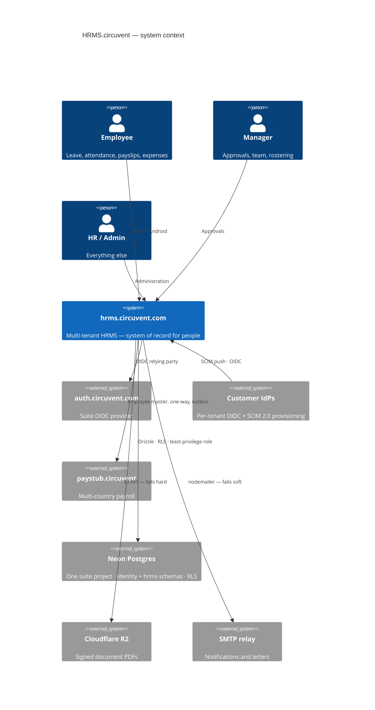
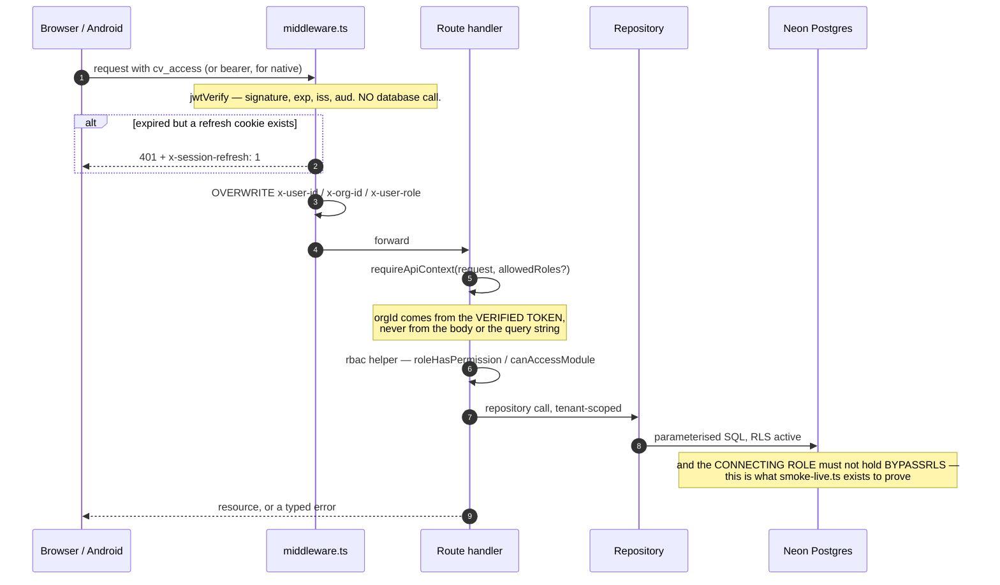
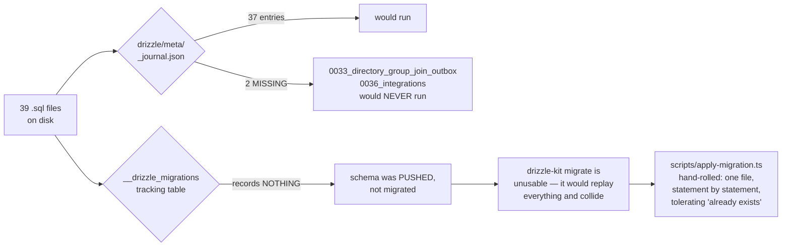
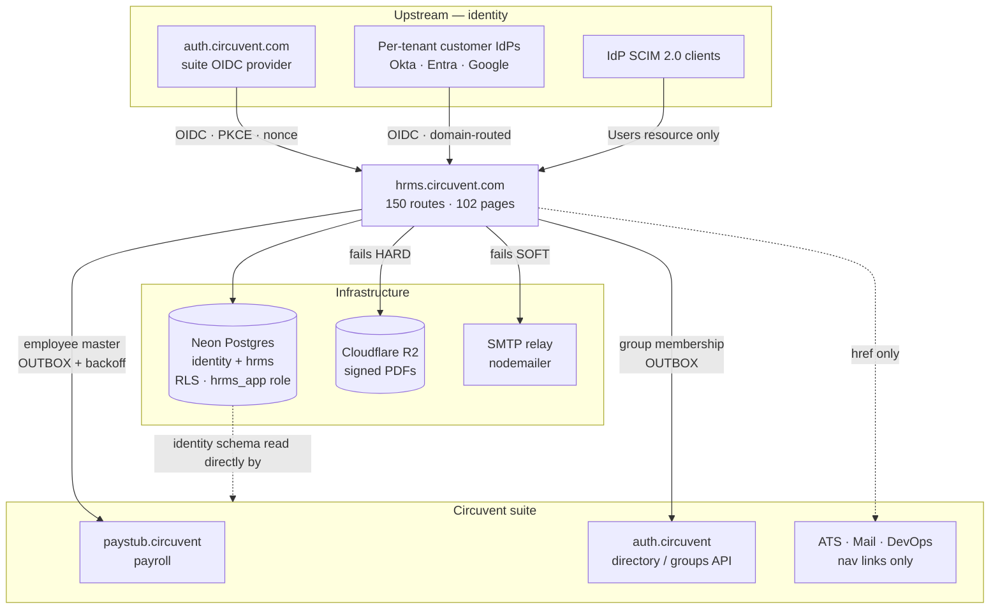
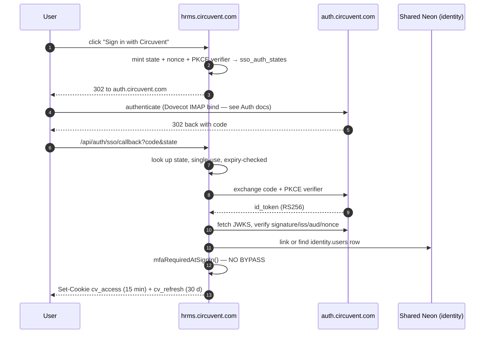
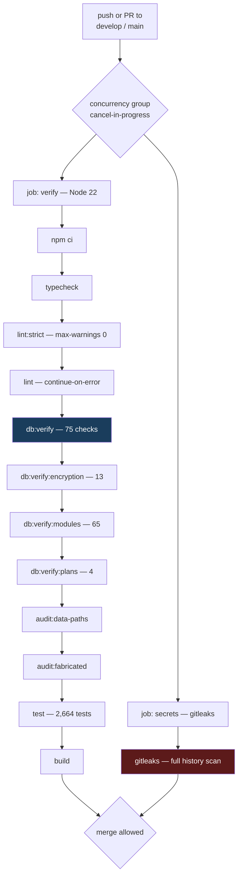
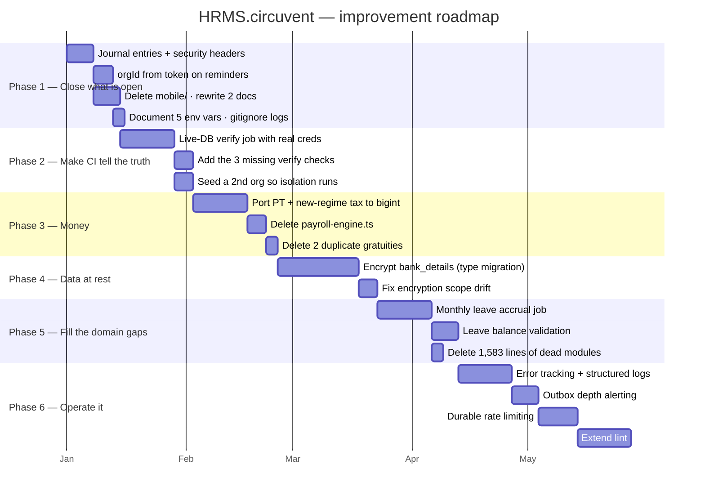

# hrms.circuvent.com — Architecture & Technical Audit

> **Organisation:** Circuvent Technologies  
> **Generated:** 2026-08-19  
> **Scope:** full technical audit and architecture reverse-engineering.


This is the aggregated master reference. The same content is maintained as five focused documents in this directory; edit those, then re-run `generate_docs.py` to rebuild this file and the Word, PDF and PowerPoint deliverables.


---


## Contents

1. [Part 1 · System Overview](#part-1-system-overview)
2. [Part 2 · Database & Data Models](#part-2-database-data-models)
3. [Part 3 · Integrations & Ecosystem](#part-3-integrations-ecosystem)
4. [Part 4 · Maintenance & Operations](#part-4-maintenance-operations)
5. [Part 5 · Areas of Enhancement](#part-5-areas-of-enhancement)

---


<a id="part-1-system-overview"></a>


# Part 1 · System Overview

> **Audience:** everyone. An intern reads §1–§4; a CTO reads §1 and §10.
> **System:** `hrms.circuvent.com` — the system of record for **who works here**. The largest application in the Circuvent suite.

---

## 1. Executive summary

This is a full multi-tenant HRMS: employees, leave, attendance, rostering, payroll, recruitment, performance, learning, documents and e-signature, helpdesk, assets, benefits, compensation, expenses, governance — plus a shipped native Android app.

```
   ╔══════════════════════════════════════════════════════════════════════╗
   ║  THE MOST IMPORTANT SENTENCE IN THIS ENTIRE AUDIT                    ║
   ╠══════════════════════════════════════════════════════════════════════╣
   ║                                                                      ║
   ║  From the header of scripts/smoke-live.ts:                           ║
   ║                                                                      ║
   ║    "ninety-one correct policies and seventy-five passing isolation   ║
   ║     tests, while DATABASE_URL pointed at a role with BYPASSRLS and   ║
   ║     every query returned every tenant's rows.                        ║
   ║     Nothing that ran in CI could have noticed."                      ║
   ║                                                                      ║
   ║  The policies were right. The tests were right. The tests passed.    ║
   ║  And every tenant could read every other tenant's data, because      ║
   ║  the CREDENTIAL the application actually connected with was exempt   ║
   ║  from the policies being tested.                                     ║
   ║                                                                      ║
   ║  This is the defining lesson of the codebase, and the reason it now  ║
   ║  has nine verification scripts instead of a test suite alone.        ║
   ╚══════════════════════════════════════════════════════════════════════╝
```

### At a glance

| | |
| --- | --- |
| **Type** | Multi-tenant HRMS with subscription plans · web + native Android |
| **Framework** | Next.js 16.1 App Router (Turbopack) · React 19.2 · TypeScript 5 strict |
| **Scale** | 1,454 files · **574 src TypeScript files** · **144,146 lines** · 150 API routes · 102 pages |
| **Database** | Neon Postgres · Drizzle ORM · **39 migrations** · row-level security |
| **Tests** | **92 test files · 2,664 tests passing**, 12 skipped, 1 flaky |
| **CI** | ✅ **`.github/workflows/verify.yml`** — the only real CI in the suite |
| **Guards** | **9 custom verification scripts** + gitleaks |
| **Mobile** | `android/` Kotlin Multiplatform — **shipped, v1.8.0, versionCode 10** |
| **Repository** | `github.com/Hemakotibonthada/HRMS.circuvent` · `main` + `develop` · 122 commits |
| **Identity** | Four sign-in paths converging on one HS256 suite session |

### The five decisions that define it

| # | Decision | Why it matters |
| --- | --- | --- |
| 1 | **Verify the credential, not just the policy** | 91 correct RLS policies meant nothing while the app connected as a `BYPASSRLS` role. `verify-credential-reach` and `smoke-live` exist because of that. |
| 2 | **Pure rule modules, impure shells** | ~40 domain modules take arguments and return values. That is why 2,664 tests run in under a minute with no database. |
| 3 | **Money is `bigint` minor units** | `money/minor.ts`: *"floats lose money, and the number it loses it by is somebody's raise."* Held everywhere except one legacy seam — see §7. |
| 4 | **Refuse rather than invent** | A missing document token refuses to render. A lunisolar holiday is not computed. The assistant will say *"I cannot see that"* rather than answer. |
| 5 | **Every fix is documented in the file it fixed** | An unusual number of modules open with a comment naming the *specific* bug they exist to prevent. |

> ⚠️ **A fact worth stating plainly:** all 122 commits are dated **2026-08-19**, several titled `chore: auto-sync HH:MM`. The working tree is currently dirty with in-flight work. Commit count here is a proxy for change volume, not project age — this system has not yet run a payroll cycle in anger.

---

## 2. What it owns, and what it does not

```
   HRMS OWNS                              DELEGATED / ELSEWHERE
   ---------                              ---------------------
   employees, org structure               identity federation  -> auth.circuvent.com
   leave, attendance, rostering           multi-country payroll -> paystub.circuvent
   its OWN payroll module (India)         mail transport        -> shared SMTP relay
   recruitment (its own ATS module)       object storage        -> Cloudflare R2
   performance, learning, documents
   helpdesk, assets, benefits             NOTE: ATS.circuvent, Mail.circuvent and
   compensation, expenses, governance     DevOps.circuvent appear in ecosystem.ts
   subscriptions and plans                only as NAV LINKS. There are no direct
                                          REST calls to them from this codebase.
```

> **A correction worth making early.** `src/lib/payroll-client.ts` is *not* a bridge to Paystub — it is a browser client for HRMS's *own* `/api/payroll/*` routes. The real cross-app link is `src/lib/paystub-client.ts`, and it is a **one-way outbound push of employee master data only**. HRMS does not delegate a single payroll calculation to Paystub. Both applications compute Indian statutory figures independently.

---

## 3. Technology stack

| Layer | Choice | Note |
| --- | --- | --- |
| Framework | Next.js 16.1 App Router, Turbopack | uses `middleware.ts`, **not** the Next 16 `proxy.ts` rename |
| Language | TypeScript 5 strict | **0 TODO · 0 `@ts-ignore` · 0 `eslint-disable` · 0 `console.log`** in `src/` |
| ORM | Drizzle 0.45 + drizzle-kit 0.31 | 39 migrations |
| Database | Neon Postgres | row-level security, per-app least-privilege roles |
| Passwords | **Argon2id** via `@noble/hashes` | 19 MiB, t=2, p=1, PHC string, auto-rehash on param drift |
| Sessions | `jose` HS256 (own) + RS256/JWKS (external IdPs) | |
| MFA | `otpauth` TOTP + `qrcode` | secret encrypted at rest |
| PDF | `pdf-lib` | hand-laid-out — **no headless Chromium on serverless** |
| Mail | `nodemailer` | direct SMTP, fails soft |
| Storage | `@aws-sdk/client-s3` → Cloudflare R2 | fails **hard**, deliberately |
| Tests | Vitest 4 + Testing Library + `@electric-sql/pglite` | PGlite powers the *verify scripts*, not the test suite |
| Mobile | Kotlin Multiplatform + Jetpack Compose | `android/` — shipped |

---

## 4. Topology

```
        ┌──────────────────────┐        ┌────────────────────────────┐
        │  auth.circuvent.com  │        │  Per-tenant customer IdPs  │
        │  suite OIDC provider │        │  Okta · Entra · Google     │
        └──────────┬───────────┘        └─────────────┬──────────────┘
                   │ RS256 / JWKS                     │ RS256 / JWKS
                   └────────────────┬─────────────────┘
                                    ▼
   ┌────────────┐          ┌─────────────────────────────────────┐
   │  Browser   │─────────▶│      hrms.circuvent.com             │
   │  Android   │  cv_access│                                     │
   │  (v1.8.0)  │  cv_refresh│  middleware.ts  ── the gate        │
   └────────────┘          │  150 API routes · 102 pages         │
                           │  ~40 PURE rule modules              │
   ┌────────────┐  SCIM 2.0│  Drizzle repositories               │
   │  IdP SCIM  │─────────▶│                                     │
   └────────────┘          └──┬─────────┬──────────┬─────────┬───┘
                              │         │          │         │
              ┌───────────────┘         │          │         └──────────────┐
              ▼                         ▼          ▼                        ▼
   ┌────────────────────┐  ┌──────────────────┐ ┌──────────┐  ┌──────────────────────┐
   │  Neon Postgres     │  │  Cloudflare R2   │ │   SMTP   │  │  paystub.circuvent   │
   │  ONE suite project │  │  signed PDFs     │ │ fails    │  │  employee master     │
   │  identity + hrms   │  │  FAILS HARD      │ │ SOFT     │  │  push, via OUTBOX    │
   │  RLS + least-priv  │  └──────────────────┘ └──────────┘  └──────────────────────┘
   └────────────────────┘
```



### Module map

```
   src/
     middleware.ts        THE GATE. Overwrites x-user-id / x-org-id / x-user-role.
     lib/
       auth/              session · tokens · password (Argon2id) · mfa · webauthn
       crypto/            AES-256-GCM field encryption
       rbac.ts            ~90 permissions across 4 roles (+ `owner` above them)
       api-context.ts     session principal  -> role
       api-v1-context.ts  API-key principal  -> scopes
       ── ~40 PURE rule modules ──
       statutory-india.ts   PF · ESI · PT · TDS · gratuity      bigint, dated config
       compensation.ts      bands · compa-ratio · vesting        bigint
       settlement.ts        full & final                         bigint
       rostering.ts         shifts · constraints · swaps         pure
       workflow/engine.ts   one approval engine for everything   pure
       reporting/builder.ts allow-listed report compiler         pure
       governance.ts        retention · erasure — PLANS only     pure
       sla.ts  assets.ts  benefits-rules.ts  learning-rules.ts
       performance.ts  ats.ts  offer-rules.ts  lifecycle-rules.ts
       document-rules.ts  custom-fields.ts  intelligence/  ...
       ── impure shells ──
       *-client.ts        browser fetch wrappers
       paystub-client.ts  + paystub-sync-outbox.ts
       notifications/     engine (decide) → notify (write) → transport (deliver)
     db/
       schema/            Drizzle definitions — hrms.ts is 1,440 lines
       repositories/      *.neon.ts — the only code that queries
     app/
       (dashboard)/       102 pages
       api/               150 route handlers
   android/               Kotlin Multiplatform — SHIPPED v1.8.0
   mobile/                Expo — ABANDONED precursor, same package id
   scripts/               9 verification scripts + ~25 operational tools
```

---

## 5. The security model

```
   ┌──────────────────────────────────────────────────────────────────────┐
   │  LAYER 1 — FOUR SIGN-IN PATHS, ONE SESSION                           │
   │    local Argon2id · suite OIDC · per-tenant customer OIDC · passkeys │
   │    all converge on one HS256 token: sub · orgId · role · email       │
   │    cv_access 15 min · cv_refresh 30 d, SHA-256 hashed, single-use,   │
   │    rotated on every use, with FAMILY REVOCATION on reuse             │
   ├──────────────────────────────────────────────────────────────────────┤
   │  LAYER 2 — THE GATE                                                  │
   │    middleware.ts verifies signature/exp/iss/aud with no DB call,     │
   │    then ALWAYS OVERWRITES x-user-id, x-org-id and x-user-role.       │
   │    Client-supplied values are discarded. 36 assertions cover this.   │
   ├──────────────────────────────────────────────────────────────────────┤
   │  LAYER 3 — AUTHORIZATION                                             │
   │    ~90 dot-notation permissions · 4 roles in rbac.ts                 │
   │    + `owner` as a de facto super-role at the API layer               │
   │    canAccessModule() FAILS CLOSED on an unmapped module              │
   ├──────────────────────────────────────────────────────────────────────┤
   │  LAYER 4 — TENANCY                                                   │
   │    orgId is derived from the VERIFIED TOKEN, never from the request  │
   │    — with exactly one exception, and it is a finding (§8)            │
   │    plus Postgres RLS, plus per-app least-privilege database roles    │
   ├──────────────────────────────────────────────────────────────────────┤
   │  LAYER 5 — DATA AT REST                                              │
   │    AES-256-GCM field encryption (PAN, UAN, MFA secrets, …)           │
   │    ⚠ bank_details is jsonb and is NOT encrypted — masked on read     │
   └──────────────────────────────────────────────────────────────────────┘
```

### MFA, done carefully

```
   3-state machine:  off → pending → active

   • The secret is minted and stored ENCRYPTED at `pending`.
   • Backup codes are issued ONLY after a live code proves the secret works.
     Codes are never handed out for a secret not yet verified.
   • `pending` is deliberately NOT enforced at sign-in — anti-lockout, and it
     grants no elevated trust either.
   • Disabling MFA requires the current password AND a live TOTP code.
     A stolen session cookie alone cannot turn the control off.
   • Enrol/confirm/disable are rate limited 10/min per user, explicitly so a
     six-digit code over a 90-second window cannot become a brute-force
     surface that bypasses the sign-in lockout.

   VERIFIED: both sign-in paths — password and SSO/passkey — independently
   call mfaRequiredAtSignIn(). There is NO bypass.

   ⚠ The trade is fail-closed: an MFA-enabled user currently cannot complete
     SSO or passkey login at all, because neither accepts a TOTP parameter.
     An availability gap, not a security gap. Doc 05, D-09.
```

---

## 6. Core workflows

### 6.1 A request, end to end



### 6.2 The approval engine

One configurable engine (`workflow/engine.ts`, pure, 493 lines with a 495-line test) serves leave, expense, travel, loan and offboarding approvals — rather than each module hard-coding its own routing. `startWorkflow`, `advanceWorkflow`, `resolveApprovers`, `findBreaches`.

### 6.3 Cross-application sync uses a transactional outbox

```
   Employee changes in HRMS
        │
        ├─ row written to paystub_sync_outbox IN THE SAME TRANSACTION
        │
        └─ HTTP POST to paystub.circuvent/api/sync/employees
             X-Service-Token: <CROSS_APP_SYNC_TOKEN>
             exponential backoff, capped around 17 hours
             drained by /api/cron

   The same pattern appears three more times:
     document-pdf-outbox · directory-group-outbox · outbox-sweep

   PAN is decrypted immediately before transmission. Department and location
   cross as CODE + NAME strings, never internal UUIDs, because Paystub owns
   its own independent tables.
```

---

## 7. Money — mostly right, with one honest seam

```
   ✅  src/lib/money/minor.ts

       /** A whole number of paise, as a decimal string. Never a float. */
       export type MinorUnits = string;

       Header rationale, verbatim:
         "the comment on the type said the result must never be summed or
          compared for equality on the client. That is a rule a type cannot
          enforce and a reviewer has to remember, and it was already being
          broken: the payroll dashboard adds every payslip's net pay together
          to render the headline Net Payroll figure."

   ✅  bigint throughout: statutory-india.ts · compensation.ts · assets.ts ·
       expense-rules.ts · settlement.ts

   🔴  src/lib/payroll-engine.ts is entirely `number`-based.
       580 lines of Math.round on plain floats. It is LEGACY: five of its
       seven major functions have zero callers anywhere in src/.

   🔴  But two of them are still wired into the real pipeline, through a
       currency-unsafe seam in payroll.neon.ts:

         const professionalTax =
           BigInt(Math.round(calculateProfessionalTax(minorToMajor(gross)) * 100));

       bigint → minorToMajor() → float math → BigInt(Math.round(x*100))

       minorToMajor() is money/minor.ts's own DISPLAY-ONLY helper, whose
       doc comment warns it "must never be summed or compared for equality."
```

Doc 05, D-03. Values are rounded back to whole paise, so this is not demonstrably producing a wrong figure today — but it is a direct violation of the codebase's own stated invariant, in the one place money is actually computed.

**And gratuity exists three times:** the correct bigint, Act-compliant version in `statutory-india.ts` (used by `settlement.ts`), plus two naive float duplicates in `payroll-engine.ts` and `hr-utils.ts` with no part-year rounding and no death/disablement waiver. Both duplicates have zero callers — but both are still exported.

> The codebase already fixed this exact problem once, for income tax, and wrote it down: *"There were three implementations of the Indian slabs in this codebase — payroll's old regime, the tax page's own inline copy, and the real one — and three copies of a slab table is three different answers to 'what is my tax', of which at most one is right."* Gratuity is the same story, not yet finished.

---

## 8. Design patterns actually in use

| Pattern | Where | Note |
| --- | --- | --- |
| **Pure core / impure shell** | ~40 rule modules vs `*-client.ts` and `*.neon.ts` | nearly every module header states this in its own words |
| **Decide → write → deliver** | `notifications/engine` → `notify` → `transport`; `document-notify` → `document-dispatch` | |
| **State machines as allow-list data** | `lifecycle-rules`, `referral-rules`, `assets`, `expense-rules` | `Record<State, State[]>`, not `if` chains |
| **Return every violation, not the first** | `rostering`, `offer-rules`, `custom-fields`, `assets` | *"a form filled in once should not need five round trips"* |
| **Config as a dated parameter** | `statutory-india.ts`'s `PfConfig`, `EsiConfig` | *"a payroll run for March 2025 must still compute with March 2025's rates"* |
| **Plan, then execute** | `governance.ts` returns an erasure *plan*; locked-month attendance corrections route to arrears rather than mutating a paid month | irreversibility safeguards |
| **Allow-list, not escaping** | `reporting/builder.ts` — every field must exist in a fixed catalogue; values always bound | SQL-injection-safe by construction |
| **Transactional outbox** | 4 separate outboxes + a sweeper | cross-system reliability |
| **Self-documented regression history** | `expense-rules`, `leave-provisioning`, `income-tax-declaration`, `assistant`, `money/minor`, `catalog` | each opens by naming the specific bug it prevents |

**Two patterns worth calling out as unusually good:**

- **`assistant.ts` refuses to invent.** It replaced a chatbot that fabricated answers — a hardcoded *"Casual Leave: 6 remaining"*, a fake performance rating. The new rule: never state a fact about a person that has not been fetched. Only two answer kinds are allowed — `fetched` (real API data, sourced) or `navigation` (a link, no figures). Anything else returns an honest *"I cannot see that."*
- **`ap-holidays.ts` refuses to guess.** It categorises each holiday by how its date is *known* — Gregorian-fixed, solar, or lunisolar/Islamic — and deliberately does not compute the third category, because those dates require confirmation rather than arithmetic.

---

## 9. Where reality diverges from the documentation

```
   docs/PLATFORM-ARCHITECTURE.md  — "Status: Phase 0 — Plan", describes HRMS
                                    as FIRESTORE-backed, 52k LOC, "zero
                                    automated tests"
   docs/DEPLOYMENT.md             — "No Neon project exists yet", "No Vercel
                                    project exists yet", "main has not been
                                    created"
   docs/PLAY-STORE.md             — describes the Expo app as never run on a
                                    device

   ACTUAL REALITY
   ──────────────
   Postgres + Drizzle. ~144,000 lines. 92 test files, 2,664 passing tests.
   A `main` branch with a shipped "Release 1.8.0" commit.
   A live cron entry in vercel.json.
   A signed, tested Kotlin Android app at versionCode 10.

   A new engineer reading docs/ first would misunderstand the entire system.
   docs/ROADMAP.md (96 KB) and README.md are the accurate ones.
```

Doc 05, D-06.

---

## 10. Health assessment

```
   Verification discipline  ████████████████████░  9/10  9 guard scripts, real CI
   Test coverage            ██████████████████░░░  8/10  2,664 tests, 92 files
   Code hygiene             ██████████████████░░░  8/10  0 TODO/ts-ignore/disable
   Domain rigour            ██████████████████░░░  8/10  pure modules, dated config
   Auth & session design    ██████████████████░░░  8/10  4 paths, family revocation
   Tenancy enforcement      ████████████████░░░░░  7/10  token-derived, one exception
   ─────────────────────────────────────────────────
   Money consistency        ████████████░░░░░░░░░  6/10  🔴 one float seam, 3 gratuities
   CI completeness          ████████████░░░░░░░░░  6/10  9 of 12 checks; misses 3
   Documentation accuracy   ████████░░░░░░░░░░░░░  4/10  🔴 two docs wholesale obsolete
   Dead code                ████████░░░░░░░░░░░░░  4/10  ~1,583 lines never imported
   Rule-source singularity  ██████░░░░░░░░░░░░░░░  3/10  🔴 rules exist in 3 codebases
   Response headers         ████░░░░░░░░░░░░░░░░░  2/10  🔴 no security headers at all
```

**What is genuinely excellent:** nine verification scripts that check things a test suite structurally cannot; Argon2id with auto-rehash; refresh-token family revocation; MFA that will not issue backup codes for an unproven secret; `orgId` derived from the token everywhere but one route; a single approval engine; an allow-list report compiler; and a documentation convention where modules name the bug they exist to prevent.

**What needs attention:** the float seam in the payroll pipeline, three parallel implementations of the same business rules (web TypeScript, Expo TypeScript, Kotlin), two architecture documents that describe a system that no longer exists, `bank_details` stored unencrypted, and `next.config.ts` with no security headers whatsoever.

---

## 11. Where to start reading

```
   1. README.md                        the accurate one
   2. docs/ROADMAP.md                  96 KB, and the real history
   3. .github/workflows/verify.yml     what actually gates a merge
   4. scripts/smoke-live.ts            read the header. Twice.
   5. src/middleware.ts                the gate, plus its 36-assertion test
   6. src/lib/rbac.ts                  ~90 permissions, 4 roles
   7. src/lib/money/minor.ts           and then payroll-engine.ts, for contrast
   8. src/lib/statutory-india.ts       670 lines, the most rigorous module here
   9. src/db/schema/hrms.ts            1,440 lines
```

---

*Next: **02_DATABASE_AND_DATA_MODELS.md** · **03_INTEGRATIONS_AND_ECOSYSTEM.md** · **04_MAINTENANCE_AND_OPERATIONS.md** · **05_AREAS_OF_ENHANCEMENT.md***


---


<a id="part-2-database-data-models"></a>


# Part 2 · Database & Data Models

> **Audience:** engineers and DBAs. §1–§3 are the map; §4–§6 are the enforcement machinery; §8 is the debt.
> **Engine:** Neon Postgres · Drizzle ORM 0.45 · drizzle-kit 0.31 · **two drivers, deliberately**

---

## 1. Shape of the database

```
   ╔══════════════════════════════════════════════════════════════════════╗
   ║  117 PHYSICAL TABLES · 44 ENUM TYPES · 2 SCHEMAS                     ║
   ╠══════════════════════════════════════════════════════════════════════╣
   ║                                                                      ║
   ║   116 defined in Drizzle TypeScript  (src/db/schema/*.ts, 13 files)  ║
   ║   + 1 that exists ONLY as raw SQL    (hrms.doc_store, in 0023)       ║
   ║   ────────────────────────────────                                   ║
   ║   = 117 tables                                                       ║
   ║                                                                      ║
   ║   schema `identity`  20 tables   cross-app: orgs, users, sessions,   ║
   ║                                  SSO, SCIM, API keys, audit log      ║
   ║   schema `hrms`      97 tables   every HR domain + doc_store         ║
   ║                                                                      ║
   ║   116 of 117 carry org_id. The one exception is `organizations`      ║
   ║   itself — it IS the tenant.                                         ║
   ╚══════════════════════════════════════════════════════════════════════╝
```

### The conventions, stated once

Every table follows these, so they are omitted from the tables below:

| Convention | Definition |
| --- | --- |
| Primary key | `id uuid PRIMARY KEY DEFAULT gen_random_uuid()` |
| Tenant key | `org_id uuid NOT NULL REFERENCES identity.organizations(id) ON DELETE CASCADE` |
| Timestamps | `created_at timestamptz DEFAULT now()` on most tables |
| Money | `*_minor bigint` — a whole number of paise. **Never `numeric`, never `float`.** |
| Deletes | `CASCADE` or `SET NULL`, with exactly **three** `RESTRICT` exceptions (§7) |

### Domains by table count

```
   Employees & org structure   ████████        8
   Attendance & shifts         ████████████   12
   Identity / auth / SSO       ████████████   12 + organizations
   Performance                 ██████████     10
   Recruitment (own ATS)       █████████       9
   Helpdesk                    ███████         7
   Compensation                ██████          6
   Benefits                    ██████          6
   Governance / privacy        ██████          6
   Assets                      █████           5
   Loans & IT declarations     █████           5
   Leave                       ████            4
   Referrals                   ████            4
   Learning                    ████            4
   Documents & e-signature     ████            4
   Workflow / announcements    ████            4
   Custom fields               ███             3
   Payroll                     ███             3
   Expenses                    █               1
   Integrations                █               1
   doc_store (raw SQL)         █               1
```

---

## 2. Entity relationship — the core spine

```mermaid
erDiagram
    ORGANIZATIONS ||--o{ USERS : "employs"
    ORGANIZATIONS ||--|| SUBSCRIPTIONS : "has one"
    ORGANIZATIONS ||--o{ EVERYTHING_ELSE : "org_id on 116 tables"

    USERS ||--o{ USER_ROLES : "per-app role"
    USERS ||--o{ SESSIONS : "refresh chain"
    USERS ||--o{ WEBAUTHN_CREDENTIALS : "passkeys"
    USERS ||--o| EMPLOYEES : "may be"

    EMPLOYEES ||--o{ ATTENDANCE_RECORDS : "one per work day"
    EMPLOYEES ||--o{ LEAVE_REQUESTS : "applies"
    EMPLOYEES ||--o{ LEAVE_BALANCES : "per year, per type"
    EMPLOYEES ||--o{ SALARY_STRUCTURES : "dated"
    EMPLOYEES ||--o{ PAYROLL_RECORDS : "one per run"
    EMPLOYEES ||--o{ EXPENSE_CLAIMS : "submits"
    EMPLOYEES ||--o{ ASSET_ASSIGNMENTS : "holds"
    EMPLOYEES ||--o{ LIFECYCLE_JOURNEYS : "onboard/offboard"
    EMPLOYEES ||--o{ PAYSTUB_SYNC_OUTBOX : "queued push"

    DEPARTMENTS ||--o{ EMPLOYEES : "belongs to"
    LOCATIONS ||--o{ EMPLOYEES : "sits at"

    PAYROLL_RUNS ||--o{ PAYROLL_RECORDS : "one per employee"

    JOB_POSTINGS ||--o{ APPLICATIONS : "receives"
    CANDIDATES ||--o{ APPLICATIONS : "submits"
    APPLICATIONS ||--o{ INTERVIEWS : "schedules"
    APPLICATIONS ||--o{ INTERVIEW_SCORECARDS : "collects"
    APPLICATIONS ||--o{ OFFERS : "versioned"

    ROSTERS ||--o{ ROSTER_ASSIGNMENTS : "publishes"
    SHIFT_PATTERNS ||--o{ ROSTER_ASSIGNMENTS : "RESTRICT"
    ROSTER_ASSIGNMENTS ||--o{ SHIFT_SWAP_REQUESTS : "may be swapped"

    GENERATED_DOCUMENTS ||--o{ DOCUMENT_SIGNATURES : "sequenced"
    GENERATED_DOCUMENTS ||--o{ DOCUMENT_PDF_OUTBOX : "archival queue"

    REVIEW_CYCLES ||--o{ PERFORMANCE_REVIEWS : "contains"
    FEEDBACK_REQUESTS ||--|| FEEDBACK_RESPONSES : "1:1, split on purpose"
```



> **Why `FEEDBACK_REQUESTS` and `FEEDBACK_RESPONSES` are two tables in a strict 1:1.** They are split so that aggregating 360° feedback never has to touch the respondent's identity. The request holds *who was asked*; the response holds *what was said*. An anonymised roll-up reads only the second table.

---

## 3. Table inventory, by domain

> Only non-obvious columns, foreign keys, uniques and indexes are listed. `casc` = `ON DELETE CASCADE`, `set0` = `SET NULL`, `big` = `bigint`, `j` = `jsonb`, `t` = `text`, `d` = `date`, `ts` = `timestamptz`, `u` = `uuid`.

### 3.1 `identity` — tenancy, auth, federation (20 tables)

| Table | Notable columns | FK → | Unique | Index |
| --- | --- | --- | --- | --- |
| `organizations` | `slug`, `plan`, `features` j, `settings` j, `deleted_at` | *(none — this is the tenant)* | `slug` | — |
| `users` | `email`, `password_hash`, `legacy_firebase_uid`, **`mfa_secret` (encrypted)**, `mfa_backup_codes` j, `status` | — | `email` **globally**, `legacy_firebase_uid` | `org_id`, `(org_id,status)` |
| `user_roles` | `app` enum, `role` enum, `extra_permissions` j | `user_id`→users casc | `(user_id,app)` | `(org_id,app)` |
| `sessions` | `refresh_token_hash`, **`rotated_to_id`**, `ip_address` inet, `expires_at` | `user_id`→users casc | `refresh_token_hash` | `user_id`, `expires_at` |
| `auth_tokens` | `email`, `purpose` enum, `token_hash` | users casc·null, orgs casc·null | `token_hash` | `(email,purpose)` |
| `api_keys` | `key_prefix`, `key_hash`, `scopes` j, `rate_limit_per_minute` | — | `key_hash` | `org_id` |
| `subscriptions` | `plan`, `status`, `max_employees`, `current_employees` | — | `org_id` (1:1) | — |
| `audit_log` | `actor_id`, `app`, `action`, `before`/`after` j, **`previous_hash`, `hash`** | — | — | `(org_id,created_at)`, `(entity_type,entity_id)`, `actor_id` |
| `webauthn_credentials` | `credential_id`, `public_key`, `sign_count` | `user_id`→users casc | `credential_id` **globally** | `user_id` |
| `sso_connections` | `protocol` enum, **`client_secret` (encrypted)**, `domains` j | — | — | `(org_id,is_active)` |
| `sso_auth_states` | `state`, `nonce`, `code_verifier`, `expires_at` | `connection_id` casc | `state` | `expires_at` |
| `sso_identities` | `subject`, `email_at_link` | users casc, connections casc | `(connection_id,subject)` | `user_id` |
| `scim_tokens` | `token_hash`, `token_prefix`, `revoked_at` | — | `token_hash` | `org_id` |
| `scim_sync_log` | `operation`, `payload` j, `status_code` | tokens set0, users set0 | — | `(org_id,received_at)`, `(org_id,external_id)` |

### 3.2 Employees and org structure (8 tables)

| Table | Notable columns | FK → | Unique | Index |
| --- | --- | --- | --- | --- |
| `locations` | `code`, `lat`/`long` num(10,7), `geofence_radius_meters` | — | `(org_id,code)` | — |
| `departments` | `code`, `head_id` u **(no FK)**, `parent_id` u **(no FK, self-ref)**, `budget_minor` big | — | `(org_id,code)` | `org_id` |
| **`employees`** | `employee_code`, `work_email`, `reporting_to_id` u **(no FK — "deferred FK in migration")**, **`bank_details` j (PLAINTEXT)**, `pan_number`, `aadhaar_number`, `uan_number`, `pf_number`, `esi_number` | users set0, departments set0, locations set0 | `(org_id,employee_code)`, `(org_id,work_email)`, `user_id` | `(org_id,status)`, `(org_id,department_id)`, `reporting_to_id` |
| `employee_documents` | `blob_url`, `is_verified` | employees casc | — | `employee_id` |
| `paystub_employee_sync_outbox` | `status`, `attempt_count`, `next_attempt_at` | employees casc | `(org_id,employee_id)` | `(status,next_attempt_at)` |
| `directory_group_join_outbox` | `group_address`, `member_email` | employees casc | `(org_id,employee_id,group_address)` | `(status,next_attempt_at)` |
| `lifecycle_journeys` | `kind` enum, `anchor_date` | employees casc | `(employee_id,kind)` | `(org_id,status)` |
| `lifecycle_tasks` | `task_key`, `mandatory`, `due_offset_days` | journeys casc | `(journey_id,task_key)` | `journey_id`, `(org_id,completed)` |

### 3.3 Attendance and scheduling (12 tables)

| Table | Notable columns | FK → | Unique | Index |
| --- | --- | --- | --- | --- |
| `shifts` | `code`, `start_time`/`end_time`, `weekly_off_days` j | — | `(org_id,code)` | — |
| `attendance_records` | `work_date`, `status`, `clock_in_method`/`out_method`, `is_within_geofence`, **`requires_location_review`**, `location_signals` j | employees casc, shifts set0 | `(employee_id,work_date)` | `(org_id,work_date)`, `(org_id,status,work_date)`, **partial idx on `requires_location_review`** |
| `attendance_regularisations` | `attendance_date`, `reason`, `routing`, `has_proof` | employees casc, decided_by set0 | — | `(employee_id,attendance_date)`, `(org_id,status)` |
| `work_arrangement_requests` | `kind` (wfh / on_duty), `start_date`/`end_date` | employees casc | — | `(employee_id,start_date)` |
| `shift_patterns` | `code`, **`crosses_midnight`**, `pay_multiplier` num(5,3) | departments set0, locations set0 | `(org_id,code)` | `(org_id,is_active)` |
| `shift_eligibility` | `valid_from`/`valid_until` | employees casc, patterns casc | `(employee_id,pattern_id)` | `org_id` |
| `availability` | `kind` enum, `start_date`/`end_date` | employees casc | — | `(org_id,start_date,end_date)` |
| `rosters` | `status`, **`constraints_snapshot` j**, `accepted_warnings` j | departments set0, locations set0 | — | `(org_id,period_start,period_end)` |
| `roster_assignments` | `shift_date`, `starts_at`/`ends_at`, `status` | rosters casc, employees casc, **patterns RESTRICT** | — | `roster_id`, `(employee_id,shift_date)` |
| `shift_swap_requests` | `status`, `expires_at` | assignments casc, employees casc | — | `(org_id,status)`, `assignment_id` |
| `open_shifts` | `shift_date`, `headcount_needed` | rosters casc, patterns casc | — | `(org_id,shift_date)` |
| `coverage_requirements` | `weekday`, `headcount` | patterns casc, departments casc, locations casc | — | `(org_id,pattern_id)` |

> `rosters.constraints_snapshot` stores the rules **as they were when the roster was published**. A later policy change cannot retroactively make a published roster non-compliant.

### 3.4 Leave (4 tables)

| Table | Notable columns | FK → | Unique |
| --- | --- | --- | --- |
| `leave_policies` | `leave_type` enum, `annual_quota_days` num | — | `(org_id,leave_type)` |
| `leave_requests` | `leave_type`, `status`, `start_date`/`end_date` | employees casc | — |
| `leave_balances` | `year`, `leave_type`, `opening_days` / **`accrued_days`** / `used_days` | employees casc | `(employee_id,year,leave_type)` |
| `holidays` | `holiday_date`, `year`, `is_optional` | locations casc | — |

> ⚠️ **`accrued_days` is always 0.** Provisioning is annual-upfront, and the monthly accrual job that would populate this column *does not exist yet*. The column is present, correct and unused. Doc 05, D-07.
>
> ⚠️ The `leave_type` enum has **11 values**; only **9** have a seeded default policy. `wfh` and `study` have none.

### 3.5 Payroll, loans, tax (8 tables)

| Table | Notable columns | Unique |
| --- | --- | --- |
| `salary_structures` | `effective_from`/`to`, `ctc_minor`, `basic_minor`, `hra_minor` … 9 bigint columns | — |
| `payroll_runs` | `period_month`/`year`, `run_type`, `status`, `processed_by_id`, **`approved_by_id`** | `(org_id,period_year,period_month,run_type)` |
| `payroll_records` | `working_days`/`present_days`/`lop_days`, **~20 bigint earning + deduction columns**, `net_pay_minor`, `anomalies` j | `(run_id,employee_id)` |
| `employee_loans` | `principal_minor`, `interest_rate_percent` | — |
| `loan_repayments` | `period_month`/`year`, `amount_minor` | `(loan_id,period_year,period_month)` |
| `loan_benchmark_rates` | `financial_year`, `loan_type`, `rate_percent` | `(org_id,financial_year,loan_type)` |
| `it_declarations` | `financial_year`, `regime`, `rent_paid_minor` | `(employee_id,financial_year)` |
| `it_declaration_items` | `section`, `declared_minor`, `verified_minor` | `(declaration_id,section)` |

> `payroll_runs` carries `processed_by_id` **and** `approved_by_id` — the schema shape for maker-checker. `loan_benchmark_rates` is keyed by financial year for the same reason `PfConfig` is a dated parameter: a run for FY2024 must compute with FY2024's rates.

### 3.6 Compensation (6 tables)

`salary_bands` (grade × location, min/mid/max minor) · `compensation_cycles` (status, **`merit_matrix` j**, `prorate_new_joiners`) · `budget_pools` (`allocated_minor`, `committed_minor`) · `compensation_recommendations` (`compa_ratio`, `system_percent` → `proposed_percent` → `final_percent`, **`override_reason`**) · `equity_grants` (`total_units`, `vesting_months`, `exercised_units`) · `salary_history` (**insert-only**).

> The three-percent progression on `compensation_recommendations` is the audit trail: what the *system* suggested, what the *manager* proposed, what *calibration* settled on — with a mandatory reason when a human overrides the model.

### 3.7 Recruitment — HRMS's own ATS module (9 tables)

`job_postings` · `candidates` · `applications` (`tracking_token` unique, `match_score`) · `interviews` (`panelist_ids` j) · `pipeline_stages` · `application_events` (insert-only) · **`interview_scorecards`** · **`offers`** (versioned, `supersedes_offer_id` with no FK) · `application_sources`.

> `interview_scorecards.submitted_at` **gates visibility**: an interviewer cannot see other panellists' scores until their own is submitted. That is anchoring bias prevented in the data model rather than in a UI rule.
>
> This is *not* `ATS.circuvent` — it is a separate, internal recruitment module inside HRMS. See doc 03.

### 3.8 Referrals (4 tables)

`referrals` · `referral_policies` (`instalments` j) · `referral_events` (insert-only) · **`referral_invites`**.

```
   ╔══════════════════════════════════════════════════════════════════════╗
   ║  referral_invites — documented in-code as:                           ║
   ║                                                                      ║
   ║  "the only table in the schema that grants an unauthenticated        ║
   ║   write into a tenant's data"                                        ║
   ║                                                                      ║
   ║  The mailed token IS the entire authority. Only its SHA-256 is       ║
   ║  stored — never the token. Plus expires_at, revoked_at,              ║
   ║  submitted_at and consent_given_at.                                  ║
   ║                                                                      ║
   ║  This is the single highest-scrutiny table in the database.          ║
   ╚══════════════════════════════════════════════════════════════════════╝
```

### 3.9 Performance (10 tables)

`review_cycles` · `performance_goals` (self-referencing `parent_goal_id`, no FK) · `performance_reviews` · `competencies` (`behavioural_anchors` j) · `competency_ratings` · `feedback_requests` · `feedback_responses` · `calibration_sessions` (`distribution_target` j, a snapshot) · **`calibration_adjustments`** (insert-only, `rating_before`/`after`, **`justification` NOT NULL**) · `check_ins` (`private_notes`, `mood_rating`).

> A calibration cannot silently change a rating: the adjustment row is insert-only and the justification column is `NOT NULL`.
>
> ⚠️ `competency_ratings.review_id` and `calibration_adjustments.review_id` are plain `uuid`, **not foreign keys** to `performance_reviews` — most likely cross-file circular-import avoidance, but undocumented as deliberate, unlike `custom_field_values.entity_id` which is. Doc 05, D-13.

### 3.10 Learning, benefits, documents (14 tables)

`courses` / `course_modules` / `course_enrolments` (`expires_on` drives recertification) / `certifications` · `benefit_plans` / `enrolment_windows` / `benefit_enrolments` (**plan FK is `RESTRICT`**) / `dependants` / `enrolment_dependants` / `benefit_claims` · `document_templates` (`required_tokens` j) / `generated_documents` (`content_hash` sha-256) / `document_signatures` (`access_token_hash`, `signed_content_hash`, sequenced) / `document_pdf_storage_outbox`.

> Signing captures **`signed_content_hash`** — proof of *what* was signed, not merely *that* something was. Change the document afterwards and the hashes diverge.

### 3.11 Helpdesk, assets, expenses, workflow (17 tables)

`sla_policies` / `ticket_categories` (**`is_confidential`, `confidential_to_roles`**) / `tickets` / **`ticket_pauses`** / `ticket_comments` (`is_internal`) / `ticket_events` / `knowledge_articles` (`deflection_count`) · `asset_categories` / `assets` / `asset_assignments` (**`book_value_on_issue_minor`**) / `asset_maintenance` / `asset_events` · `expense_claims` · `workflow_definitions` / **`workflow_instances`** (polymorphic `entity_type` + `entity_id`, definition FK is `RESTRICT`) / `announcements` / `notifications`.

> `ticket_pauses` exists so SLA clocks stop while a ticket waits on the requester. Without it, "pending requester" time would count against the team's resolution target.

### 3.12 Governance and privacy (6 tables)

`retention_policies` (`anchor` enum, `method` enum, **`basis`**) · `legal_holds` (blanket when `entity_id` is null) · `data_subject_requests` (`plan` j, `outcome` j, **`refused_areas` j**, `due_on`) · `erasure_log` (insert-only) · `consent_records` (append-only — `granted_at` and `withdrawn_at`, never an update) · `processing_activities` (`lawful_basis`, `transfers` j).

> A GDPR-shaped design throughout: consent is *appended*, never mutated, so the history of what a person agreed to and when is reconstructible; and a DSAR can be **partially refused** with the refused areas recorded, which is what the regulation actually contemplates.

### 3.13 Custom fields, integrations, doc_store (5 tables)

| Table | Note |
| --- | --- |
| `custom_field_definitions` | `entity_type` + `key`, `data_type` enum (11 kinds), `is_pii` |
| `custom_field_values` | `entity_id` is **deliberately not a FK** — documented polymorphic gap; orphans cleaned by the entity's own delete path. `is_unique` is **trigger-maintained** — the schema comment says *"never write from application code."* |
| `custom_field_audit` | before / after |
| `integrations` | `kind` CHECK-constrained to slack / teams / generic webhook, `endpoint_url`, `secret_encrypted` |
| **`hrms.doc_store`** | See below |

```
   hrms.doc_store — the only table with no TypeScript definition
   ──────────────────────────────────────────────────────────────
     org_id  ·  collection text  ·  data jsonb  ·  deleted_at

     GIN (data jsonb_path_ops)
     partial (org_id, collection, created_at DESC) WHERE deleted_at IS NULL

   A deliberate schemaless catch-all for ~20 legacy Firestore collections
   — kudos, wellness, badges, celebrations, visitors, grievances — that
   "have no relational table and never will."

   It is read and written purely through raw `sql` tagged templates,
   OUTSIDE Drizzle's type-checked query builder.

   Its own migration header records that it was originally numbered 0012
   and was found MISSING FROM THE JOURNAL — the exact defect that is still
   live today for two other migrations (§5).
```

---

## 4. Multi-tenancy: row-level security, for real

This is the most rigorous part of the codebase. It is also the part that once failed completely.

### 4.1 The mechanism

```sql
CREATE OR REPLACE FUNCTION app_current_org() RETURNS uuid
LANGUAGE sql STABLE AS $$
  SELECT NULLIF(current_setting('app.org_id', true), '')::uuid
$$;

CREATE OR REPLACE FUNCTION app_is_superuser() RETURNS boolean
LANGUAGE sql STABLE AS $$
  SELECT COALESCE(current_setting('app.superuser', true), 'off') = 'on'
$$;
```

Rather than repeat a policy 117 times, migration `0003` defines a **sweeping function** that is then called by **17 later migrations**:

```sql
CREATE OR REPLACE FUNCTION apply_tenant_rls(
  target_schemas text[] DEFAULT ARRAY['identity','hrms']
) RETURNS int LANGUAGE plpgsql AS $$
DECLARE target record; applied int := 0;
BEGIN
  FOR target IN
    SELECT c.table_schema, c.table_name FROM information_schema.columns c
    JOIN information_schema.tables t
      ON t.table_schema = c.table_schema AND t.table_name = c.table_name
     AND t.table_type = 'BASE TABLE'
    WHERE c.column_name = 'org_id' AND c.table_schema = ANY(target_schemas)
  LOOP
    EXECUTE format('ALTER TABLE %I.%I ENABLE ROW LEVEL SECURITY', ...);
    EXECUTE format('ALTER TABLE %I.%I FORCE  ROW LEVEL SECURITY', ...);
    EXECUTE format('DROP POLICY IF EXISTS tenant_isolation ON %I.%I', ...);
    EXECUTE format(
      'CREATE POLICY tenant_isolation ON %I.%I'
      ' USING      (app_is_superuser() OR org_id = app_current_org())'
      ' WITH CHECK (app_is_superuser() OR org_id = app_current_org())', ...);
    EXECUTE format('GRANT SELECT, INSERT, UPDATE, DELETE ON %I.%I TO hrms_app', ...);
    applied := applied + 1;
  END LOOP;
  RETURN applied;
END $$;
```

**`FORCE ROW LEVEL SECURITY` is deliberate.** Plain `ENABLE` exempts the table *owner*. `FORCE` binds the owner too — the stated reason: *"a mistake in a migration script must not be able to read across tenants either."*

**Live-verified: 117 `tenant_isolation` policies exist.**

### 4.2 There is no `WHERE org_id = ?` convention

```
   ┌────────────────────────────────────────────────────────────────────┐
   │  Application code NEVER writes a tenant filter.                    │
   │  There is exactly one sanctioned entry point:                      │
   │                                                                    │
   │      withTenant(ctx, async (tx) => { ... })                        │
   │                                                                    │
   │  which requires ctx.orgId (unless superuser), opens a transaction, │
   │  and sets three GUCs:                                              │
   │                                                                    │
   │      set_config('app.org_id',    ctx.orgId,  true)                 │
   │      set_config('app.user_id',   ctx.userId, true)                 │
   │      set_config('app.superuser', 'on'|'off', true)                 │
   │                       ────────────────────────┘                    │
   │                       the `true` is SET LOCAL semantics:           │
   │                       TRANSACTION-SCOPED, reverts on commit        │
   │                                                                    │
   │  Isolation is delegated entirely to Postgres. Application code     │
   │  CANNOT forget it — it can only bypass withTenant() entirely.      │
   └────────────────────────────────────────────────────────────────────┘
```

Because the GUC is `SET LOCAL`, it reverts **before the physical connection returns to the pool**. A later request borrowing the same `pg.Pool` connection cannot inherit the previous tenant's `org_id`. This is the correct design.

And the failure mode of *forgetting* `withTenant()` is fail-closed, not a leak: `app_current_org()` returns `NULL`, and `org_id = NULL` is `NULL`/false — the query returns **zero rows**, a visible bug rather than a silent cross-tenant read.

### 4.3 The incident

```
   ╔══════════════════════════════════════════════════════════════════════╗
   ║  WHAT ACTUALLY HAPPENED — documented in src/db/client.ts             ║
   ╠══════════════════════════════════════════════════════════════════════╣
   ║                                                                      ║
   ║   The role `hrms_app` existed.                                       ║
   ║   It correctly had rolbypassrls = false.                             ║
   ║   The 117 policies were correct.                                     ║
   ║   75 isolation tests passed.                                         ║
   ║                                                                      ║
   ║   But `hrms_app` was NEVER GRANTED LOGIN.                            ║
   ║                                                                      ║
   ║   So DATABASE_URL pointed at `neondb_owner` — the table owner,       ║
   ║   which bypasses RLS regardless of what the policies say.            ║
   ║                                                                      ║
   ║   Two organisations shared the database.                             ║
   ║   Either could read the other's payroll.                             ║
   ║                                                                      ║
   ║   "ninety-one correct policies, seventy-five passing isolation       ║
   ║    tests, and a DATABASE_URL pointing at the database owner…         ║
   ║    every policy was inert."                                          ║
   ╚══════════════════════════════════════════════════════════════════════╝

   THE FIX — drizzle/0028_app_role_login.sql
      ALTER ROLE hrms_app WITH LOGIN;
      ALTER ROLE hrms_app NOBYPASSRLS;
      + grants

   THE GUARD — assertConnectionIsolatesTenants(), src/db/client.ts
      Queries pg_roles.rolbypassrls for current_user on first use.
      Throws with remediation text unless the role does not bypass RLS,
      or ALLOW_RLS_BYPASS=true is explicitly set.
      Memoized per process; the promise is CLEARED ON REJECTION so a
      transient failure does not permanently poison the pool.
      Skipped for superuser context, so migrations are not blocked.
```

### 4.4 Two more hardened objects

| Object | Hardening |
| --- | --- |
| `identity.login_lookup` | A **`security_barrier` view** used for pre-authentication sign-in, when there is no `org_id` context yet |
| `identity.audit_log` | **Append-only**: `REVOKE UPDATE, DELETE … FROM hrms_app` *plus* a `BEFORE UPDATE OR DELETE` trigger. **Hash-chained**: `sha256(prev_hash ‖ org_id ‖ actor_id ‖ action ‖ entity_type ‖ entity_id ‖ after ‖ created_at)` — tampering with any earlier row breaks every subsequent hash |

---

## 5. Migrations — 39 files, and a ledger that does not work



### Highlights of the sequence

| # | File | What it did |
| --- | --- | --- |
| 0001 | `row_level_security` | `app_current_org()`, `app_is_superuser()`, the `hrms_app` role, RLS swept over every `org_id` table |
| 0003 | `rls_for_talent_tables` | Defines the reusable `apply_tenant_rls()` — called by 17 later migrations |
| 0006–0007 | `custom_fields` | Adds the tables, **drops** the jsonb `custom_fields` columns, and **backfills** the blob into rows |
| 0010 | `federation` | SSO/SCIM tables; **drops** placeholder tables `CASCADE` |
| 0016 | `assets` | **Backfills** the new `state` enum from the old free-text `status` |
| 0023 | `doc_store` | The schemaless catch-all — **renumbered from an original 0012** after it was found missing from the journal |
| 0026 | `list_query_indexes` | A deliberate performance migration, then *proved* by `verify-query-plans.ts` |
| **0028** | **`app_role_login`** | **`ALTER ROLE hrms_app WITH LOGIN; NOBYPASSRLS`** — the fix for §4.3 |
| 0033b | `directory_group_join_outbox` | ⚠️ Applies RLS correctly — **but is missing from the journal** |
| 0036 | `integrations` | ⚠️ Applies RLS correctly — **but is missing from the journal** |
| 0037 | `document_pdf_storage_outbox` | The most recent |

### Findings

```
   🔴 JOURNAL DRIFT — LIVE AND CURRENTLY FAILING
      39 files on disk · 37 journal entries.
      0033_directory_group_join_outbox and 0036_integrations are absent.
      In a fresh environment, drizzle-kit migrate would SILENTLY SKIP both.
      This is the one failing check in verify-migrations.ts's 75.
      Per 0023's own comment, this mistake has now happened THREE times.

   🔴 NO WORKING LEDGER
      __drizzle_migrations "records nothing on this deployment, while
      almost every table exists" — the schema was pushed, not migrated.
      There is no authoritative record of what has run against any database.

   🟠 SNAPSHOT DRIFT
      *_snapshot.json exists for 0000–0005 and 0008 only — 7 of 37.

   🟠 HAND-WRITTEN BY NECESSITY
      0005, 0007, 0009, 0010, 0011, 0012, 0014 and others are hand-written
      "because drizzle-kit needs an interactive terminal to resolve
       rename-versus-replace and has none here."

   ✅ DESTRUCTIVE OPERATIONS ARE RARE AND DELIBERATE
      DROP COLUMN in 0006/0007 (jsonb placeholders, with a backfill first).
      DROP TABLE CASCADE in 0010/0014 (placeholder tables only).
      NO `ALTER TYPE` and NO `TRUNCATE` anywhere in all 39 files.
```

---

## 6. Field-level encryption

```
   ENVELOPE FORMAT
   ───────────────
      enc.v1.<keyId>.<iv-base64url>.<ciphertext+tag-base64url>
      ─── ── ─────── ─────────────  ────────────────────────
       │   │     │          │                  │
       │   │     │          │                  └─ AES-256-GCM, 16-byte tag
       │   │     │          └──── 12 random bytes, per encryption
       │   │     └─── 8-hex SHA-256 fingerprint of the key = KEY VERSION
       │   └─── format version
       └─── prefix; isEncrypted() tests for exactly this

   KEYS
      ENCRYPTION_KEY           current, 32 bytes base64 — encrypt + decrypt
      ENCRYPTION_KEY_PREVIOUS  comma-separated retired keys — DECRYPT ONLY

   BEHAVIOUR
      decryptField() on a NON-prefixed value returns it UNCHANGED
        → deliberate backward compatibility with pre-encryption plaintext
      needsReEncryption() flags plaintext OR a retired key → drives backfill

   ⚠ NO AAD. createCipheriv is called without .setAAD(), so the GCM tag
     authenticates the ciphertext but not the row/column it belongs to —
     a theoretical ciphertext-substitution risk within one key.

   ⚠ NO BLIND INDEX. Acknowledged in the module header as an accepted gap,
     because no encrypted field is currently searched or filtered.
```

### What is actually encrypted — and the drift

`scripts/encrypt-fields.ts` names exactly **four** target columns:

| Column | Backfill target? | Reality |
| --- | :-: | --- |
| `identity.users.mfa_secret` | ✅ | Encrypted at write; the **only** column proven end-to-end by `verify-encryption.ts` |
| `identity.sso_connections.client_secret` | ✅ | Claimed encrypted at write by its schema comment |
| `hrms.employees.pan_number` | ✅ | Encrypted on the `updateBankDetails` path — *"every earlier row and every other write path left it in the clear"* |
| `hrms.employees.aadhaar_number` | ✅ | 🔴 **Has no capture path anywhere in the product.** The backfill targets a column nothing populates |
| `talent.dependants.identifier` | ❌ | 🔴 Comment says *"encrypted at rest"* — **absent from `TARGETS` entirely** |
| `hrms.employees.bank_details` (jsonb) | ❌ | 🔴 **Plaintext account number and IFSC in Postgres.** Masked to last-4 only on read, by `toBankDetailsView`. A `jsonb`→ciphertext change needs a column type migration, not a backfill |
| `uan_number`, `pf_number`, `esi_number` | ❌ | Deliberate — *"scheme membership numbers, quoted on statutory filings, left in the clear"* |

The schema's own comment is the most honest source here:

> *"PAN is a national identifier and, as of `updateBankDetails`, is the one of these five actually encrypted at rest… **Aadhaar has no capture path anywhere in the product yet, encrypted or otherwise, despite once being claimed encrypted by this same comment.**"*

---

## 7. Referential integrity — the deliberate gaps

| Pattern | Where | Verdict |
| --- | --- | --- |
| `ON DELETE RESTRICT` (3 only) | `roster_assignments.pattern_id`, `benefit_enrolments.plan_id`, `workflow_instances.definition_id` | ✅ correct — a shift pattern, benefit plan or workflow definition in use must be *deactivated*, never deleted |
| Documented polymorphic gap | `custom_field_values.entity_id` | ✅ intentional, and said so |
| Undocumented soft FKs | `competency_ratings.review_id`, `calibration_adjustments.review_id` | 🟠 probably circular-import avoidance; not stated |
| Unenforced self-references | `employees.reporting_to_id`, `departments.parent_id`/`head_id`, `performance_goals.parent_goal_id`, `ticket_categories.parent_id`, `offers.supersedes_offer_id` | 🟠 `employees.reporting_to_id` at least says *"deferred FK in migration"* |
| Polymorphic `entity_type` + `entity_id` | `workflow_instances`, `legal_holds`, `erasure_log`, `application_events` | ✅ genuinely polymorphic — a FK is not expressible |
| Trigger-maintained column | `custom_field_values.is_unique` | ✅ *"never write from application code"* |

---

## 8. Connection handling — two drivers, one unused

```
   src/db/client.ts

   edgeDb()   drizzle-orm/neon-http over @neondatabase/serverless
              One HTTP round-trip per query. Stateless. Edge-compatible.
              ❌ CANNOT hold a transaction open, so CANNOT carry the tenant GUC.
              ⚠ ZERO CALL SITES — grep for `edgeDb(` across all 574 src files
                finds only the function's own definition.

   db()       drizzle-orm/node-postgres over a pg.Pool
              A real pooled TCP connection. Required for transactions and
              therefore for anything relying on RLS, since SET LOCAL
              app.org_id only survives inside a transaction.
              Memoized on globalThis — "Next.js dev server hot-reloads
              modules; without this the pool leaks a new set of connections
              on every reload."
              max 10 (DATABASE_POOL_MAX) · idle 30 s · connect timeout 10 s

   withTenant(ctx, fn)   the sanctioned entry point — see §4.2
```

---

## 9. The five database guard scripts

All five were executed live against the real Neon instance during this audit.

```
   ┌───────────────────────────┬─────────┬────────────────────────────────┐
   │ Script                    │ Result  │ What it proves                 │
   ├───────────────────────────┼─────────┼────────────────────────────────┤
   │ verify-migrations.ts      │ 74 / 75 │ All 39 migrations apply to a   │
   │   1,647 lines · PGlite    │  1 FAIL │ real in-memory Postgres; 117   │
   │   npm run db:verify       │         │ policies created; TS schema    │
   │                           │         │ matches SQL. THE FAILURE IS    │
   │                           │         │ the journal gap (§5).          │
   ├───────────────────────────┼─────────┼────────────────────────────────┤
   │ verify-encryption.ts      │ 13 / 13 │ Backfill encrypts exactly the  │
   │   npm run db:verify:      │         │ plaintext rows, is idempotent, │
   │   encryption              │         │ key rotation works, and the    │
   │                           │         │ retired key becomes optional.  │
   │                           │         │ ⚠ mfa_secret ONLY.             │
   ├───────────────────────────┼─────────┼────────────────────────────────┤
   │ verify-live-isolation.ts  │  3 / 3  │ Connected as `hrms_app`,       │
   │   npm run db:verify:live  │ that    │ rolbypassrls = false ✓,        │
   │   ⚠ NOT in `npm run       │ could   │ policies present ✓, no table   │
   │      verify`              │ run     │ uncovered ✓.                   │
   │                           │         │ 🔴 Only 1 organisation exists, │
   │                           │         │ so the plant-a-row-as-A-and-   │
   │                           │         │ read-as-B experiment — the one │
   │                           │         │ that matters most — DID NOT    │
   │                           │         │ EXECUTE. It was skipped, not   │
   │                           │         │ passed.                        │
   ├───────────────────────────┼─────────┼────────────────────────────────┤
   │ verify-credential-reach   │  2 / 2  │ HRMS's credential opens `hrms` │
   │   .ts                     │         │ and CANNOT open `neondb`.      │
   │   ⚠ NOT in `npm run       │         │ ⚠ Auth.circuvent's half was    │
   │      verify`              │         │ skipped (no local .env.local). │
   ├───────────────────────────┼─────────┼────────────────────────────────┤
   │ verify-query-plans.ts     │  4 / 4  │ Seeds 4,000 expense_claims,    │
   │   npm run db:verify:plans │         │ EXPLAINs, then DROPS THE INDEX │
   │                           │         │ as a counterfactual and proves │
   │                           │         │ the Sort comes back.           │
   │                           │         │ ⚠ ONE table only.              │
   └───────────────────────────┴─────────┴────────────────────────────────┘
```

The counterfactual in `verify-query-plans.ts` is worth quoting, because it is the difference between asserting and proving:

```ts
check("the newest-first list uses an index", /Index (Scan|Only Scan)/.test(listPlan));
check("and no longer sorts the whole tenant to return fifty rows", !/\bSort\b/.test(listPlan));
await db.exec(`DROP INDEX hrms.expense_claims_org_created_idx`);
check("dropping the index brings the sort back, so the index is what removed it",
      /\bSort\b/.test(withoutIndex) || /Seq Scan/.test(withoutIndex));
```

And `verify-live-isolation.ts` states its own purpose better than any summary could:

> *"`db:verify` proves the RLS policies are correct… That is not a proof of the deployment: it says nothing about the role `DATABASE_URL` actually names. This script asks the only question that matters in production: connect as whoever we really connect as, plant a row in one tenant, ask as another, and see whether it comes back."*

---

## 10. Caching

**There is none.** No Redis, no Upstash, no `unstable_cache`, no materialised views. Every read goes to Postgres.

For the current scale this is the right call — it removes an entire class of stale-data and cache-key-tenancy bugs, and the composite indexes are doing the work. It is a scaling item, not a defect. Doc 05, D-16.

> The one place an in-memory cache *does* exist is `checkRateLimit` in `api-context.ts` — and it is per-serverless-instance, which is exactly why it is flagged as a stopgap in its own comment.

---

## 11. Data-layer debt, ranked

| # | Finding | Severity |
| --- | --- | --- |
| 1 | **Journal drift** — 2 migrations would never run in a fresh environment; currently failing CI's own check | 🔴 |
| 2 | **No `__drizzle_migrations` ledger** — no authoritative record of what has run anywhere | 🔴 |
| 3 | **`bank_details` jsonb is plaintext** — masked on read only | 🔴 |
| 4 | **Encryption scope drift** — Aadhaar targeted but uncapturable; `dependants.identifier` claimed but untargeted | 🟠 |
| 5 | **`verify-live-isolation`'s core test never executed** — only one organisation exists | 🟠 |
| 6 | **Snapshot drift** — 7 of 37 | 🟠 |
| 7 | **No AAD in the GCM envelope** | 🟡 |
| 8 | **`edgeDb()` has zero call sites** — and structurally cannot carry the tenant GUC if ever wired | 🟡 |
| 9 | **Query-plan proof covers one table** — `attendance_records`, `payroll_records`, `tickets` are asserted by convention only | 🟡 |
| 10 | **Undocumented soft FKs** on the two `review_id` columns | 🟡 |
| 11 | **Tenant isolation hinges on one fact** — that `DATABASE_URL` names a `NOBYPASSRLS` role. The runtime guard is strong, but it is also an admission that 117 correct policies once depended on an unchecked assumption for an unknown period **in production** | 🔴 |

---

*Next: **03_INTEGRATIONS_AND_ECOSYSTEM.md** · Back to **01_SYSTEM_OVERVIEW.md***


---


<a id="part-3-integrations-ecosystem"></a>


# Part 3 · Integrations & Ecosystem

> **Audience:** integration engineers, security reviewers, and anyone tracing where a piece of data goes.
> **One-line summary:** HRMS is a **relying party** to two OIDC systems, a **receiver** of SCIM provisioning, a **publisher** of employee master data to Paystub, and a **consumer** of four infrastructure services. It is never an identity provider, and it receives no third-party webhooks.

---

## 1. The map

```
                        UPSTREAM — things that push INTO HRMS
   ┌─────────────────────────────────────────────────────────────────────┐
   │                                                                     │
   │   auth.circuvent.com          Customer IdPs             IdP SCIM    │
   │   (suite OIDC provider)       (Okta/Entra/Google,       clients     │
   │          │                     one per tenant)             │        │
   │          │ RS256/JWKS                 │ RS256/JWKS          │ SCIM 2.0│
   └──────────┼────────────────────────────┼─────────────────────┼───────┘
              ▼                            ▼                     ▼
   ╔══════════════════════════════════════════════════════════════════════╗
   ║                        hrms.circuvent.com                            ║
   ║                                                                      ║
   ║       150 API routes    ·    102 pages    ·    Android v1.8.0        ║
   ║                                                                      ║
   ║   128 routes  requireApiContext   session cookie / bearer JWT        ║
   ║     3 routes  requireApiKey       cvk_ API keys, scope-based         ║
   ║     2 routes  authenticateScim    hashed per-org bearer              ║
   ║    17 routes  public / bespoke    health, openapi, tokens, cron      ║
   ╚══════════════════════════════════════════════════════════════════════╝
              │              │              │              │
              ▼              ▼              ▼              ▼
   ┌──────────────┐ ┌──────────────┐ ┌────────────┐ ┌──────────────────┐
   │ Neon Postgres│ │ Cloudflare R2│ │ SMTP relay │ │ paystub.circuvent│
   │ THE backbone │ │ signed PDFs  │ │ nodemailer │ │ employee master  │
   │ identity +   │ │ FAILS HARD   │ │ FAILS SOFT │ │ ONE-WAY, OUTBOX  │
   │ hrms schemas │ │              │ │            │ │                  │
   └──────────────┘ └──────────────┘ └────────────┘ └──────────────────┘
              │
              ▼  also read directly by
   ┌───────────────────────────────────────────────────────────────────┐
   │  auth · mail · ats · website · devops — the shared identity schema │
   │  THIS, not any API, is the real backbone of "suite single sign-on" │
   └───────────────────────────────────────────────────────────────────┘

                        DOWNSTREAM — nav links only
   ┌───────────────────────────────────────────────────────────────────┐
   │  ATS.circuvent · Mail.circuvent · DevOps.circuvent                │
   │  appear in src/lib/ecosystem.ts as APP-SWITCHER URLs.             │
   │  NO direct REST calls to any of them exist in this codebase.      │
   └───────────────────────────────────────────────────────────────────┘
```



---

## 2. The four ways in

```
   ┌──────────────────┬───────────────┬──────────┬──────────────────────┐
   │ Path             │ Credential    │ # routes │ Principal            │
   ├──────────────────┼───────────────┼──────────┼──────────────────────┤
   │ Session          │ cv_access     │   128    │ a PERSON with a ROLE │
   │                  │ cookie, or a  │          │ ApiContext           │
   │                  │ bearer JWT    │          │ { orgId, userId,     │
   │                  │ (native)      │          │   email?, role }     │
   ├──────────────────┼───────────────┼──────────┼──────────────────────┤
   │ API key          │ cvk_live_…    │     3    │ a SYSTEM with SCOPES │
   │                  │ SHA-256 at    │          │ ApiKeyContext        │
   │                  │ rest          │          │ { orgId, keyId,      │
   │                  │               │          │   scopes }           │
   ├──────────────────┼───────────────┼──────────┼──────────────────────┤
   │ SCIM             │ per-org       │     2    │ an IdP provisioning  │
   │                  │ bearer,       │          │ users                │
   │                  │ SHA-256       │          │                      │
   ├──────────────────┼───────────────┼──────────┼──────────────────────┤
   │ Public / bespoke │ none, or a    │    17    │ health probes, spec  │
   │                  │ single-use    │          │ documents, mailed    │
   │                  │ hashed token, │          │ tokens, and two      │
   │                  │ or a static   │          │ static shared        │
   │                  │ shared secret │          │ secrets              │
   └──────────────────┴───────────────┴──────────┴──────────────────────┘
                                        ───
                                        150   ← reconciles exactly
```

### Why two context modules

`api-context.ts` and `api-v1-context.ts` exist separately because **two different kinds of principal need two different shapes**. A session belongs to a *person* who has a *role*; an API key belongs to an *integration* that has *scopes*. The header of `api-v1-context.ts` states the reason plainly: reusing the role model for API keys would over-permission integrations.

```ts
// api-context.ts — 128 routes
export type ApiRole = "owner" | "admin" | "hr" | "manager" | "employee";
export interface ApiContext { orgId: string; userId: string; email?: string; role: ApiRole }
export async function requireApiContext(request: NextRequest, allowedRoles?: ApiRole[]): Promise<ApiContext>

// api-v1-context.ts — 3 routes
export interface ApiKeyContext { orgId: string; keyId: string; scopes: ApiKeyScope[]; superuser?: false }
export async function requireApiKey(request: NextRequest, requiredScopes?: ApiKeyScope[]): Promise<ApiKeyContext>
```

Both throw typed errors, and both share the same in-memory `checkRateLimit`.

---

## 3. The 150 routes, grouped

| Prefix | # | Auth | Purpose |
| --- | :-: | --- | --- |
| `/api/auth/*` | 15 | mixed | login · register · logout · refresh · me · MFA · SSO · passkey |
| `/api/performance/*` | 11 | session | reviews, goals, self-assessment, ratings |
| `/api/compensation/*` | 8 | session | pay bands, revisions, structures |
| `/api/roster/*` | 8 | session | shift and roster scheduling |
| `/api/documents/*` | 8 | session ×7, **service token** ×1 | generation, e-sign lifecycle, reminders |
| `/api/learning/*` | 7 | session | courses, enrolments, completions |
| `/api/assets/*` | 6 | session | IT and company asset tracking |
| `/api/ats/*` | 6 | session | **HRMS's own internal recruitment pipeline** |
| `/api/governance/*` | 6 | session | retention, legal hold, DSAR, consent |
| `/api/employees/*` | 5 | session | core employee CRUD |
| `/api/referrals/*` | 5 | session ×4, **public token** ×1 | employee referral programme |
| `/api/helpdesk/*` | 5 | session | internal IT/HR ticketing |
| `/api/attendance/*` | 5 | session | check-in/out, regularisation |
| `/api/v1/*` | 4 | **API key** ×3, public ×1 | public partner API + OpenAPI spec |
| `/api/benefits/*` | 4 | session | enrolment and administration |
| `/api/reports/*` | 3 | session | canned reports |
| `/api/leave/*` | 3 | session | apply, approve, balance |
| `/api/lifecycle/*` | 3 | session | onboarding / offboarding |
| `/api/integrations/*` | 3 | session (`settings.manage`) | configure **outbound** webhooks |
| `/api/expenses/*` | 3 | session | claims and approval |
| `/api/custom-fields/*` | 3 | session | tenant-defined schema extensions |
| `/api/scim/*` | 3 | **SCIM token** ×2, public ×1 | inbound SCIM 2.0 provisioning |
| `/api/payroll/*` | 3 | session | HRMS's own payroll module |
| `/api/sync/*` | 2 | session | **inbound** — sibling apps querying HRMS |
| `/api/tax/*` | 2 | session | declarations and computation |
| `/api/workflows/*` · `/api/holidays/*` · `/api/groups/*` · `/api/collections/*` | 2 each | session | configuration and generic data |
| 10 further single-route groups | 1 each | session | loans, recruitment, work-arrangements, departments, team, notifications, announcements |
| `/api/health` | 1 | **none** | status probe |
| `/api/sign/[id]` | 1 | **single-use hashed token** | e-signature by a non-account holder |
| `/api/cron` | 1 | **`CRON_SECRET` bearer** | outbox sweeps, reminder triggers |
| **Total** | **150** | | |

### Exactly three routes have no authentication at all

| Route | Why that is correct |
| --- | --- |
| `GET /api/health` | Status only. No tenant data. |
| `GET /api/v1/openapi` | The API's shape — needed *before* an integrator has a key. |
| `GET /api/scim/v2/ServiceProviderConfig` | Capability metadata. **Unauthenticated per RFC 7644 §4.** |

Two more accept no session but *do* require a secret — a single-use hashed token, not "no auth":

```
   GET/POST /api/public/referral/[token]     GET/POST /api/sign/[id]
   ─────────────────────────────────────     ────────────────────────
   256-bit token                             same pattern
   only its SHA-256 is stored                constant-time comparison
   uniform 404 on any mismatch               wrong id and wrong token
   rate limited 30/min GET, 5/min POST       return the SAME 404
```

The uniform-404 discipline matters: a distinguishable "wrong token" response would confirm that a valid document id had been guessed.

---

## 4. Suite identity — how single sign-on actually works

```
   THE THING PEOPLE ASSUME                THE THING THAT IS TRUE
   ───────────────────────                ──────────────────────
   "The apps call each other's            The apps SHARE ONE POSTGRES
    APIs to share sessions."              PROJECT and read the SAME
                                          `identity` schema DIRECTLY.

                                          identity.users
                                          identity.organizations
                                          identity.sessions
                                          identity.user_roles

                                          A shared HS256 AUTH_JWT_SECRET
                                          then makes one app's cookie
                                          verifiable by all of them.
```



### Two SSO systems, both relying-party

| Module | Role | Notes |
| --- | --- | --- |
| `src/lib/circuvent-sso.ts` | RP to **`auth.circuvent.com`** | The suite IdP. PKCE + state + nonce, RS256/JWKS. |
| `src/lib/sso.ts` | RP to **each tenant's own IdP** | Okta / Entra / Google, selected by email domain. **Explicitly not SAML** — the header documents the reason (the XML signature-wrapping attack class), so this is a decision, not an omission. |

**HRMS is never itself an OIDC provider or a SAML IdP for anyone.**

---

## 5. Inbound SCIM 2.0

```
   IdP (Okta / Entra)  ──── SCIM 2.0 ────▶  /api/scim/v2/Users
                                            /api/scim/v2/Users/[id]
                                            /api/scim/v2/ServiceProviderConfig

   AUTHENTICATION
     bearer token → SHA-256 → per-org scimTokens lookup
                  → TIMING-SAFE compare → revoked? expired?
     600 requests/min/org
     EVERY call written to scim_sync_log — operation, payload, status code

   COVERAGE
     ✅ Users resource
     ✅ ServiceProviderConfig  (unauthenticated, per RFC 7644 §4)
     🔴 NO Groups resource — an IdP configured to push SCIM groups has
        nothing to call. Common in Okta/Entra SCIM apps. Doc 05, D-12.
```

---

## 6. API keys

```
   FORMAT     cvk_<live|test>_<32 hex>_<48 hex>
                              ─────────  ─────────
                              16 random  24 random bytes = the SECRET
                              bytes, an  192 bits of entropy
                              INDEXED
                              LOOKUP
                              PREFIX

   AT REST    SHA-256 — justified in-code precisely BECAUSE the secret
              carries 192 bits of entropy, so no KDF is needed (unlike
              a password, which is low-entropy and therefore needs Argon2id)

   LOOKUP     prefix indexes the row → hash compared with
              timingSafeEqualHex() — constant time

   SCOPES     employees:read/write · leave:read/write ·
              attendance:read/write · payroll:read/write ·
              reports:read · webhooks:manage

              ⚠ `write` DOES NOT imply `read`. requireScopes() checks
                each one explicitly. An integration that only writes
                cannot read back.

   LIFECYCLE  expiresAt and revokedAt, both checked at request time,
              and revoked keys excluded at the SQL layer too

   LIMITS     per-key bucket: checkRateLimit(`apikey:${keyId}`,
              key.rateLimitPerMinute, 60_000) — configurable per key
```

> 🟡 **One inconsistency.** `requireApiKey` distinguishes *"expired"* from *"invalid"* in its client-facing error, while login, SCIM and the referral/sign tokens all deliberately collapse failure reasons to prevent enumeration. Low severity, but worth aligning. Doc 05, D-14.

---

## 7. The Paystub integration — and a common misconception

```
   ╔══════════════════════════════════════════════════════════════════════╗
   ║  HRMS DOES NOT DELEGATE PAYROLL TO PAYSTUB.                          ║
   ║                                                                      ║
   ║  Both applications compute Indian statutory figures independently.   ║
   ║  HRMS has its own payroll module, its own payroll_runs and           ║
   ║  payroll_records tables, and its own statutory-india.ts.             ║
   ║                                                                      ║
   ║  The only link is a ONE-WAY PUSH OF EMPLOYEE MASTER DATA.            ║
   ╚══════════════════════════════════════════════════════════════════════╝

   ⚠ AND: src/lib/payroll-client.ts is NOT the Paystub client.
     It is a browser fetch wrapper for HRMS's own /api/payroll/* routes.
     The real one is src/lib/paystub-client.ts.
```

### What crosses, and how

```
   TRIGGER   an employee record changes
      │
      ▼
   ┌────────────────────────────────────────────────────────────┐
   │  paystub_employee_sync_outbox                              │
   │  row written IN THE SAME DATABASE TRANSACTION as the change│
   └────────────────────────────────────────────────────────────┘
      │  after commit
      ▼
   POST  $PAYSTUB_SYNC_URL        (https://paystub.circuvent.com/api/sync/employees)
   Header  X-Service-Token: $CROSS_APP_SYNC_TOKEN

   PAYLOAD   name · date of birth · address · phone
             PAN / UAN / PF / ESI  ── DECRYPTED immediately before sending
             department + location as CODE and NAME
                                    ─────────────────
                                    never internal UUIDs, because Paystub
                                    owns its own independent tables and
                                    HRMS's primary keys mean nothing there

   ON FAILURE  exponential backoff, capped around 17 hours,
               drained by /api/cron
```

The **transactional outbox** pattern appears four times in this codebase:

| Outbox | Purpose |
| --- | --- |
| `paystub-sync-outbox.ts` | employee master → Paystub |
| `document-pdf-outbox.ts` | signed PDF → Cloudflare R2 |
| `directory-group-outbox.ts` | group membership → auth.circuvent directory |
| `outbox-sweep.ts` | the shared drainer, invoked by `/api/cron` |

Its value: the queue row and the business change either both commit or neither does. There is no window where an employee is updated but the sync was never queued.

---

## 8. Every outbound dependency, and its failure mode

| System | Protocol / auth | What crosses | Failure mode |
| --- | --- | --- | --- |
| **paystub.circuvent** | HTTPS POST, `X-Service-Token` | employee master data | **Durable** — outbox + backoff |
| **auth.circuvent.com** (OIDC) | OIDC redirect, RS256/JWKS | ID-token claims only | Blocks that login attempt; password login unaffected |
| **auth.circuvent.com** (directory API) | HTTPS, `Bearer` **and** `X-Service-Token` (`DIRECTORY_SERVICE_TOKEN`) — `directory-sdk.ts` | group membership for mail-list expansion | **Fails soft** on read (empty directory); writes queue in an outbox |
| **SMTP relay** | direct SMTP via `nodemailer` | notifications, letters | **Fails soft** — logs, returns `false`, callers proceed |
| **Cloudflare R2** | `@aws-sdk/client-s3` | signed document PDFs | **Fails hard** — throws |
| **Neon Postgres** | direct connection, `hrms_app` role | everything | N/A — this *is* the system |
| ATS · Mail · DevOps | **none** | — | `ecosystem.ts` nav links only |

```
   WHY MAIL FAILS SOFT AND STORAGE FAILS HARD — the reasoning is explicit:

     A delayed notification email is an inconvenience.
     A signed document that was never persisted is unrecoverable.

     So the mailer swallows and logs; the object store throws.
```

---

## 9. Outbound webhooks — and the absence of inbound ones

```
   ┌────────────────────────────────────────────────────────────────────┐
   │  WHAT EXISTS: outbound                                             │
   │    /api/integrations/*  (3 routes, gated on `settings.manage`)     │
   │    Configure Slack / Teams / generic webhook DESTINATIONS that     │
   │    HRMS calls out to when events fire.                             │
   │    Destination URLs pass an SSRF checkEndpoint() validation.       │
   ├────────────────────────────────────────────────────────────────────┤
   │  WHAT DOES NOT EXIST: inbound                                      │
   │    A repository-wide search across all 150 routes for              │
   │    x-hub-signature · stripe-signature · x-*-signature ·            │
   │    HMAC verification helpers                                       │
   │    returned ZERO matches.                                          │
   │                                                                    │
   │    There is no endpoint anywhere that receives and verifies a      │
   │    third-party webhook callback. "Webhook signature verification"  │
   │    is therefore not applicable today.                              │
   └────────────────────────────────────────────────────────────────────┘
```

Good practice to carry forward: if an inbound receiver is ever added, it should reuse the SCIM/API-key pattern — hash at rest, constant-time compare, uniform failure.

---

## 10. Two static shared secrets

```
   /api/cron                            CRON_SECRET
     • timingSafeEqual comparison ✅
     • fails CLOSED (503) if the env var is unset ✅
     • 🔴 NO nonce, NO timestamp — replayable indefinitely until rotated
     • 🔴 NO rate limit found on this route

   /api/documents/reminders             CROSS_APP_SYNC_TOKEN
     • requireServiceToken() checks x-service-token (or bearer)
     • timingSafeEqual ✅, fails CLOSED (403) if unset ✅
     • falls back to requireApiContext + ["owner","admin","hr"] for humans
     • 🔴 NO rate limit
     • 🔴 THE ONE TENANCY EXCEPTION — see below
```

```
   ╔══════════════════════════════════════════════════════════════════════╗
   ║  THE ONE PLACE orgId IS NOT DERIVED FROM A VERIFIED IDENTITY         ║
   ╠══════════════════════════════════════════════════════════════════════╣
   ║                                                                      ║
   ║  In 149 of 150 routes, orgId comes from requireApiContext() or       ║
   ║  requireApiKey() — that is, from the VERIFIED TOKEN. Never from the  ║
   ║  request body. Never from the query string. This is stated as the    ║
   ║  design rationale in api-context.ts's own header, and it holds.      ║
   ║                                                                      ║
   ║  /api/documents/reminders is the exception. Once the static          ║
   ║  CROSS_APP_SYNC_TOKEN is accepted, the tenant to act on is read      ║
   ║  from  ?orgId=  in the query string.                                 ║
   ║                                                                      ║
   ║  Anyone holding that shared token can name ANY tenant and trigger    ║
   ║  mass reminder emails for it. With no rate limit.                    ║
   ║                                                                      ║
   ║  → Doc 05, D-02                                                      ║
   ╚══════════════════════════════════════════════════════════════════════╝
```

`requireUserOrService()` — a helper in `server-auth.ts` that accepts either credential — is **defined but never called anywhere**. The one route that needs the dual path reimplements it inline. Doc 05, D-15.

---

## 11. Environment variables

| Variable | Purpose | In `.env.example`? |
| --- | --- | :-: |
| `DATABASE_URL` | Neon connection — **must name a `NOBYPASSRLS` role** | ✅ |
| `DATABASE_POOL_MAX` | pg pool size, default 10 | ✅ |
| `AUTH_JWT_SECRET` | **HS256 suite session secret — shared across all apps** | ✅ |
| `ENCRYPTION_KEY` | AES-256-GCM current key, base64 | ✅ |
| `ENCRYPTION_KEY_PREVIOUS` | comma-separated retired keys, decrypt-only | ✅ |
| `CRON_SECRET` | `/api/cron` bearer | ✅ |
| `CROSS_APP_SYNC_TOKEN` | Paystub push + `/api/documents/reminders` | ✅ |
| `PAYSTUB_SYNC_URL` | Paystub endpoint | ✅ |
| `SMTP_*` | nodemailer transport | ✅ |
| `S3_*` / R2 credentials | object storage | ✅ |
| `SSO_CLIENT_ID` | suite OIDC client | 🔴 **undocumented** |
| `SSO_CLIENT_SECRET` | suite OIDC client | 🔴 **undocumented** |
| `SSO_REDIRECT_URI` | suite OIDC callback | 🔴 **undocumented** |
| `AUTH_ISSUER` | expected `iss` | 🔴 **undocumented** |
| `DIRECTORY_SERVICE_TOKEN` | directory/groups API | 🔴 **undocumented** |
| `ALLOW_RLS_BYPASS` | escape hatch for the RLS guard — **never set in production** | ✅ |
| `NEXT_PUBLIC_USE_LOCAL_CREDS` | 🔴 **dead** — points at `src/lib/local-auth.ts`, which does not exist | ✅ |

Five variables are read by code but absent from `.env.example`. Each fails soft or disables its feature when unset, so severity is low — but it is exactly the kind of drift that makes a fresh deployment quietly lose SSO. Doc 05, D-11.

---

## 12. Integration risk register

| # | Risk | Severity |
| --- | --- | --- |
| 1 | **`/api/documents/reminders` takes `orgId` from the query string** after a static token, with no rate limit — cross-tenant blast radius | 🔴 |
| 2 | **`AUTH_JWT_SECRET` is one symmetric key shared suite-wide** — a leak in *any* sibling app forges sessions everywhere; no per-app key separation is visible from this repository | 🔴 |
| 3 | **`/api/cron`'s secret is replayable** — no nonce, no timestamp, no rate limit | 🟠 |
| 4 | **Five required env vars are undocumented** — SSO silently disables on a fresh deploy | 🟠 |
| 5 | **In-memory rate limiting** — per serverless instance, so the real ceiling scales with instance count. Flagged as a stopgap in its own comment; a Redis swap is planned | 🟠 |
| 6 | **SCIM has no Groups resource** — an IdP expecting group push has nothing to call | 🟠 |
| 7 | **`requireUserOrService()` is dead code** — the intended pattern was never applied | 🟡 |
| 8 | **`NEXT_PUBLIC_USE_LOCAL_CREDS` is a dead security toggle** — harmless only because nothing implements it, and `NEXT_PUBLIC_*` is client-visible by definition | 🟡 |
| 9 | **API-key error messages distinguish expired from invalid** — inconsistent with the uniform-failure discipline used elsewhere | 🟡 |

### And the positive control, stated explicitly

> Outside of risk #1, `orgId` is **always** derived from the verified token in `requireApiContext` / `requireApiKey` — never trusted from a request body or query string. This is the stated design rationale in `api-context.ts`'s header and it is consistently applied across 149 of 150 routes. Combined with Postgres RLS and a `NOBYPASSRLS` connection role, it is a genuinely strong defence in depth.

---

*Next: **04_MAINTENANCE_AND_OPERATIONS.md** · Back to **02_DATABASE_AND_DATA_MODELS.md***


---


<a id="part-4-maintenance-operations"></a>


# Part 4 · Maintenance & Operations

> **Audience:** anyone who has to run, deploy, debug or extend this system.
> **The distinguishing fact:** this is the **only application in the Circuvent suite with a working CI pipeline** — and even so, it runs 9 of its own 12 verification checks.

---

## 1. Local setup

```
   ┌──────────────────────────────────────────────────────────────────────┐
   │  PREREQUISITES                                                       │
   │    Node 22 (CI pins it; 20 will build but is not what ships)         │
   │    A Neon Postgres database                                          │
   │    JDK 17 + Android SDK — ONLY if you touch android/                 │
   └──────────────────────────────────────────────────────────────────────┘

   git clone https://github.com/Hemakotibonthada/HRMS.circuvent
   cd HRMS.circuvent
   npm install

   cp .env.example .env.local        ← then fill it in, see §2
   npm run db:verify                 ← 39 migrations onto in-memory PGlite
   npm run dev                       ← Next 16 + Turbopack, port 3000

   FIRST-RUN SANITY, in order:
     npm run typecheck               tsc --noEmit
     npm run test                    2,664 tests, ~92 files
     npm run db:verify:live          ⚠ needs a REAL DATABASE_URL
```

> ⚠️ **`npm run db:verify:live` is the one that matters and the one that is not in CI.** Everything else runs against in-memory PGlite. Run it against a real database after any change to roles, grants or connection strings. It is the check that would have caught the BYPASSRLS incident.

---

## 2. Configuration

`.env.local` is git-ignored and has never been committed. `.vercelignore` exists specifically because, before it did, `.env.local` and database backups were uploaded to every Vercel deployment.

```
   REQUIRED
     DATABASE_URL             ⚠ MUST name a role WITHOUT BYPASSRLS.
                                The app refuses to start otherwise —
                                assertConnectionIsolatesTenants() throws.
     AUTH_JWT_SECRET          HS256, shared across the whole suite
     ENCRYPTION_KEY           32 bytes, base64 — AES-256-GCM

   OPTIONAL BUT LOAD-BEARING
     ENCRYPTION_KEY_PREVIOUS  comma-separated retired keys (decrypt only)
     CRON_SECRET              /api/cron — fails CLOSED (503) if unset
     CROSS_APP_SYNC_TOKEN     Paystub push + documents/reminders
     PAYSTUB_SYNC_URL         https://paystub.circuvent.com/api/sync/employees
     SMTP_*                   nodemailer — fails SOFT if unset
     S3_* / R2 credentials    object storage — fails HARD if a PDF is needed
     DATABASE_POOL_MAX        default 10

   READ BY CODE, ABSENT FROM .env.example  🔴
     SSO_CLIENT_ID  ·  SSO_CLIENT_SECRET  ·  SSO_REDIRECT_URI
     AUTH_ISSUER    ·  DIRECTORY_SERVICE_TOKEN

   ESCAPE HATCHES — never in production
     ALLOW_RLS_BYPASS=true          disables the tenancy guard
     NEXT_PUBLIC_USE_LOCAL_CREDS    🔴 DEAD — src/lib/local-auth.ts
                                       does not exist
```

---

## 3. The npm script surface

```
   DEVELOPMENT              dev · build · start · lint · typecheck

   STRICTNESS               lint:strict   --max-warnings 0, but only over
                                          an explicit ALLOW-LIST of paths
                            lint:a11y     jsx-a11y rules
                            typecheck:mobile

   DATABASE                 db:verify              39 migrations → PGlite, 75 checks
                            db:verify:encryption   13 checks, key rotation
                            db:verify:modules      65 checks, route reality
                            db:verify:plans        4 checks, EXPLAIN + counterfactual
                            db:verify:live      ⚠ needs a real DB — RLS in production
                            db:verify:reach     ⚠ needs two apps' creds

   AUDITS                   audit:data-paths     91 pages vs their data sources
                            audit:fabricated     hardcoded data that looks real
                            audit:unwired        built but never dispatched

   AGGREGATE                verify        ← 12 checks
   ```

```
   npm run verify   — the 12 checks
   ┌────────────────────────────────┬──────────────┐
   │ typecheck                      │  ✅ in CI    │
   │ typecheck:mobile               │  🔴 NOT      │
   │ lint:strict                    │  ✅ in CI    │
   │ lint:a11y                      │  🔴 NOT      │
   │ lint                           │  ✅ advisory │
   │ db:verify                      │  ✅ in CI    │
   │ db:verify:encryption           │  ✅ in CI    │
   │ db:verify:modules              │  ✅ in CI    │
   │ db:verify:plans                │  ✅ in CI    │
   │ audit:data-paths               │  ✅ in CI    │
   │ audit:fabricated               │  ✅ in CI    │
   │ audit:unwired                  │  🔴 NOT      │
   │ test                           │  ✅ in CI    │
   │ build                          │  ✅ in CI    │
   └────────────────────────────────┴──────────────┘
        A developer running `npm run verify` locally gets MORE
        coverage than CI provides. Doc 05, D-04.
```

---

## 4. Continuous integration

`.github/workflows/verify.yml` — the only real CI in the Circuvent suite.



```
   ┌──────────────────────────────────────────────────────────────────────┐
   │  WHAT CI CANNOT SEE — and this is the whole lesson                   │
   │                                                                      │
   │  Every db:verify* step in CI runs against IN-MEMORY PGlite.          │
   │  No live database is ever contacted.                                 │
   │                                                                      │
   │  That is precisely why the BYPASSRLS incident was invisible:         │
   │  PGlite connects as its own superuser, so RLS policy correctness     │
   │  tests pass regardless of which role production actually uses.       │
   │                                                                      │
   │  db:verify:live and db:verify:reach are the two checks that would    │
   │  have caught it — and they are the two that need real credentials,   │
   │  and therefore the two NOT in CI.                                    │
   │                                                                      │
   │  This is a genuine, unresolved gap. Doc 05, D-01.                    │
   └──────────────────────────────────────────────────────────────────────┘
```

---

## 5. The nine guard scripts

These check things a unit test structurally cannot.

### 5.1 `audit-data-paths.ts` — does the page have a data source?

```
   Walks 91 dashboard pages and reconciles each against
     12 ENTITY_ROUTES  +  29 allow-listed doc_store collections

   THE FAILURE IT PREVENTS:
     A page fetches /api/kudos. That route does not exist. The fetch
     404s. The component's catch block renders an empty state.

     The user sees "No kudos yet."
     Not "something is broken."

     A silent 404 that renders as an empty state is indistinguishable
     from genuinely having no data — and no test would ever catch it,
     because the component behaves exactly as written.
```

### 5.2 `audit-fabricated-data.ts` — is this number real?

Scans for hardcoded values that look like live data. **Currently 0 findings.**

> Its own history is the point: an earlier version scanned **2 of 9 directories** and reported clean while real fabricated data sat in the 7 it never opened. A guard that only appears to work is worse than none.

### 5.3 `audit-unwired.ts` — is it wired up?

Checks that anything built to be dispatched actually is, across 6 effect modules. Current verdict: *"Everything built to be dispatched is dispatched."*

### 5.4 `verify-modules.ts` — is the route real?

65 checks. Its rationale:

> *"two routes were once fakes that returned 201 and wrote nothing."*

A route returning `201 Created` while persisting nothing passes every integration test that only asserts the status code.

### 5.5–5.9 The five database guards

Covered in detail in doc 02 §9. Summary of the live run performed during this audit:

```
   verify-migrations.ts        74 / 75    🔴 1 FAIL — journal drift
   verify-encryption.ts        13 / 13    ✅
   verify-live-isolation.ts     3 / 3     ⚠ core cross-tenant test SKIPPED
                                            (only 1 organisation exists)
   verify-credential-reach.ts   2 / 2     ⚠ Auth.circuvent half skipped
   verify-query-plans.ts        4 / 4     ✅ with a DROP INDEX counterfactual
```

---

## 6. The test suite

```
   92 test files  ·  2,664 tests passing  ·  12 skipped  ·  1 flaky

   Vitest 4 + Testing Library + @electric-sql/pglite

   WHY IT IS FAST: ~40 domain modules are PURE. They take arguments and
   return values. No database, no clock, no network — so the statutory,
   rostering, workflow, expense and settlement suites are plain function
   calls.

   NOTABLE COVERAGE
     middleware.test.ts        36 assertions across 6 describes, including
                               look-alike prefix rejection (/loginish must
                               NOT match the /login public prefix) and
                               header-overwrite protection
     rbac.test.ts              36 assertions — role completeness, privilege
                               boundaries, canAccessModule fail-closed,
                               and "a reporting line does not imply pay
                               visibility"
     workflow/engine.test.ts   495 lines for a 493-line module

   ⚠ FLAKY: paystub-sync-outbox.test.ts passes standalone, intermittently
     fails in a full-suite run — a shared-state or timing dependency.
     Doc 05, D-17.

   ⚠ UNTESTED: document-dispatch.ts · notifications/notify.ts · hr-utils.ts
     — all three have real side effects.
```

---

## 7. Code quality

```
   IN src/  —  measured, not estimated
   ┌─────────────────────────────────┬─────────┐
   │ TODO / FIXME comments           │    0    │
   │ @ts-ignore / @ts-expect-error   │    0    │
   │ eslint-disable                  │    0    │
   │ literal console.log             │    0    │
   │ files using `any`               │   ~9    │
   └─────────────────────────────────┴─────────┘

   That is an unusually clean tree. But:

   🔴 lint:strict --max-warnings 0 covers only an EXPLICIT ALLOW-LIST.
      Outside it — and therefore never strictly linted:
        almost all  src/app/(dashboard)/**/page.tsx
        all         src/components/**
        all         src/hooks/**
        all         src/stores/**
        about half  src/app/api/**

      The plain `lint` run reports ~925 warnings and is
      `continue-on-error` in CI. README says "~936".

   LARGEST FILES
     src/db/schema/hrms.ts                        1,440
     src/db/repositories/ats.neon.ts              1,292
     src/lib/document-templates/catalog.ts        1,139
     src/db/repositories/rostering.neon.ts        1,012
     src/app/(dashboard)/admin/page.tsx             919
```

---

## 8. The other ~25 scripts

| Script | What it does |
| --- | --- |
| `apply-app-role.ts` | Creates/repairs `hrms_app` — the fix from migration 0028 |
| `contain-database-access.ts` | 🔴 Written because **Auth's credential could open the `hrms` database as `neondb_owner` with BYPASSRLS** |
| `smoke-live.ts` | End-to-end against a live deployment. **Read its header.** |
| `apply-migration.ts` | Hand-rolled migration runner — one file, statement by statement, tolerating "already exists" |
| `encrypt-fields.ts` | Backfills the 4 encryption targets |
| `sync-employees-to-paystub.ts` | Manual outbox drain |
| `sweep-routes.ts` | Route inventory |
| `test-e2e.ts` | E2E harness |
| `audit-suite-connections.ts` | 🟠 contains a **hardcoded absolute path** `C:\Users\v-hbonthada\…` — works on exactly one machine |
| `clean-prod-keep-applicants.mjs`, `seat-the-founder.mjs`, `merge-duplicate-org.cjs`, `purge-demo-tenants.mjs` | ⚠️ Destructive production data tools. Read before running. |

---

## 9. Deployment

```
   ┌──────────┐   git push    ┌──────────┐   build   ┌──────────────────┐
   │  local   │──────────────▶│  GitHub  │──────────▶│  Vercel          │
   │  develop │               │  verify  │           │  Next 16 runtime │
   └──────────┘               │  gitleaks│           └────────┬─────────┘
                              └──────────┘                    │
                                                              ▼
                                              ┌──────────────────────────┐
                                              │  vercel.json             │
                                              │  crons: [{               │
                                              │    "path": "/api/cron",  │
                                              │    "schedule":"0 3 * * *"│
                                              │  }]                      │
                                              └──────────────────────────┘
                                                    ONE cron, daily 03:00
                                                    drains ALL FOUR outboxes
```

```
   🔴 next.config.ts HAS NO SECURITY HEADERS.

      No Content-Security-Policy.
      No Strict-Transport-Security.
      No X-Frame-Options / frame-ancestors.
      No X-Content-Type-Options.
      No Referrer-Policy · No Permissions-Policy.

      Also absent: serverExternalPackages, and any image remote-pattern
      allow-list.

      For an application holding salary, bank details and national
      identifiers, this is the single cheapest high-value fix available.
      Doc 05, D-05.
```

### Mobile

```
   ┌────────────────────────────┬────────────────────────────────────────┐
   │  mobile/                   │  android/                              │
   │  Expo ~52 · RN 0.76.6      │  Kotlin Multiplatform                  │
   │                            │    shared/  — business logic           │
   │  v1.0.0 / versionCode 1    │    app/     — Jetpack Compose          │
   │                            │    iosApp/  — SwiftUI, NEVER COMPILED  │
   │  "has never been run on a  │                                        │
   │   device" — its own docs   │  v1.8.0 / versionCode 10               │
   │                            │  SIGNED AND READY (HRMS Upload.md)     │
   │  ❌ ABANDONED PRECURSOR     │  ✅ THE ONE THAT SHIPS                  │
   └────────────────────────────┴────────────────────────────────────────┘
              ⚠ BOTH DECLARE THE SAME APP ID: com.circuvent.hrms

   CONSEQUENCE: business rules now exist independently in THREE codebases
     web TypeScript  ·  Expo TypeScript  ·  Kotlin
   A statutory rate change must be made three times, correctly, in three
   languages. Nothing checks that they agree. Doc 05, D-08.
```

---

## 10. Debugging playbook

### 10.1 Every query returns zero rows

```
   SYMPTOM   A page renders empty. No error. The data exists in the DB.

   CAUSE #1  The code path did not go through withTenant().
             app_current_org() returns NULL, `org_id = NULL` is NULL,
             the RLS policy denies everything.
             FIX: route the repository call through withTenant(ctx, fn).

   CAUSE #2  ctx.orgId is empty string rather than a uuid.
             set_config('app.org_id', '', true) → NULLIF gives NULL.
             Same outcome.

   ✅ This is FAIL-CLOSED. An empty result is the safe failure. The
      dangerous failure — seeing OTHER tenants' rows — means the
      connecting role has BYPASSRLS. Run: npm run db:verify:live
```

### 10.2 The app refuses to start

```
   "the connected role bypasses row-level security"
       → DATABASE_URL names a superuser or the table owner.
       → npx tsx scripts/apply-app-role.ts, then repoint DATABASE_URL
         at hrms_app.
       → Do NOT set ALLOW_RLS_BYPASS=true to make it go away.
```

### 10.3 A user cannot sign in

```
   ┌─ Password rejected? ─────────────────────────────────────────────┐
   │  Argon2id auto-rehashes on parameter drift. A hash written under │
   │  older parameters still verifies. Check the PHC prefix.          │
   └──────────────────────────────────────────────────────────────────┘
   ┌─ SSO or passkey silently refuses? ───────────────────────────────┐
   │  🔴 MOST LIKELY: the user has MFA active. Neither SSO nor        │
   │     passkey accepts a TOTP parameter, so mfaRequiredAtSignIn()   │
   │     fails them closed. This is the known UX gap, not a bug in    │
   │     the IdP. Workaround: password + TOTP. Doc 05, D-09.          │
   └──────────────────────────────────────────────────────────────────┘
   ┌─ 401 with x-session-refresh: 1 ──────────────────────────────────┐
   │  Normal. Access token expired, refresh cookie present. The       │
   │  client should call /api/auth/refresh and retry once.            │
   └──────────────────────────────────────────────────────────────────┘
   ┌─ Refresh returns 401 unexpectedly? ──────────────────────────────┐
   │  A refresh token was REUSED. That triggers FAMILY REVOCATION —   │
   │  every session in the chain is killed. Usually two tabs racing;  │
   │  occasionally a real theft. Check sessions.rotated_to_id.        │
   └──────────────────────────────────────────────────────────────────┘
```

### 10.4 The Paystub sync is not arriving

```
   1  SELECT status, attempt_count, next_attempt_at, last_error
        FROM hrms.paystub_employee_sync_outbox
       WHERE org_id = :org AND status <> 'sent';

   2  Backoff caps around 17 HOURS. A row can legitimately sit
      untouched for most of a day.

   3  Only /api/cron drains it — once daily at 03:00 UTC.
      Manual drain: npx tsx scripts/sync-employees-to-paystub.ts

   4  Check CROSS_APP_SYNC_TOKEN matches on BOTH sides.
```

### 10.5 A migration did not run

```
   npm run db:verify

   Expect: "missing from _journal.json: 0033_directory_group_join_outbox,
            0036_integrations"

   🔴 THIS IS THE KNOWN, CURRENT, REAL FAILURE. Doc 05, D-10.
      Those two files apply RLS correctly but would never execute in a
      fresh environment, because drizzle reads the journal, not the
      directory.

   Fix: add both entries to drizzle/meta/_journal.json.
```

### 10.6 A page shows an empty state that should have data

```
   npm run audit:data-paths

   This is exactly the failure it was written to find: a fetch to a
   route that does not exist, 404ing into a component's catch block,
   rendering "no items" instead of "broken".
```

---

## 11. Observability

```
   WHAT EXISTS                          WHAT DOES NOT
   ───────────                          ─────────────
   ✅ identity.audit_log — hash-chained  ❌ APM / distributed tracing
      and append-only at the DB level    ❌ Sentry or equivalent
   ✅ scim_sync_log — every SCIM call    ❌ structured JSON logging
   ✅ outbox tables with attempt_count,  ❌ alerting on outbox depth
      next_attempt_at, last_error        ❌ uptime monitoring beyond
   ✅ /api/health                           /api/health existing
   ✅ Vercel platform logs               ❌ dashboards of any kind

   Practically: the ONLY way to learn that the Paystub outbox has been
   failing for three days is to query the table. Nothing raises a hand.
   Doc 05, D-18.
```

---

## 12. Routine maintenance

| Cadence | Task |
| --- | --- |
| **Every deploy** | `npm run verify` locally — it covers 3 more checks than CI does |
| **Every deploy** | Confirm `DATABASE_URL` still names `hrms_app` |
| **Weekly** | Query all four outbox tables for rows with a high `attempt_count` |
| **Monthly** | `npm run db:verify:live` against production — **once there is more than one organisation, so the cross-tenant test actually executes** |
| **Monthly** | `npm run db:verify:reach` with both apps' credentials present |
| **Quarterly** | Rotate `ENCRYPTION_KEY`; move the old key to `ENCRYPTION_KEY_PREVIOUS`; run `encrypt-fields.ts`; only then drop the retired key |
| **Quarterly** | Rotate `CRON_SECRET` and `CROSS_APP_SYNC_TOKEN` — neither has replay protection |
| **Per statutory change** | Update `statutory-india.ts` **and** the Kotlin `shared/` module **and** the Expo copy, or delete the latter two |
| **Per migration** | Add the journal entry. This has been missed three times. |

---

*Next: **05_AREAS_OF_ENHANCEMENT.md** · Back to **03_INTEGRATIONS_AND_ECOSYSTEM.md***


---


<a id="part-5-areas-of-enhancement"></a>


# Part 5 · Areas of Enhancement

> **Audience:** engineering leadership and whoever owns the next two quarters.
> **Method:** every item below is traceable to a file, a script's live output, or a comment in the codebase itself. Nothing here is speculative.

---

## 1. Gap analysis

```
   ┌─────────────────────────┬────────┬────────┬────────────────────────┐
   │ Dimension               │  Now   │ Target │ Gap                    │
   ├─────────────────────────┼────────┼────────┼────────────────────────┤
   │ Verification discipline │ ████████│████████│ best in the suite      │
   │ Test coverage           │ ███████ │████████│ 3 side-effect modules  │
   │ Code hygiene            │ ███████ │████████│ lint allow-list gaps   │
   │ Domain rigour           │ ███████ │████████│ leave accrual missing  │
   │ Auth & session design   │ ███████ │████████│ MFA blocks SSO         │
   │ Tenancy enforcement     │ ██████  │████████│ 1 route reads ?orgId=  │
   │ Money consistency       │ █████   │████████│ 🔴 float seam          │
   │ CI completeness         │ █████   │████████│ 🔴 no live-DB check    │
   │ Encryption at rest      │ ████    │████████│ 🔴 bank_details plain  │
   │ Documentation accuracy  │ ███     │████████│ 🔴 2 docs obsolete     │
   │ Dead code               │ ███     │████████│ ~1,583 lines           │
   │ Rule-source singularity │ ██      │████████│ 🔴 rules in 3 languages│
   │ Response headers        │ █       │████████│ 🔴 none at all         │
   │ Observability           │ █       │██████  │ 🔴 nothing raises a hand│
   └─────────────────────────┴────────┴────────┴────────────────────────┘
```

---

## 2. The one thing to internalise before anything else

```
   ╔══════════════════════════════════════════════════════════════════════╗
   ║                                                                      ║
   ║   "ninety-one correct policies and seventy-five passing isolation    ║
   ║    tests, while DATABASE_URL pointed at a role with BYPASSRLS and    ║
   ║    every query returned every tenant's rows.                         ║
   ║    Nothing that ran in CI could have noticed."                       ║
   ║                                                                      ║
   ║                          — scripts/smoke-live.ts                     ║
   ║                                                                      ║
   ╠══════════════════════════════════════════════════════════════════════╣
   ║                                                                      ║
   ║   Every artefact was correct:                                        ║
   ║     ✅ the policies                                                   ║
   ║     ✅ the tests                                                      ║
   ║     ✅ the test results                                               ║
   ║                                                                      ║
   ║   And the system was completely broken, because the CREDENTIAL       ║
   ║   the application actually connected with was exempt from the        ║
   ║   policies being tested.                                             ║
   ║                                                                      ║
   ║   The lesson is not "add a test."                                    ║
   ║   The lesson is: SOME PROPERTIES ARE ONLY TRUE OF A DEPLOYMENT,      ║
   ║   AND A TEST SUITE CANNOT SEE THEM.                                  ║
   ║                                                                      ║
   ║   This codebase learned that and grew nine verification scripts.     ║
   ║   Two of them — the two that would have caught this — are still      ║
   ║   NOT in CI, because they need real credentials. That is the         ║
   ║   single most important open item in this document.                  ║
   ╚══════════════════════════════════════════════════════════════════════╝
```

A second, related incident is recorded in `scripts/contain-database-access.ts`: **Auth's credential could open the `hrms` database as `neondb_owner` with BYPASSRLS.** Same class of failure — a credential reaching further than intended — but across applications rather than across tenants.

---

## 3. Technical debt log

Severity: 🔴 critical · 🟠 high · 🟡 medium · ⚪ low

| ID | Finding | Sev | Effort |
| --- | --- | :-: | :-: |
| **D-01** | **`db:verify:live` and `db:verify:reach` are not in CI.** Every DB check in CI runs against in-memory PGlite, which connects as its own superuser — structurally unable to detect the exact failure that already happened once | 🔴 | M |
| **D-02** | **`/api/documents/reminders` reads `orgId` from the query string** after a static token, with no rate limit. The one place in 150 routes where a tenant is not derived from a verified identity | 🔴 | S |
| **D-03** | **Float seam in the live payroll pipeline.** `payroll.neon.ts` does `BigInt(Math.round(calculateProfessionalTax(minorToMajor(gross)) * 100))` — round-tripping through the codebase's own display-only helper, whose doc comment forbids exactly this | 🔴 | M |
| **D-04** | **CI runs 9 of the 12 `npm run verify` checks.** Omits `typecheck:mobile`, `lint:a11y`, `audit:unwired`. A local run is stricter than the merge gate | 🔴 | S |
| **D-05** | **`next.config.ts` has no security headers.** No CSP, HSTS, X-Frame-Options, X-Content-Type-Options, Referrer-Policy or Permissions-Policy — on an app holding salary, bank details and national identifiers | 🔴 | S |
| **D-06** | **`docs/PLATFORM-ARCHITECTURE.md` and `docs/DEPLOYMENT.md` are wholesale obsolete.** They describe a Firestore-backed system with "zero automated tests", "no Neon project", "no Vercel project" and "`main` has not been created" — none of which is true | 🔴 | S |
| **D-07** | **`bank_details` is unencrypted `jsonb`.** Full account number and IFSC in plaintext in Postgres; masked only on read. Needs a column type migration, not a backfill | 🔴 | L |
| **D-08** | **Business rules exist independently in three codebases** — web TypeScript, Expo TypeScript, Kotlin — all shipping under app id `com.circuvent.hrms`. Nothing checks that they agree | 🔴 | L |
| **D-09** | **MFA blocks SSO and passkey sign-in entirely.** No bypass exists (correct), but neither path accepts a TOTP parameter, so an MFA-enabled user cannot use them at all | 🟠 | M |
| **D-10** | **Migration journal drift.** 39 files, 37 journal entries; `0033_directory_group_join_outbox` and `0036_integrations` would never run in a fresh environment. **This is currently the one failing check in `verify-migrations.ts`.** Per `0023`'s own comment, this has now happened three times | 🟠 | S |
| **D-11** | **Five required env vars are undocumented** — `SSO_CLIENT_ID`, `SSO_CLIENT_SECRET`, `SSO_REDIRECT_URI`, `AUTH_ISSUER`, `DIRECTORY_SERVICE_TOKEN`. SSO silently disables on a fresh deploy | 🟠 | S |
| **D-12** | **Three gratuity implementations.** One correct (bigint, Act-compliant, `statutory-india.ts`); two naive float duplicates in `payroll-engine.ts` and `hr-utils.ts` with no part-year rounding and no death/disablement waiver. Both are dead — and both are still exported | 🟠 | S |
| **D-13** | **~1,583 lines of dead modules.** `employee-lifecycle.ts` (469), `compliance-engine.ts` (475), `reporting-engine.ts` (639) — zero importers, zero tests | 🟠 | S |
| **D-14** | **No monthly leave accrual.** `leave_balances.accrued_days` exists and is always 0. Provisioning is annual-upfront; the accrual job "does not exist yet" | 🟠 | M |
| **D-15** | **No leave-request-vs-balance validation anywhere in `src/lib`.** Nothing in the pure rule layer prevents applying for more leave than is held | 🟠 | M |
| **D-16** | **`lint:strict` covers an explicit allow-list only.** Almost all dashboard pages, all of `components/`, `hooks/`, `stores/`, and about half of `app/api/` are never strictly linted. ~925 warnings sit behind `continue-on-error` | 🟠 | M |
| **D-17** | **`/api/cron`'s secret is replayable** — constant-time compared, but no nonce, no timestamp, no rate limit | 🟠 | S |
| **D-18** | **No observability.** No APM, no error tracking, no structured logs, no alerting. The only way to learn an outbox has been failing for three days is to query the table | 🟠 | M |
| **D-19** | **`dev2.log` and `build_output2.txt` are committed** and absent from `.gitignore` — swept in by an unattended `chore: auto-sync` commit | 🟡 | S |
| **D-20** | **No working `__drizzle_migrations` ledger.** The schema was pushed, not migrated; there is no authoritative record of what has run against any database | 🟡 | M |
| **D-21** | **Encryption scope drift.** `aadhaar_number` is a backfill target with no capture path anywhere in the product; `dependants.identifier` claims encryption-at-rest but is absent from `TARGETS` | 🟡 | S |
| **D-22** | **`verify-live-isolation`'s core test has never executed.** Only one organisation exists, so the plant-as-A-read-as-B experiment is skipped, not passed | 🟡 | S |
| **D-23** | **Three side-effect modules are untested** — `document-dispatch.ts`, `notifications/notify.ts`, `hr-utils.ts` | 🟡 | M |
| **D-24** | **`paystub-sync-outbox.test.ts` is flaky** — passes standalone, intermittently fails in a full-suite run | 🟡 | S |
| **D-25** | **In-memory rate limiting.** Per serverless instance, so the real ceiling scales with instance count. Flagged as a stopgap in its own comment | 🟡 | M |
| **D-26** | **SCIM has no Groups resource.** An IdP configured for group push has nothing to call | 🟡 | M |
| **D-27** | **`edgeDb()` has zero call sites** — and structurally cannot carry the tenant GUC if ever wired up | 🟡 | S |
| **D-28** | **Query-plan proof covers one table.** `expense_claims` is verified by EXPLAIN with a `DROP INDEX` counterfactual; `attendance_records`, `payroll_records` and `tickets` are asserted by naming convention only | 🟡 | M |
| **D-29** | **`audit-suite-connections.ts` hardcodes an absolute path** `C:\Users\v-hbonthada\…` — works on exactly one machine | ⚪ | S |
| **D-30** | **`requireUserOrService()` is dead code** — the intended dual-credential pattern was never applied | ⚪ | S |
| **D-31** | **`NEXT_PUBLIC_USE_LOCAL_CREDS` is a dead security toggle** pointing at a non-existent `src/lib/local-auth.ts`. Harmless only because nothing implements it | ⚪ | S |
| **D-32** | **No AAD in the GCM envelope** — the tag authenticates ciphertext but not the row or column it belongs to | ⚪ | M |
| **D-33** | **Undocumented soft FKs** on `competency_ratings.review_id` and `calibration_adjustments.review_id` | ⚪ | S |
| **D-34** | **API-key errors distinguish expired from invalid**, inconsistent with the uniform-failure discipline used by login, SCIM and the token routes | ⚪ | S |
| **D-35** | **Snapshot drift** — `drizzle/meta/*_snapshot.json` exists for 7 of 37 journal entries | ⚪ | M |
| **D-36** | **`mobile/` (Expo) is an abandoned precursor** sharing an app id with the shipping Kotlin app. Delete it or archive it | ⚪ | S |

---

## 4. The float seam, in full

This deserves its own section because it sits in the one place money is actually computed.

```
   THE RULE THE CODEBASE SET FOR ITSELF — src/lib/money/minor.ts

     /** A whole number of paise, as a decimal string. Never a float. */
     export type MinorUnits = string;

     …and on minorToMajor(), the display helper:
       "the result must never be summed or compared for equality"


   WHERE IT HOLDS  ✅
     statutory-india.ts   compensation.ts   settlement.ts
     assets.ts            expense-rules.ts


   WHERE IT BREAKS  🔴  — src/db/repositories/payroll.neon.ts

     const professionalTax =
       BigInt(Math.round(calculateProfessionalTax(minorToMajor(gross)) * 100));
                         ─────────────────────── ─────────────────  ─────
                                 │                       │            │
       a FLOAT function from ────┘                       │            │
       payroll-engine.ts                                 │            │
                                                         │            │
       fed by the DISPLAY-ONLY helper ───────────────────┘            │
       whose own comment forbids this                                 │
                                                                      │
       then forced back into bigint ─────────────────────────────────┘

     Same shape for calculateNewRegimeIncomeTax.
     bigint → float → bigint, twice, per employee, per run.


   WHY payroll-engine.ts IS STILL THERE
     580 lines, entirely number-based, a legacy remnant.
     FIVE of its seven major functions have ZERO callers.
     Only these two are still wired in — through this seam.
```

**The codebase has already solved this exact problem once, and wrote down how.** From `income-tax-declaration.ts`:

> *"There were three implementations of the Indian slabs in this codebase — payroll's old regime, the tax page's own inline copy, and the real one — and three copies of a slab table is three different answers to 'what is my tax', of which at most one is right."*

Income tax slabs were consolidated. **Gratuity was not.** Professional tax was not. The pattern is understood; the work is unfinished.

---

## 5. Three codebases, one set of rules

```
                        ┌──────────────────────────┐
                        │  Indian statutory rules  │
                        │  PF · ESI · PT · TDS ·   │
                        │  gratuity · leave        │
                        └────────────┬─────────────┘
                                     │
              ┌──────────────────────┼──────────────────────┐
              ▼                      ▼                      ▼
   ┌────────────────────┐ ┌────────────────────┐ ┌────────────────────┐
   │  web TypeScript    │ │  Expo TypeScript   │ │  Kotlin            │
   │  src/lib/          │ │  mobile/src/lib/   │ │  android/shared/   │
   │  statutory-india   │ │  leave-rules       │ │                    │
   │  .ts               │ │  shift-rules       │ │  v1.8.0            │
   │                    │ │  attendance-rules  │ │  versionCode 10    │
   │  ✅ SHIPS           │ │  ❌ ABANDONED       │ │  ✅ SHIPS           │
   └────────────────────┘ └────────────────────┘ └────────────────────┘
              └──────────────────────┴──────────────────────┘
                    all three declare com.circuvent.hrms

   ⚠ NOTHING CHECKS THAT THEY AGREE.

   A PF wage-ceiling change must be made three times, correctly, in two
   languages, by people who may not know the other two copies exist.

   NOTE ON NAMING: leave-rules.ts, shift-rules.ts and attendance-rules.ts
   do NOT exist in src/lib. Those names point ONLY at mobile/src/lib/*.
   The web equivalents are leave-provisioning.ts, rostering.ts and
   attendance-regularisation.ts. A search for the former names finds the
   ABANDONED copy first.
```

**Recommendation:** delete `mobile/` outright (it has never run on a device and its own docs say so), then extract the statutory rules into a versioned specification that both the web and Kotlin implementations are tested against — a shared fixture file of inputs and expected outputs, run by both suites.

---

## 6. Phased roadmap



### Phase 1 — Close what is already open (about a week)

Everything here is small, and every item is a known-broken thing rather than an improvement.

| Task | Debt | Why now |
| --- | --- | --- |
| Add two journal entries | D-10 | It is the one **currently failing** check. Two lines of JSON. |
| Add security headers to `next.config.ts` | D-05 | Highest value-per-hour item in this document |
| Derive `orgId` from the token on `/api/documents/reminders`, and rate-limit it | D-02 | Closes the only tenancy exception in 150 routes |
| Delete `mobile/`, rewrite `PLATFORM-ARCHITECTURE.md` and `DEPLOYMENT.md` | D-36, D-06 | Both actively mislead new engineers today |
| Document the 5 env vars; gitignore `dev2.log` and `build_output2.txt` | D-11, D-19 | Trivial |

### Phase 2 — Make CI tell the truth (2–3 weeks)

```
   ADD A JOB THAT CONNECTS TO A REAL DATABASE.

   A dedicated CI Neon branch, seeded with TWO organisations, with
   DATABASE_URL pointing at hrms_app. Then run:

     npm run db:verify:live      ← the plant-as-A-read-as-B experiment
                                   FINALLY EXECUTES
     npm run db:verify:reach     ← proves credential containment

   Plus the three checks CI currently skips:
     typecheck:mobile (or drop it with mobile/)
     lint:a11y
     audit:unwired

   OUTCOME: CI becomes capable of catching the class of failure that
   already occurred once. Right now it is not.
```

### Phase 3 — Finish the money migration (3 weeks)

1. Port `calculateProfessionalTax` and `calculateNewRegimeIncomeTax` to bigint, in `statutory-india.ts` alongside their siblings.
2. Repoint `payroll.neon.ts` at them. **Delete the `minorToMajor()` round-trip.**
3. Delete `payroll-engine.ts` entirely — the other five functions already have no callers.
4. Delete `calculateGratuity` from `payroll-engine.ts` and `hr-utils.ts`. One implementation, in `statutory-india.ts`.
5. Add a regression test asserting there is exactly one gratuity implementation.

### Phase 4 — Data at rest (3–4 weeks)

`bank_details` is `jsonb`. Encrypting it means a column type change, a backfill and a read-path change — not a one-line addition to `TARGETS`. Sequence: add `bank_details_encrypted text` → dual-write → backfill → switch reads → drop the old column. While in there, resolve the encryption scope drift (D-21).

### Phase 5 — Fill the domain gaps (3 weeks)

Monthly accrual (`accrued_days` finally does something) · a pure `validateLeaveRequest(request, balance, policy)` in `src/lib` · delete the three dead modules.

### Phase 6 — Operate it (6–8 weeks)

Error tracking · structured logs · alerting on outbox depth and age · durable rate limiting (Redis/Upstash — already planned in-code) · extend `lint:strict` past the allow-list.

---

## 7. What not to change

```
   ✅ THE PURE-CORE / IMPURE-SHELL SPLIT
      It is why 2,664 tests run in under a minute with no database.

   ✅ THE NINE VERIFICATION SCRIPTS
      They check things a test suite structurally cannot. Adding more
      unit tests would not have caught the BYPASSRLS incident. These do.

   ✅ THE TRANSACTIONAL OUTBOX, ALL FOUR TIMES
      The queue row and the business change commit together, or neither.

   ✅ assertConnectionIsolatesTenants()
      The single best line of defence in the codebase.

   ✅ FORCE ROW LEVEL SECURITY
      "a mistake in a migration script must not be able to read across
       tenants either."

   ✅ THE HASH-CHAINED, APPEND-ONLY AUDIT LOG
      Revoked at the grant level AND trigger-protected AND hash-chained.

   ✅ MFA THAT WILL NOT ISSUE BACKUP CODES FOR AN UNPROVEN SECRET
      Rare, and correct.

   ✅ interview_scorecards.submitted_at GATING VISIBILITY
      Anchoring bias prevented in the data model, not a UI rule.

   ✅ THE "SELF-DOCUMENTED REGRESSION HISTORY" COMMENT CONVENTION
      Modules that open by naming the specific bug they exist to prevent.
      This audit was materially easier because of it, and so is every
      future one.

   ✅ assistant.ts REFUSING TO INVENT, AND ap-holidays.ts REFUSING TO GUESS
      Two systems that would rather say "I cannot see that" than be
      confidently wrong. Keep both.
```

---

## 8. If you only do five things

```
   ┌────┬─────────────────────────────────────────────────┬────────────┐
   │ 1  │ Add the two missing migration journal entries   │ 10 minutes │
   │    │ — it is a currently failing check               │            │
   ├────┼─────────────────────────────────────────────────┼────────────┤
   │ 2  │ Add security headers to next.config.ts          │ 1 hour     │
   ├────┼─────────────────────────────────────────────────┼────────────┤
   │ 3  │ Derive orgId from the token on                  │ half a day │
   │    │ /api/documents/reminders, and rate-limit it     │            │
   ├────┼─────────────────────────────────────────────────┼────────────┤
   │ 4  │ Add a CI job with a real two-organisation       │ 1 week     │
   │    │ database, running db:verify:live + :reach       │            │
   ├────┼─────────────────────────────────────────────────┼────────────┤
   │ 5  │ Delete payroll-engine.ts and the two duplicate  │ 1 week     │
   │    │ gratuity implementations                        │            │
   └────┴─────────────────────────────────────────────────┴────────────┘

   #4 is the one that matters most. Everything else on this list is a
   defect. #4 is the capability to notice the next one.
```

---

*Back to **01_SYSTEM_OVERVIEW.md** · **02_DATABASE_AND_DATA_MODELS.md** · **03_INTEGRATIONS_AND_ECOSYSTEM.md** · **04_MAINTENANCE_AND_OPERATIONS.md***


---


*Generated by `generate_docs.py` on 2026-08-19.*
